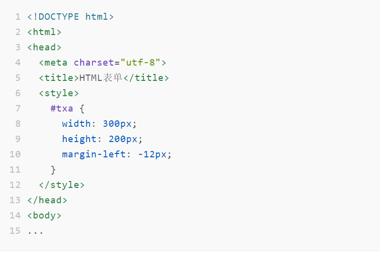
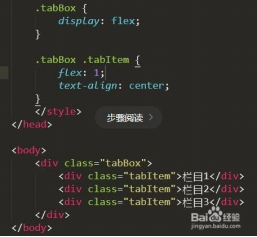
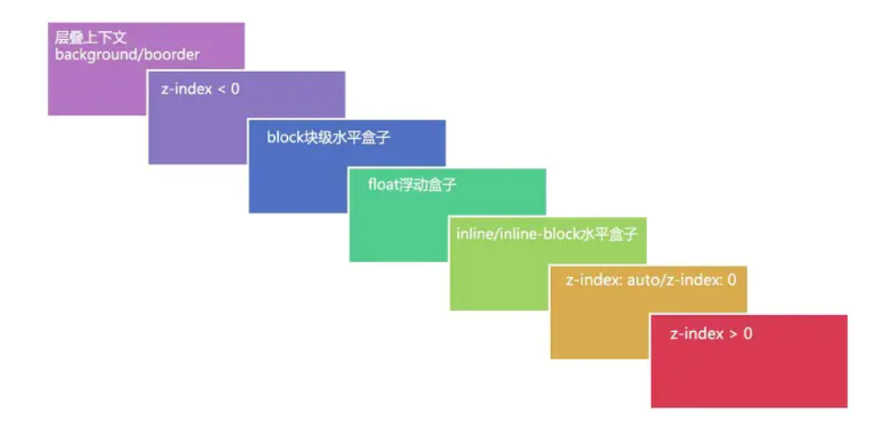
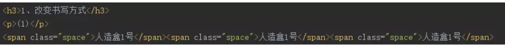

目录
- [1. CSS 盒模型](#1-css-盒模型)
  - [1.1 Content-box (W3C)（标准盒模型）](#11-content-box-w3c标准盒模型)
  - [1.2 Border-box (IE)](#12-border-box-ie)
  - [1.3 BFC 规范](#13-bfc-规范)
    - [1.3.1 如何生成BFC](#131-如何生成bfc)
    - [1.3.2 BFC能用来做什么](#132-bfc能用来做什么)
  - [1.4 BFC, IFC, GFC, FFC](#14-bfc-ifc-gfc-ffc)
- [2. CSS加载方式](#2-css加载方式)
  - [2.1 内部样式表](#21-内部样式表)
  - [2.2 内联样式表](#22-内联样式表)
  - [2.3 外部样式表](#23-外部样式表)
  - [2.4 加载方式的区别](#24-加载方式的区别)
  - [2.5 @import 和 link 的区别是什么呢？](#25-import-和-link-的区别是什么呢)
  - [2.6 src 和 href 的区别](#26-src-和-href-的区别)
  - [2.7 CSS阻塞加载](#27-css阻塞加载)
- [3. 选择器](#3-选择器)
  - [3.1 优先级](#31-优先级)
  - [3.2 css继承](#32-css继承)
  - [3.3 伪类选择器](#33-伪类选择器)
    - [3.3.1 静态动态伪类选择器](#331-静态动态伪类选择器)
    - [3.3.2 UI 伪类选择器](#332-ui-伪类选择器)
    - [3.3.3 结构伪类选择器](#333-结构伪类选择器)
- [4. 布局](#4-布局)
  - [4.1 px，em，rem，vw 区别](#41-pxemremvw-区别)
    - [4.1.1 如何移动端实现1像素细线](#411-如何移动端实现1像素细线)
      - [4.1.1.1 媒体查询](#4111-媒体查询)
      - [4.1.1.2 viewport + rem](#4112-viewport--rem)
      - [4.1.1.3 伪类 + transform](#4113-伪类--transform)
  - [4.2 display的值和作用](#42-display的值和作用)
  - [4.3 position的值和作用](#43-position的值和作用)
  - [4.4 三栏布局](#44-三栏布局)
    - [4.4.1 圣杯布局](#441-圣杯布局)
    - [4.4.2 双飞翼布局](#442-双飞翼布局)
    - [4.4.3 float实现](#443-float实现)
    - [4.4.4 flex实现](#444-flex实现)
    - [4.4.5 gird，table](#445-girdtable)
  - [4.5 两栏布局](#45-两栏布局)
  - [4.6 水平居中和垂直居中](#46-水平居中和垂直居中)
    - [4.6.1 水平居中](#461-水平居中)
    - [4.6.2 垂直居中](#462-垂直居中)
  - [4.7 flex值和作用](#47-flex值和作用)
  - [4.8 flex语法](#48-flex语法)
- [5. CSS3 新特性](#5-css3-新特性)
- [6. float元素特征，如何清除](#6-float元素特征如何清除)
- [7. display:none 与 visibility:hidden 的区别](#7-displaynone-与-visibilityhidden-的区别)
- [8.性能优化](#8性能优化)
- [9. 响应式布局](#9-响应式布局)
  - [9.1 bootstrap 响应式布局实现原理](#91-bootstrap-响应式布局实现原理)
  - [9.2 rem 响应式布局](#92-rem-响应式布局)
  - [9.3 vw 响应式布局](#93-vw-响应式布局)
  - [9.4 flex实现](#94-flex实现)
- [10. 层叠上下文——z-index](#10-层叠上下文z-index)
  - [10.1 如何产生“层叠上下文”](#101-如何产生层叠上下文)
  - [10.2 顺序](#102-顺序)
  - [10.3 CSS3中的属性对层叠上下文的影响](#103-css3中的属性对层叠上下文的影响)
- [11. CSS 预处理器](#11-css-预处理器)
  - [11.1 预处理器的功能](#111-预处理器的功能)
  - [11.2 sass 和 less 区别](#112-sass-和-less-区别)
- [12. CSS hack](#12-css-hack)
- [13. 面经问题整理：](#13-面经问题整理)
  - [13.1 移动端适配](#131-移动端适配)
    - [13.1.1 rem布局](#1311-rem布局)
    - [13.1.2 vw，vh布局](#1312-vwvh布局)
  - [13.2 相邻的两个inline-block节点为什么会出现间隔？怎么解决？](#132-相邻的两个inline-block节点为什么会出现间隔怎么解决)
  - [13.3 如何实现在图片被加载之前的占位符，宽高比16:9](#133-如何实现在图片被加载之前的占位符宽高比169)
    - [13.3.1 使用 img 伪对象 after 和 background](#1331-使用-img-伪对象-after-和-background)
    - [13.3.2 使用 JS 懒加载图片](#1332-使用-js-懒加载图片)
  - [13.4 宽度自适应，宽高比16：9](#134-宽度自适应宽高比169)
    - [13.4.1 padding-bottom 实现](#1341-padding-bottom-实现)
    - [13.4.2 利用vmin来实现](#1342-利用vmin来实现)
  - [13.5 CSS 画三角形](#135-css-画三角形)
  - [13.6 Bootstrap清除浮动](#136-bootstrap清除浮动)
  - [13.7 水平垂直居中矩形，宽高比2:1](#137-水平垂直居中矩形宽高比21)


## 1. CSS 盒模型

标准模型由四部分组成：

- 内容区域: 可以放置元素的区域如文本,图像等，一般设置宽高指的是这个内容的宽高
- 内边距的区域：内容与边框之间的距离
- 边框区域: 边框
- 外边框区域：由外边框限制，用空白区域扩展边框区域，开分开相邻的元素

### 1.1 Content-box (W3C)（标准盒模型）
padding 和 border **不被包含**在定义的 width 和 height 之内。对象的实际宽度等于设置的width 值和border、padding 之和，即Elemenet width = width + border + padding。

```
.box1 {
    box-sizing: content-box;
    width: 200px;
    padding: 10px;
    border: 15px solid #eee;
}
```
box-sizing的值为border-box可以转为IE。

### 1.2 Border-box (IE)
padding 和 border **包含**在定义的 width 和 height 之内。对象的实际宽度等于设置的width 值，即Elemenet width = width。
```
.box2 {
    box-sizing: border-box;
    width: 200px;
    padding: 10px;
    border: 15px solid #eee;
}
/*
一般都是使用标准的 W3C 盒子模型。可以使用box-sizing 属性进行修改。
```

> JS 如何设置获取盒模型对应的宽和高？
>```dom.style.width/height;//设置获取的是内联样式
>dom.currentStyle.width/height;//只有IE支持
>window.getComputedStyle(dom).width/height;//兼容性好
>dom.getBoundingClientRect().width/height;//适用场所：计算一个元素的绝对位置
>```

### 1.3 BFC 规范

（W3C CSS 2.1 规范中的一个概念,它是一个独立容器，决定了元素如何对其内容进行定位,以及与其他元素的关系和相互作用。）

一个页面是由很多个 Box 组成的， 元素的类型和 display 属性， 决定了这个 Box 的类型。

不同类型的 Box，会参与不同的 Formatting Context（决定如何渲染文档的容器），因此Box内的元素会以不同的方式渲染，也就是说BFC内部的元素和外部的元素不会互相影响。**Block Formatting Context提供了一个环境，HTML元素在这个环境中按照一定规则进行布局。一个环境中的元素不会影响到其它环境中的布局。比如浮动元素会形成BFC，浮动元素内部子元素的主要受该浮动元素影响，两个浮动元素之间是互不影响的。**

#### 1.3.1 如何生成BFC

- 根元素或包含根元素的元素；
- 浮动元素（元素的 float 不是 none）；
- 绝对定位元素（元素的 position 为 absolute 或 fixed）；
- 行内块元素（元素的 display 为 inline-block ）；
- 表格单元格（元素的 display 为 table-cell ，HTML 表格单元格默认为该值）；
- 表格标题（元素的 display 为 table-caption ，HTML 表格标题默认为该值）；
- 弹性元素（display 为 flex 或 inline-flex **元素的直接子元素**）；
- 网格元素（display 为 grid 或 inline-grid **元素的直接子元素**）；
- 匿名表格单元格元素（元素的 display 为 table、 table-row 、 table-row-group 、table-header-group 、table-footer-group （分别是 HTML table、row、tbody、thead、tfoot 的默认属性）或 inline-table ）；
- **overflow 值不为 visible 的块元素；**
- display 值为 flow-root 的元素；
- contain 值为 layout、content 或 strict 的元素；
- 多列容器（元素的 column-count 或 column-width 不为 auto，包括 column-count 为 1）；
- column-span 为 all 的元素始终会创建一个新的 BFC，即使该元素没有包裹在一个多列容器
中。

#### 1.3.2 BFC能用来做什么
- 清除元素内部浮动：通过给父元素创建 BFC ，添加 overflow: hidden; 样式；
  

  只要把父元素设为 BFC 就可以清理子元素的浮动了，最常见的用法就是在父元素上设置  overflow : hidden 样式，对于 IE6 加上 zoom :1 就可以了( IE Haslayout )。

  根据 CSS2.1 规范第 10.6.3 部分的高度计算规则，在进行普通流中的块级非替换元素的高度计算时，浮动子元素不参与计算。同时 CSS2.1 规范第10.6.7部分的高度计算规则，在计算生成了 block formatting context 的元素的高度时，其浮动子元素应该参与计算。**所以，触发外部容器BFC，高度将重新计算。比如给outer加上属性overflow:hidden触发其BFC。**

  结果：

  


- 解决外边距合并问题：将垂直方向上的盒子放在不同的 BFC 中，margin 就不会重叠了；
  

  如果一个浮动元素后面跟着一个非浮动的元素，那么就会产生一个覆盖的现象，很多自适应的两栏布局就是这么做的。**上面已经说过创建 BFC 的方法，可以根据具体情况选用不同的方法，这里我选用的是加 overflow:hidden。**

  结果：

  

- 制作自适应两栏布局：要求两栏布局中间没有缝隙时，通过触发 main 生成 BFC ，来实现自适应无缝隙两栏布局。
  
  

  根据 CSS 2.1 8.3.1 Collapsing margins 第一条，两个相邻的普通流中的块框在垂直位置的空白边会发生折叠现象。也就是处于同一个BFC中的两个垂直窗口的margin会重叠。根据 CSS 2.1 8.3.1 Collapsing margins 第三条，生成 block formatting context 的元素不会和在流中的子元素发生空白边折叠。所以解决这种问题的办法是要为两个容器添加具有BFC的包裹容器。**所以解这个问题的办法就是,把两个容器分别放在两个据有 BFC 的包裹容器中，IE 里就是触发layout 的两个包裹容器中！**

  结果：

  

### 1.4 BFC, IFC, GFC, FFC

IFC: 在行内格式化上下文中，框(boxes)一个接一个地水平排列，起点是包含块的顶部。水平方向上的 margin，border 和 padding在框之间得到保留。框在垂直方向上可以以不同的方式对齐：它们的顶部或底部对齐，或根据其中文字的基线对齐。包含那些框的长方形区域，会形成一行，叫做行框。

GFC(CSS3): 直译为"网格布局格式化上下文"（也即是新的布局：display:grid;兼容性问题比较大），当为一个元素设置display值为grid的时候，此元素将会获得一个独立的渲染区域，我们可以通过在网格容器（grid container）上定义网格定义行（grid definition rows）和网格定义列（grid definition columns）属性各在网格项目（grid item）上定义网格行（grid row）和网格列（grid columns）为每一个网格项目（grid item）定义位置和空间。

他将让布局从一维布局变成了二维布局。简单的说，有了GFC之后，布局不再局限于单个维度了。这个时候你要实现类似九宫格，拼图之类的布局效果显得格外的容易。

FFC(Flex Formatting Contexts):直译为"自适应格式化上下文"（也即是现在的flex布局：display:flex;），display值为flex或者inline-flex的元素将会生成自适应容器（flex container）。

Flex Box 由伸缩容器和伸缩项目组成。通过设置元素的 display 属性为 flex 或 inline-flex 可以得到一个伸缩容器。设置为 flex 的容器被渲染为一个块级元素，而设置为 inline-flex 的容器则渲染为一个行内元素。

伸缩容器中的每一个子元素都是一个伸缩项目。伸缩项目可以是任意数量的。伸缩容器外和伸缩项目内的一切元素都不受影响。简单地说，Flexbox 定义了伸缩容器内伸缩项目该如何布局。

## 2. CSS加载方式

### 2.1 内部样式表

通过style标签将CSS的样式写在style属性当中，链入内部的CSS文件。


### 2.2 内联样式表
样式通过style属性内嵌在css的样式当中，写在标签当中。

### 2.3 外部样式表
通过link标签或者是在style中通过@import的方式引入外部的CSS样式文件。

```
<link rel="stylesheet" herf="style.css">

<style>
@import url("style.css")
@import url(style.css)
@import "style.css";
</style>
```

### 2.4 加载方式的区别

1） 优先级不同，内联样式表的优先级最高，而内部样式表和外部样式表的优先级与书写顺序有关，后书写的优先级高。

2） 作用域不同，内联样式表的作用域最小，只能应用于当前的元素，内部样式表的作用域其次，只能应用于当前的HTML文件，最后是外部样式表的作用域最大，能够适用于所有链接的HTML文件。

3）书写顺序不同，内联样式表写在标签当中，内部样式表写在style标签中来链入内部的CSS文件，外部样式表是通过link或者是@import的方式来链入外部的CSS文件。

### 2.5 @import 和 link 的区别是什么呢？

1）本质的差别：link是属于XHTML的标签，而@import是CSS提供的一种方式。

2）加载顺序的差别：当页面进行加载的时候，link引用的CSS时会被加载，而@import引用的CSS会等页面加载完成以后才被加载，所以在 @import加载CSS的时候，一开始会没有样式。

3）兼容性的差别：@import在老的浏览器上不兼容，只有在IE5以上的浏览器才可以被识别，但是link可以在任意浏览器的版本上进行加载执行。

4）使用DOM文档对象模型控制样式的差别：当使用JavaScript控制DOM区改变样式的时候，只能使用link标签，而@import是不可以的。

5）作用不同：link是属于XHTML，除了可以加载css,还可以定义RSS等其它事务，而@import是属于css范畴，只能加载css。

6）权重不同：link方式的权重高于@import的权重值。

7）标签不同：import在html使用的时候需要标签，而link在html使用的时候不需要标签。

### 2.6 src 和 href 的区别

href 是指向网络资源所在位置，建立和当前元素（锚点）或当前文档（链接）之间的链接，用于超链接。浏览器会识别该文档，**并行下载该文档**，并且不会停止对文档的处理。

src是指向外部资源的位置，指向的内容将会嵌入到文档中当前标签所在位置；在请求src资源时会将其指向的资源下载并应用到文档内，例如js脚本，img图片和frame等元素。浏览器解析到该元素时，会暂停浏览器的渲染，直到该资源加载完毕。**这也就是js脚本放在底部而不是头部的原因。**

### 2.7 CSS阻塞加载

- css加载不会阻塞DOM树的解析
- css加载会阻塞DOM树的渲染
- css加载会阻塞后面js语句的执行、

## 3. 选择器

- id选择器(#myid)
- 类选择器(.myclassName)
- 标签/元素选择器(p,h1,p)
- 组合选择器：
  - 子元素选择器(ul>li)
  - 后代选择器(li a)
  - 直接相邻元素选择器(h1 + p)
  - 普通相邻元素选择器
  
- 通配符选择器(*)
- 属性选择器(a[rel="external"])
- 伪类选择器(a:hover,li:nth-child)
  - UI元素伪类选择器
  - 结构伪类选择器

### 3.1 优先级

元素选择符： 1
class选择符： 10
id选择符：100
元素标签：1000

- 同权重： 内联样式(标签内部) > 内部样式表(当前文件中) > 外部样式(外部文件中)
- !important > id > class > tag
- !important 比内联优先级高
- 如果优先级相同，则选择最后出现的样式。
- 继承得到的样式的优先级最低。

### 3.2 css继承
可继承的样式： 
- font-size 
- font-family 
- font-weight 
- font-style
- color

不可继承的样式： 
- border
- padding 
- margin
- height 
- width

### 3.3 伪类选择器

**伪元素**是创造文档树之外的对象。例如文档不能提供访问元素内容第一字或者第一行的机制。

伪元素还提供一些在源文档中不存在的内容分配样式，例如 `::before` 和 `::after` 能够访问产生的内容。

伪元素的内容实际上和普通 DOM 元素是相同的，虽然用户可以看到，但是它本身只是基于元素的抽象，并不存在于文档中，所以叫伪元素。

**伪类**用于当元素处于某个状态时，为其添加对应的样式，这个状态是根据用户行为而动态变化的。比如说，用户悬停在指定的元素时，我们可以通:hover来描述这个元素的状态。虽然它和普通的css类类似，可以为已有的元素添加样式，但是它只有处于dom树无法描述的状态下才能为元素添加样式，所以将其称为伪类。


#### 3.3.1 静态动态伪类选择器

- a:link 没有访问之前a标签的样式
- a:visited 已访问a标签的样式
- a:hover a标签鼠标移上的样式
- a:actived a标签鼠标按下的样式
- input:focus input表单元素获取焦点
- input:blur input表单元素失去焦点

#### 3.3.2 UI 伪类选择器
- :checked 被选中 主要用在input表单元素上 (新增)
- ::selection
- enabled 控制表单控件的禁用状态。
- disabled 控制表单控件的禁用状态。
- read-write
- read-only

#### 3.3.3 结构伪类选择器
- :root 
- E:not 排除 (新增)
- :empty 空内容 (新增)
- E:target
  
    ---------------
- :last-child 最后一个元素  (新增)
- :nth-child(n)  n表示具体的第几个  odd/2n+1 奇数 even/2n 偶数 (新增)
- :only-child 仅仅/唯一的元素 (新增)
- :nth-last-child(n) 倒数第几个元素  :nth-last-child(1) <=> :last-child (新增)
  
    ---------------
- :first-of-type 第一个同级兄弟元素 (新增)
- :last-of-type 最后一个同级兄弟元素 (新增)
- :only-of-type 只有一个同级兄弟元素 (新增)
- :nth-of-type(n) 第几个同级兄弟元素 (新增)
- :nth-last-of-type(n) 倒数第几个同级兄弟元素 (新增)

## 4. 布局

### 4.1 px，em，rem，vw 区别

- px 像素（Pixel）：相对长度单位。像素 px 是相对于显示器屏幕分辨率而言的。
- em : 相对长度单位，相对于父元素字体大小，1em 被定义为一种给定字体的 font-size 值。如当前对行内文本的字体尺寸未被人为设置，则相对于浏览器的默认字体尺寸。
- rem : rem——root em，是相对于根元素 <html> 的字体大小单位。
- vw : 1vw 为视口宽度的 1%。

#### 4.1.1 如何移动端实现1像素细线
移动端CSS里面写了1px，实际上看起来比1px粗， viewport的设置和屏幕物理分辨率是按比例而不是相同的. 移动端window对象有个devicePixelRatio属性, 它表示设备物理像素和css像素的比例, 在retina屏的iphone手机上, 这个值为2或3, css里写的1px长度映射到物理像素上就有2px或3px那么长。

##### 4.1.1.1 媒体查询
media查询利用设备像素比缩放，设置小数像素。IOS8下已经支持带小数的px值, media query对应devicePixelRatio有个查询值-webkit-min-device-pixel-ratio, css可以写成这样。

```
.border { border: 1px solid #999 }
@media screen and (-webkit-min-device-pixel-ratio: 2) {
    .border { border: 0.5px solid #999 }
}
@media screen and (-webkit-min-device-pixel-ratio: 3) {
    .border { border: 0.333333px solid #999 }
}
```
【缺点】对设备有要求，小数像素目前兼容性较差。

##### 4.1.1.2 viewport + rem

viewport + rem + js 动态的修改页面的缩放比例，实现小于1像素的显示。在页面初始化时，在头部引入原始默认状态如下：
```
<meta http-equiv="Content-Type" content="text/html;charset=UTF-8">  
<meta name="viewport" id="WebViewport" content="initial-scale=1, maximum-scale=1, minimum-scale=1, user-scalable=no"> 
```
接下来的任务就是js的动态修改缩放比 以及 实现rem根元素字体大小的设置。
```
var viewport = document.querySelector("meta[name=viewport]")
if (window.devicePixelRatio == 1) {
    viewport.setAttribute('content', 'width=device-width, initial-scale=1, maximum-scale=1, minimum-scale=1, user-scalable=no')
} 
if (window.devicePixelRatio == 2) {
    viewport.setAttribute('content', 'width=device-width, initial-scale=0.5, maximum-scale=0.5, minimum-scale=0.5, user-scalable=no')
} 
if (window.devicePixelRatio == 3) {
    viewport.setAttribute('content', 'width=device-width, initial-scale=0.333333333, maximum-scale=0.333333333, minimum-scale=0.333333333, user-scalable=no')
} 

var docEl = document.documentElement;
var fontsize = 10 * (docEl.clientWidth / 320) + 'px';
docEl.style.fontSize = fontsize;
```

##### 4.1.1.3 伪类 + transform
1.  设置height: 1px，根据媒体查询结合transform缩放为相应尺寸。
```
div {
    height:1px;
    background:#000;
    -webkit-transform: scaleY(0.5);
    -webkit-transform-origin:0 0;
    overflow: hidden;
}
```
2.  用::after和::befor,设置border-bottom：1px solid #000,然后在缩放-webkit-transform: scaleY(0.5);可以实现两根边线的需求
```
div::after{
    content:'';width:100%;
    border-bottom:1px solid #000;
    transform: scaleY(0.5);
}
```
3.  用::after设置border：1px solid #000; width:200%; height:200%,然后再缩放scaleY(0.5); 优点可以实现圆角，京东就是这么实现的，缺点是按钮添加active比较麻烦。

```
.div::after {
    content: '';
    width: 200%;
    height: 200%;
    position: absolute;
    top: 0;
    left: 0;
    border: 1px solid #bfbfbf;
    border-radius: 4px;
    -webkit-transform: scale(0.5,0.5);
    transform: scale(0.5,0.5);
    -webkit-transform-origin: top left;
}
```

### 4.2 display的值和作用
| 值 | 作用 |
| -- | --- |
|block | 此元素将显示为块级元素，此元素前后会带有换行符。默认宽度为父元素宽度，可设置宽高，换行显示 |
|none | 元素不显示，并从文档流中移除 |
|inline | 行内元素，默认宽度为内容宽度，不可设置宽高，同行显示
|inline-block (CSS2.1新增) | 默认宽度为内容宽度，可以设置宽高，像行内元素一样显示，但其内容像块类型元素一样显示 |
|list-item | 此元素会作为列表显示 |
|table | 此元素会作为块级表格来显示（类似table），表格前后带有换行符

### 4.3 position的值和作用
| 值 | 作用 |
| -- | --- |
|absolute | 生成绝对定位的元素，相对于 static 定位以外的第一个父元素进行定位。元素的位置通过 "left", "top", "right" 以及 "bottom" 属性进行规定。而其层叠通过css z-index属性定义。此时对象**不具有边距**，宽度由元素里面的内容决定，效果和用float方法一样，但仍有补白和边框 |
|fixed | 生成固定定位的元素，相对于浏览器窗口进行定位。（老IE不支持）元素的位置通过 "left", "top", "right" 以及 "bottom" 属性进行规定。
|relative | 生成相对定位的元素，相对于其正常位置进行定位，不脱离文档流。因此，"left:20" 会向元素的 LEFT 位置添加 20 像素。
|static | 默认值。没有定位，元素出现在正常的文档流中（忽略 top, bottom, left, right 或者 z-index 声明）。
|inherit | 规定应该从父元素继承 position 属性的值。
|sticky (新增) | 它主要用在对 scroll 事件的监听上；粘性定位可以被认为是相对定位和固定定位的混合。元素在跨越特定阈值前为相对定位，之后为固定定位。例如：#one { position: sticky; top: 10px; } 在 viewport 视口滚动到元素 top 距离小于 10px 之前，元素为相对定位。之后，元素将固定在与顶部距离 10px 的位置，直到 viewport 视口回滚到阈值以下。

float和position混用时，float不会生效。

### 4.4 三栏布局

#### 4.4.1 圣杯布局
HTML结构设置

- 新建一个父元素，包含三个子元素：left、main、right（注意，main在写在前面，这样在页面渲染时会先加载中间，针对面试
题优先加载中间部分）

CSS样式设置

- 父元素设置高度
- 三个元素均设置浮动
- 中间main部分定宽100%：width: 100%，左右两边按产品需求设置宽高
- 左边设置margin-left: -100%；右边设置margin-right: -右盒子宽
- 父元素设置padding-left: 左盒子宽；padding-right: 右盒子宽
- 左右盒子相对定位

```
<div class="container">
  <div class="main f">go aheadgo aheadvgo aheadgo aheadgo aheadgo aheadgo aheadgo aheadgo aheadgo aheadgo aheadgo aheadgo aheadgo aheadgo aheadgo ahead</div>
 <div class="left f"></div>
 <div class="right f"></div>
</div>

<style>
 body {
 min-width: 700px;
 }
 .container {
 height: 300px;
 padding: 0 200px 0 200px;
 }
 .f {
 float: left;
 }
 .main {
 width: 100%;
 height: 300px;
 background-color: cornflowerblue;
 }
 .left {
 width: 200px;
 height: 300px;
 background-color: indianred;
 margin-left:-100%;
 /*postion:relative;*/
 right:-200px;
 }
 .right {
 width: 200px;
 height: 300px;
 background-color: lightgreen;
 margin-left:-200px;
 /*postion:relative;*/
 right:-200px;
 }
 </style>
 ```

该布局受内部元素影响而破坏布局的概率低，但是当浏览器屏幕缩小的一定程度时，左右两侧的内容会掉下来，或发生重叠现象。解决方案，给body加一个最小宽度（起码大于左右两侧宽度之和）

#### 4.4.2 双飞翼布局
HTML结构设置

- 新建一个父元素，包含三个子元素：left、main、right（注意，main在写在前面，这样在页面渲染时会先加载中间，针对面试
题优先加载中间部分）

CSS样式设置

- 父元素设置高度
- 三个元素均设置浮动
- 中间main部分定宽100%：width: 100%，左右两边按产品需求设置宽高
- 中间main部分再加一个盒子inner，放置内容（与圣杯布局的不同点）
- 左边设置margin-left: -100%；右边设置margin-right: -右盒子宽
- 新添加盒子，inner，设置左右padding或margin

```
<div class="container">
 <div class="main f">
 <div class=inner>go aheadgo aheadvgo aheadgo aheadgo aheadgo aheadgo aheadgo aheadgo aheadgo aheadgo
aheadgo aheadgo aheadgo aheadgo aheadgo ahead</div>
 </div>
 <div class="left f"></div>
 <div class="right f"></div>
</div>

<style>
.container {
height: 300px;
}
.f {
float: left;
}
.main {
width: 100%;
height: 300px;
background-color: cornflowerblue;
}
.left {
width: 200px;
height: 300px;
background-color: indianred;
margin-left: -100%;
}
.right {
width: 200px;
height: 300px;
background-color: indianred;
margin-left: -200px;
}
.inner {
  padding: 0 200px 0 200px;
}
 ```

#### 4.4.3 float实现
HTML结构设置

- 新建三个元素：left、right、main（注意，main写在后面）
  
CSS样式设置

- 左盒子左浮动，右盒子右浮动
- 中间部分设置margin或padding值

```
<div class="left"></div>
<div class="right"></div>
<div class="main">go aheadgo aheadvgo aheadgo aheadgo aheadgo aheadgo aheadgo aheadgo aheadgo aheadgo
aheadgo aheadgo aheadgo aheadgo aheadgo ahead</div>

<style>
 .main {
 margin: 0 200px 0 200px;
 background-color: red;
 height: 200px;
 }
 .left {
 float: left;
 width: 200px;
 background-color: blue;
 height: 200px;
 }
 .right {
 float: right;
 width: 200px;
 background-color: pink;
 height: 200px;
 }
</style>
```

#### 4.4.4 flex实现
HTML结构设置

- 新建一个父元素，包含三个子元素：main、left、right（注意，main写在前面）

CSS样式设置

- 父元素设置宽度为100%，display: flex；
- main中间部分设置flex: 1；
- 左右两则按产品需求设置宽高；
- left设置order: -1；
  
```
<div class="container">
 <div class="main">go aheadgo aheadvgo aheadgo aheadgo aheadgo aheadgo aheadgo aheadgo aheadgo aheadgo
aheadgo aheadgo aheadgo aheadgo aheadgo ahead</div>
 <div class="left"></div>
 <div class="right"></div>
</div>
<style>
 .container {
 width: 100%;
 height: 200px;
 display: flex;
 }
 .main {
 flex: 1;
 background-color: red;
 height: 200px;
 }
 .left {
 width: 200px;
 background-color: blue;
 height: 200px;
 order: -1;
 }
 .right {
 width: 200px;
 background-color: pink;
 height:200px;
 }
 </style>
 ```

order属性是调整或设置盒模型对象的子元素出现的顺序，数值越小排列越靠前，默认为0。在上面的布局中，left想要排在前面，就
需要比0小，所以设置order: -1，left盒子会跑到前面。需要注意的是，如果父元素没有设置flex，则 order 属性不起作用。

#### 4.4.5 gird，table

### 4.5 两栏布局
实现两栏布局，左栏固定宽度，右栏宽度与父级容器宽度一致，随父级容器宽度改变而改变。

给父级容器设置padding-left为左栏的宽度，给左栏设置绝对定位，定位至父级容器的左边left：0px，右栏设置宽度为100%，此时右栏的宽度随父级的宽度改变，右栏的宽度始终等于父级的宽度。

```
<div class="box">
	<div class="box1">left</div>
	<div class="box2">right</div>
</div>

<style type="text/css">
.box{
width: 800px;
position: relative;
padding-left: 200px;
}
.box1{
  width: 200px;
  height: 500px;
  background: red;
  position: absolute;
  left: 0;
}
.box2{
  width: 100%;
  height: 500px;
  background: green;
}
</style>
```

### 4.6 水平居中和垂直居中

#### 4.6.1 水平居中
- 在父元素上设置 text-align: center; 使文字/图片水平居中：

```
.container {
  text-align: center;
}
```

- margin 居中

```
.container {
  width: 80%;
  margin: 0 auto;
}
```

#### 4.6.2 垂直居中
- 未知元素宽高
```
<div class="outer">
    <span>我想居中显示</span>
</div>

<style>
.outer{
    width:300px;
    height:300px;
    position:relative;
    background-color:#ccc;
}
span{
    float:left;
    position:absolute;
    backgroond-color:red;
    top:50%;
    left:50%;
    transform:translate(-50%,-50%);
}
</style>
```
或者

```
.main {
  width: 400px;
  height: 400px;
  background-color: #aaa;
  display: table; /* 父元素设置表格属性 */
  text-align: center;
}
.main span {
  display: table-cell; /* img 设置成表格元素属性 */
  vertical-align: middle; /* 两个 display 设置后这个属性就起作用 */
}
```

- 已知元素宽高

```
<div class="outer">
    <span>我想居中显示</span>
</div>

<style>
.outer{
    width:300px;
    height:300px;
    position:relative;
    background-color:#ccc;
}
span{
    float:left;
    position:absolute;
    backgroond-color:red;
    width:150px;
    height:50px;
    top:50%;
    left:50%;
    margin:-25px 0px 0px -75px;
}
</style>
```

- 如何垂直居中一个img（display : table-cell 或者 position定位）

```
<div class="outer">        
        
</div>

<style>        
.outer{            
    width: 300px;           
    height: 300px;            
    border: 1px solid #cccccc;            
    display: table-cell;            
    text-align: center;            
    vertical-align: middle;        
}        
img{            
    width: 150px;            
    height: 150px;        
}    
</style>

```

- flex布局
``` 
父级元素：{
display: flex;
flex-direction: row;
justify-content: center;
align-items: center;
}
子级元素：{
flex: 1;
}
```


### 4.7 flex值和作用
- 设置盒子的display属性为flex，或者line-flex，其对应还有六个css属性。

  | 值 | 作用 |
  | -- | --- |
  |flex-direction | 设置子元素的排列方式（row，column，row-reverse，column-reverse） |
  |flex-warp | 设置子元素的是否换行（nowarp，warp，warp-reverse） |
  |flex-flow | flex-direction和flex-warp的缩写，默认为row nowarp
  |justify-content | 设置子元素的水平排列方式（flex-start，flex-end，center，span-around，span-between） |
  |align-items | 设置子元素的垂直方式（flex-start，flex-end，center，stretch，baseline） |
  |align-content | 设置多个轴线的排列方式（flex-start，flex-end，center，spand-around，spand-between，stretch）


- 对应的子元素项目也拥有自身的六个css属性。

  | 值 | 作用 |
  | -- | --- |
  |order | 设置元素的排列权重 值越大越在后 |
  |flex-grow | 设置元素的放大比例（横向会变宽）
  |flex-shrink | 设置元素的缩小比例
  |flex-basis | 设置多余空间项目主轴所占比例空间，设置元素初始大小。比如=content(根据内容自动调节大小)
  |flex | flex-grow和flex-shrink和flex-basis的缩写方式 默认为0 1 auto
  |align-self | 设置子元素自己的垂直排列方式，默认为盒子的align-items的值
  
  :warning:：设置flex布局后，子元素的float，clear，vertical-align都无效

### 4.8 flex语法

- 单值语法
  
  值必须是如下之一：

  - 数值 number，那么解释为 flex: number 1 0
  - none、auto、initial

- 双值语法

  第一个值必须是 number，它会被解释为 flex-grow 属性，第二个值必须是如下之一：

  - 数值 number，会被解释为 flex-shrink 属性
  - 一个能够描述宽度的值，例如 10em、30%、min-content，会被解释为 flex-basis 属性

- 三值语法

  三个值的含义：

  - 第一个 number 表示 flex-grow
  - 第二个 number 表示 flex-shrink
  - 第三个描述宽度的值表示 flex-basis

```
flex: 0 auto
flex: 0 auto 等同于 flex: initial，也是 flex: 0 1 auto 的简写表达。它根据元素自身的 width 或 height 属性来调节元素大小。
当还剩余一些空闲空间时，它使 flex 元素呈现的是固定大小的样式；当没有足够的空间时，它允许它收缩到最小。auto 边距可用于根据主轴来对齐元素。
flex: auto
flex: auto 等同于 flex: 1 1 auto，它根据元素的 width 或 height 属性调整元素的大小，但是其非常灵活，以便让它们吸收沿主轴的任何额外空间。
flex: none
flex: none 等同于 flex: 0 0 auto。它根据 width 和 `height 来调节元素大小，但是完全不灵活。
```

## 5. CSS3 [新特性](https://juejin.im/post/6844903829679390728)

- 新增各种 CSS 选择器  
  - :not(p)  选择每个非p的元素； 
  - p:empty 选择每个没有任何子级的p元素（包括文本节点）
  
- 边框：
  
  ```
  div{ 
      border:2px solid; 
      border-radius:25px; //用于设置圆角
      box-shadow: 10px 10px 5px #888888; //水平阴影 垂直阴影 模糊距离 阴影颜色
      border-image:url(border.png) 30 30 round;// 设置所有边框图像的速记属性。
  }
  ```
- 背景 background-clip（规定背景图的绘制区域），background-origin，background-size

  ```
  div{ 
      background:url(img_flwr.gif); 
      background-repeat:no-repeat; 
      background-size:100% 100%; //规定背景图的尺寸
      background-origin:content-box;//规定背景图的定位区域
  } 
  多背景 
  body{ 
      background-image:url(img_flwr.gif),url(img_tree.gif); 
  }
  ```
- 线性渐变 （Linear Gradients） 向下/向上/向左/向右/对角方向
  ```
  background: linear-gradient(direction, color-stop1, color-stop2, ...);
  ```
- 文本效果 
  
  阴影text-shadow，textwrap，word-break，word-wrap;

- 2D 转换 
  
  transform:scale(0.85,0.90) | translate(0px,-30px) | skew(-9deg,0deg) |rotate()  

- 3D转换 
  
  perspective()；transform是向元素应用 2D 或者 3D 转换；

- 过渡 transition
  
  transition：定义了元素在变化过程中是怎么样的，包含transition-property、transition-duration、transition-timing-function、transition-delay。

- 动画 animation
  
  animation：动画定义了动作的每一帧（@keyframes）有什么效果，包括animation-name，animation-duration、animation-timing-function、animation-delay、animation-iteration-count、animation-direction

- 多列布局 （multi-column layout）
- [盒模型](#1-css-盒模型)
- [flex 布局](#47-flex值和作用)
- 多媒体查询 定义两套css，当浏览器的尺寸变化时会采用不同的属性

>Transition 和 Animation 对比
>
>Transition 强调过渡，Transition ＋ Transform ＝ 两个关键帧的Animation
>
>Animation 强调流程与控制，Duration ＋ TransformLib ＋ Control ＝ 多个关键帧的Animation

## 6. float元素特征，如何清除 

- 出现浮动的原因：浮动元素碰到包含它的边框或者浮动元素的边框停留。在CSS规范中，浮动定位不属于正常的页面流，而是独立定位的，所以文档流的块框表现得就像浮动框不存在一样。浮动元素会漂浮在文档流的块框上。

- 关于css的定位机制：普通流，浮动，绝对定位（position：fixed是position：absolute的一个子类）。浮动的框可以左右移动，直到它的外边缘遇到包含框或者另一个浮动框的边缘，所以才说**浮动定位不属于正常的页面流**。文档中的普通流就会表现得和浮动框不存在一样，当浮动框高度超出包含框的时候，就会出现包含框**不会自动伸缩高度类笔盒浮动元素**。所以，只含有浮动元素的父容器在显示时不需要考虑子元素的位置，就造成显示父容器像空容器一样。

- 浮动带来的问题：
  - 对其父元素的影响

    对于其父元素来说，元素浮动之后，它脱离当前正常的文档流，所以它也无法撑开其父元素，造成父元素的塌陷。

  - 对其兄弟元素（非浮动）的影响

    如果兄弟元素为块级元素，该元素会忽视浮动元素的而占据它的位置，并且元素会处在浮动元素的下层（并且无法通过 z-index 属性改变它们的层叠位置），但它的内部文字和其他行内元素都会环绕浮动元素。

    如果兄弟元素为内联元素，则元素会环绕浮动元素排列。

  - 对其兄弟元素（浮动）的影响
  
    同一个方向的浮动元素：当一个浮动元素在浮动过程中碰到同一个方向的浮动元素时，它会紧跟在它们后面反方向的浮动元素：互不影响，位于同一条水平线上，当空间不够时会被挤下。

  - 对子元素的影响
  
    当一个元素浮动时，在没有清除浮动的情况下，它无法撑开其父元素，但它可以让自己的浮动子元素撑开它自身，并且在没有定义具体宽度情况下，使自身的宽度从 100% 变为自适应（浮动元素display: block; ）。其高度和宽度均为浮动元素高度和非浮动元素高度之间的最大值。
 
- 清除浮动的方式：

1.  父级div定义height

    原理：父级div手动定义height，就解决了父级div无法自动获取到高度的问题

    优点：简单，代码少，容易掌握

    缺点：只适合高度固定的布局，要给出精确的高度，如果高度和父级div不一样时，会产生问题

    建议：不推荐使用，只建议高度固定的布局时使用

------
2.  最后一个浮动元素后加空 div 标签 并添加样式 clear:both。（理论上能清除任何标签，增加无意义的标签）
  
    原理：添加一个空div，利用css提高的clear:both清除浮动，让父级div能自动获取到高度

    优点：简单，代码少，浏览器支持好，不容易出现怪问题

    缺点：不少初学者不理解原理；如果页面浮动布局多，就要增加很多空div，让人感觉很不爽

    建议：不推荐使用，但此方法是以前主要使用的一种清除浮动方法
------
3.  包含浮动元素的父标签添加样式 overflow 为 hidden 或 auto。

    原理：必须定义width或zoom:1，同时不能定义height，使用overflow:hidden时，浏览器会自动检查浮动区域的高度

    优点：简单，代码少，浏览器支持好

    缺点：不能和position配合使用，因为超出的尺寸的会被隐藏

    建议：只推荐没有使用position或对overflow:hidden理解比较深的朋友使用
------
4.  父级div定义伪类 :after 和 zoom（空标签元素清除浮动而不得不增加无意义代码的弊端，使用zoom:1用于兼容IE）
   
    原理：IE8以上和非IE浏览器才支持:after，原理和方法2有点类似，zoom(IE转有属性)可解决ie6,ie7浮动问题

    优点：浏览器支持好，不容易出现怪问题（目前：大型网站都有使用，如：腾迅，网易，新浪等等）

    缺点：代码多，不少初学者不理解原理，要两句代码结合使用，才能让主流浏览器都支持

    建议：推荐使用，建议定义公共类，以减少CSS代码


    (1) 在子元素后添加一个空div
     ```
     div{clear:both;}
     ```
    (2) 在父元素中{overflow:hidden|auto;zoom:1}

    (3) :after伪选择符，在父容器的尾部自动创建一个子元素
    ```
    .clearfix:after {
      content: "\0020";display: block;height: 0;clear: both;
    }
    .clearfix {
        zoom: 1;
    }
    ```
    "clearfix"是父容器的class名称，"content:"020";"是在父容器的结尾处放一个空白符.
    
    "height:0;"是让这个这个空白字符不显示出来。
    
    "display:block; clear: both;"是确保这个空白字符是非浮动的独立区块。
    
    :after选择符IE 6不支持,添加一条IE 6的独有命令"zoom:1;"就行了.

## 7. display:none 与 visibility:hidden 的区别

display : none 隐藏对应的元素，在文档布局中不再分配空间（回流+重绘）

visibility:hideen 隐藏对应的元素，在文档布局中仍保留原来的空间（重绘）

使用 CSS display:none 属性后，HTML 元素（对象）的宽度、高度等各种属性值都将“丢失”;而使用 visibility:hidden 属性后，HTML元素（对象）仅仅是在视觉上看不见（完全透明），而它所占据的空间位置仍然存在。

## 8.性能优化

  （1） 减少http请求次数：CSS Sprites, JS、CSS源码压缩、图片大小控制合适；网页Gzip，CDN托管，data缓存 ，图片服务器。

  （2） 前端模板 JS+数据，减少由于HTML标签导致的带宽浪费，前端用变量保存AJAX请求结果，每次操作本地变量，不用请求，减少请求次数

  （3） 用innerHTML代替DOM操作，减少DOM操作次数，优化javascript性能。

  （4） 当需要设置的样式很多时设置className而不是直接操作style。

  （5） 少用全局变量、缓存DOM节点查找的结果。减少IO读取操作。

  （6） 避免使用CSS Expression（css表达式)又称Dynamic properties(动态属性)。

  （7） 图片预加载，将样式表放在顶部，将脚本放在底部  加上时间戳。

## 9. 响应式布局

响应式布局就是根据屏幕大小变化，页面的内容排版布局会自动调整变动，已呈现更好的用户体验。

当你完成当你已经完成了无响应的网站，做的第一件事是在你的 HTML 页面，粘贴下面的代码到标签之间。

大多数移动浏览器将HTML页面放大为宽的视图（viewport）以符合屏幕分辨率。你可以使用视图的meta标签来进行重置。下面的视图标签告诉浏览器，使用设备的宽度作为视图宽度并禁止初始的缩放。在标签里加入这个meta标签。
```
<meta name="viewport" content="width=device-width, initial-scale=1, maximum-scale=1, user-scalable=no">

<!-- width=device-width ：表示宽度是设备屏幕的宽度
initial-scale=1.0：表示初始的缩放比例
minimum-scale=0.5：表示最小的缩放比例
maximum-scale=2.0：表示最大的缩放比例
user-scalable=yes：表示用户是否可以调整缩放比例 -->
```

>和自适应布局的区别？
>
>自适应布局就是宽度自适用布局，在不同大小的设备上，网页以等比例的形式缩放宽度，呈现同样的主体内容和排版布局。随着屏幕宽度缩放，网页内容也以等比例缩放，不管屏幕宽度为多少，网页主体排版布局总是一样的
>
>而响应式布局是随着屏幕宽度的缩放，页面做出相应调整，布局和展示的内容会有所变动

### 9.1 bootstrap 响应式布局实现原理

- 媒体查询（media）

  使用 @media 查询，就针对不同的媒体类型定义不同的样式。利用媒体查询设置不同分辨率下的css样式，来适配不同屏幕。

  @media 可以针对不同的屏幕尺寸设置不同的样式，特别是如果你需要设置设计响应式的页面，@media 是非常有用的。

  当你重置浏览器大小的过程中，页面也会根据浏览器的宽度和高度重新渲染页面。

- grid system 行列布局（12等分）

  bootstrap布局划分屏幕空间采用的是12等分。它可以被1、2、3、4、6、12共6个数字整除，本来就是用来分空间的系统，当然可以更好的被整除最好了，这样怎么分都愉快。

  比如，两个div分空间，分别占用50%，或者一个1/3一个2/3，或者1/4对3/4

  3个div分空间，分别占用1/3，或者两个1/6一个2/3，或者两个1/4对1/2

### 9.2 rem 响应式布局

  当前页面中元素的rem 单位的样式值都是针对于html 元素的font-size 的值进行动态计算的，所以有两种方法可以达到适配不同屏幕：

- 第一种利用媒体查询，在不同分辨率下给 html 的 font-size 赋值。
- 利用js然后根据缩放比例算。但是这样页面在打开的时候，元素大小有个变化的过程。

### 9.3 vw 响应式布局
根据 PSD 文件宽度或高度作为标准，元素单位 px 转换为 vw 或 vh，比如font-size: 12px，PSD 文件宽度 375，转换公式 12 * 100 / 375，则样式改为font-size: 3.2vw。有工具可以计算。

### 9.4 flex实现


## 10. 层叠上下文——z-index

层叠上下文(stacking context)，是HTML中一个三维的概念。在CSS2.1规范中，每个盒模型的位置是三维的，分别是平面画布上的X轴，Y轴以及表示层叠的Z轴。

如果一个元素含有层叠上下文，(也就是说它是层叠上下文元素)，表现就是它离屏幕观察者更近。

那么，层叠等级指的又是什么？层叠等级(stacking level，叫“层叠级别”/“层叠水平”也行)

在同一个层叠上下文中，它描述定义的是该层叠上下文中的层叠上下文元素在Z轴上的上下顺序。

在其他普通元素中，它描述定义的是这些普通元素在Z轴上的上下顺序。

### 10.1 如何产生“层叠上下文”
- HTML中的根元素<html></html>本身j就具有层叠上下文，称为“根层叠上下文”。
- 普通元素设置position属性为非static值并设置z-index属性为具体数值，产生层叠上下文。
- CSS3中的新属性也可以产生层叠上下文。

### 10.2 顺序


- 左上角"层叠上下文background/border"指的是层叠上下文元素的背景和边框。
- inline/inline-block元素的层叠顺序要高于block(块级)/float(浮动)元素。
- 单纯考虑层叠顺序，z-index: auto和z-index: 0在同一层级，但这两个属性值本身是有根本区别的。

1.  首先先看要比较的两个元素是否处于同一个层叠上下文中：

    1.1 如果是，谁的层叠等级大，谁在上面（怎么判断层叠等级大小呢？——看“层叠顺序”图）。

    1.2 如果两个元素不在统一层叠上下文中，请先比较他们所处的层叠上下文的层叠等级。

2.  当两个元素层叠等级相同、层叠顺序相同时，在DOM结构中后面的元素层叠等级在前面元素之上。

### 10.3 CSS3中的属性对层叠上下文的影响

CSS3中出现了很多新属性，其中一些属性对层叠上下文也产生了很大的影响。如下：

- 父元素的display属性值为flex|inline-flex，子元素z-index属性值不为auto的时候，子元素为层叠上下文元素；
- 元素的opacity属性值不是1；
- 元素的transform属性值不是none；
- 元素mix-blend-mode属性值不是normal`；
- 元素的filter属性值不是none；
- 元素的isolation属性值是isolate；
- will-change指定的属性值为上面任意一个；
- 元素的-webkit-overflow-scrolling属性值设置为touch。

CSS3中，元素属性满足以上条件之一，就会产生层叠上下文。我们用第1条来做一个简单的解释说明。

## 11. CSS 预处理器
css预处理器：用一种专门的编程语言，为CSS增加了一些编程的特性，将CSS作为目标生成文件，然后开发者就只要使用这种语言进行编码工作，可以让你的CSS更加简洁、适应性更强、可读性更佳，更易于代码的维护等诸多好处

- Sass(Scss)：2007,ruby编写
- Less: 2009，js编译

### 11.1 预处理器的功能
- 嵌套： 反映层级和约束
- 变量和计算： 减少重复代码
- Extend和mixIn： 代码片段的抽离
- 循环语句: 适用于复杂有规律的样式
- 条件语句
- 单位转换
- 自动前缀
- import：可以实现CSS文件的模块化

### 11.2 sass 和 less 区别

- 编译环境不一样
- 变量符不一样，Less是@，而Scss是$，而且变量的作用域也不一样。
- 输出设置，Less没有输出设置，Sass提供4种输出选项：
- Sass支持条件语句，可以使用if{}else{},for{}循环等等。而Less不支持。
- 引用外部CSS文件
- 工具库不同

## 12. CSS hack

## 13. 面经问题整理：
### 13.1 移动端适配

#### 13.1.1 rem布局
rem 是相对于html节点的font-size来做计算的。所以在页面初始话的时候给根元素设置一个font-size，接下来的元素就根据rem来布局，这样就可以保证在页面大小变化时，布局可以自适应，

如此我们只需要给设计稿的px转换成对应的rem单位即可。
```
function refreshRem() {
    var docEl = doc.documentElement;
    var width = docEl.getBoundingClientRect().width;
    var rem = width / 10; // var rem = docEl.clientWidth / 10
    docEl.style.fontSize = rem + 'px'; 
    flexible.rem = win.rem = rem;
}
win.addEventListener('resize', refreshRem);
```

缺点：通过rem单位，可以实现响应式的布局，特别是引入相应的postcss相关插件，免去了设计稿中的px到rem的计算。rem单位在国外的一些网站也有使用，这里所说的rem来实现布局的缺点，或者说是小缺陷是：

在响应式布局中，必须通过js来动态控制根元素font-size的大小。

也就是说css样式和js代码有一定的耦合性。且必须将改变font-size的代码放在css样式之前。

#### 13.1.2 vw，vh布局
vh、vw方案即将视觉视口宽度 window.innerWidth和视觉视口高度 window.innerHeight 等分为 100 份。

vh和vw方案和rem类似也是相当麻烦需要做单位转化，而且px转换成vw不一定能完全整除，因此有一定的像素差。

不过在工程化的今天，webpack解析css 的时候用postcss-loader 有个postcss-px-to-viewport能自动实现px到vw的转化

>总结：
>
>px为主，vx和vxxx（vw/vh/vmax/vmin）为辅，搭配一些flex（推荐）

### 13.2 相邻的两个inline-block节点为什么会出现间隔？怎么解决？

归根结底这是一个西文排版的问题。举一个很简单的例子：

I am very happy

南京市长江大桥欢迎您

英文有空格作为词分界，而中文则没有。（这背后延伸出一个中文分词的问题）

这个问题的原因可以上述到SGML(标准通用标记语言)和TeX(排版工具)，它实际上是一个行内（inline）的问题，它由空格、换行或回车所产生空白符所致

解决方法：

- 写的时候中间不要加空格或者空行



- 用font-size 改变字符大小
- margin负值。按照字体大小，值不一样。
- word-spacing 或者 letter-spacing
  - 一个是字符间距(letter-spacing)一个是单词间距(word-spacing)，大同小异。
  - letter-spacing子元素要设置letter-spacing为0，不然会继承父元素的值；使用word-spacing时，只需设置父元素word-spacing为合适值即可。
  - 使用letter-spacing和word-spacing时，其在不同浏览器下效果不同。

### 13.3 如何实现在图片被加载之前的占位符，宽高比16:9

#### 13.3.1 使用 img 伪对象 after 和 background
```
<!DOCTYPE html>
<html lang="en">

<head>
    <meta charset="UTF-8">
    <meta name="viewport" content="width=device-width, initial-scale=1.0">
    <meta http-equiv="X-UA-Compatible" content="ie=edge">
    <title>Document</title>


	<style>
	.placeholder {
	  width: 120px;
	  height: 120px;
	  position: relative;
	}
	.placeholder:after {
	  content: '';
	  position: absolute;
	  width: 100%;
	  height: 100%;
	  left: 0;
	  top: 0;
	  background: url('img.png') no-repeat center #999;
	  padding-bottom:56.25%;
	}
	</style>
</head>

<body>
    

</body>
</html>
```

#### 13.3.2 使用 JS 懒加载图片

如果图片加载失败，使用一个默认图占位。

插件使用 setTimeout 监听页面元素是否显示，如果图片出现在显示区域则执行图片加载。适应常见的 tab 切换，轮播图等。

### 13.4 宽度自适应，宽高比16：9

#### 13.4.1 padding-bottom 实现
```
<!DOCTYPE html>
<html>
<head>
<title>固定宽高比16:9</title>
<style type="text/css">
* {
  margin: 0px;
  padding: 0px;
}
.wrap{
  width:100%;
}

/* 16:9宽高比，则设padding-bottom:56.25% */
/* height: 0px,防止矩形被里面的内容撑出多余的高度*/

.box{
  width: 100vw;
  height: 0px;
  position: relative;
  padding-bottom: 56.25%;
  background: pink;
}

/* 如果需要在div里面设置内容*/
/* 需要设置position：absolute，才能设置内容高度100%和矩形一样 */
/*.box p{
  width: 100%;
  height: 100%;
  position: absolute;
}*/

</style>
</head>
<body>
<div class="wrap">
<div class="box">
<p>这是一个16：9的矩形</p>
</div>
</div>
</body>
</html>
```

#### 13.4.2 利用vmin来实现
```
<!DOCTYPE html>
<html>
<head>
<title>固定宽高比16:9</title>
<style type="text/css">
*{
  margin: 0px;
  padding: 0px;
}
.wrap{
  width:100%;
}
 
/*vmin：相对于可视窗口的宽度或高度中较小的那个，被均分为100单位的vmin*/
/*例：当宽度是300，高度是600，那么50vmin则是相对于宽度的50%*/

.box{
  height: 56.25vmin;
  background: pink;
}
</style>
</head>

<body>
<div class="wrap">
  <div class="box">
    <p>这是一个16：9的矩形</p>
  </div>
</div>
</body>
</html>
 ```

 注意：如果屏幕宽度较大高度较小时，则可以用vmax。如果需要随意切换时，可以通过js来控制。

### 13.5 CSS 画三角形
```
div{
  width: 0;
  height: 0;
  border-left:50px solid red;  
  border-top:50px solid blue;  
  border-right:50px solid green;  
  border-bottom:50px solid yellow;  
}
```


然后我们在看下border不等的情况下的模式，代码就不发了，改下各个border-width宽度就行了：由此我们可以看出图中每个三角形的高是等于border-width值的。

然后把别的三角形都隐身。

```
div{
  width: 0;
  height: 0;
  border-left:100px solid transparent;  
  border-top:80px solid transparent;  
  border-right:40px solid transparent;  
  border-bottom:70px solid yellow;  
}
```

那怎么得出我们想要的三角形呢，比如直角，或者是底边和高需要确定的角，因为底边=相邻两个border的宽度，高=自身border的宽度。那直角三角行：


这样是不是看的比较明白点，这样border-right，border-bottom都不设置就好像把下面和右边都削掉了一样，最后只留下左上角，即下图：


### 13.6 Bootstrap清除浮动

通过为父元素添加.clearfix类可以很容易地清除浮动（float）。如：

<div class="clearfix">...</div>

### 13.7 水平垂直居中矩形，宽高比2:1

```
<!DOCTYPE html>
<html lang="en">
<head>
  <meta charset="UTF-8">
  <meta name="viewport" content="width=device-width, initial-scale=1.0">
  <meta http-equiv="X-UA-Compatible" content="ie=edge">
  <title>DIV</title>
  <style>
    * {
      margin: 0;
      padding: 0;
    }
    .main{
      width: 100%;
      height: 600px;
      background-color: red
    }
    .wrap {
      position: relative;
      width: 40%;
      height: 100%;
      left: 50%;
      transform: translate(-50%);
      /* background-color: green; */
    }
    .a1 {
      position: absolute;
      width: 100%;
      height: 0;
      padding-bottom: 50%;
      background: burlywood;
      top: 50%;
      transform: translate(0, -50%);
    }
  </style>
</head>
<body>
  <div class="main">
    <div class="wrap">
      <div class="a1">Hanyang</div>
    </div>
  </div>
</body>
</html>
```