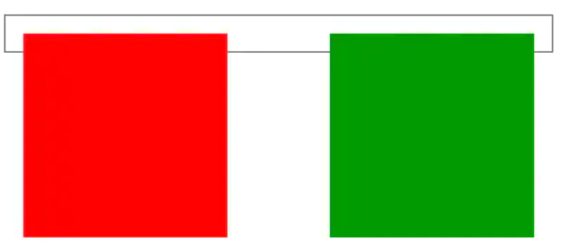
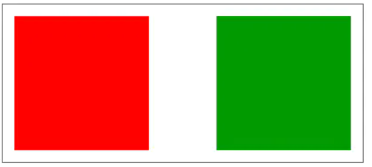
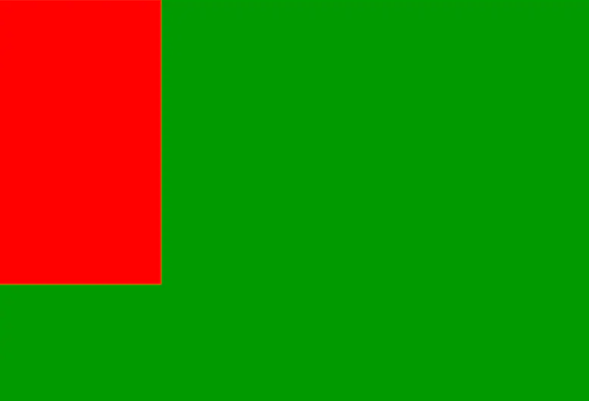
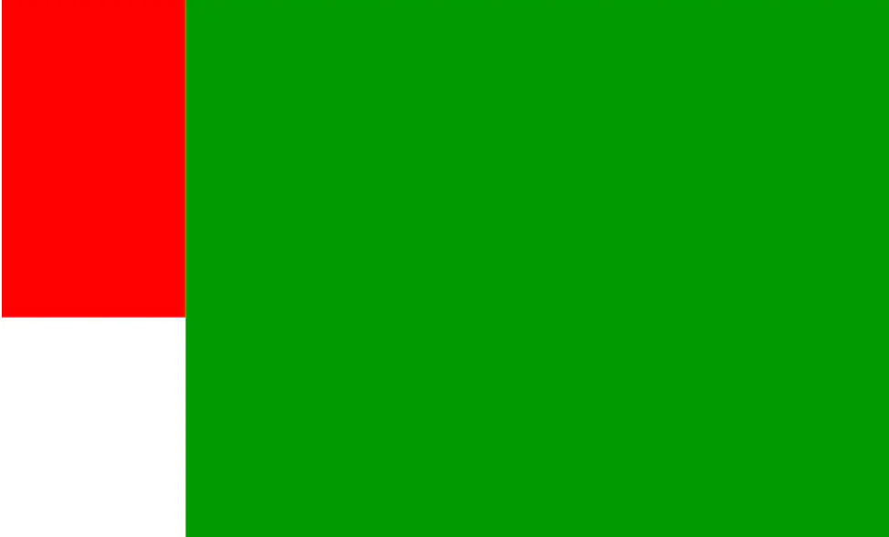
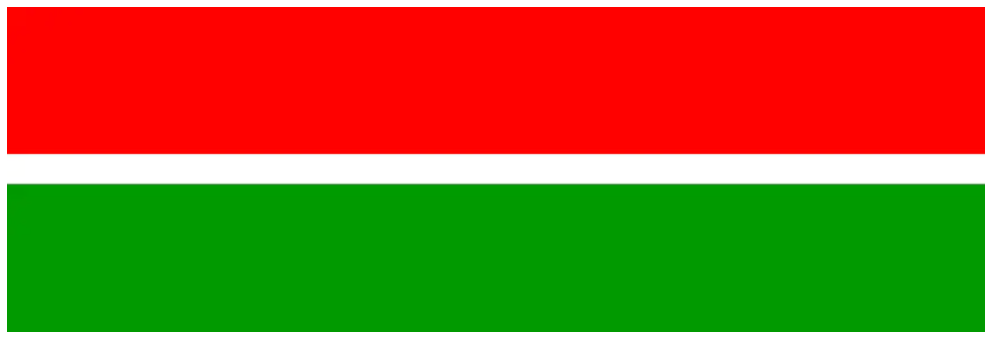
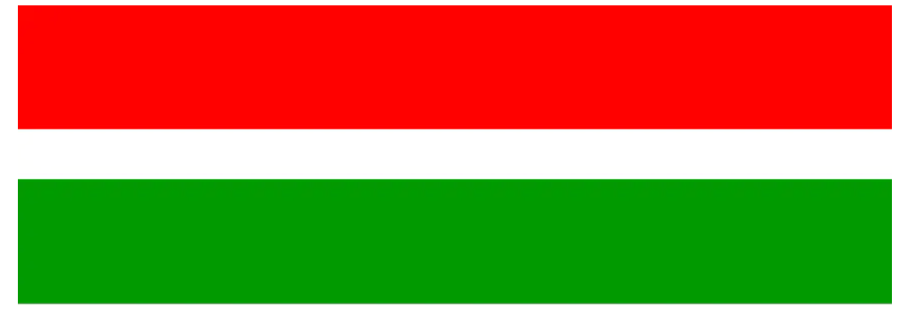
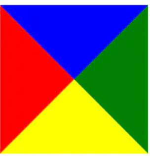
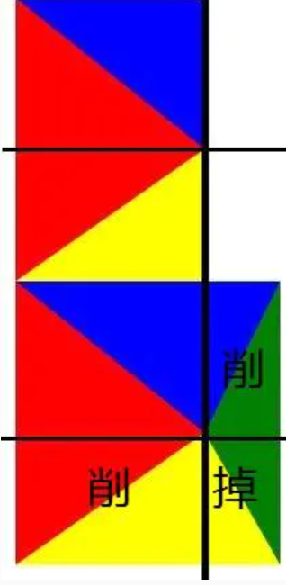
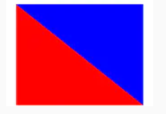

目录
- [1. CSS基础](#1-css基础)
  - [1.1 CSS盒模型 ](#11-css盒模型-)
  - [1.2 CSS选择器及优先级 ](#12-css选择器及优先级-)
  - [1.3 CSS3 新特性 ](#13-css3-新特性-)
    - [1.3.1 Transition 和 Animation 对比 ](#131-transition-和-animation-对比-)
  - [1.4 display的值和作用及区别 ](#14-display的值和作用及区别-)
    - [1.4.1 相邻的两个inline-block出现间隔？怎么解决？ ](#141-相邻的两个inline-block出现间隔怎么解决-)
  - [1.5 隐藏元素的方法和区别 ](#15-隐藏元素的方法和区别-)
  - [1.6 单行、多行文本溢出隐藏 ](#16-单行多行文本溢出隐藏-)
  - [1.7 @import 和 link 的区别 ](#17-import-和-link-的区别-)
  - [1.8 CSS中可继承与不可继承属性 ](#18-css中可继承与不可继承属性-)
  - [1.9 伪元素和伪类的区别和作用 ](#19-伪元素和伪类的区别和作用-)
  - [1.10 对 CSSSprites 的理解 ](#110-对-csssprites-的理解-)
  - [1.11 CSS预处理器/后处理器是什么？为什么要使用它们？ ](#111-css预处理器后处理器是什么为什么要使用它们-)
  - [1.12 对line-height 的理解 ](#112-对line-height-的理解-)
  - [1.13 媒体查询的理解 ](#113-媒体查询的理解-)
- [2. 页面布局问题](#2-页面布局问题)
  - [2.1 两栏布局 ](#21-两栏布局-)
  - [2.2 三栏布局 ](#22-三栏布局-)
  - [2.3 水平垂直居中的实现 ](#23-水平垂直居中的实现-)
  - [2.4 Flex布局 ](#24-flex布局-)
    - [2.4.1 flex语法](#241-flex语法)
  - [2.5 常见CSS布局单位 (px，em，rem的区别) ](#25-常见css布局单位-pxemrem的区别-)
  - [2.6 移动端适配 ](#26-移动端适配-)
  - [2.7 响应式布局 ](#27-响应式布局-)
    - [2.7.1 bootstrap 响应式布局实现原理](#271-bootstrap-响应式布局实现原理)
- [3. 定位与浮动](#3-定位与浮动)
  - [3.1 BFC ](#31-bfc-)
    - [3.1.1 如何生成BFC](#311-如何生成bfc)
    - [3.1.2 BFC能用来做什么](#312-bfc能用来做什么)
  - [3.2 position详解 ](#32-position详解-)
  - [3.3 为什么需要清除浮动？清除浮动的方式 ](#33-为什么需要清除浮动清除浮动的方式-)
- [4. 实践](#4-实践)
    - [4.1 如何移动端实现1px细线  ](#41-如何移动端实现1px细线--)
  - [4.2 CSS 画三角形 ](#42-css-画三角形-)
- [5. 查漏补缺](#5-查漏补缺)
  - [5.1 CSS阻塞加载](#51-css阻塞加载)
  - [5.2 性能优化](#52-性能优化)
  - [5.3 如何实现在图片被加载之前的占位符，宽高比16:9](#53-如何实现在图片被加载之前的占位符宽高比169)
    - [5.3.1 使用 img 伪对象 after 和 background](#531-使用-img-伪对象-after-和-background)
  - [5.4 宽度自适应，宽高比16：9](#54-宽度自适应宽高比169)
    - [5.4.1 padding-bottom 实现](#541-padding-bottom-实现)
    - [5.4.2 利用vmin来实现](#542-利用vmin来实现)
  - [5.5 水平垂直居中矩形，宽高比2:1](#55-水平垂直居中矩形宽高比21)


## 1. CSS基础

### 1.1 CSS盒模型  

有两种盒子模型标准盒子模型和IE盒子模型

```css
.box1 {
  box-sizing: content-box; //标准盒模型
  box-sizing: border-box; //IE盒模型
}
```
- Content-box (W3C)（标准盒模型）
四个部分组成：margin，border，padding，content

padding 和 border **不被包含**在定义的 width 和 height 之内。
Element width = width + border + padding。

- Border-box (IE)
padding 和 border **包含**在定义的 width 和 height 之内。Element width = width。

一般都是使用标准的 W3C 盒子模型。可以使用box-sizing 属性进行修改。

> JS 如何设置获取盒模型对应的宽和高？
>```
>dom.style.width/height;//设置获取的是内联样式
>window.getComputedStyle(dom).width/height;//兼容性好
>dom.getBoundingClientRect().width/height;//适用场所：计算一个元素的绝对位置
>```
>

### 1.2 CSS选择器及优先级  

- id选择器(#myid)
- 类选择器(.myclassName)
- 标签/元素选择器(p, h1)
- 组合选择器：
  - 子元素选择器(ul>li)
  - 后代选择器(li a)
  - 直接相邻元素选择器(h1 + p)
- 通配符选择器(*)
- 属性选择器(`a[rel="external"]`)
- 伪类选择器(a:hover,li:nth-child)
  - UI元素伪类选择器
  - 结构伪类选择器

选择器的**优先级**：
- 元素选择器，伪元素选择器： 1
- class选择器，伪类选择器，属性选择器： 10
- id选择符：100
- 元素标签（内联样式）：1000

>注意事项：
>- !important 最高，比内联优先级高
>- 如果优先级相同，则选择最后出现的样式。
>- 同权重： 内联样式(标签内部) > 内部样式表(当前文件中) > 外部样式(外部文件中)
>- !important > id > class > tag  
>- 继承得到的样式的优先级最低。

### 1.3 CSS3 新特性  


- 新增 CSS 选择器  
  - :not(p)  选择每个非p的元素； 
  - p:empty 选择每个没有任何子级的p元素（包括文本节点）
  
- 边框：
  ```
  div { 
    border:2px solid; 
    border-radius:25px; //用于设置圆角
    box-shadow: 10px 10px 5px #888888; //水平阴影 垂直阴影 模糊距离 阴影颜色
    border-image:url(border.png) 30 30 round;// 设置所有边框图像的速记属性。
  }
  ```

- 背景 background-clip（规定背景图的绘制区域），background-origin，background-size
  ```
  div{ 
      background:url(img_flwr.gif); 
      background-repeat:no-repeat; 
      background-size:100% 100%; //规定背景图的尺寸
      background-origin:content-box;//规定背景图的定位区域
  } 
  多背景 
  body{ 
      background-image:url(img_flwr.gif),url(img_tree.gif); 
  }
  ```

- 线性渐变 （Linear Gradients） 向下/向上/向左/向右/对角方向
  ```
  background: linear-gradient(direction, color-stop1, color-stop2, ...);
  ```

- 文本效果 
  阴影 text-shadow，textwrap，word-break，word-wrap;

- 2D 转换, 3D转换
  ```
  transform:scale(0.85,0.90) | translate(0px,-30px) | skew(-9deg,0deg) |rotate()
  perspective()；transform是向元素应用 2D 或者 3D 转换；  
  ```

- 过渡 transition
  transition：定义了元素在变化过程中是怎么样的，包含transition-property、transition-duration、transition-timing-function、transition-delay。

- 动画 animation
  animation：动画定义了动作的每一帧（@keyframes）有什么效果，包括animation-name，animation-duration、animation-timing-function、animation-delay、animation-iteration-count、animation-direction

- 多列布局 （multi-column layout）
- [盒模型](#1-css-盒模型)
- [flex 布局](#47-flex值和作用)
- 多媒体查询 定义两套css，当浏览器的尺寸变化时会采用不同的属性

#### 1.3.1 Transition 和 Animation 对比 

Transition是过渡属性，强调过度，它的实现需要触发一个事件（比如鼠标移动上去，焦点，点击等）才执行动画。它类似于flash的补间动画，设置一个开始关键帧，一个结束关键帧。

Animation是动画属性，它的实现不需要触发事件，设定好时间之后可以自己执行，且可以循环一个动画。它也类似于flash的补间动画，但是它可以设置多个关键帧（用@keyframe定义）完成动画。

### 1.4 display的值和作用及区别  
| 值 | 作用 |
| -- | --- |
|block | 此元素将显示为块级元素，此元素前后会带有换行符。默认宽度为父元素宽度，可设置宽高，换行显示 |
|none | 元素不显示，并从文档流中移除 |
|inline | 行内元素，默认宽度为内容宽度，不可设置宽高，同行显示
|inline-block (CSS2.1新增) | 默认宽度为内容宽度，可以设置宽高，像行内元素一样显示，但其内容像块类型元素一样显示 |
|list-item | 此元素会作为列表显示 |
|table | 此元素会作为块级表格来显示（类似table），表格前后带有换行符
|inherit | 从父元素继承display值 |

> display的block、inline和inline-block的区别
> 
>block：会独占一行，多个元素会另起一行，可以设置width、height、margin和padding属性；可以自动换行。
>
>inline：元素不会独占一行，设置width、height属性无效。**但可以设置水平方向的margin和padding属性，不能设置垂直方向的padding和margin；**。不能自动换行。
>
>inline-block：将对象设置为inline对象，但对象的内容作为block对象呈现，之后的内联对象会被排列在同一行内。

#### 1.4.1 相邻的两个inline-block出现间隔？怎么解决？ 

归根结底这是一个西文排版的问题。举一个很简单的例子：

I am very happy

南京市长江大桥欢迎您

英文有空格作为词分界，而中文则没有。（这背后延伸出一个中文分词的问题）

这个问题的原因可以上述到SGML(标准通用标记语言)和TeX(排版工具)，它实际上是一个行内（inline）的问题，它由空格、换行或回车所产生空白符所致

解决方法：

- 写的时候中间不要加空格或者空行
- 用font-size 改变字符大小
- margin负值。按照字体大小，值不一样。
- word-spacing 或者 letter-spacing
  - 一个是字符间距(letter-spacing)一个是单词间距(word-spacing)，大同小异。
  - letter-spacing子元素要设置letter-spacing为0，不然会继承父元素的值；使用word-spacing时，只需设置父元素word-spacing为合适值即可。
  - 使用letter-spacing和word-spacing时，其在不同浏览器下效果不同。


### 1.5 隐藏元素的方法和区别  

- `display: none`：渲染树不会包含该渲染对象，因此该元素不会在页面中占据位置，也不会响应绑定的监听事件。
- `visibility: hidden`：元素在页面中仍占据空间，但是不会响应绑定的监听事件。
- `opacity: 0`：将元素的透明度设置为 0，以此来实现元素的隐藏。元素在页面中仍然占据空间，并且能够响应元素绑定的监听事件。
- `z-index: 负值`：来使其他元素遮盖住该元素，以此来实现隐藏。●
- `clip/clip-path`：使用元素裁剪的方法来实现元素的隐藏，这种方法下，元素仍在页面中占据位置，但是不会响应绑定的监听事件。●
- `transform: scale(0,0)`：将元素缩放为 0，来实现元素的隐藏。这种方法下，元素仍在页面中占据位置，但是不会响应绑定的监听事件。
- `position: absolute`：通过使用绝对定位将元素移除可视区域内，以此来实现元素的隐藏。

> `display:none`与 `visibility:hidden` 区别
>- display:none会让元素完全从渲染树中消失，渲染时不会占据任何空间；
>- visibility:hidden不会让元素从渲染树中消失，渲染的元素还会占据相应的空间，只是内容不可见。
>- display:none是非继承属性，子孙节点会随着父节点从渲染树消失，通过修改子孙节点的属性也无法显示；
>- visibility:hidden是继承属性，子孙节点消失是由于继承了hidden，通过设置visibility:visible可以让子孙节点显示；
>- 修改常规文档流中元素的 display 通常会造成文档的重排，但是修改visibility属性只会造成本元素的重绘；
>- 如果使用读屏器，设置为display:none的内容不会被读取，设置为visibility:hidden的内容会被读取。

### 1.6 单行、多行文本溢出隐藏  

- 单行文本溢出
```
overflow: hidden;            // 溢出隐藏
text-overflow: ellipsis;      // 溢出用省略号显示
white-space: nowrap;         // 规定段落中的文本不进行换行
```
- 多行文本溢出
```
overflow: hidden;            // 溢出隐藏
text-overflow: ellipsis;     // 溢出用省略号显示
display:-webkit-box;         // 作为弹性伸缩盒子模型显示
-webkit-box-orient:vertical; // 设置伸缩盒子的子元素排列方式：从上到下垂直排列
-webkit-line-clamp:3;        // 显示的行数
```

### 1.7 @import 和 link 的区别 
- link是属于XHTML的标签，而@import是CSS提供的一种方式。
- 加载顺序的差别：当页面进行加载的时候，link引用的CSS时会被加载，而@import引用的CSS会等页面加载完成以后才被加载，所以在 @import加载CSS的时候，一开始会没有样式。
- 兼容性的差别：@import在老的浏览器上不兼容，只有在IE5以上的浏览器才可以被识别，但是link可以在任意浏览器的版本上进行加载执行。
- 使用DOM文档对象模型控制样式的差别：当使用JavaScript控制DOM区改变样式的时候，只能使用link标签，而@import是不可以的。
- 作用不同：link是属于XHTML，除了可以加载css,还可以定义RSS等其它事务，而@import是属于css范畴，只能加载css。

### 1.8 CSS中可继承与不可继承属性 

不能继承的属性

- display：规定元素应该生成的框的类型；
- 文本属性：vertical-align、text-decoration、text-shadow;
- 盒子模型的属性：width、height、margin 、border、padding;
- 背景属性：background、background-color、background-image;
- 定位属性：float、clear、position、top、right、bottom、left、min-width、
min-height、max-width、max-height、overflow、clip;
- 生成内容属性：content


能继承的属性

- 字体系列属性:font、font-family、font-weight、font-size、font-style;
- 文本系列属性:
  - 内联元素：color、line-height、word-spacing、letter-spacing、text-transform;
  - 块级元素：text-indent、text-align;
- 元素可见性：visibility
- 表格布局属性：caption-side、border-collapse、border-spacing、empty-cells、
table-layout;
- 列表布局属性：list-style

### 1.9 伪元素和伪类的区别和作用 

伪元素：在内容元素的前后插入额外的元素或样式，但是这些元素实际上并不在文档中生成。它们只在外部显示可见，但不会在文档的源代码中找到它们，因此，称为“伪”元素。例如：
```
p::before {content:"第一章：";}
p::after {content:"Hot!";}
p::first-line {background:red;}
p::first-letter {font-size:30px;}
```

伪类：将特殊的效果添加到特定选择器上。它是已有元素上添加类别的，不会产生新的元素。例如：
```
a:hover {color: #FF00FF}
p:first-child {color: red}
```

总结：伪类是通过在元素选择器上加⼊伪类改变元素状态，⽽伪元素通过对元素的操作进⾏对元素的改变。

### 1.10 对 CSSSprites 的理解 
CSSSprites（精灵图），将一个页面涉及到的所有图片都包含到一张大图中去，然后利用CSS的 background-image，background-repeat，background-position属性的组合进行背景定位。

优点：
- 利用CSS Sprites能很好地减少网页的http请求，从而大大提高了页面的性能
- CSS Sprites能减少图片的字节，把3张图片合并成1张图片的字节总是小于这3张图片的字节总和。
  
缺点：
- 在图片合并时，要把多张图片有序的、合理的合并成一张图片，还要留好足够的空间，防止板块内出现不必要的背景。在宽屏及高分辨率下的自适应页面，如果背景不够宽，很容易出现背景断裂；
- CSSSprites在开发的时候相对来说有点麻烦，需要借助photoshop或其他工具来对每个背景单元测量其准确的位置。
- 维护方面：CSS Sprites在维护的时候比较麻烦，页面背景有少许改动时，就要改这张合并的图片，无需改的地方尽量不要动，这样避免改动更多的CSS，如果在原来的地方放不下，又只能（最好）往下加图片，这样图片的字节就增加了，还要改动CSS。

### 1.11 CSS预处理器/后处理器是什么？为什么要使用它们？ 

**预处理器**，如：less，sass，stylus，用来预编译sass或者less，增加了css代码的复用性。层级，mixin， 变量，循环， 函数等对编写以及开发UI组件都极为方便。

后处理器， 如： postCss，通常是在完成的样式表中根据css规范处理css，让其更加有效。目前最常做的是给css属性添加浏览器私有前缀，实现跨浏览器兼容性的问题。

预处理器为css增加一些编程特性，无需考虑浏览器的兼容问题，可以在CSS中使用变量，简单的逻辑程序，函数等在编程语言中的一些基本的性能，可以让css更加的简洁，增加适应性以及可读性，可维护性等。

其它css预处理器语言：Sass（Scss）, Less, Stylus, Turbine, Swithch css, CSS Cacheer, DT Css。

使用原因：
- 结构清晰， 便于扩展
- 可以很方便的屏蔽浏览器私有语法的差异
- 可以轻松实现多重继承
- 完美的兼容了CSS代码，可以应用到老项目中

### 1.12 对line-height 的理解 

- line-height 指一行文本的高度，包含了字间距，实际上是下一行基线到上一行基线距离；
- 如果一个标签没有定义 height 属性，那么其最终表现的高度由 line-height 决定；
- 一个容器没有设置高度，那么撑开容器高度的是 line-height，而不是容器内的文本内容；
- 把 line-height 值设置为 height 一样大小的值可以实现单行文字的垂直居中；


line-height 的赋值方式：

- 带单位：px 是固定值，而 em 会参考父元素 font-size 值计算自身的行高
- 纯数字：会把比例传递给后代。例如，父级行高为 1.5，子元素字体为 18px，则子元素行高为 1.5 * 18 = 27px
- 百分比：将计算后的值传递给后代

### 1.13 媒体查询的理解 

响应式适配 根据不同的屏幕尺寸, 显示不同的效果 (设置盒子的样式)

媒体查询由两部分组成：

一个可选的媒体类型（如 screen、print 等）

零个或多个媒体功能限定表达式（如 max-width: 500px、orientation: landscape 等）

这两部分最终都会被解析为 true 或 false 值，然后整个媒体查询值为 true，则和该媒体查询关联的样式就生效，否则就不生效。

```
@media screen and (max-width: 767px) {
  .container {
    width: 100%;
  }
}
@media screen and (min-width: 768px) and (max-width: 991px) {
  .container {
    width: 750px;
  }
}
@media screen and (min-width: 992px) and (max-width: 1199px) {
  .container {
    width: 980px;
  }
}
```

## 2. 页面布局问题

### 2.1 两栏布局  

实现两栏布局，左栏固定宽度，右栏宽度与父级容器宽度一致，随父级容器宽度改变而改变。

- 利用浮动，将左边元素宽度设置为200px，并且设置向左浮动。将右边元素的margin-left设置为200px，宽度设置为auto（默认为auto，撑满整个父元素）。

```
.outer {
  height: 100px;
}
.left {
  float: left;
  width: 200px;
}
.right {
  margin-left: 200px;
  width: auto;
  background: gold;
}
```

- 利用flex布局，将左边元素设置为固定宽度200px，将右边的元素设置为flex:1。
```  
.outer {
  display: flex;
  height: 100px;
}
.left { 
  width: 200px;
}
.right {
  flex: 1;
}
```

### 2.2 三栏布局  

- 利用flex布局，左右两栏设置固定大小，中间一栏设置为flex:1。
```
.outer {
  display: flex;
  height: 100px;
}
.left {
  width: 100px;
}
.right {
  width: 100px;
}
.center {
  flex: 1;
}
```

### 2.3 水平垂直居中的实现 

- 利用绝对定位，先将元素的左上角通过top:50%和left:50%定位到页面的中心，然后再通过translate来调整元素的中心点到页面的中心。该方法需要考虑浏览器兼容问题。
```
.parent {
  position: relative;
}
.child {
  position: absolute;
  left: 50%
  top: 50%;
  transform: translate(-50%,-50%);
}
```

- 利用绝对定位，设置四个方向的值都为0，并将margin设置为auto，由于宽高固定，因此对应方向实现平分，可以实现水平和垂直方向上的居中。该方法适用于盒子有宽高的情况：
```
.parent {
  position: relative
}
.child {
  position: absolute;
  top: 0;
  bottom: 0;
  left: 0;
  right: 0;
  margin: auto;
}
```
- 使用flex布局，通过align-items:center和justify-content:center设置容器的垂直和水平方向上为居中对齐，然后它的子元素也可以实现垂直和水平的居中。该方法要考虑兼容的问题，该方法在移动端用的较多：
```  
.parent {
  display: flex;
  justify-content:center;
  align-items:center;
}
```

### 2.4 Flex布局 

- 设置盒子的display属性为flex，或者line-flex，其对应还有六个css属性。

  | 值 | 作用 |
  | -- | --- |
  |flex-direction | 设置子元素的排列方式（row，column，row-reverse，column-reverse） |
  |flex-warp | 设置子元素的是否换行（nowarp，warp，warp-reverse） |
  |flex-flow | flex-direction和flex-warp的缩写，默认为row nowarp
  |justify-content | 设置子元素的水平排列方式（flex-start，flex-end，center，span-around，span-between） |
  |align-items | 设置子元素的垂直方式（flex-start，flex-end，center，stretch，baseline） |
  |align-content | 设置多个轴线的排列方式（flex-start，flex-end，center，spand-around，spand-between，stretch）


- 对应的子元素项目也拥有自身的六个css属性。

  | 值 | 作用 |
  | -- | --- |
  |order | 设置元素的排列权重 值越大越在后 |
  |flex-grow | 设置元素的放大比例（横向会变宽）
  |flex-shrink | 设置元素的缩小比例
  |flex-basis | 设置多余空间项目主轴所占比例空间，设置元素初始大小。比如=content(根据内容自动调节大小)
  |flex | flex-grow和flex-shrink和flex-basis的缩写方式 默认为0 1 auto
  |align-self | 设置子元素自己的垂直排列方式，默认为盒子的align-items的值
  
  :warning:：设置flex布局后，子元素的float，clear，vertical-align都无效

#### 2.4.1 flex语法

- 单值语法
  
  值必须是如下之一：

  - 数值 number，那么解释为 flex: number 1 0
  - none、auto、initial

- 双值语法

  第一个值必须是 number，它会被解释为 flex-grow 属性，第二个值必须是如下之一：

  - 数值 number，会被解释为 flex-shrink 属性
  - 一个能够描述宽度的值，例如 10em、30%、min-content，会被解释为 flex-basis 属性

- 三值语法

  三个值的含义：

  - 第一个 number 表示 flex-grow
  - 第二个 number 表示 flex-shrink
  - 第三个描述宽度的值表示 flex-basis

```
flex: 0 auto
flex: 0 auto 等同于 flex: initial，也是 flex: 0 1 auto 的简写表达。它根据元素自身的 width 或 height 属性来调节元素大小。
当还剩余一些空闲空间时，它使 flex 元素呈现的是固定大小的样式；当没有足够的空间时，它允许它收缩到最小。auto 边距可用于根据主轴来对齐元素。
flex: auto
flex: auto 等同于 flex: 1 1 auto，它根据元素的 width 或 height 属性调整元素的大小，但是其非常灵活，以便让它们吸收沿主轴的任何额外空间。
flex: none
flex: none 等同于 flex: 0 0 auto。它根据 width 和 `height 来调节元素大小，但是完全不灵活。
```

### 2.5 常见CSS布局单位 (px，em，rem的区别) 

常用的布局单位包括像素（px），百分比（%），em，rem，vw/vh。
- 像素（px）是页面布局的基础，一个像素表示终端（电脑、手机、平板等）屏幕所能显示的最小的区域，像素分为两种类型：CSS像素和物理像素：

  >CSS像素：为web开发者提供，在CSS中使用的一个抽象单位；
  >
  >物理像素：只与设备的硬件密度有关，任何设备的物理像素都是固定的。

- 百分比（%），当浏览器的宽度或者高度发生变化时，通过百分比单位可以使得浏览器中的组件的宽和高随着浏览器的变化而变化，从而实现响应式的效果。一般认为子元素的百分比相对于直接父元素。

- em和rem相对于px更具灵活性，它们都是相对长度单位，它们之间的区别：**em相对于父元素，rem相对于根元素。**

  >em： 文本相对长度单位。相对于当前对象内文本的字体尺寸。如果当前行内文本的字体尺寸未被人为设置，则相对于浏览器的默认字体尺寸(默认16px)。(相对父元素的字体大小倍数)。
  >
  >rem： rem是CSS3新增的一个相对单位，相对于根元素（html元素）的font-size的倍数。作用：利用rem可以实现简单的响应式布局，可以利用html元素中字体的大小与屏幕间的比值来设置font-size的值，以此实现当屏幕分辨率变化时让元素也随之变化。

- vw/vh是与视图窗口有关的单位，vw表示相对于视图窗口的宽度，vh表示相对于视图窗口高度，除了vw和vh外，还有vmin和vmax两个相关的单位。

  >vw：相对于视窗的宽度，视窗宽度是100vw；
  >vh：相对于视窗的高度，视窗高度是100vh；
  >vmin：vw和vh中的较小值；
  >vmax：vw和vh中的较大值；

### 2.6 移动端适配 

适配不同像素密度，针对不同的像素密度，使用 CSS 媒体查询，选择不同精度的图片，以保证图片不会失真；

适配不同屏幕大小，由于不同的屏幕有着不同的逻辑像素大小，所以如果直接使用 px 作为开发单位，会使得开发的页面在某一款手机上可以准确显示，但是在另一款手机上就会失真。为了适配不同屏幕的大小，应按照比例来还原设计稿的内容

### 2.7 响应式布局 

响应式布局就是根据屏幕大小变化，页面的内容排版布局会自动调整变动，已呈现更好的用户体验。

大多数移动浏览器将HTML页面放大为宽的视图（viewport）以符合屏幕分辨率。你可以使用视图的meta标签来进行重置。下面的视图标签告诉浏览器，使用设备的宽度作为视图宽度并禁止初始的缩放。在标签里加入这个meta标签。

可以通过flex，vw/vh，rem实现。

>和自适应布局的区别？
>
>自适应布局就是宽度自适用布局，在不同大小的设备上，网页以等比例的形式缩放宽度，呈现同样的主体内容和排版布局。随着屏幕宽度缩放，网页内容也以等比例缩放，不管屏幕宽度为多少，网页主体排版布局总是一样的
>
>而响应式布局是随着屏幕宽度的缩放，页面做出相应调整，布局和展示的内容会有所变动

#### 2.7.1 bootstrap 响应式布局实现原理

- 媒体查询（media）

  使用 @media 查询，就针对不同的媒体类型定义不同的样式。利用媒体查询设置不同分辨率下的css样式，来适配不同屏幕。

  @media 可以针对不同的屏幕尺寸设置不同的样式，特别是如果你需要设置设计响应式的页面，@media 是非常有用的。

  当你重置浏览器大小的过程中，页面也会根据浏览器的宽度和高度重新渲染页面。

- grid system 行列布局（12等分）

  bootstrap布局划分屏幕空间采用的是12等分。它可以被1、2、3、4、6、12共6个数字整除，本来就是用来分空间的系统，当然可以更好的被整除最好了，这样怎么分都愉快。

  比如，两个div分空间，分别占用50%，或者一个1/3一个2/3，或者1/4对3/4

  3个div分空间，分别占用1/3，或者两个1/6一个2/3，或者两个1/4对1/2


## 3. 定位与浮动

### 3.1 BFC 

一个页面是由很多个 Box 组成的， 元素的类型和 display 属性， 决定了这个 Box 的类型。

不同类型的 Box，会参与不同的 Formatting Context（决定如何渲染文档的容器），因此Box内的元素会以不同的方式渲染，也就是说BFC内部的元素和外部的元素不会互相影响。**Block Formatting Context提供了一个环境，HTML元素在这个环境中按照一定规则进行布局。一个环境中的元素不会影响到其它环境中的布局。**

通俗来讲：BFC是一个独立的布局环境，可以理解为一个容器，在这个容器中按照一定规则进行物品摆放，并且不会影响其它环境中的物品。如果一个元素符合触发BFC的条件，则BFC中的元素布局不受外部影响。

#### 3.1.1 如何生成BFC

- 根元素或包含根元素的元素；
- 浮动元素（元素的 float 不是 none）；
- 绝对定位元素（元素的 position 为 absolute 或 fixed）；
- 行内块元素（元素的 display 为 inline-block ）；
- 表格单元格（元素的 display 为 table-cell ，HTML 表格单元格默认为该值）；
- 表格标题（元素的 display 为 table-caption ，HTML 表格标题默认为该值）；
- 弹性元素（display 为 flex 或 inline-flex **元素的直接子元素**）；
- 网格元素（display 为 grid 或 inline-grid **元素的直接子元素**）；
- 匿名表格单元格元素（元素的 display 为 table、 table-row 、 table-row-group 、table-header-group 、table-footer-group （分别是 HTML table、row、tbody、thead、tfoot 的默认属性）或 inline-table ）；
- **overflow 值为 hidden、auto、scroll 的块元素；**

#### 3.1.2 BFC能用来做什么
- 清除元素内部浮动：通过给父元素创建 BFC ，添加 overflow: hidden; 样式；
  

  只要把父元素设为 BFC 就可以清理子元素的浮动了，最常见的用法就是在父元素上设置  overflow : hidden 样式，对于 IE6 加上 zoom :1 就可以了( IE Haslayout )。

  根据 CSS2.1 规范第 10.6.3 部分的高度计算规则，在进行普通流中的块级非替换元素的高度计算时，浮动子元素不参与计算。同时 CSS2.1 规范第10.6.7部分的高度计算规则，在计算生成了 block formatting context 的元素的高度时，其浮动子元素应该参与计算。**所以，触发外部容器BFC，高度将重新计算。比如给outer加上属性overflow:hidden触发其BFC。**

  结果：

  


- 解决margin重叠问题：将垂直方向上的盒子放在不同的 BFC 中，margin 就不会重叠了；
  

  如果一个浮动元素后面跟着一个非浮动的元素，那么就会产生一个覆盖的现象，很多自适应的两栏布局就是这么做的。**上面已经说过创建 BFC 的方法，可以根据具体情况选用不同的方法，这里我选用的是加 overflow:hidden。**

  结果：

  

- 制作自适应两栏布局：要求两栏布局中间没有缝隙时，通过触发 main 生成 BFC ，来实现自适应无缝隙两栏布局。
  
  

  根据 CSS 2.1 8.3.1 Collapsing margins 第一条，两个相邻的普通流中的块框在垂直位置的空白边会发生折叠现象。也就是处于同一个BFC中的两个垂直窗口的margin会重叠。根据 CSS 2.1 8.3.1 Collapsing margins 第三条，生成 block formatting context 的元素不会和在流中的子元素发生空白边折叠。所以解决这种问题的办法是要为两个容器添加具有BFC的包裹容器。**所以解这个问题的办法就是,把两个容器分别放在两个据有 BFC 的包裹容器中，IE 里就是触发layout 的两个包裹容器中！**

  结果：

  

### 3.2 position详解  

| 值 | 作用 |
| -- | --- |
|absolute | 生成绝对定位的元素，相对于 static 定位以外的第一个父元素进行定位。元素的位置通过 "left", "top", "right" 以及 "bottom" 属性进行规定。而其层叠通过css z-index属性定义。此时对象**不具有边距**，宽度由元素里面的内容决定，效果和用float方法一样，但仍有补白和边框 |
|fixed | 生成固定定位的元素，相对于浏览器窗口进行定位。（老IE不支持）元素的位置通过 "left", "top", "right" 以及 "bottom" 属性进行规定。
|relative | 生成相对定位的元素，相对于其正常位置进行定位，不脱离文档流。因此，"left:20" 会向元素的 LEFT 位置添加 20 像素。
|static | 默认值。没有定位，元素出现在正常的文档流中（忽略 top, bottom, left, right 或者 z-index 声明）。
|inherit | 规定应该从父元素继承 position 属性的值。
|sticky (新增) | 它主要用在对 scroll 事件的监听上；粘性定位可以被认为是相对定位和固定定位的混合。元素在跨越特定阈值前为相对定位，之后为固定定位。例如：#one { position: sticky; top: 10px; } 在 viewport 视口滚动到元素 top 距离小于 10px 之前，元素为相对定位。之后，元素将固定在与顶部距离 10px 的位置，直到 viewport 视口回滚到阈值以下。

float和position混用时，float不会生效。

### 3.3 为什么需要清除浮动？清除浮动的方式  

浮动的定义： 非IE浏览器下，容器不设高度且子元素浮动时，容器高度不能被内容撑开。 此时，内容会溢出到容器外面而影响布局。这种现象被称为浮动（溢出）。

浮动的工作原理：
- 浮动元素脱离文档流，不占据空间（引起“高度塌陷”现象）
- 浮动元素碰到包含它的边框或者其他浮动元素的边框停留

>浮动元素可以左右移动，直到遇到另一个浮动元素或者遇到它外边缘的包含框。浮动框不属于文档流中的普通流，当元素浮动之后，不会影响块级元素的布局，只会影响内联元素布局。此时文档流中的普通流就会表现得该浮动框不存在一样的布局模式。当包含框的高度小于浮动框的时候，此时就会出现“高度塌陷”。

**浮动元素引起的问题？**
- 父元素的高度无法被撑开，影响与父元素同级的元素
- 与浮动元素同级的非浮动元素会跟随其后
- 若浮动的元素不是第一个元素，则该元素之前的元素也要浮动，否则会影响页面的显示结构

**清除浮动的方式如下**：
1.  父级div定义height

    原理：父级div手动定义height，就解决了父级div无法自动获取到高度的问题

    优点：简单，代码少，容易掌握

    缺点：只适合高度固定的布局，要给出精确的高度，如果高度和父级div不一样时，会产生问题

    建议：不推荐使用，只建议高度固定的布局时使用

------
2.  最后一个浮动元素后加空 div 标签 并添加样式 clear:both。（理论上能清除任何标签，增加无意义的标签）
  
    原理：添加一个空div，利用css添加clear:both清除浮动，让父级div能自动获取到高度

    优点：简单，代码少，浏览器支持好，不容易出现怪问题

    缺点：不少初学者不理解原理；如果页面浮动布局多，就要增加很多空div，让人感觉很不爽

    建议：不推荐使用，但此方法是以前主要使用的一种清除浮动方法
------
3.  包含浮动元素的父标签添加样式 overflow 为 hidden 或 auto。

    原理：必须定义width或zoom:1，同时不能定义height，使用overflow:hidden时，浏览器会自动检查浮动区域的高度

    优点：简单，代码少，浏览器支持好

    缺点：不能和position配合使用，因为超出的尺寸的会被隐藏

    建议：只推荐没有使用position或对overflow:hidden理解比较深的朋友使用
------
4.  父级div定义伪类 :after 和 zoom（空标签元素清除浮动而不得不增加无意义代码的弊端，使用zoom:1用于兼容IE）
   
    原理：IE8以上和非IE浏览器才支持:after，原理和方法2有点类似，zoom(IE转有属性)可解决ie6,ie7浮动问题

    优点：浏览器支持好，不容易出现怪问题（目前：大型网站都有使用，如：腾迅，网易，新浪等等）

    缺点：代码多，不少初学者不理解原理，要两句代码结合使用，才能让主流浏览器都支持

    建议：推荐使用，建议定义公共类，以减少CSS代码


## 4. 实践

#### 4.1 如何移动端实现1px细线  

移动端CSS里面写了1px，实际上看起来比1px粗， viewport的设置和屏幕物理分辨率是按比例而不是相同的. 移动端window对象有个devicePixelRatio属性, 它表示设备物理像素和css像素的比例, 在retina屏的iphone手机上, 这个值为2或3, css里写的1px长度映射到物理像素上就有2px或3px那么长。

------
媒体查询

media查询利用设备像素比缩放，设置小数像素。IOS8下已经支持带小数的px值, media query对应devicePixelRatio有个查询值-webkit-min-device-pixel-ratio, css可以写成这样。

```
.border { border: 1px solid #999 }
@media screen and (-webkit-min-device-pixel-ratio: 2) {
    .border { border: 0.5px solid #999 }
}
@media screen and (-webkit-min-device-pixel-ratio: 3) {
    .border { border: 0.333333px solid #999 }
}
```
【缺点】对设备有要求，小数像素目前兼容性较差。

------
viewport + rem 缩放解决

viewport + rem + js 动态的修改页面的缩放比例，实现小于1像素的显示。在页面初始化时，在头部引入原始默认状态如下：
```
<meta http-equiv="Content-Type" content="text/html;charset=UTF-8">  
<meta name="viewport" id="WebViewport" content="initial-scale=1, maximum-scale=1, minimum-scale=1, user-scalable=no"> 
```
接下来的任务就是js的动态修改缩放比 以及 实现rem根元素字体大小的设置。
```
var viewport = document.querySelector("meta[name=viewport]")
if (window.devicePixelRatio == 1) {
    viewport.setAttribute('content', 'width=device-width, initial-scale=1, maximum-scale=1, minimum-scale=1, user-scalable=no')
} 
if (window.devicePixelRatio == 2) {
    viewport.setAttribute('content', 'width=device-width, initial-scale=0.5, maximum-scale=0.5, minimum-scale=0.5, user-scalable=no')
} 
if (window.devicePixelRatio == 3) {
    viewport.setAttribute('content', 'width=device-width, initial-scale=0.333333333, maximum-scale=0.333333333, minimum-scale=0.333333333, user-scalable=no')
} 

var docEl = document.documentElement;
var fontsize = 10 * (docEl.clientWidth / 320) + 'px';
docEl.style.fontSize = fontsize;
```

------
伪类 + transform

这个方法的可行性会更高，兼容性也更好。唯一的缺点是代码会变多。

思路是先放大、后缩小：在目标元素的后面追加一个 ::after 伪元素，让这个元素布局为 absolute 之后、整个伸展开铺在目标元素上，然后把它的宽和高都设置为目标元素的两倍，border值设为 1px。

接着借助 CSS 动画特效中的放缩能力，把整个伪元素缩小为原来的 50%。此时，伪元素的宽高刚好可以和原有的目标元素对齐，而 border 也缩小为了 1px 的二分之一，间接地实现了 0.5px 的效果。

代码如下：
```
#container[data-device="2"] {    
  position: relative;
}

#container[data-device="2"]::after{      
  position:absolute;      
  top: 0;      
  left: 0;      
  width: 200%;      
  height: 200%;
  content:"";      
  transform: scale(0.5);
  transform-origin: left top;   
  box-sizing: border-box;     
  border: 1px solid #333;   
}
```

### 4.2 CSS 画三角形 

```
div{
  width: 0;
  height: 0;
  border-left:50px solid red;  
  border-top:50px solid blue;  
  border-right:50px solid green;  
  border-bottom:50px solid yellow;  
}
```


然后我们在看下border不等的情况下的模式，代码就不发了，改下各个border-width宽度就行了：由此我们可以看出图中每个三角形的高是等于border-width值的。

然后把别的三角形都隐身。

```
div{
  width: 0;
  height: 0;
  border-left:100px solid transparent;  
  border-top:80px solid transparent;  
  border-right:40px solid transparent;  
  border-bottom:70px solid yellow;  
}
```

那怎么得出我们想要的三角形呢，比如直角，或者是底边和高需要确定的角，因为底边=相邻两个border的宽度，高=自身border的宽度。那直角三角行：



这样是不是看的比较明白点，这样border-right，border-bottom都不设置就好像把下面和右边都削掉了一样，最后只留下左上角，即下图：



## 5. 查漏补缺

### 5.1 CSS阻塞加载

- css加载不会阻塞DOM树的解析
- css加载会阻塞DOM树的渲染
- css加载会阻塞后面js语句的执行

### 5.2 性能优化

  （1） 减少http请求次数：CSS Sprites, JS、CSS源码压缩、图片大小控制合适；网页Gzip，CDN托管，data缓存 ，图片服务器。

  （2） 前端模板 JS+数据，减少由于HTML标签导致的带宽浪费，前端用变量保存AJAX请求结果，每次操作本地变量，不用请求，减少请求次数

  （3） 用innerHTML代替DOM操作，减少DOM操作次数，优化javascript性能。

  （4） 当需要设置的样式很多时设置className而不是直接操作style。

  （5） 少用全局变量、缓存DOM节点查找的结果。减少IO读取操作。

  （6） 避免使用CSS Expression（css表达式)又称Dynamic properties(动态属性)。

  （7） 图片预加载，将样式表放在顶部，将脚本放在底部  加上时间戳。


### 5.3 如何实现在图片被加载之前的占位符，宽高比16:9

#### 5.3.1 使用 img 伪对象 after 和 background
```
<!DOCTYPE html>
<html lang="en">

<head>
    <meta charset="UTF-8">
    <meta name="viewport" content="width=device-width, initial-scale=1.0">
    <meta http-equiv="X-UA-Compatible" content="ie=edge">
    <title>Document</title>


	<style>
	.placeholder {
	  width: 120px;
	  height: 120px;
	  position: relative;
	}
	.placeholder:after {
	  content: '';
	  position: absolute;
	  width: 100%;
	  height: 100%;
	  left: 0;
	  top: 0;
	  background: url('img.png') no-repeat center #999;
	  padding-bottom:56.25%;
	}
	</style>
</head>

<body>
    

</body>
</html>
```

### 5.4 宽度自适应，宽高比16：9

#### 5.4.1 padding-bottom 实现
```
<!DOCTYPE html>
<html>
<head>
<title>固定宽高比16:9</title>
<style type="text/css">
* {
  margin: 0px;
  padding: 0px;
}
.wrap{
  width:100%;
}

/* 16:9宽高比，则设padding-bottom:56.25% */
/* height: 0px,防止矩形被里面的内容撑出多余的高度*/

.box{
  width: 100vw;
  height: 0px;
  position: relative;
  padding-bottom: 56.25%;
  background: pink;
}

/* 如果需要在div里面设置内容*/
/* 需要设置position：absolute，才能设置内容高度100%和矩形一样 */
/*.box p{
  width: 100%;
  height: 100%;
  position: absolute;
}*/

</style>
</head>
<body>
<div class="wrap">
<div class="box">
<p>这是一个16：9的矩形</p>
</div>
</div>
</body>
</html>
```

#### 5.4.2 利用vmin来实现
```
<!DOCTYPE html>
<html>
<head>
<title>固定宽高比16:9</title>
<style type="text/css">
*{
  margin: 0px;
  padding: 0px;
}
.wrap{
  width:100%;
}
 
/*vmin：相对于可视窗口的宽度或高度中较小的那个，被均分为100单位的vmin*/
/*例：当宽度是300，高度是600，那么50vmin则是相对于宽度的50%*/

.box{
  height: 56.25vmin;
  background: pink;
}
</style>
</head>

<body>
<div class="wrap">
  <div class="box">
    <p>这是一个16：9的矩形</p>
  </div>
</div>
</body>
</html>
 ```

 注意：如果屏幕宽度较大高度较小时，则可以用vmax。如果需要随意切换时，可以通过js来控制。


### 5.5 水平垂直居中矩形，宽高比2:1

```
<!DOCTYPE html>
<html lang="en">
<head>
  <meta charset="UTF-8">
  <meta name="viewport" content="width=device-width, initial-scale=1.0">
  <meta http-equiv="X-UA-Compatible" content="ie=edge">
  <title>DIV</title>
  <style>
    * {
      margin: 0;
      padding: 0;
    }
    .main{
      width: 100%;
      height: 600px;
      background-color: red
    }
    .wrap {
      position: relative;
      width: 40%;
      height: 100%;
      left: 50%;
      transform: translate(-50%);
      /* background-color: green; */
    }
    .a1 {
      position: absolute;
      width: 100%;
      height: 0;
      padding-bottom: 50%;
      background: burlywood;
      top: 50%;
      transform: translate(0, -50%);
    }
  </style>
</head>
<body>
  <div class="main">
    <div class="wrap">
      <div class="a1">Hanyang</div>
    </div>
  </div>
</body>
</html>
```