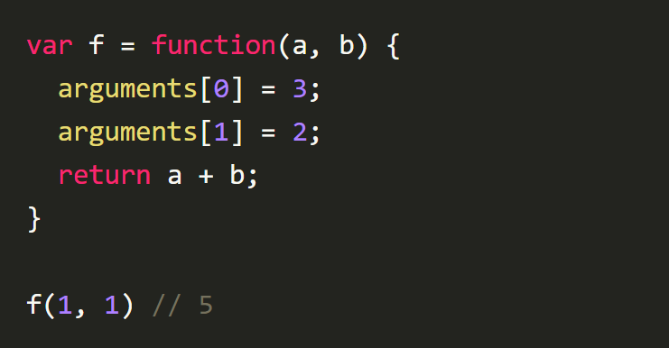
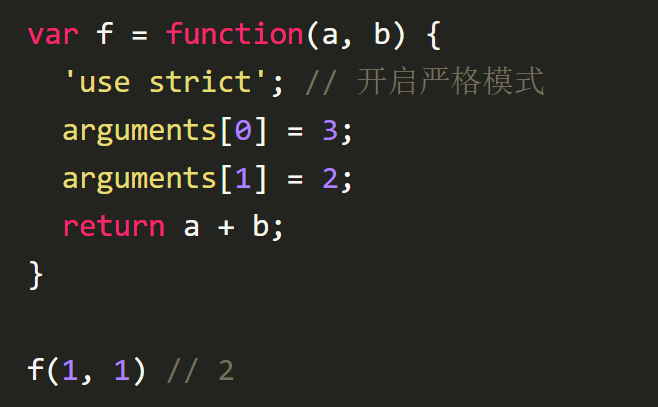
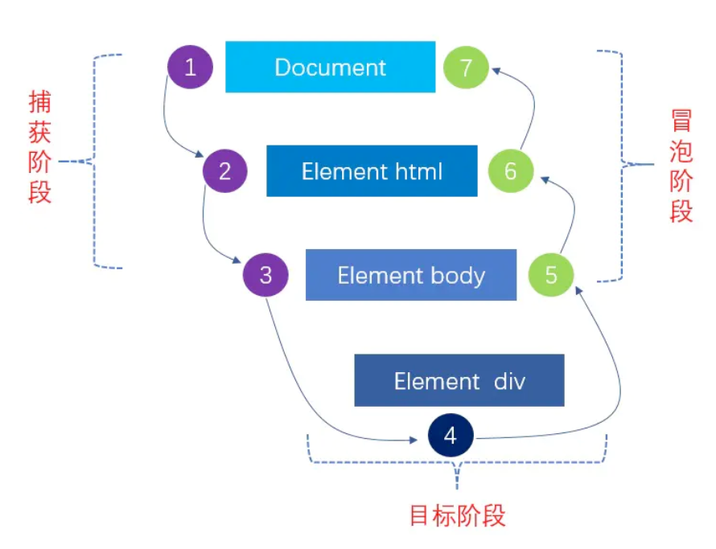

目录
- [1. 数据类型](#1-数据类型)
  - [1.1 有哪些类型？他们的区别](#11-有哪些类型他们的区别)
  - [1.2 typeof可以及检测的数据类型](#12-typeof可以及检测的数据类型)
  - [1.3 instanceof](#13-instanceof)
  - [1.4 JS中===和==的区别 和类型转换？](#14-js中和的区别-和类型转换)
  - [1.5 判断 `[] == ![]`](#15-判断---)
  - [1.6 判断对象是否为空](#16-判断对象是否为空)
  - [1.7 为什么0.1+0.2 ! == 0.3](#17-为什么0102---03)
  - [1.8 js中准确获取undefined的方法](#18-js中准确获取undefined的方法)
  - [1.9 isNaN 和 Number.isNaN 函数的区别？](#19-isnan-和-numberisnan-函数的区别)
  - [1.10 其他值到字符串的转换规则？](#110-其他值到字符串的转换规则)
  - [1.11 其他值到数字值的转换规则？](#111-其他值到数字值的转换规则)
  - [1.12 JS隐式转换](#112-js隐式转换)
  - [1.13  `+` 操作符什么时候用于字符串的拼接？](#113---操作符什么时候用于字符串的拼接)
  - [1.14 为什么会有BigInt的提案？](#114-为什么会有bigint的提案)
  - [1.15 object.assign和扩展运算法是深拷贝还是浅拷贝，两者区别](#115-objectassign和扩展运算法是深拷贝还是浅拷贝两者区别)
- [2. ES6](#2-es6)
  - [2.1 let、const 以及 var 的区别](#21-letconst-以及-var-的区别)
  - [2.2 箭头函数与普通函数的区别](#22-箭头函数与普通函数的区别)
  - [2.3 箭头函数的this指向哪⾥？](#23-箭头函数的this指向哪)
- [3. JS 基础](#3-js-基础)
  - [3.1 new操作符的实现原理](#31-new操作符的实现原理)
  - [3.2 map和weakMap的区别](#32-map和weakmap的区别)
  - [3.3](#33)
  - [3.4 对JSON的理解](#34-对json的理解)
- [4. prototype](#4-prototype)
  - [2.1 原型链](#21-原型链)
  - [2.2 new一个对象的过程](#22-new一个对象的过程)
- [3. 继承](#3-继承)
  - [3.1 原型继承](#31-原型继承)
  - [3.2 构造继承](#32-构造继承)
  - [3.4 组合继承（基本）](#34-组合继承基本)
  - [3.3 寄生组合式继承](#33-寄生组合式继承)
  - [3.4 实例继承](#34-实例继承)
- [4. 闭包](#4-闭包)
  - [4.1 循环中使用闭包解决`var`定义函数的问题（setTimeout）](#41-循环中使用闭包解决var定义函数的问题settimeout)
  - [4.2 每多过一秒一个数字(setInterval)](#42-每多过一秒一个数字setinterval)
  - [4.3 一定时间内只发生一次（setTimeout）](#43-一定时间内只发生一次settimeout)
- [5. 作用域](#5-作用域)
  - [5.1 js作用域](#51-js作用域)
  - [5.2 变量的查找是就近原则去寻找，定义的var变量](#52-变量的查找是就近原则去寻找定义的var变量)
  - [5.3 作用域链](#53-作用域链)
  - [5.4 判断结果函数名和变量名一样](#54-判断结果函数名和变量名一样)
- [6. this的理解](#6-this的理解)
  - [6.1 setTimeout、setInterval中的this](#61-settimeoutsetinterval中的this)
  - [6.2 严格模式下的this](#62-严格模式下的this)
- [7. 变量提升和暂时性死区？](#7-变量提升和暂时性死区)
- [8. arguments](#8-arguments)
- [9. 循环体](#9-循环体)
  - [9.1 for...of、for...in 和 forEach、map](#91-forofforin-和-foreachmap)
  - [9.2 swtich语句](#92-swtich语句)
- [10. 深拷贝和浅拷贝](#10-深拷贝和浅拷贝)
- [11. 数组](#11-数组)
  - [11.1 判断数组](#111-判断数组)
  - [11.2 类数组](#112-类数组)
  - [11.3 常用方法](#113-常用方法)
  - [11.4 数组去重](#114-数组去重)
  - [11.5 数组最大值](#115-数组最大值)
  - [11.6 数组扁平化\[Code\]](#116-数组扁平化code)
- [12. parseInt](#12-parseint)
  - [12.1 \["1", "2", "3"\].map(parseInt)](#121-1-2-3mapparseint)
  - [12.2 实现](#122-实现)
- [13. Ajax](#13-ajax)
  - [13.1 自己实现](#131-自己实现)
  - [13.2 方法解释](#132-方法解释)
  - [13.3 使用](#133-使用)
- [14. ES6](#14-es6)
  - [14.2 Promise](#142-promise)
  - [14.3 Promise 实现](#143-promise-实现)
    - [14.3.1 主体实现](#1431-主体实现)
    - [14.3.2 then()方法](#1432-then方法)
    - [14.3.3 resolvePromise方法](#1433-resolvepromise方法)
    - [14.3.4 catch()方法](#1434-catch方法)
    - [14.3.5 deferred()方法](#1435-deferred方法)
    - [14.3.6 all()方法](#1436-all方法)
    - [14.3.7 racel()方法](#1437-racel方法)
    - [14.3.8 resolve()方法](#1438-resolve方法)
    - [14.3.9 reject()方法](#1439-reject方法)
  - [14.5](#145)
- [15.Set、Map、WeakSet 和 WeakMap 的区别？](#15setmapweakset-和-weakmap-的区别)
- [16. 事件流和事件委托](#16-事件流和事件委托)
  - [16.1 DOM事件流](#161-dom事件流)
  - [16.2 事件对象](#162-事件对象)
  - [16.3 事件类型](#163-事件类型)
  - [16.4 事件委托](#164-事件委托)
- [17. call,apply,bind](#17-callapplybind)
  - [17.1 手写call](#171-手写call)
  - [17.2 手写apply](#172-手写apply)
  - [17.3 手写bind](#173-手写bind)
- [18. 脚本加载](#18-脚本加载)
- [18.1 async和defer更常用哪个（区别就在于js执行的时间）？](#181-async和defer更常用哪个区别就在于js执行的时间)
- [19. 懒加载和预加载](#19-懒加载和预加载)
  - [19.1 什么是懒加载](#191-什么是懒加载)
  - [19.2 为什么要用懒加载](#192-为什么要用懒加载)
  - [19.3 懒加载的原理](#193-懒加载的原理)
  - [19.4 什么是预加载](#194-什么是预加载)
  - [19.5 为什么要用预加载](#195-为什么要用预加载)
  - [19.6 实现预加载的几种办法](#196-实现预加载的几种办法)
- [20. 柯里化](#20-柯里化)
  - [20.1 什么是柯里化](#201-什么是柯里化)
  - [20.2 实现](#202-实现)
  - [20.3 应用](#203-应用)
  - [20.4 优劣：](#204-优劣)

## 1. 数据类型

### 1.1 有哪些类型？他们的区别
JavaScript 定义了 7 种数据类型。

原始类型：
1. 数值（Number）
2. 字符串（String）
3. 布尔值（Boolean）
4. undefined
5. null
6. Symbol (ES6新增)
7. BigInt (ES6新增)

引⽤类型：
- Object 类，如 Date、Array、Function 等。

其中 Symbol 和 BigInt 是ES6 中新增的数据类型：

symbol不能使用new,因为symbol是原始数据类型，不是对象。

每一个symbol的值都是不相等的，是唯一的。主要是为了防止属性名冲突。

symbol不能和其他的数据类型比较，比较的话会报错。如果symbol和symbol比较，值为false。

for…in和object.keys()均不能访问到symbol作为key的值。可以通过object.getOwnPropertySymbols获取。

>Symbol的应用场景
>（1）防止属性污染
>在某些情况下，我们可能要为对象添加一个属性，此时就有可能造成属性覆盖，用Symbol作为对象属性可以保证永远不会出现同名属性。
>（2）借助Symbol类型的不可枚举，我们可以在类中模拟私有属性，控制变量读写
>（3）可以防止XSS攻击，JSON中不能存储Symbol类型的变量，这就是防止XSS的一种手段。

- BigInt 是一种数字类型的数据，它可以表示任意精度格式的整数，使用 BigInt 可以安全地存储和操作大整数，即使这个数已经超出了 Number 能够表示的安全整数范围。


⾸先原始类型**存储的都是值**，存储在栈内存。是没有函数可以调⽤的，⽐如 undefined.toString()

为什么'1'.toString() 是可以使⽤的呢？其实在这种情况下，'1' 已经不是原始类型了，⽽是被强制 转换成了 String 类型也就是对象类型，所以可以调⽤ toString 函数。

引⽤类型类型**存储在堆内存，存储的是地址**。当我们把对象赋值给另外一个变量的时候，复制的是地址，指向同一块内存空间，当其中一个对象改变时，另一个对象也会变化。

在参数传递⽅式上，值类型是按值传递，引⽤类型是按共享传递。

>在操作系统中，内存被分为栈区和堆区：
>
>栈区内存由编译器自动分配释放，存放函数的参数值，局部变量的值等。其操作方式类似于数据结构中的栈。 
>
>堆区内存一般由开发者分配释放，若开发者不释放，程序结束时可能由垃圾回收机制回收。

### 1.2 typeof可以及检测的数据类型

- 基本数据类型：Undefined null bool string number
- 关键点：typeof只能区分值类型，不能区分引用类型
- JS中的基本数据类型：null, undefined, bool, string, number（typeof可以区分除了null以外的四种值类型）
- typeof 6种类型：Object({},[],null), Undefined, Boolean, Number, Function, String
- typeof可以区分值类型，typeof null = Object
  - 虽然 typeof null 返回 "object" ，但是 null 不是对象，它是“原始类型”之一。

>总结：
>A. null instanceof Object //false
>
>B. null === undefined  //false
>
>C. null == undefined //true
>
>D. NaN == NaN //false

### 1.3 instanceof
首先 typeof 能够正确的判断基本数据类型，但是除了 null, typeof null输出的是对象。

但是对象来说，typeof 不能正确的判断其类型， typeof 一个函数可以输出 'function',而除此之外，输出的全是 object,这种情况下，我们无法准确的知道对象的类型。

instanceof可以准确的判断复杂数据类型，但是不能正确判断基本数据类型。

instanceof **是通过原型链判断的**，A instanceof B, 在A的原型链中层层查找，是否有原型等于B.prototype，如果一直找到A的原型链的顶端`(null;即Object.prototype.__proto__)`,仍然不等于B.prototype，那么返回false，否则返回true.

```
// L instanceof R
function instance_of(L, R) {//L 表示左表达式，R 表示右表达式
    var O = R.prototype;// 取 R 的显式原型
    L = L.__proto__;    // 取 L 的隐式原型
    while (true) { 
        if (L === null) //已经找到顶层
            return false;  
        if (O === L)   //当 O 严格等于 L 时，返回 true
            return true; 
        L = L.__proto__;  //继续向上一层原型链查找
    } 
}
```

### 1.4 JS中===和==的区别 和类型转换？

== 会进行强制类型转换之后再比较，=== 不会进行强制类型转换的，只有类型相同并且值相等时，才返回 true.

== 如果两者类型不同，首先需要进行类型转换。具体流程如下:

- 首先判断两者类型是否相同，如果相等，判断值是否相等.
- 如果类型不同，进行类型转换
- 判断比较的是否是 null 或者是 undefined, 如果是, 返回 true .
- 判断两者类型是否为 string 和 number, 如果是, 将字符串转换成 number
- 判断其中一方是否为 boolean, 如果是, 将 boolean 转为 number 再进行判断
- 判断其中一方是否为 object 且另一方为 string、number 或者 symbol , 如果是, 将 object 转为原始类型再进行判断

```
let person1 = {
    age: 25
}
let person2 = person1;
person2.gae = 20;
console.log(person1 === person2); //true,注意复杂数据类型，比较的是引用地址
```

### 1.5 判断 `[] == ![]`

我们来分析一下: [] == ![] 是true还是false？

首先，我们需要知道 ! 优先级是高于 == (更多运算符优先级可查看: 运算符优先级)

![] **引用类型转换成布尔值都是true**,因此![]的是false

根据上面的比较步骤中的第五条，其中一方是 boolean，将 boolean 转为 number 再进行判断，false转换成 number，对应的值是 0.

根据上面比较步骤中的第六条，有一方是 number，那么将object也转换成Number,空数组转换成数字，对应的值是0.(空数组转换成数字，对应的值是0，如果数组中只有一个数字，那么转成number就是这个数字，其它情况，均为**NaN**)

0 == 0; 为true

### 1.6 判断对象是否为空

- 利用 for...in 循环

  ```
  function isEmpty(obj) {
    for (let i in Object.keys(obj)) {
      return false // 进入循环即不为空
    }
    return true
  }
  console.log(isEmpty(obj)) // true
  console.log(isEmpty(obj1)) // false
  console.log(isEmpty(obj2)) // true
  console.log(isEmpty(obj3)) // true
  ```

- 利用JSON.stringify()转化为字符串
  ```
  let isEmpty = (obj) => (JSON.stringify(obj) === '{}') ? true : false
  
  console.log(isEmpty(obj)) // true
  console.log(isEmpty(obj1)) // false
  console.log(isEmpty(obj2)) // true
  console.log(isEmpty(obj3)) // true
  ```

- 使用Object.keys()将取出对象中的键名，再判断长度
  ```
  let isEmpty = (obj) => (Object.keys(obj).length === 0) ? true : false

  console.log(isEmpty(obj)) // true
  console.log(isEmpty(obj1)) // false
  console.log(isEmpty(obj2)) // true
  console.log(isEmpty(obj3)) // true
  ```

### 1.7 为什么0.1+0.2 ! == 0.3 
在开发过程中遇到类似这样的问题：
```
let n1 = 0.1, n2 = 0.2
console.log(n1 + n2)  // 0.30000000000000004
```
这里得到的不是想要的结果，要想等于0.3，就要把它进行转化：
```
(n1 + n2).toFixed(2) // 注意，toFixed为四舍五入
```

`toFixed(num)` 方法可把 Number 四舍五入为指定小数位数的数字。那为什么会出现这样的结果呢？

计算机是通过二进制的方式存储数据的，所以计算机计算0.1+0.2的时候，实际上是计算的两个数的二进制的和。0.1的二进制是`0.0001100110011001100...`（1100循环），0.2的二进制是：`0.00110011001100...`（1100循环），这两个数的二进制都是无限循环的数。那JavaScript是如何处理无限循环的二进制小数呢？

一般我们认为数字包括整数和小数，但是在 JavaScript 中只有一种数字类型：Number，它的实现遵循IEEE 754标准，使用64位固定长度来表示，也就是标准的double双精度浮点数。在二进制科学表示法中，双精度浮点数的小数部分最多只能保留52位，再加上前面的1，其实就是保留53位有效数字，剩余的需要舍去，遵从“0舍1入”的原则。

根据这个原则，0.1和0.2的二进制数相加，再转化为十进制数就是：`0.30000000000000004`。
下面看一下双精度数是如何保存的：

(图像)
- 第一部分（蓝色）：用来存储符号位（sign），用来区分正负数，0表示正数，占用1位
- 第二部分（绿色）：用来存储指数（exponent），占用11位
- 第三部分（红色）：用来存储小数（fraction），占用52位
  
对于0.1，它的二进制为：
```
0.00011001100110011001100110011001100110011001100110011001 10011...
```

转为科学计数法（科学计数法的结果就是浮点数）：
```
1.1001100110011001100110011001100110011001100110011001*2^-4
```

可以看出0.1的符号位为0，指数位为-4，小数位为：
```
1001100110011001100110011001100110011001100110011001
```

那么问题又来了，指数位是负数，该如何保存呢？

IEEE标准规定了一个偏移量，对于指数部分，每次都加这个偏移量进行保存，这样即使指数是负数，那么加上这个偏移量也就是正数了。由于JavaScript的数字是双精度数，这里就以双精度数为例，它的指数部分为11位，能表示的范围就是0~2047，IEEE固定双精度数的偏移量为1023。

- 当指数位不全是0也不全是1时(规格化的数值)，IEEE规定，阶码计算公式为 e-Bias。 此时e最小值是1，则1-1023= -1022，e最大值是2046，则2046-1023=1023，可以看到，这种情况下取值范围是`-1022~1013`。
- 当指数位全部是0的时候(非规格化的数值)，IEEE规定，阶码的计算公式为1-Bias，即1-1023= -1022。
- 当指数位全部是1的时候(特殊值)，IEEE规定这个浮点数可用来表示3个特殊值，分别是正无穷，负无穷，NaN。 具体的，小数位不为0的时候表示NaN；小数位为0时，当符号位s=0时表示正无穷，s=1时候表示负无穷。

对于上面的0.1的指数位为-4，-4+1023 = 1019 转化为二进制就是：`1111111011`.
所以，0.1表示为：
```
0 1111111011 1001100110011001100110011001100110011001100110011001
```

说了这么多，是时候该最开始的问题了，如何实现0.1+0.2=0.3呢？

对于这个问题，一个直接的解决方法就是设置一个误差范围，通常称为“机器精度”。对JavaScript来说，这个值通常为2-52，在ES6中，提供了`Number.EPSILON`属性，而它的值就是2-52，只要判断`0.1+0.2-0.3`是否小于`Number.EPSILON`，如果小于，就可以判断为0.1+0.2 ===0.3
```
function numberepsilon(arg1,arg2){                   
  return Math.abs(arg1 - arg2) < Number.EPSILON;        
}        
console.log(numberepsilon(0.1 + 0.2, 0.3)); // true
```

### 1.8 js中准确获取undefined的方法

因为 undefined 是一个标识符，所以可以被当作变量来使用和赋值，但是这样会影响 undefined 的正常判断。

表达式 void ___ 没有返回值，因此返回结果是 undefined。void 并不改变表达式的结果，只是让表达式不返回值。

按惯例我们用 void(0) 来获得 undefined。

### 1.9 isNaN 和 Number.isNaN 函数的区别？

函数 isNaN 接收参数后，会尝试将这个参数转换为数值，任何不能被转换为数值的的值都会返回 true，因此非数字值传入也会返回 true ，会影响 NaN 的判断。

函数 Number.isNaN 会首先判断传入参数是否为数字，如果是数字再继续判断是否为 NaN ，不会进行数据类型的转换，这种方法对于 NaN 的判断更为准确。

### 1.10 其他值到字符串的转换规则？
- Null 和 Undefined 类型 ，null 转换为 "null"，undefined 转换为 "undefined"，
- Boolean 类型，true 转换为 "true"，false 转换为 "false"。
- Number 类型的值直接转换，不过那些极小和极大的数字会使用指数形式。
- Symbol 类型的值直接转换，但是只允许显式强制类型转换，使用隐式强制类型转换会产生错误。
- 对普通对象来说，除非自行定义 toString() 方法，否则会调用 toString()（Object.prototype.toString()）来返回内部属性 [[Class]] 的值，如"[object Object]"。如果对象有自己的 toString() 方法，字符串化时就会调用该方法并使用其返回值。
- 
### 1.11 其他值到数字值的转换规则？
- Undefined 类型的值转换为 NaN。
- Null 类型的值转换为 0。
- Boolean 类型的值，true 转换为 1，false 转换为 0。
- String 类型的值转换如同使用 Number() 函数进行转换，如果包含非数字值则转换为 NaN，空字符串为 0。
- Symbol 类型的值不能转换为数字，会报错。
- 对象（包括数组）会首先被转换为相应的基本类型值，如果返回的是非数字的基本类型值，则再遵循以上规则将其强制转换为数字。
  
为了将值转换为相应的基本类型值，抽象操作 ToPrimitive 会首先（通过内部操作 DefaultValue）检查该值是否有valueOf()方法。如果有并且返回基本类型值，就使用该值进行强制类型转换。如果没有就使用 toString() 的返回值（如果存在）来进行强制类型转换。

如果 valueOf() 和 toString() 均不返回基本类型值，会产生 TypeError 错误。

### 1.12 JS隐式转换
在JS中，当运算符在运算时，如果两边数据不统一，CPU就无法计算，JS引擎会把运算符两边的数据转成一样的类型再计算。这种自动转换的方式就叫隐式转换。

- 当进行加法运算时：
  - 有一方为string，那么另一方也会被转为string
  - 一方为number,另一方为原始值类型，则将原始值转换为number
  - 一方为number，另一方为引用类型，将双方都转为string（引用类型转string就调用toString函数）
- 乘除，减号，取模，就隐式调用Number()函数，转为number
- == （相等操作符）的类型转换是：
  - Null==undefined//true
  - 布尔值与其他类型比较时，先转换为number
  - string与number比较，string转为number
  - 引用类型与值类型比较，引用类型先转为值类型（引用类型转值类型调用valueOf函数，结果为基础类型就返回，不是基础类型就再调用toString）
  - 引用类型与引用类型比较，直接判断是否指向同一对象
- Null,undefined与其他任何类型进行比较，结果都为false
- ！隐式调用Boolean函数

### 1.13  `+` 操作符什么时候用于字符串的拼接？

根据 ES5 规范，如果某个操作数是字符串或者能够通过以下步骤转换为字符串的话，+ 将进行拼接操作。

如果其中一个操作数是对象（包括数组），则首先对其调用 ToPrimitive 抽象操作，该抽象操作再调用 [[DefaultValue]]，以数字作为上下文。如果不能转换为字符串，则会将其转换为数字类型来进行计算。

简单来说就是，如果 + 的其中一个操作数是字符串（或者通过以上步骤最终得到字符串），则执行字符串拼接，否则执行数字加法。

那么对于除了加法的运算符来说，只要其中一方是数字，那么另一方就会被转为数字。

### 1.14 为什么会有BigInt的提案？ 
JavaScript中Number.MAX_SAFE_INTEGER表示最⼤安全数字，计算结果是9007199254740991，即在这个数范围内不会出现精度丢失（⼩数除外）。但是⼀旦超过这个范围，js就会出现计算不准确的情况，这在⼤数计算的时候不得不依靠⼀些第三⽅库进⾏解决，因此官⽅提出了BigInt来解决此问题。 


### 1.15 object.assign和扩展运算法是深拷贝还是浅拷贝，两者区别

扩展运算符：
```
let outObj = {
  inObj: {a: 1, b: 2}
}
let newObj = {...outObj}
newObj.inObj.a = 2
console.log(outObj) // {inObj: {a: 2, b: 2}}
Object.assign():
let outObj = {
  inObj: {a: 1, b: 2}
}
let newObj = Object.assign({}, outObj)
newObj.inObj.a = 2
console.log(outObj) // {inObj: {a: 2, b: 2}}
```
可以看到，两者都是浅拷贝。

- Object.assign()方法接收的第一个参数作为目标对象，后面的所有参数作为源对象。然后把所有的源对象合并到目标对象中。它会修改了一个对象，因此会触发 ES6 setter。
- 扩展操作符（…）使用它时，数组或对象中的每一个值都会被拷贝到一个新的数组或对象中。它不复制继承的属性或类的属性，但是它会复制ES6的 symbols 属性。

## 2. ES6

### 2.1 let、const 以及 var 的区别

（1）块级作用域：块作用域由 `{ }`包括，let和const具有块级作用域，var不存在块级作用域。块级作用域解决了ES5中的两个问题：
- 内层变量可能覆盖外层变量
- 用来计数的循环变量泄露为全局变量
  
（2）变量提升：var存在变量提升，let和const不存在变量提升，即在变量只能在声明之后使用，否在会报错。

（3）给全局添加属性：浏览器的全局对象是window，Node的全局对象是global。var声明的变量为全局变量，并且会将该变量添加为全局对象的属性，但是let和const不会。

（4）重复声明：var声明变量时，可以重复声明变量，后声明的同名变量会覆盖之前声明的遍历。const和let不允许重复声明变量。

（5）暂时性死区：在使用let、const命令声明变量之前，该变量都是不可用的。这在语法上，称为暂时性死区。使用var声明的变量不存在暂时性死区。

（6）初始值设置：在变量声明时，var 和 let 可以不用设置初始值。而const声明变量必须设置初始值。

（7）指针指向：let和const都是ES6新增的用于创建变量的语法。 let创建的变量是可以更改指针指向（可以重新赋值）。但const声明的变量是不允许改变指针的指向。


### 2.2 箭头函数与普通函数的区别
（1）箭头函数比普通函数更加简洁

- 如果没有参数，就直接写一个空括号即可
- 如果只有一个参数，可以省去参数的括号
- 如果有多个参数，用逗号分割
- 如果函数体不需要返回值，且只有一句话，可以给这个语句前面加一个void关键字。最常见的就是调用一个函数：
```
let fn = () => void doesNotReturn();
```

（2）箭头函数没有自己的this
箭头函数不会创建自己的this， 所以它没有自己的this，它只会在自己作用域的上一层继承this。所以箭头函数中this的指向在它在定义时已经确定了，之后不会改变。

（3）箭头函数继承来的this指向永远不会改变
```
var id = 'GLOBAL';
var obj = {
  id: 'OBJ',
  a: function(){
    console.log(this.id);
  },
  b: () => {
    console.log(this.id);
  }
};
obj.a();    // 'OBJ'
obj.b();    // 'GLOBAL'
new obj.a()  // undefined
new obj.b()  // Uncaught TypeError: obj.b is not a constructor
```

对象obj的方法b是使用箭头函数定义的，这个函数中的this就永远指向它定义时所处的全局执行环境中的this，即便这个函数是作为对象obj的方法调用，this依旧指向Window对象。需要注意，定义对象的大括号`{}`是无法形成一个单独的执行环境的，它依旧是处于全局执行环境中。

（4）call()、apply()、bind()等方法不能改变箭头函数中this的指向
```
var id = 'Global';
let fun1 = () => {
    console.log(this.id)
};
fun1();                     // 'Global'
fun1.call({id: 'Obj'});     // 'Global'
fun1.apply({id: 'Obj'});    // 'Global'
fun1.bind({id: 'Obj'})();   // 'Global'
```

（5）箭头函数不能作为构造函数使用

构造函数在new的步骤在上面已经说过了，实际上第二步就是将函数中的this指向该对象。 但是由于箭头函数时没有自己的this的，且this指向外层的执行环境，且不能改变指向，所以不能当做构造函数使用。

（6）箭头函数没有自己的arguments

箭头函数没有自己的arguments对象。在箭头函数中访问arguments实际上获得的是它外层函数的arguments值。

（7）箭头函数没有prototype

（8）箭头函数不能用作Generator函数，不能使用yield关键字


### 2.3 箭头函数的this指向哪⾥？

箭头函数不同于传统JavaScript中的函数，箭头函数并没有属于⾃⼰的this，它所谓的this是捕获其所在上下⽂的 this 值，作为⾃⼰的 this 值，并且由于没有属于⾃⼰的this，所以是不会被new调⽤的，这个所谓的this也不会被改变。

可以⽤Babel理解⼀下箭头函数: 
```
// ES6 
const obj = { 
  getArrow() { 
    return () => { 
      console.log(this === obj); 
    }; 
  } 
}
```

转化后：
```
// ES5，由 Babel 转译
var obj = { 
   getArrow: function getArrow() { 
     var _this = this; 
     return function () { 
        console.log(_this === obj); 
     }; 
   } 
};
```

## 3. JS 基础

### 3.1 new操作符的实现原理
new操作符的执行过程：

（1）首先创建了一个新的空对象

（2）设置原型，将对象的原型设置为函数的 prototype 对象。

（3）让函数的 this 指向这个对象，执行构造函数的代码（为这个新对象添加属性）

（4）判断函数的返回值类型，如果是值类型，返回创建的对象。如果是引用类型，就返回这个引用类型的对象。

具体实现：
```
function objectFactory() {
  let newObject = null;
  let constructor = Array.prototype.shift.call(arguments);
  let result = null;
  // 判断参数是否是一个函数
  if (typeof constructor !== "function") {
    console.error("type error");
    return;
  }
  // 新建一个空对象，对象的原型为构造函数的 prototype 对象
  newObject = Object.create(constructor.prototype);
  // 将 this 指向新建对象，并执行函数
  result = constructor.apply(newObject, arguments);
  // 判断返回对象
  let flag = result && (typeof result === "object" || typeof result === "function");
  // 判断返回结果
  return flag ? result : newObject;
}
// 使用方法
objectFactory(构造函数, 初始化参数);
```

自己实现：
```
// Object.create的原理 (自定义new)
// var obj = Object.create(Constructor.prototype);
// 等价于：
// var obj = new Object();
// obj.__proto__ = Constructor.prototype;
const _new = function () {
    var Constructor = [].shift.call(arguments);
    // 1. 创建一个对象，这个对象要继承与构造函数的原型对象
    var obj = Object.create(Constructor.prototype);
    // 2. 执行这个构造函数
    var ret = Constructor.apply(obj, arguments);
    return typeof ret === 'object' ? ret || obj : obj;
}

// 实现一个自己的new构造函数
const _new = function() {
    // 从Object.prototype上克隆一个对象 
    var obj = new Object();
    // 取出来外部传入的构造器
    var Constructor = [].shift.call(arguments);

    // 使用一个中间的函数来维护原型的关系
    var F = function(){};
    F.prototype = Constructor.prototype;
    obj = new F();

    // 开始执行这个构造函数
    var res = Constructor.apply(obj, arguments);
    // 确保构造器总是返回一个对象(使用res || obj 的方式来防止返回null参数)
    return typeof res === 'object' ? res || obj : obj;
}
```

### 3.2 map和weakMap的区别
（1）Map

map本质上就是键值对的集合，但是普通的Object中的键值对中的键只能是字符串。而ES6提供的Map数据结构类似于对象，但是它的键不限制范围，可以是任意类型，是一种更加完善的Hash结构。如果Map的键是一个原始数据类型，只要两个键严格相同，就视为是同一个键。

实际上Map是一个数组，它的每一个数据也都是一个数组，其形式如下：
```
const map = [
     ["name","张三"],
     ["age",18],
]
```

Map数据结构有以下操作方法：
- size： `map.size` 返回Map结构的成员总数。
- set(key,value)：设置键名key对应的键值value，然后返回整个Map结构，如果key已经有值，则键值会被更新，否则就新生成该键。（因为返回的是当前Map对象，所以可以链式调用）
- get(key)：该方法读取key对应的键值，如果找不到key，返回undefined。
- has(key)：该方法返回一个布尔值，表示某个键是否在当前Map对象中。
- delete(key)：该方法删除某个键，返回true，如果删除失败，返回false。
- clear()：map.clear()清除所有成员，没有返回值。


Map结构原生提供是三个遍历器生成函数和一个遍历方法
- keys()：返回键名的遍历器。
- values()：返回键值的遍历器。
- entries()：返回所有成员的遍历器。
- forEach()：遍历Map的所有成员。

```
const map = new Map([
     ["foo",1],
     ["bar",2],
])
for(let key of map.keys()){
    console.log(key);  // foo bar
}
for(let value of map.values()){
     console.log(value); // 1 2
}
for(let items of map.entries()){
    console.log(items);  // ["foo",1]  ["bar",2]
}
map.forEach( (value,key,map) => {
     console.log(key,value); // foo 1    bar 2
})
```

（2）WeakMap

WeakMap 对象也是一组键值对的集合，其中的键是弱引用的。其键必须是对象，原始数据类型不能作为key值，而值可以是任意的。

该对象也有以下几种方法：
- set(key,value)：设置键名key对应的键值value，然后返回整个Map结构，如果key已经有值，则键值会被更新，否则就新生成该键。（因为返回的是当前Map对象，所以可以链式调用）
- get(key)：该方法读取key对应的键值，如果找不到key，返回undefined。
- has(key)：该方法返回一个布尔值，表示某个键是否在当前Map对象中。
- delete(key)：该方法删除某个键，返回true，如果删除失败，返回false。

其clear()方法已经被弃用，所以可以通过创建一个空的WeakMap并替换原对象来实现清除。

WeakMap的设计目的在于，有时想在某个对象上面存放一些数据，但是这会形成对于这个对象的引用。一旦不再需要这两个对象，就必须手动删除这个引用，否则垃圾回收机制就不会释放对象占用的内存。

而WeakMap的键名所引用的对象都是弱引用，即垃圾回收机制不将该引用考虑在内。因此，只要所引用的对象的其他引用都被清除，垃圾回收机制就会释放该对象所占用的内存。也就是说，一旦不再需要，WeakMap 里面的键名对象和所对应的键值对会自动消失，不用手动删除引用。

总结：
- Map 数据结构。它类似于对象，也是键值对的集合，但是“键”的范围不限于字符串，各种类型的值（包括对象）都可以当作键。
- WeakMap 结构与 Map 结构类似，也是用于生成键值对的集合。但是 WeakMap 只接受对象作为键名（ null 除外），不接受其他类型的值作为键名。而且 WeakMap 的键名所指向的对象，不计入垃圾回收机制。

### 3.3 

### 3.4 对JSON的理解

JSON 是一种基于文本的轻量级的数据交换格式。它可以被任何的编程语言读取和作为数据格式来传递。

在项目开发中，使用 JSON 作为前后端数据交换的方式。在前端通过将一个符合 JSON 格式的数据结构序列化为 JSON 字符串，然后将它传递到后端，后端通过 JSON 格式的字符串解析后生成对应的数据结构，以此来实现前后端数据的一个传递。

因为 JSON 的语法是基于 js 的，因此很容易将 JSON 和 js 中的对象弄混，但是应该注意的是 JSON 和 js 中的对象不是一回事，JSON 中对象格式更加严格，比如说在 JSON 中属性值不能为函数，不能出现 NaN 这样的属性值等，因此大多数的 js 对象是不符合 JSON 对象的格式的。

在 js 中提供了两个函数来实现 js 数据结构和 JSON 格式的转换处理，
- JSON.stringify 函数，通过传入一个符合 JSON 格式的数据结构，将其转换为一个 JSON 字符串。如果传入的数据结构不符合 JSON 格式，那么在序列化的时候会对这些值进行对应的特殊处理，使其符合规范。在前端向后端发送数据时，可以调用这个函数将数据对象转化为 JSON 格式的字符串。
- JSON.parse() 函数，这个函数用来将 JSON 格式的字符串转换为一个 js 数据结构，如果传入的字符串不是标准的 JSON 格式的字符串的话，将会抛出错误。当从后端接收到 JSON 格式的字符串时，可以通过这个方法来将其解析为一个 js 数据结构，以此来进行数据的访问。


## 4. prototype

JavaScript是一种通过原型实现继承的语言与别的高级语言是有区别的，像java，C#是通过类型决定继承关系的，JavaScript是的动态的弱类型语言。

总之可以认为JavaScript中所有都是对象，在JavaScript中，原型也是一个对象，通过原型可以实现对象的属性继承，JavaScript的对象中都包含了一个"prototype"内部属性，这个属性所对应的就是该对象的原型。

"prototype"作为对象的内部属性，是不能被直接访问的。所以为了方便查看一个对象的原型，Firefox和Chrome内核的JavaScript引擎中提供了"__proto__"这个非标准的访问器（ECMA新标准中引入了标准对象原型访问器"Object.getPrototype(object)"）。原型的主要作用就是**为了实现继承与扩展对象**。

### 2.1 原型链

原型链解决的主要是继承问题。

每个对象拥有一个原型对象，通过 proto (读音: dunder proto) 指针指向其原型对象，并从中继承方法和属性，同时原型对象也可能拥有原型，这样一层一层，最终指向 null(Object.proptotype.__proto__ 指向的是null)。这种关系被称为原型链 (prototype chain)，通过原型链一个对象可以拥有定义在其他对象中的属性和方法。

构造函数 Parent、Parent.prototype 和 实例 p 的关系如下:(p.__proto__ === Parent.prototype)

>原型链的5条规则:
>所有的引用类型（数组，对象，函数），都是具有对象特性的，即可以自由扩展属性（除了null以外）
>
>所有的引用类型（数组、对象、函数），都有一个proto 属性（隐式原型），这个属性的值是一个普通对象
>
>所有的函数，都有一个prototype属性（显式原型），这个属性值是一个普通的对象
>
>所有的引用类型（数组、对象、函数），proto的属性值指向（完全相等）它的构造函数的“prototype”的属性值
>
>当试图得到一个对象的某一个属性的时候，如果一个对象本身没有这个属性的话，就会去它的proto( 也就是它的构造函数中去寻找这个属性)

### 2.2 new一个对象的过程

- 创建一个新对象
- this指向这个新对象
- 执行代码（对this赋值）
- 返回this
```
// v1
  function objectFactory() {
      var obj = new Object(),
          // 因为 shift 会修改原数组，所以 arguments 会被去除第一个参数
          Constructor = [].shift.call(arguments);     // 拿到伪数组中的第一个参数
      // 取出参数中的第一个参数，就是我们要传入的构造函数，建立继承关系
      obj.__proto__ = Constructor.prototype;
      Constructor.apply(obj, arguments);
      return obj;
  }

  // v2 : 还需要判断返回的值是不是一个对象，如果是一个对象，我们就返回这个对象，如果没有，我们该返回什么就返回什么。
  function objectFactory() {
      var obj = new Object(),
          Constructor = [].shift.call(arguments);
      // 建立继承关系(二者之间的关系)
      obj.__proto__ = Constructor.prototype;
      // 开始执行这个构造函数
      var ret = Constructor.apply(obj, arguments);
      // 看一下构造函数的返回值，是对象还是一个基本数据类型?
      return typeof ret === 'object' ? ret : obj;
  }


  
```
## 3. 继承

### 3.1 原型继承
基本方法就是一个父类的实例赋值给子类的原型。
```
/**
* 动物类
* @constructor
* */
function Animal (name){
    this.name = name;
    this.eat = function () {
        console.log('My name is ', name, ' I am eating Foods…………');
    }
}

/**
    * 小狗类
    * @constructor
    */
function Dog(){
    this.furColor = furColor;
    this.bark = function () {
        console.log("I am a dog, I am barking……");
    }
}

// 如何让这个小狗继承这个Animal的属性呢？
// 实现思路：每一个函数都有一个prototype属性，这个属性值是一个普通的对象
Dog.prototype = new Animal();
var dog = new Dog('black');

// 这个小狗有eat() 这个属性吗？发现自身没有，那么就会去dog这个对象的__proto__里面去寻找，也就是他的构造函数Dog的prototype上面去寻找

// 发现这个对象Dog构造函数的prototype的值是一个对象new Animal(), 这个对象里面是有eat这个属性的，因此就找到了
dog.eat(); // My name is  undefined  I am eating Foods…………
console.log(dog.__proto__ === Dog.prototype);       // true
```

这个继承方式是通过__proto__建立和子类之间的原型链，当子类的实例需要使用父类的属性和方法的时候，可以通过__proto__一级级向上找；

缺点：

1. 创建子类实例时，无法向父类构造函数传参。Animal类中的name属性为undefined，说明没有被赋值。因为无法调用父类的构造函数并传参。

2. Animal类的私有属性被所有实例共享。来自父类Animal中的私有属性name被放到了Dog类的原型，导致name属性被所有实例所共享。

```
//....省略dog和Animal类
let blackTom = new Dog('black');
let whiteTtom = new Dog('white');

blackTom.__proto__.name = 'blackTom';
whiteTtom.__proto__.name  = 'whiteTtom';
console.log(blackTom.name) //whiteTtom
console.log(whiteTtom.name)//whiteTtom
```

而我们希望达到的效果是**继承父类的私有属性到子类的私有属性**和**继承父类的原型属性到子类的原型属性**。

**为了解决这两种问题，我们还有一种方法就是在构造函数继承。**

### 3.2 构造继承

```
function Animal(name) {
  this.name = name; 
}

Animal.prototype.eat= function () {
  console.log(this.name + '正在吃东西')
};
function Cat(furColor){ 
   Animal.call(this,'小花猫');
   this.furColor = furColor ;
};

let tom = new Cat('black');
console.log(tom);
```

这里解决了上述的两个问题，第一无法向构造函数传参的问题，第二Animal的私有属性被共享的问题。但是又产生了新的问题

缺点：
1. 没有继承父类的原型，有些方法比如eat方法无法使用
2. 实例并不是父类的实例，只是子类的实例，原因也是因为没有继承Animal的原型

```
console.log(tom instanceof Animal); // false
console.log(tom instanceof Cat); // true
```

### 3.4 组合继承（基本）
```
function Parent (name) {
    this.name = name;
    this.colors = ['red', 'blue', 'green'];
}

Parent.prototype.getName = function () {
    console.log(this.name)
}

function Child (name, age) {

    Parent.call(this, name);
    
    this.age = age;

}

Child.prototype = new Parent();
Child.prototype.constructor = Child;

var child1 = new Child('kevin', '18');

child1.colors.push('black');

console.log(child1.name); // kevin
console.log(child1.age); // 18
console.log(child1.colors); // ["red", "blue", "green", "black"]

var child2 = new Child('daisy', '20');

console.log(child2.name); // daisy
console.log(child2.age); // 20
console.log(child2.colors); // ["red", "blue", "green"]
```

组合继承最大的缺点是会调用两次父构造函数。

一次是设置子类型实例的原型的时候：
```
Child.prototype = new Parent();
```
一次在创建子类型实例的时候：
```
var child1 = new Child('kevin', '18');
```
回想下 new 的模拟实现，其实在这句中，我们会执行：
```
Parent.call(this, name);
```
在这里，我们又会调用了一次 Parent 构造函数。

所以，在这个例子中，如果我们打印 child1 对象，我们会发现 Child.prototype 和 child1 都有一个属性为colors，属性值为['red', 'blue', 'green']。

### 3.3 寄生组合式继承
```
function Parent (name) {
    this.name = name;
    this.colors = ['red', 'blue', 'green'];
}

Parent.prototype.getName = function () {
    console.log(this.name)
}

function Child (name, age) {
    Parent.call(this, name);
    this.age = age;
}

// 关键的三步
var F = function () {};

F.prototype = Parent.prototype;

Child.prototype = new F();


var child1 = new Child('kevin', '18');

console.log(child1);
```

最后我们封装一下这个继承方法：
```
function object(o) {
    function F() {}
    F.prototype = o;
    return new F();
}

function prototype(child, parent) {
    var prototype = object(parent.prototype);
    prototype.constructor = child;
    child.prototype = prototype;
}

// 当我们使用的时候：
prototype(Child, Parent);
```

这种方式的高效率体现它只调用了一次 Parent 构造函数，并且因此避免了在 Parent.prototype 上面创建不必要的、多余的属性。与此同时，原型链还能保持不变；因此，还能够正常使用 instanceof 和 isPrototypeOf。开发人员普遍认为寄生组合式继承是引用类型最理想的继承范式。

### 3.4 实例继承
```
function Animal(name = 'animal') {
  this.name = name ; 
}
Animal.prototype.eat= function () {
  console.log(this.name + '正在吃东西')
};
function Cat(furColor){ 
   let instance  = new Animal("小花猫")
   instance .furColor = furColor ;
   return instance ;
};
let tom = new Cat('black');
console.log(tom);
```
实例继承的基本思路是创建父类实例，然后再做修改返回。

缺点：

实例是父类的实例，不是子类的实例。
```
console.log(tom instanceof Animal); // true
console.log(tom instanceof Cat); // false
```
## 4. 闭包

闭包的定义其实很简单：函数 A 内部有一个函数 B，函数 B 可以访问到函数 A 中的变量，那么函数 B 就是闭包。

```
function A(){                 
    let a=1;                 
    window.B=function(){                     
        console.log(a)                 
    }            
}            
A();            
B();//1
```
**在 JS 中，闭包存在的意义就是让我们可以间接访问函数内部的变量。**

### 4.1 循环中使用闭包解决`var`定义函数的问题（setTimeout）

需求：每隔一秒输出一个数字，从 0 - 5；
```
for(var i=0;i<=5;i++){            
    setTimeout(function timer(){                
        console.log(i)            
    },i*1000)        
}        
console.log(i)
```
输出结果：立即输出一个6，然后每隔一秒输出一个6；

首先因为 setTimeout 是个异步函数，所以会先把循环全部执行完毕，这时候 i 就是 6 了，所以会输出一堆 6。

解决办法有3种。

1. 闭包

```
for(var i=0;i<=5;i++){            
    (function(j){                
        setTimeout(function timer(){                    
            console.log(j)                
        },j*1000)            
    })(i)        
}
```

在上述代码中，我们首先使用了立即执行函数将 i 传入函数内部，这个时候值就被固定在了参数 j上面不会改变，当下次执行 timer 这个闭包的时候，就可以使用外部函数的变量 j，从而达到目的。

2. 使用 setTimeout 的第三个参数

```
for(var i=0;i<=5;i++){           
    setTimeout((j) => {                
        console.log(j);            
    },i*1000,i)        
}

```

3. let 定义 i
```
for(let i=0;i<=5;i++){                
    setTimeout(() => {                    
        console.log(i)                
    },i*1000)            
}

```

### 4.2 每多过一秒一个数字(setInterval)
```
let lastIntervalId, counter = 5;
const greeting = delay => {
  if (counter === 5) {
    clearInterval(lastIntervalId);
    lastIntervalId = setInterval(() => {
      console.log('Hello World. ', delay);
      greeting(delay + 100);
    }, delay);
    counter = 0;
  }
counter += 1;
};
greeting(100);
```

### 4.3 一定时间内只发生一次（setTimeout）

```
<script>
//定时器 异步运行
function hello(){
alert("hello");
}
//使用方法名字执行方法
var t1 = window.setTimeout(hello,1000);
var t2 = window.setTimeout("hello()",3000);//使用字符串执行方法
window.clearTimeout(t1);//去掉定时器
</script>
```

## 5. 作用域
ES6 之前 JS 没有块级作⽤域。例如 
```
if (true) {
    var name = 'zhangsan'
}
console.log(name)
```

从上⾯的例⼦可以体会到作⽤域的概念，作⽤域就是⼀个独⽴的地盘，让变量不会外泄、暴露出去。

上⾯的 name 就被暴露出去了，因此，JS 没有块级作⽤域，只有全局作⽤域和函数作⽤域。

但是 ES6 中开始加⼊了块级作⽤域，使⽤ let 定义变量即可。
```
if (true) {
 let name1 = 'zhangsan'
}
console.log(name1) // 报错，因为let定义的name是在if这个块级作⽤域
```

### 5.1 js作用域
全局作用域和函数作用域。内部可以访问外部，但外部的不能访问内部的。
```
var a=10;        
function aaa(){             
    alert(a);        
};        
aaa();//10
```
```
function aaa(){            
    var a=10;          
};        
aaa();        
console.log(a)//Uncaught ReferenceError: a is not defined
```
```
var a=10;         
function aaa(){             
    console.log(a);//10        
};                    
function bbb(){            
    var a=20;            
    aaa();        
}        
bbb();//10
```
```
function aaa(){            
    a=10;         
}        
aaa();        
function aaa(){            
    var a=b=10;         
}      
aaa();      
console.log(b)//10    
console.log(a)//Uncaught ReferenceError: a is not defined
```
### 5.2 变量的查找是就近原则去寻找，定义的var变量
```
function aaa(){            
console.log(a);//undefined            
var a=20;        
}        
aaa(); 
```
```
var a=10;        
function aaa(){            
    console.log(a);//undefined            
    var a=20;        
}        
aaa();
```
```
var a=10;        
function aaa(a){             
    console.log(a);//10            
    var a=20;  //因为 a 是形参，优先级高于 var a; 所以 局部变量a的声明其实被忽略了。        
}         
aaa(a);
```

### 5.3 作用域链
⾸先认识⼀下什么叫做**自由变量**。如下代码中， console.log(a) 要得到 a 变量，但是在当前的作⽤域中没有定义 a （可对⽐⼀下 b ）。当前作⽤域没有定义的变量，这成为 ⾃由变量 。⾃由变量如何得到 —— 向⽗级作⽤域寻找。

```
var a = 100;
function fn() {
    var b = 200;
    console.log(a);
    console.log(b);
};
fn();
```
如果⽗级也没呢？再⼀层⼀层向上寻找，直到找到全局作⽤域还是没找到，就宣布放弃。这种⼀层⼀ 层的关系，就是 作⽤域链 。
```
var a = 100;
function F1() {
    var b = 200;
    function F2() {
        var c = 300;
        console.log(a) // ⾃由变量，顺作⽤域链向⽗作⽤域找
        console.log(b) // ⾃由变量，顺作⽤域链向⽗作⽤域找
        console.log(c) // 本作⽤域的变量
    };
    F2();
};
F1();
```

### 5.4 判断结果函数名和变量名一样
```
var a = 1;        
(function a () {            
    a = 2;            
    console.log(a);        
})();
// 输出结果
ƒ a () {
           a = 2;
           console.log(a);
       }
```

立即调用的函数表达式（IIFE） 有一个 自己独立的 作用域，如果函数名称与内部变量名称冲突，就会永远执行函数本身；所以上面的结果输出是函数本身；

函数表达式中的函数名称，只有自己独立的作用域可以拿到，不会影响全局

```
var a = 1;        
(function a () {            
    a = 2;            
    console.log(window.a);        
})();
// 1
```
```
var a = 1;        
(function x () {            
    a = 2;            
    console.log(a);        
})();
// 2
```
     
## 6. this的理解
- 作为构造函数执行
- 作为对象属性执行
- 作为普通函数执行
- call apply bind

### 6.1 setTimeout、setInterval中的this
```
var obj ={ 
    fn:function(){
        console.log(this);
    }
}
function fn2(){
    console.log(this);
}
setTimeout(obj.fn, 0);   //Window
setTimeout(fn2, 0);//Window
setInterval( obj.fn,1000 );//Window
```

从上述例子中可以看到setTimeout,setInterval中函数内的this是指向了window对象，这是由于setTimeout()，setInterval()调用的代码运行在与所在函数完全分离的执行环境上。这会导致这些代码中包含的 this 关键字会指向**window (或全局)对象。**

### 6.2 严格模式下的this
- 全局作用域中的this: 在严格模式下的全局作用域中 this 指向window对象
- 全局作用域中函数中的this: 严格模式下： 在全局作用域中函数的 this 指向 undefined
- 对象的方法中的this: 严格模式下，对象的函数中的this指向该对象
- 构造函数中的this: 严格模式下，构造函数中的this指向new出来的对象


## 7. 变量提升和暂时性死区？

变量提升就是变量在声明之前就可以使用，值为undefined。

在代码块内，使用 let/const 命令声明变量之前，该变量都是不可用的(会抛出错误)。这在语法上，称为“暂时性死区”。暂时性死区也意味着 typeof 不再是一个百分百安全的操作。
```
typeof x; // ReferenceError(暂时性死区，抛错)
let x;
```
```
typeof y; // 值是undefined,不会报错
```
暂时性死区的本质就是，只要一进入当前作用域，所要使用的变量就已经存在了，但是不可获取，只有等到声明变量的那一行代码出现，才可以获取和使用该变量。

## 8. arguments
由于 JavaScript 允许函数有不定数目的参数，所以需要一种机制，可以在函数体内部读取所有参数。这就是arguments对象的由来。

arguments对象包含了函数运行时的所有参数，arguments[0]就是第一个参数，arguments[1]就是第二个参数，以此类推。这个对象只有在函数体内部，才可以使用。

还可以进行修改：



严格模式下，arguments对象与函数参数不具有联动关系。也就是说，修改arguments对象不会影响到实际的函数参数。



通过arguments对象的length属性，可以判断函数调用时到底带几个参数。

## 9. 循环体
### 9.1 for...of、for...in 和 forEach、map
- for...of 循环：
  - 具有 iterator 接口，就可以用 for...of 循环遍历它的成员（属性值）。
  - for...of 循环可以使用的范围包括数组、Set 和 Map 结构、某些类似数组的对象、Generator 对象，以及字符串。 
  - for...of 循环调用遍历器接口，数组的遍历器接口只返回具有数字索引的属性。对于普通的对象， for...of 结构不能直接使用，会报错，必须部署了Iterator 接口后才能使用。可以中断循环。
- for...in 循环：遍历对象自身的和继承的可枚举的属性, 不能直接获取属性值。可以中断循环。
- forEach: 只能遍历数组，不能中断，没有返回值(或认为返回值是undefined)。
    ```
    const a = [1, 2, 3];
    const doubled = a.forEach((num, index) => {
    // 执行与 num、index 相关的代码
    });

    console.log(doubled) // undefined
    ```
- 只能遍历数组，不能中断，返回值是修改后的数组。
    ```
    const a = [1, 2, 3];
    const doubled = a.map(num => {
    return num * 2;
    });

    console.log(doubled) // [2, 4, 6]
    ```
### 9.2 swtich语句
```
var   x=prompt("请输入1-5的数字","");                     
switch (x) {                            
    case “1”:alert(“one”);                            
    case “2”:alert(“two”);                            
    case “3”:alert(“three”);                            
    case “4”:alert(“four”);                            
    case “5”:alert(“five”);                            
    default:alert(“none”);
}
//four,five,none
```

因为执行完之后，没有加break，会一直往下执行代码。

## 10. 深拷贝和浅拷贝
浅拷贝是指只复制第一层对象，但是当对象的属性是引用类型时，实质复制的是其引用，当引用指向的值改变时也会跟着变化。

深拷贝复制变量值，对于非基本类型的变量，则递归至基本类型变量后，再复制。深拷贝后的对象与原来的对象是完全隔离的，互不影响，对一个对象的修改并不会影响另一个对象。

实现一个深拷贝:
```
function deepClone(obj) { //递归拷贝
    if(obj === null) return null; //null 的情况
    if(obj instanceof RegExp) return new RegExp(obj);
    if(obj instanceof Date) return new Date(obj);
    if(typeof obj !== 'object') {
        //如果不是复杂数据类型，直接返回
        return obj;
    }
    /**
     * 如果obj是数组，那么 obj.constructor 是 [Function: Array]
     * 如果obj是对象，那么 obj.constructor 是 [Function: Object]
     */
    let t = new obj.constructor();
    for(let key in obj) {
        //如果 obj[key] 是复杂数据类型，递归
        t[key] = deepClone(obj[key]);
    }
    return t;
}
```
```
// 只复制第一层的浅拷贝
function simpleCopy(obj1) {
   var obj2 = Array.isArray(obj1) ? [] : {};
   for (let i in obj1) {
   obj2[i] = obj1[i];
  }
   return obj2;
}
var obj1 = {
   a: 1,
   b: 2,
   c: {
   d: 3
  }
}
var obj2 = simpleCopy(obj1);
obj2.a = 3;
obj2.c.d = 4;
alert(obj1.a); // 1
alert(obj2.a); // 3
alert(obj1.c.d); // 4
alert(obj2.c.d); // 4
```

## 11. 数组

### 11.1 判断数组

- 使用 Array.isArray 判断，如果返回 true, 说明是数组
- 使用 instanceof Array 判断，如果返回true, 说明是数组
- 使用 Object.prototype.toString.call 判断，如果值是 [object Array], 说明是数组
- 通过 constructor 来判断，如果是数组，那么 arr.constructor === Array. (不准确，因为我们可以指定 obj.constructor = Array)

```
function fn() {
    console.log(Array.isArray(arguments));   //false; 因为arguments是类数组，但不是数组
    console.log(Array.isArray([1,2,3,4]));   //true
    console.log(arguments instanceof Array); //false
    console.log([1,2,3,4] instanceof Array); //true
    console.log(Object.prototype.toString.call(arguments)); //[object Arguments]
    console.log(Object.prototype.toString.call([1,2,3,4])); //[object Array]
    console.log(arguments.constructor === Array); //false
    arguments.constructor = Array;
    console.log(arguments.constructor === Array); //true
    console.log(Array.isArray(arguments));        //false
}
fn(1,2,3,4);
```

### 11.2 类数组

1）拥有length属性，其它属性（索引）为非负整数（对象中的索引会被当做字符串来处理）;

2）不具有数组所具有的方法；

- 类数组是一个普通对象，而真实的数组是Array类型。
- 常见的类数组有: 函数的参数 arugments, DOM 对象列表(比如通过 document.querySelectorAll 得到的列表), jQuery 对象 (比如 $("div")).

类数组可以转换为数组:
```
//第一种方法
Array.prototype.slice.call(arrayLike, start);
//第二种方法
[...arrayLike];
//第三种方法:
Array.from(arrayLike);
```

PS: 任何定义了遍历器（Iterator）接口的对象，都可以用扩展运算符转为真正的数组。

Array.from方法用于将两类对象转为真正的数组：类似数组的对象（array-like object）和可遍历（iterable）的对象。

### 11.3 常用方法

修改原数组的API有:

splice/reverse/fill/copyWithin/sort/push/pop/unshift/shift

不修改原数组的API有:

slice/map/forEach/every/filter/reduce/entries/find


### 11.4 数组去重

```
function qc(arr1) {
    let arr = [];
    for(let i=0; i<arr1.length; i++) {
        if(arr.indexOf(arr1[i]) == -1) {
            arr.push(arr1[i])
        }
    }
    return arr;
}
arr1 = ["1", "1", "3", "5", "2", "24", "4", "4", "a", "a", "b"];
console.log(qc(arr1)); // ["1", "3", "5", "2", "24", "4", "a", "b"]
```

### 11.5 数组最大值
```
// ES5 的写法
Math.max.apply(null, [14, 3, 77, 30]);

// ES6 的写法
Math.max(...[14, 3, 77, 30]);

// reduce
[14, 3, 77, 30].reduce((accumulator, currentValue) => {
return accumulator = accumulator > currentValue ? accumulator : currentValu
});
```

### 11.6 数组扁平化[Code]
```
var array = [1, [2], [3, [4, [5]]]]

function flat(arr) {
// 补全
}

console.log(flat(array)) // [1, 2, 3, 4, 5]
```
```
// 原始方法
var array = [1, [2], [3, [4, [5]]]]
function flat() {
    var flatArr = []
    return function flatten(arr) {
        for(var index=0; index<arr.length; index++) {
            Array.isArray(arr[index]) ? flatten(arr[index]) : flatArr.push(arr[index])
        }
        return flatArr
    }
}

console.log(flat()(array))

// toString 方法
var array = [1, [2], [3, [4, [5]]]]
function flat(arr) {
    return arr.toString().split(",").map(function(val) {return +val;})
    // “+val”：如果只有一个“字符串”操作数的时候，会尝试将这个“字符串”转换为“数字”。
}

console.log(flat(array))
```

## 12. parseInt

### 12.1 ["1", "2", "3"].map(parseInt)

答案是 [1, NaN, NaN] 。因为 parseInt 需要两个参数 (val, radix) ，其中 radix 表示解析时用的基数。

map 传了 3 个 (element, index, array) ，对应的 radix 不合法导致解析失败。


### 12.2 实现
```
function _parseInt(str, radix) {
    let str_type = typeof str;
    let res = 0;
    if (str_type !== 'string' && str_type !== 'number') {
        // 如果类型不是 string 或 number 类型返回NaN
        return NaN
    }

    // 字符串处理
    str = String(str).trim().split('.')[0]
    let length = str.length;
    if (!length) {
        // 如果为空则返回 NaN
        return NaN
    }

    if (!radix) {
        // 如果 radix 为0 null undefined
        // 则转化为 10
        radix = 10;
    }
    if (typeof radix !== 'number' || radix < 2 || radix > 36) {
        return NaN
    }

    for (let i = 0; i < length; i++) {
        let arr = str.split('').reverse().join('');
        res += Math.floor(arr[i]) * Math.pow(radix, i)
    }

    return res;
}
```

## 13. Ajax
AJAX全称为“Asynchronous JavaScript And XML”（异步JavaScript和XML） 是指一种创建交互式网页应用的开发技术、改善用户体验，实现无刷新效果。

优点

a、不需要插件支持

b、优秀的用户体验

c、提高Web程序的性能

d、减轻服务器和带宽的负担

缺点

a、浏览器对XMLHttpRequest对象的支持度不足，几乎所有浏览器现在都支持

b、破坏浏览器“前进”、“后退”按钮的正常功能，可以通过简单的插件弥补

c、对搜索引擎的支持不足


### 13.1 自己实现
```
var Ajax={
  get: function(url, fn) {
    // XMLHttpRequest对象用于在后台与服务器交换数据   
    var xhr = new XMLHttpRequest();            
    xhr.open('GET', url, true);
    xhr.onreadystatechange = function() {
      // readyState == 4说明请求已完成
      if (xhr.readyState == 4 && xhr.status == 200 || xhr.status == 304) { 
        // 从服务器获得数据 
        fn.call(this, xhr.responseText);  
      }
    };
    xhr.send();
  },
  // datat应为'a=a1&b=b1'这种字符串格式，在jq里如果data为对象会自动将对象转成这种字符串格式
  post: function (url, data, fn) {
    var xhr = new XMLHttpRequest();
    xhr.open("POST", url, true);
    // 添加http头，发送信息至服务器时内容编码类型
    xhr.setRequestHeader("Content-Type", "application/x-www-form-urlencoded");  
    xhr.onreadystatechange = function() {
      if (xhr.readyState == 4 && (xhr.status == 200 || xhr.status == 304)) {
        fn.call(this, xhr.responseText);
      }
    };
    xhr.send(data);
  }
}
```
### 13.2 方法解释
1. open(method, url, async) 方法需要三个参数:

method：发送请求所使用的方法（GET或POST）；与POST相比，GET更简单也更快，并且在大部分情况下都能用；然而，在以下情况中，请使用POST请求：

无法使用缓存文件（更新服务器上的文件或数据库）
向服务器发送大量数据（POST 没有数据量限制）
发送包含未知字符的用户输入时，POST 比 GET 更稳定也更可靠
url：规定服务器端脚本的 URL(该文件可以是任何类型的文件，比如 .txt 和 .xml，或者服务器脚本文件，比如 .asp 和 .php （在传回响应之前，能够在服务器上执行任务）)；

async：规定应当对请求进行异步（true）或同步（false）处理；true是在等待服务器响应时执行其他脚本，当响应就绪后对响应进行处理；false是等待服务器响应再执行。

2. send() 方法可将请求送往服务器。

3. onreadystatechange：存有处理服务器响应的函数，每当 readyState 改变时，onreadystatechange 函数就会被执行。

4. readyState：存有服务器响应的状态信息。（更加具体的状态码信息可自行百度）

0: 请求未初始化（代理被创建，但尚未调用 open() 方法）
1: 服务器连接已建立（open方法已经被调用）
2: 请求已接收（send方法已经被调用，并且头部和状态已经可获得）
3: 请求处理中（下载中，responseText 属性已经包含部分数据）
4: 请求已完成，且响应已就绪（下载操作已完成）
5. responseText：获得字符串形式的响应数据。

6. setRequestHeader()：POST传数据时，用来添加 HTTP 头，然后send(data)，注意data格式；GET发送信息时直接加参数到url上就可以，比如url?a=a1&b=b1。
  
### 13.3 [使用](https://blog.csdn.net/qq_38409944/article/details/81352251)
```
$.ajax({
    url: ,
    type: '',
    dataType: '',
    data: {
          
    },
    success: function(){
         
    },
    error: function(){
          
    }
 })
 ```


## 14. ES6

### 14.2 Promise

ES6 原生提供了Promise 对象。

所谓 Promise，就是一个对象，用来传递异步操作的消息。它代表了某个未来才会知道结果的事件（通常是一个异步操作），并且这个事件提供统一的 API，可供进一步处理。

Promise 对象有以下两个特点。
1.  对象的状态不受外界影响。Promise 对象代表一个异步操作，有三种状态：Pending（进行中）、Resolved（已完成，又称 Fulfilled）和 Rejected（已失败）。只有异步操作的结果，可以决定当前是哪一种状态，任何其他操作都无法改变这个状态。这也是 Promise 这个名字的由来，它的英语意思就是「承诺」，表示其他手段无法改变。
   
2.  一旦状态改变，就不会再变，任何时候都可以得到这个结果。Promise 对象的状态改变，只有两种可能：从 Pending 变为 Resolved 和从 Pending 变为 Rejected。只要这两种情况发生，状态就凝固了，不会再变了，会一直保持这个结果。就算改变已经发生了，你再对 Promise 对象添加回调函数，也会立即得到这个结果。这与事件（Event）完全不同，事件的特点是，如果你错过了它，再去监听，是得不到结果的。
   
有了 Promise对象，就可以将异步操作以同步操作的流程表达出来，避免了层层嵌套的回调函数。此外，Promise 对象提供统一的接口，使得控制异步操作更加容易。

Promise 也有一些缺点。首先，无法取消 Promise，一旦新建它就会立即执行，无法中途取消。其次，如果不设置回调函数，Promise 内部抛出的错误，不会反应到外部。第三，当处于 Pending 状态时，无法得知目前进展到哪一个阶段（刚刚开始还是即将完成）。

### 14.3 Promise 实现

#### 14.3.1 主体实现
```
const PENDING =  'pending';//初始态
const FULFILLED =  'fulfilled';//初始态
const REJECTED =  'rejected';//初始态

function Promise(executor){
  let self = this; //先缓存当前promise实例
  self.status = PENDING;//设置状态
  //定义存放成功的回调的数组
  self.onResolvedCallbacks = [];
  //定义存放失败回调的数组
  self.onRejectedCallbacks = [];
  //当调用此方法的时候，如果promise状态为pending,的话可以转成成功态,如果已经是成功态或者失败态了，则什么都不做
 
  //2.1 定义resolve方法;
  function resolve(value){  
    if(value!=null &&value.then&&typeof value.then == 'function'){
      return value.then(resolve,reject);
    }
    //如果是初始态，则转成成功态
    //为什么要把它用setTimeout包起来
    setTimeout(function(){
      if(self.status == PENDING){
        self.status = FULFILLED;
        self.value = value;//成功后会得到一个值，这个值不能改
        //调用所有成功的回调
        self.onResolvedCallbacks.forEach(cb=>cb(self.value));
      }
    })
  }

  //2.1.2 定义reject方法;
  function reject(reason){ 
    setTimeout(function(){
      //如果是初始态，则转成失败态
      if(self.status == PENDING){
        self.status = REJECTED;
        self.value = reason;//失败的原因给了value
        self.onRejectedCallbacks.forEach(cb=>cb(self.value));
      }
    });
  }
  try{
    //因为此函数执行可能会异常，所以需要捕获，如果出错了，需要用错误 对象reject
    executor(resolve,reject);
  }catch(e){
    //如果这函数执行失败了，则用失败的原因reject这个promise
    reject(e);
  };
}

```

#### 14.3.2 then()方法
```
//onFulfilled 是用来接收promise成功的值或者失败的原因
Promise.prototype.then = function(onFulfilled,onRejected){
  //如果成功和失败的回调没有传，则表示这个then没有任何逻辑，只会把值往后抛
  //2.2.1
  onFulfilled = typeof onFulfilled == 'function'?onFulfilled:function(value){return  value};
  onRejected = typeof onRejected == 'function'?onRejected:reason=>{throw reason};
  //如果当前promise状态已经是成功态了，onFulfilled直接取值
  let self = this;
  let promise2;
  if(self.status == FULFILLED){
    return promise2 = new Promise(function(resolve,reject){
      setTimeout(function(){
        try{
          let x =onFulfilled(self.value);
          //如果获取到了返回值x,会走解析promise的过程
          resolvePromise(promise2,x,resolve,reject);
        }catch(e){
          //如果执行成功的回调过程中出错了，用错误原因把promise2 reject
          reject(e);
        }
      })

    });
  }
  if(self.status == REJECTED){
    return promise2 = new Promise(function(resolve,reject){
      setTimeout(function(){
        try{
          let x =onRejected(self.value);
          resolvePromise(promise2,x,resolve,reject);
        }catch(e){
          reject(e);
        }
      })
    });
  }
  if(self.status == PENDING){
   return promise2 = new Promise(function(resolve,reject){
     self.onResolvedCallbacks.push(function(){
         try{
           let x =onFulfilled(self.value);
           //如果获取到了返回值x,会走解析promise的过程
           resolvePromise(promise2,x,resolve,reject);
         }catch(e){
           reject(e);
         }

     });
     self.onRejectedCallbacks.push(function(){
         try{
           let x =onRejected(self.value);
           resolvePromise(promise2,x,resolve,reject);
         }catch(e){
           reject(e);
         }
     });
   });
  }

}

```

#### 14.3.3 resolvePromise方法

```
function resolvePromise(promise2,x,resolve,reject){
  if(promise2 === x){
    return reject(new TypeError('循环引用'));
  }
  let called = false;//promise2是否已经resolve 或reject了
  if(x instanceof Promise){
    if(x.status == PENDING){
      x.then(function(y){
        resolvePromise(promise2,y,resolve,reject);
      },reject);
    }else{
      x.then(resolve,reject);
    }
  //x是一个thenable对象或函数，只要有then方法的对象，
  }else if(x!= null &&((typeof x=='object')||(typeof x == 'function'))){
    //当我们的promise和别的promise进行交互，编写这段代码的时候尽量的考虑兼容性，允许别人瞎写
   try{
     let then = x.then;
     if(typeof then == 'function'){
       //有些promise会同时执行成功和失败的回调
       then.call(x,function(y){
         //如果promise2已经成功或失败了，则不会再处理了
          if(called)return;
          called = true;
          resolvePromise(promise2,y,resolve,reject)
       },function(err){
         if(called)return;
         called = true;
         reject(err);
       });
     }else{
       //到此的话x不是一个thenable对象，那直接把它当成值resolve promise2就可以了
       resolve(x);
     }
   }catch(e){
     if(called)return;
     called = true;
     reject(e);
   }

  }else{
    //如果X是一个普通 的值，则用x的值去resolve promise2
    resolve(x);
  }
}

```

#### 14.3.4 catch()方法
```
//catch原理就是只传失败的回调
Promise.prototype.catch = function(onRejected){
  this.then(null,onRejected);
}
```

#### 14.3.5 deferred()方法
```
Promise.deferred = Promise.defer = function(){
  let defer = {};
  defer.promise = new Promise(function(resolve,reject){
    defer.resolve = resolve;
    defer.reject = reject;
  });
  return defer;
}
```

#### 14.3.6 all()方法
```
//Promise的all方法提供了并行执行异步操作的能力，并且在所有异步操作执行完后才执行回调。

Promise.all = function(promises){
 return new Promise(function(resolve,reject){
   let done = gen(promises.length,resolve);
   for(let i=0;i<promises.length;i++){
     promises[i].then(function(data){
       done(i,data);
     },reject);
   }
 });
}

//计数法
function gen(times,cb){
  let result = [],count=0;
  return function(i,data){
    result[i] = data;
    if(++count==times){
      cb(result);
    }
  }
}
```

#### 14.3.7 racel()方法
```
Promise.race = function(promises){
  return new Promise(function(resolve,reject){
    for(let i=0;i<promises.length;i++){
      promises[i].then(resolve,reject);
    }
  });
}

//返回一个立刻成功的promise
//别人提供 给你一个方法，需要你传入一个promise,但你只有一个普通的值，你就可以通过这个方法把这个普通的值(string number object)转成一个promise对象
```

#### 14.3.8 resolve()方法
```
Promise.resolve = function(value){
  return new Promise(function(resolve){
    resolve(value);
  });
}
```

#### 14.3.9 reject()方法
```
//返回一个立刻失败的promise
Promise.reject = function(reason){
  return new Promise(function(resolve,reject){
    reject(reason);
  });
}
```

### 14.5 
## 15.Set、Map、WeakSet 和 WeakMap 的区别？
1、Set

- 成员唯一、无序且不重复；
- [value, value]，键值与键名是一致的（或者说只有键值，没有键名）；
- 可以遍历，方法有：add、delete、has、clear、entries、forEach、keys、values
- Set 也能用来保存 NaN 和 undefined， 如果有重复的 NaN， Set 会认为就一个 NaN(实际上 NaN!=NaN);

2、Map

- 本质上是键值对的集合，类似集合；
- 可以遍历，方法很多，可以跟各种数据格式转换。

3、WeakSet

- 成员都是对象；
- 成员都是弱引用，可以被垃圾回收机制回收，可以用来保存 DOM 节点，不容易造成内存泄漏；
- 不能遍历，方法有 add、delete、has。

4、WeakMap

- 只接受对象作为键名（null 除外），不接受其他类型的值作为键名；
- 键名是弱引用，键值可以是任意的，键名所指向的对象可以被垃圾回收，此时键名是无效的；
- 不能遍历，方法有 get、set、has、delete。

## 16. 事件流和事件委托

javascript和HTML之间的交互是通过事件实现的。

事件就是用户或浏览器自身执行的某种动作，比如点击、加载，鼠标移入移出等等。

### 16.1 DOM事件流

DOM(文档对象模型)结构是一个树形结构，当一个HTML元素产生一个事件时，该事件会在元素结点与根节点之间按特定的顺序传播，路径所经过的节点都会收到该事件，这个传播过程可称为DOM事件流。

事件流描述的是从页面中接收事件的顺序。

事件冒泡：IE的事件流叫 事件冒泡，即事件开始时由最具体的元素接收，然后逐级向上传播到较为不具体的节点。自下而上。

事件捕获：是不太具体的节点先接收到事件，而最具体的节点应该最后接收到事件。自上而下。

DOM事件流：包括三个阶段：

- 事件捕获阶段：该阶段的主要作用是捕获截取事件
- 处于目标阶段：一般地，该阶段具有双重范围，即捕获阶段的结束，冒泡阶段的开始；
- 事件冒泡阶段：主要作用是将目标元素绑定事件执行的结果返回给浏览器，处理不同浏览器之间的差异，主要在该阶段完成



### 16.2 事件对象
在触发DOM上的某个事件时，会产生一个事件对象event，该对象包含所有与事件有关的信息。
```
var btn = document.getElementById("juejin")
btn.onclick = function(event){
  console.log(event) 
}
```

常用属性：

- target 事件的目标
- currentTarget 绑定事件的元素，与 'this' 的指向相同
- stopPropagation() 取消事件的进一步捕获或冒泡。如果bubbles为true，则可以使用这个方法
- stopImmediatePropagation() 取消事件的进一步捕获或冒泡，同时阻止任何事件处理程序被调用（DOM3级事件中新增）
- preventDefault() 取消事件的默认行为，比如点击链接跳转。如果 cancelable 是 true，则可以使用这个方法
- type 被触发的事件类型
- eventPhase 调用事件处理程序的阶段：0表示这个时间没有事件正在被处理，1表示捕获阶段，2表示“处于目标”，3表示冒泡阶段

### 16.3 事件类型

- UI (User Interface) 事件，当用户与页面上的元素交互时触发
  - load、unload、error、select、resize、scroll

- 焦点事件，在页面获得或失去焦点时触发
  - blur、focusout  失去焦点
  - focus、focusin  获得焦点

- 鼠标事件，用户通过鼠标在页面执行操作时触发
    - click、dbclick、mousedown、mouseup
    - mouseenter、mouserleave
    - mousemove
    - mouseout、mouseover
    点击和双击事件触发的顺序如下
    - mousedown
    - mouseup
    - click
    - mousedown
    - mouseup
    - dbclick

- 滚轮事件，当使用鼠标滚轮操作时触发
    - mousewheel
- 文本事件，在文档中输入文本时触发
    - textInput 当用户在可编辑区域中输入字符时，就会触发这个事件
- 键盘事件，当用户通过键盘在页面上执行操作时触发
    - keydown 按下键盘任意键时触发，不松开，则一直触发
    - keypress 按下键盘上的字符键时触发，不松开，则一直触发
    - Keyup 用户释放键盘上的建时触发
- HTML5事件
    - contextmenu 事件：单价鼠标右键可以调出上下文菜单
    - beforeunload 事件：在浏览器卸载页面之前触发
    - DOMContentLoad 事件：在形成完整的DOM树之后就会触发。
    - readystatechange 事件：提供与文档加载状态有关的信息
    - pageshow和pagehide 事件：页面显示和隐藏时触发
    - hashchange 事件 : hash改变时触发

### 16.4 事件委托
事件委托是为了解决事件处理程序过多造成的内存和性能问题。那么什么是事件委托呢？

就是利用事件冒泡,只指定一个事件处理程序，就可以管理某一类型的所有事件。

作用：

- 支持为同一个DOM元素注册多个同类型事件
- 可将事件分为事件捕获和事件冒泡

用addEventListener(type,listener,useCapture)实现

- type: 必须,String类型,事件类型
- listener: 必须,函数体或者JS方法
- useCapture: 可选,boolean类型。指定事件是否发生在捕获阶段。默认为false,事件发生在冒泡阶段

```
<div id="div1"></div>

window.onload = function(){
    let div1 = document.getElementById('div1');
    div1.addEventListener('click',function(){
        console.log('打印第一次')
    })
    div1.addEventListener('click',function(){
        console.log('打印第二次')
    })
}
```

事件委托的优点:
- 可以大量节省内存占用，减少事件注册
- 可以实现当新增子对象时无需再次对其绑定（动态绑定事件）

使用事件委托注意事项:
- 使用“事件委托”时，并不是说把事件委托给的元素越靠近顶层就越好。
- 事件冒泡的过程也需要耗时，越靠近顶层，事件的”事件传播链”越长，也就越耗时。
- 如果DOM嵌套结构很深，事件冒泡通过大量祖先元素会导致性能损失。

## 17. call,apply,bind
  借助已实现的方法，改变方法中数据的this指向，减少重复代码，节省内存。

- 语法
  ```
  fun.call(thisArg, param1, param2, ...)
  fun.apply(thisArg, [param1,param2,...])
  fun.bind(thisArg, param1, param2, ...)
  ```

- 返回值：
  ```
  call/apply：fun执行的结果
  bind：返回fun的拷贝，并拥有指定的this值和初始参数
  ```

- 参数
  - thisArg(可选):
    - fun的this指向thisArg对象
    -  非严格模式下：thisArg指定为null，undefined，fun中的this指向window对象.
    - 严格模式下：fun的this为undefined
    - 值为原始值(数字，字符串，布尔值)的this会指向该原始值的自动包装对象，如 String、Number、Boolean
  - param1,param2(可选): 传给fun的参数。
    - 如果param不传或为 null/undefined，则表示不需要传入任何参数.
    - apply第二个参数为数组，数组内的值为传给fun的参数。
 
- 调用call/apply/bind的必须是个函数

  call、apply和bind是挂在Function对象上的三个方法,只有函数才有这些方法。

  只要是函数就可以，比如: Object.prototype.toString就是个函数，我们经常看到这样的用法：Object.prototype.toString.call(data)

- 作用：

  改变函数执行时的this指向，目前所有关于它们的运用，都是基于这一点来进行的。

- call与apply的唯一区别
  
  传给fun的参数写法不同：
  - apply是第2个参数，这个参数是一个数组：传给fun参数都写在数组中。
  - call从第2~n的参数都是传给fun的。

  call/apply与bind的区别

  执行：
  - call/apply改变了函数的this上下文后马上执行该函数
  - bind则是返回改变了上下文后的函数,不执行该函数

  返回值:
  - call/apply 返回fun的执行结果
  - bind返回fun的拷贝，并指定了fun的this指向，保存了fun的参数。
  
  返回值这段在下方bind应用中有详细的示例解析。

### 17.1 手写call

- 根据call的规则设置上下文对象,也就是this的指向。
- 通过设置context的属性,将函数的this指向隐式绑定到context上
- 通过隐式绑定执行函数并传递参数。
- 删除临时属性，返回函数执行结果

```
Function.prototype.myCall = function (context, ...arr) {
    if (context === null || context === undefined) {
       // 指定为 null 和 undefined 的 this 值会自动指向全局对象(浏览器中为window)
        context = window 
    } else {
        context = Object(context) // 值为原始值（数字，字符串，布尔值）的 this 会指向该原始值的实例对象
    }
    const specialPrototype = Symbol('特殊属性Symbol') // 用于临时储存函数
    context[specialPrototype] = this; // 函数的this指向隐式绑定到context上
    let result = context[specialPrototype](...arr); // 通过隐式绑定执行函数并传递参数
    delete context[specialPrototype]; // 删除上下文对象的属性
    return result; // 返回函数执行结果
};
```

### 17.2 手写apply
- 传递给函数的参数处理，不太一样，其他部分跟call一样。
- apply接受第二个参数为类数组对象, 这里用了JavaScript权威指南中判断是否为类数组对象的方法。

```
Function.prototype.myApply = function (context) {
    if (context === null || context === undefined) {
        context = window // 指定为 null 和 undefined 的 this 值会自动指向全局对象(浏览器中为window)
    } else {
        context = Object(context) // 值为原始值（数字，字符串，布尔值）的 this 会指向该原始值的实例对象
    }
    // JavaScript权威指南判断是否为类数组对象
    function isArrayLike(o) {
        if (o &&                                    // o不是null、undefined等
            typeof o === 'object' &&                // o是对象
            isFinite(o.length) &&                   // o.length是有限数值
            o.length >= 0 &&                        // o.length为非负值
            o.length === Math.floor(o.length) &&    // o.length是整数
            o.length < 4294967296)                  // o.length < 2^32
            return true
        else
            return false
    }
    const specialPrototype = Symbol('特殊属性Symbol') // 用于临时储存函数
    context[specialPrototype] = this; // 隐式绑定this指向到context上
    let args = arguments[1]; // 获取参数数组
    let result
    // 处理传进来的第二个参数
    if (args) {
        // 是否传递第二个参数
        if (!Array.isArray(args) && !isArrayLike(args)) {
            throw new TypeError('myApply 第二个参数不为数组并且不为类数组对象抛出错误');
        } else {
            args = Array.from(args) // 转为数组
            result = context[specialPrototype](...args); // 执行函数并展开数组，传递函数参数
        }
    } else {
        result = context[specialPrototype](); // 执行函数 
    }
    delete context[specialPrototype]; // 删除上下文对象的属性
    return result; // 返回函数执行结果
};
```

### 17.3 手写bind
- 拷贝源函数:
  - 通过变量储存源函数
  - 使用Object.create复制源函数的prototype给fToBind
- 返回拷贝的函数
- 调用拷贝的函数：
  - new调用判断：通过instanceof判断函数是否通过new调用，来决定绑定的context
  - 绑定this+传递参数
  - 返回源函数的执行结果

```
Function.prototype.myBind = function (objThis, ...params) {
    const thisFn = this; // 存储源函数以及上方的params(函数参数)
    // 对返回的函数 secondParams 二次传参
    let fToBind = function (...secondParams) {
        const isNew = this instanceof fToBind // this是否是fToBind的实例 也就是返回的fToBind是否通过new调用
        const context = isNew ? this : Object(objThis) // new调用就绑定到this上,否则就绑定到传入的objThis上
        return thisFn.call(context, ...params, ...secondParams); // 用call调用源函数绑定this的指向并传递参数,返回执行结果
    };
    if (thisFn.prototype) {
        // 复制源函数的prototype给fToBind 一些情况下函数没有prototype，比如箭头函数
        fToBind.prototype = Object.create(thisFn.prototype);
    }
    return fToBind; // 返回拷贝的函数
};
```

## 18. 脚本加载

script标签的使用分为三种情况
```
<script src="example.js"></script>
```

浏览器会立即加载并执行相应的脚本。也就是说在渲染script标签之后的文档之前，不等待后续加载的文档元素，读到就开始加载和执行，此举会阻塞后续文档的加载；

```
<script async src="example.js"></script>
```

表示后续文档的加载和渲染与js脚本的加载是并行进行的（异步）；一旦脚本加载完成就立即执行，执行会阻塞后续文档的加载或页面的渲染（若async为true，则忽略defer）

```
<script defer src="example.js"></script>
```
Defer属性指明此元素所含的脚本不会修改DOM，因此代码能够安全地延迟执行。加载页面中其他资源的过程和js脚本的加载是并行进行的(异步)，js脚本的执行需要等到文档所有元素解析完成之后，DOMContentLoaded事件（onload）触发之前。


## 18.1 async和defer更常用哪个（区别就在于js执行的时间）？
defer 是最接近我们对于应用脚本加载和执行的要求的（把js的执行放到了文档所有元素解析完成之后）， async 对于应用脚本的用处不大，因为它完全不考虑依赖（哪怕是最低级的顺序执行），不过它对于那些可以不依赖任何脚本或不被任何脚本依赖的脚本来说却是非常合适的。async谁先加载完毕就先执行，不一定按声明顺序，defer延迟脚本也不一定按顺序执行。

## 19. 懒加载和预加载

### 19.1 什么是懒加载

懒加载也叫延迟加载，指的是在长网页中延迟加载图像，是一种很好优化网页性能的方式。用户滚动到它们之前，可视区域外的图像不会加载。这与图像预加载相反，在长网页上使用延迟加载将使网页加载更快。在某些情况下，它还可以帮助减少服务器负载。常适用图片很多，页面很长的电商网站场景中。

### 19.2 为什么要用懒加载

- 能提升用户的体验，不妨设想下，用户打开像手机淘宝长页面的时候，如果页面上所有的图片都需要加载，由于图片数目较大，等待时间很长，用户难免会心生抱怨，这就严重影响用户体验。
- 减少无效资源的加载，这样能明显减少了服务器的压力和流量，也能够减小浏览器的负担。
- 防止并发加载的资源过多会阻塞js的加载，影响网站的正常使用。

### 19.3 懒加载的原理

首先将页面上的图片的 src 属性设为空字符串，而图片的真实路径则设置在data-original属性中，

当页面滚动的时候需要去监听scroll事件，在scroll事件的回调中，判断我们的懒加载的图片是否进入可视区域,如果图片在可视区内将图片的 src 属性设置为data-original 的值，这样就可以实现延迟加载。

### 19.4 什么是预加载

资源预加载是另一个性能优化技术，我们可以使用该技术来预先告知浏览器某些资源可能在将来会被使用到。预加载简单来说就是将所有所需的资源提前请求加载到本地，这样后面在需要用到时就直接从缓存取资源。

### 19.5 为什么要用预加载

在网页全部加载之前，对一些主要内容进行加载，以提供给用户更好的体验，减少等待的时间。否则，如果一个页面的内容过于庞大，没有使用预加载技术的页面就会长时间的展现为一片空白，直到所有内容加载完毕。

### 19.6 实现预加载的几种办法

使用HTML标签
```

```

使用Image对象
```
<script src="./myPreload.js"></script>

//myPreload.js文件
var image= new Image()
image.src="http://pic26.nipic.com/20121213/6168183 004444903000 2.jpg"
```

## 20. 柯里化

### 20.1 什么是柯里化

在编码过程中，身为码农的我们本质上所进行的工作就是——将复杂问题分解为多个可编程的小问题。

Currying 为实现多参函数提供了一个递归降解的实现思路——把接受多个参数的函数变换成接受一个单一参数（最初函数的第一个参数）的函数，并且返回接受余下的参数而且返回结果的新函数，在某些编程语言中（如 Haskell），是通过 Currying 技术支持多参函数这一语言特性的。

所以 Currying 原本是一门编译原理层面的技术，用途是实现多参函数。

### 20.2 实现

```
function curry(fn, ...args) {
    return (..._arg) => {
        return fn(...args, ..._arg);
    }
}
```

### 20.3 应用
- 参数复用
  固定不变的参数，实现参数复用是 Currying 的主要用途之一。
- 延迟执行

  延迟执行也是 Currying 的一个重要使用场景，同样 bind 和箭头函数也能实现同样的功能。
  在前端开发中，一个常见的场景就是为标签绑定 onClick 事件，同时考虑为绑定的方法传递参数。
  以下列出了几种常见的方法，来比较优劣：

  通过 data 属性
  ```
  <div data-name="name" onClick={handleOnClick} />
  ```通过 data 属性本质只能传递字符串的数据，如果需要传递复杂对象，只能通过 JSON.stringify(data) 来传递满足 JSON 对象格式的数据，但对更加复杂的对象无法支持。（虽然大多数时候也无需传递复杂对象）


  通过bind方法
  ```
  <div onClick={handleOnClick.bind(null, data)} />
  ```
  bind 方法和以上实现的 currying 方法，在功能上有极大的相似，在实现上也几乎差不多。可能唯一的不同就是 bind 方法需要强制绑定 context，也就是 bind 的第一个参数会作为原函数运行时的 this 指向。而 currying 不需要此参数。所以使用 currying 或者 bind 只是一个取舍问题。


  箭头函数
  ```
  <div onClick={() => handleOnClick(data))} />
  ```
  复制代码箭头函数能够实现延迟执行，同时也不像 bind 方法必需指定 context。可能唯一需要顾虑的就是在 react 中，会有人反对在 jsx 标签内写箭头函数，这样子容易导致直接在 jsx 标签内写业务逻辑。


  通过currying
  ```
  <div onClick={currying(handleOnClick, data)} />
  ```

### 20.4 优劣：

优点：
- 为了多参函数复用性

缺点：
- 性能低

