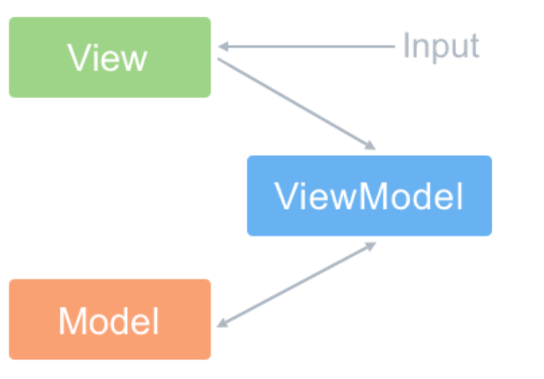
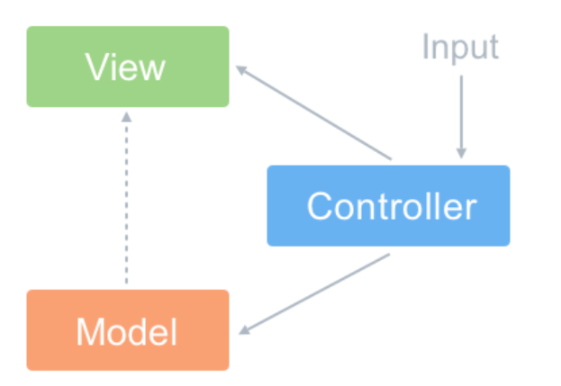
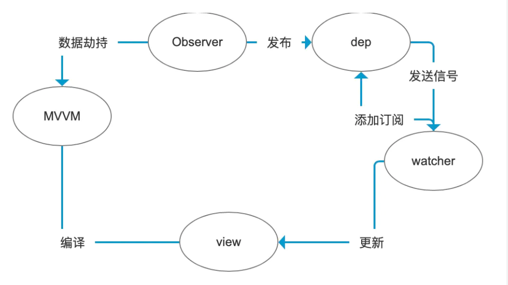
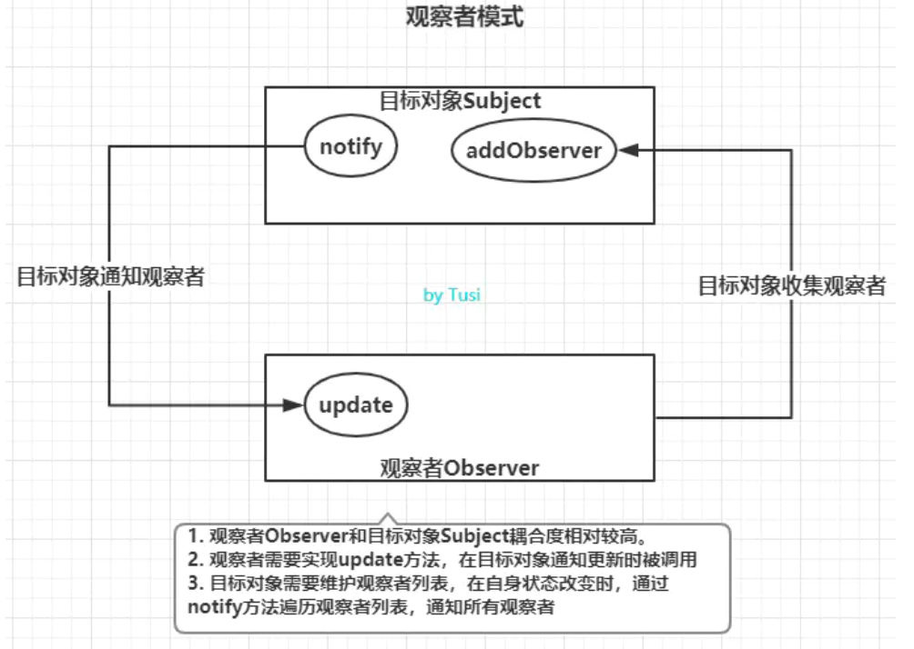
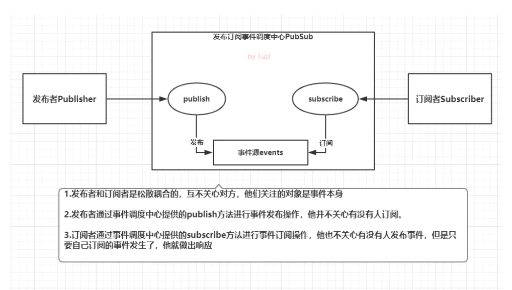

目录
- [1. Vue.js 是什么](#1-vuejs-是什么)
- [2. Vue.js 的主要功能](#2-vuejs-的主要功能)
- [3. MVVM模式](#3-mvvm模式)
  - [3.1 MVVM 优点](#31-mvvm-优点)
  - [3.2 MVMM 与 MVC 区别](#32-mvmm-与-mvc-区别)
  - [3.3 Vue组件如何通信](#33-vue组件如何通信)
- [4. 组件](#4-组件)
  - [4.1 构建组件](#41-构建组件)
    - [4.1.1 全局组件](#411-全局组件)
    - [4.1.2 局部组件](#412-局部组件)
  - [4.2 组件传值](#42-组件传值)
    - [4.2.1 父组件向子组件进行传值](#421-父组件向子组件进行传值)
    - [4.2.2 子组件向父组件传值](#422-子组件向父组件传值)
    - [4.2.3 非父子组件进行传值](#423-非父子组件进行传值)
- [5. Vue异步更新策略及 nextTick 原理](#5-vue异步更新策略及-nexttick-原理)
  - [5.1 js执行机制（补充）](#51-js执行机制补充)
  - [5.2 异步更新策略及 nextTick 原理](#52-异步更新策略及-nexttick-原理)
- [6. Vue生命周期](#6-vue生命周期)
  - [6.1 什么是vue生命周期？](#61-什么是vue生命周期)
  - [6.2 第一次页面加载会触发哪几个钩子？](#62-第一次页面加载会触发哪几个钩子)
  - [6.3 每个周期具体适合场景](#63-每个周期具体适合场景)
  - [6.4 获取数据在哪个周期](#64-获取数据在哪个周期)
- [7. 虚拟DOM](#7-虚拟dom)
  - [7.1 实现原理](#71-实现原理)
  - [7.2 为什么需要？](#72-为什么需要)
  - [7.3 虚拟DOM 优劣？](#73-虚拟dom-优劣)
- [8. compute, watch 和 method](#8-compute-watch-和-method)
  - [8.1 methods 和（watch、computed）的区别](#81-methods-和watchcomputed的区别)
  - [8.2 methods 和 computed 相比，computed 的好处](#82-methods-和-computed-相比computed-的好处)
  - [8.3 watch 和 computed 的区别](#83-watch-和-computed-的区别)
- [9.双向绑定](#9双向绑定)
  - [9.1 实现思路](#91-实现思路)
  - [9.2 vue2.0数据劫持](#92-vue20数据劫持)
  - [9.3 Vue3.0数据劫持](#93-vue30数据劫持)
  - [9.4 Proxy与Object.defineProperty的优劣](#94-proxy与objectdefineproperty的优劣)
  - [9.5 实现过程](#95-实现过程)
  - [9.6 观察者模式](#96-观察者模式)
  - [9.7 发布订阅模式](#97-发布订阅模式)
- [10. vue-router 有哪几种导航钩子?](#10-vue-router-有哪几种导航钩子)
  - [10.1 数据获取](#101-数据获取)
    - [10.1.1 导航完成后获取数据](#1011-导航完成后获取数据)
    - [10.1.2 在导航完成前获取数据](#1012-在导航完成前获取数据)
- [11. Vue 指令和它的用法](#11-vue-指令和它的用法)
  - [11.1 常用指令](#111-常用指令)
  - [11.2 v-show 和 v-if 指令的共同点和不同点？](#112-v-show-和-v-if-指令的共同点和不同点)
  - [11.3 v-for 为什么要加key](#113-v-for-为什么要加key)
- [12. $set](#12-set)
  - [13. 组件中的data为什么是一个函数？](#13-组件中的data为什么是一个函数)
  - [14. v-model的原理](#14-v-model的原理)
  - [15. Vue事件绑定](#15-vue事件绑定)

## 1. Vue.js 是什么
Vue.js 是一个开源的、用于构建用户界面的渐进式 JavaScript 框架。Vue.js 的核心库只关注于**视图层**，并且易于装载和集成其他的库或现有的项目。

## 2. Vue.js 的主要功能
1. 虚拟 DOM：它使用的虚拟 DOM 类似于其他现有的框架（例如 React.js ，Ember 等）。虚拟 DOM 是原始 HTML DOM 的轻量级内存树表示形式，并且在不影响原始 DOM 的情况下进行更新；
2. 组件：在 Vue.js 应用中用于创建可复用的自定义元素；
3. 模板：Vue.js 提供基于 HTML 的模板，并将 DOM 和 Vue 实例的 data 绑定；
4. 路由：通过 vue-router 实现页面之间的导航；
5. 轻量：Vue.js 相较于其他框架是一个轻量级的库。

## 3. MVVM模式
即Model-View-ViewModel。Vue是以数据为驱动的，Vue自身将DOM和数据进行绑定，一旦创建绑定，DOM和数据将保持同步，每当数据发生变化，DOM会跟着变化。

ViewModel是Vue的核心，它是Vue的一个实例。Vue实例时作用域某个HTML元素上的，这个HTML元素可以是body，也可以是某个id所指代的元素。

DOM Listeners和Data Bindings是实现双向绑定的关键。DOM Listeners监听页面所有View层DOM元素的变化，当发生变化，Model层的数据随之变化；Data Bindings监听Model层的数据，当数据发生变化，View层的DOM元素随之变化。


### 3.1 MVVM 优点

1. 低耦合。View可以独立于Model变化和修改，一个ViewModel可以绑定到不同的View上，**当View变化的时候Model可以不变，当Model变化的时候View也可以不变。**
2. 可重用性。可以把一些视图的逻辑放在ViewModel里面，让很多View重用这段视图逻辑。　　
3. 独立开发。开发人员可以专注与业务逻辑和数据的开发(ViewModel)。设计人员可以专注于界面(View)的设计。
4. 可测试性。可以针对ViewModel来对界面(View)进行测试。

    

### 3.2 MVMM 与 MVC 区别

- MVC中Controller演变成MVVM中的ViewModel
- MVVM通过数据来显示视图层而不是节点操作
- MVVM主要解决了MVC中大量的dom操作使页面渲染性能降低,加载速度变慢,影响用户体验
  
>MVC 是什么？
>
>MVC: MVC是应用最广泛的软件架构之一,一般MVC分为:Model(模型),View(视图),Controller(控制器)。 
>
>这主要是基于分层的目的,让彼此的职责分开.
>
>View一般用过Controller来和Model进行联系。Controller是Model和View的协调者,View和Model不直接联系。基本都是单向联系。
>
>1.View传送指令到Controller。
>
>2.Controller完成业务逻辑后改变Model状态。
>
>3.Model将新的数据发送至View,用户得到反馈。
>
>

### 3.3 Vue组件如何通信

- props/$emit+v-on:
  
  [父子间](#42-组件传值): 通过props将数据自上而下传递，而通过$emit和v-on来向上传递信息。
- [EventBus](#97-发布订阅模式): 通过EventBus进行信息的发布与订阅
- vuex: 是全局数据管理库，可以通过vuex管理全局的数据流
- $attrs/$listeners: Vue2.4中加入的$attrs/$listeners可以进行跨级的组件通信
- provide/inject：以允许一个祖先组件向其所有子孙后代注入一个依赖，不论组件层次有多深，并在起上下游关系成立的时间里始终生效，这成为了跨组件通信的基础


## 4. 组件

### 4.1 构建组件

#### 4.1.1 全局组件
```
<body>
<div id="vueInstance">
	<mine></mine>
</div>
</body>

<script>
Vue.component('mine',{           
    template:'#mineTpl',          
    props:['name','title','city','content']        
}); 

var v=new Vue({      
    el:'#vueInstance',  //class name     
    data:{          
        name:'zhang',          
        title:'this is title',         
        city:'Beijing',         
        content:'these are some desc about Blog'     
    }
});
</script>
```

这些组件是全局注册的。也就是说它们在注册之后可以用在任何新创建的 Vue 根实例 (new Vue) 的模板中。比如：

```
Vue.component('component-a', { /* ... */ })
Vue.component('component-b', { /* ... */ })
Vue.component('component-c', { /* ... */ })

new Vue({ el: '#app' })
<div id="app">
  <component-a></component-a>
  <component-b></component-b>
  <component-c></component-c>
</div>
```

#### 4.1.2 局部组件

全局注册往往是不够理想的。比如，如果你使用一个像 webpack 这样的构建系统，全局注册所有的组件意味着即便你已经不再使用一个组件了，它仍然会被包含在你最终的构建结果中。这造成了用户下载的 JavaScript 的无谓的增加。

在这些情况下，你可以通过一个普通的 JavaScript 对象来定义组件：

```
var ComponentA = { /* ... */ }
var ComponentB = { /* ... */ }
var ComponentC = { /* ... */ }
```

然后在 components 选项中定义你想要使用的组件：
```
new Vue({
  el: '#app',
  components: {
    'component-a': ComponentA,
    'component-b': ComponentB
  }
})
```

对于 components 对象中的每个 property 来说，其 property 名就是自定义元素的名字，其 property 值就是这个组件的选项对象。

注意**局部注册的组件在其子组件中不可用**。例如，如果你希望 ComponentA 在 ComponentB 中可用，则你需要这样写：
```
var ComponentA = { /* ... */ }

var ComponentB = {
  components: {
    'component-a': ComponentA
  },
  // ...
}
```
或者 (和项目一样)
```
import ComponentA from './ComponentA.vue'

export default {
  components: {
    ComponentA
  },
  // ...
}
```

### 4.2 组件传值

- 父组件传值给子组件，首先父组件发送的形式是用bind(缩写是“:”)绑定值到子组件身上。然后子组件用属性props接收。
- 子组件传值父组件，首先是子组件发送的形式是this.$emit(事件名,需要发送的值)，事件名：父组件on监听的方法，父组件第一
件事就是监听子组件发送过来的事件名，@事件名=**获取值的方法**，就这样拿到了儿子发过来的值。
- 兄弟传值，两个都要引入公共js->bus。首先是发送者，this.emit(名字，值)。然后是接受者，this.on("传过来的那个名字"，函数（值）)，这里要注意的是接受者的这个监听事件应该是放在钩子mounted事件内。同时注意this指向问题。（可用封装方法）


#### 4.2.1 父组件向子组件进行传值

父组件：

```
<template>
    <div>
        父组件:
        <input type="text" v-model="name">
        <br>
        <br>
        <!-- 引入子组件 -->
        <child :inputName="name"></child>
    </div>
</template>

<script>
import child from './child'
export default {
    components: {
    child
},
data () {
    return {
        name: ''
    }
}
}
</script>
```

子组件：
```
<template>
    <div>
    子组件:
    <span>{{inputName}}</span>
    </div>
</template>

<script>
export default {
    // 接受父组件的值
props: {
    inputName: String,
    required: true
}
}
</script>

```

#### 4.2.2 子组件向父组件传值
子组件：

```
<template>
    <div>
    子组件:
    <span>{{childValue}}</span>
    <!-- 定义一个子组件传值的方法 -->
    <input type="button" value="点击触发" @click="childClick">
    </div>
</template>

<script>
export default {
data () {
    return {
        childValue: '我是子组件的数据'
    }
},

methods: {
    childClick () {
        // childByValue是在父组件on监听的方法
        // 第二个参数this.childValue是需要传的值
        this.$emit('childByValue', this.childValue)
    }
}
}
</script>
```

父组件：

```
<template>
    <div>
    父组件:
    <span>{{name}}</span>
    <br>
    <br>
    <!-- 引入子组件 定义一个on的方法监听子组件的状态-->
    <child v-on:childByValue="childByValue"></child>
    </div>
</template>

<script>
import child from './child'
export default {
components: {
child
},
data () {
    return {
        name: ''
    }
},
methods: {
    childByValue: function (childValue) {
        // childValue就是子组件传过来的值
        this.name = childValue
}

```

#### 4.2.3 非父子组件进行传值
非父子组件之间传值，需要定义个公共的公共实例文件bus.js，作为中间仓库来传值，不然路由组件之间达不到传值的效果。

公共Bus.js

```
//bus.js
import Vue from 'vue'
export default new Vue()
```

组件A：
```
<template>
    <div>
    A组件:
    <span>{{elementValue}}</span>
    <input type="button" value="点击触发" @click="elementByValue">
    </div>
</template>

<script>
// 引入公共的bus，来做为中间传达的工具
import Bus from './bus.js'
export default {
data () {
    return {
        elementValue: 4
    }
},
methods: {
    elementByValue: function () {
        Bus.$emit('val', this.elementValue)
    }
}
}
</script>
```

组件B：
```
<template>
    <div>
    B组件:
    <input type="button" value="点击触发" @click="getData">
    <span>{{name}}</span>
    </div>
</template>
 
<script>
import Bus from './bus.js'
export default {
data () {
    return {
        name: 0
    }
},
mounted: function () {
    var vm = this
    // 用$on事件来接收参数
    Bus.$on('val', (data) => {
    console.log(data)
    vm.name = data
    })
},
methods: {
    getData: function () {
        this.name++
    }
}
}
</script>
```


## 5. Vue异步更新策略及 nextTick 原理

什么是进程： 进程是cpu分配资源的最小单位；（是能拥有资源和独立运行的最小单位）

什么是线程： 线程是cpu调度的最小单位；（线程是建立在进程的基础上的一次程序运行单位，一个进程中可以有多个线程）

浏览器是多进程的：
在浏览器中，每打开一个tab页面，其实就是新开了一个进程，在这个进程中，还有ui渲染线程，js引擎线程，http请求线程等。 所以，浏览器是一个多进程的。

**js是单线程**的：
js是作为浏览器的脚本语言，主要是实现用户与浏览器的交互，以及操作dom；这决定了它只能是单线程，否则会带来很复杂的同步问题。

举个例子：如果js被设计了多线程，如果有一个线程要修改一个dom元素，另一个线程要删除这个dom元素，此时浏览器就会一脸茫然，不知所措。所以，为了避免复杂性，从一诞生，JavaScript就是单线程。

### 5.1 js执行机制（补充）
由于js是单线程，js设计者把任务分为同步任务和异步任务，同步任务都在主线程上排队执行，前面任务没有执行完成，后面的任务会一直等待；

异步任务则是挂在在一个任务队列里，等待主线程所有任务执行完成后，通知任务队列可以把可执行的任务放到主线程执行。

异步任务放到主线程执行完后，又通知任务队列把下一个异步任务放到主线程中执行。这个过程一直持续，直到异步任务执行完成，这个持续重复的过程就叫Event loop。**而一次循环就是一次tick** 。

>在任务队列中的异步任务又可以分为两种microtast（微任务） 和 macrotask（宏任务）
>
>microtast（微任务）：Promise， process.nextTick， Object.observe， MutationObserver
>
>macrotask（宏任务）：script整体代码、setTimeout、 setInterval等

执行优先级上，先执行宏任务macrotask，再执行微任务mincrotask。

执行过程中需要注意的几点是：

在一次event loop中，**microtask在这一次循环中是一直取一直取**，直到清空microtask队列，而macrotask则是一次循环取一次。
如果执行事件循环的过程中又加入了异步任务，**如果是macrotask，则放到macrotask末尾**，等待下一轮循环再执行。如果是microtask，则放到本次event loop中的microtask任务末尾继续执行。直到microtask队列清空。


### 5.2 异步更新策略及 nextTick 原理

在下次DOM更新循环结束之后执行的延迟回调。在修改数据之后立即使用该方法，获取更新后的DOM。

意思就是：当页面中的数据发生改变了，就会把该任务放到一个异步队列中，只有在当前任务空闲时才会进行DOM渲染，当DOM渲染完成以后，该函数就会自动执行。

**vue为了实现异步更新效果，建立了nextTick函数。**

Vue 在更新 DOM 时是异步执行的。只要侦听到数据变化，Vue 将开启一个队列，并缓冲在同一事件循环中发生的所有数据变更。

如果同一个 watcher 被多次触发，只会被推入到队列中一次。这种在缓冲时去除重复数据对于避免不必要的计算和 DOM 操作是非常重要的。**所以如果你用一个for循环来动态改变数据100次，其实它只会应用最后一次改变，如果没有这种机制，DOM就要重绘100次，这固然是一个很大的开销。**


然后，在下一个的事件循环“tick”中，Vue 刷新队列并执行实际 (已去重的) 工作。Vue 在内部对异步队列尝试使用原生的 **Promise.then、MutationObserver 和 setImmediate**，如果执行环境不支持，则会采用 setTimeout(fn, 0) 代替。

使用nextTick保证当前视图渲染完成。

>原理：
>当调用nextTick方法时会传入两个参数，回调函数和执行回调函数的上下文环境，如果没有提供回调函数，那么将返回promise对象。
>
>首先将拿到的回调函数存放到数组中，判断是否正在执行回调函数，如果当前没有在pending的时候，就会执行timeFunc，多次执行nextTick只会执行一次timerFunc，timeFunc其实就是执行异步的方法，在timeFunc方法中选择一个异步方法（首先判断是否支持promise，如果支持就将flushCallbacks放在promise中异步执行，并且标记使用微任务。如果不支持promise就看是否支持MutationObserver方法，如果支持就new了一个MutationObserver类，创建一个文本节点进行监听，当数据发生变化了就会异步执行flushCallbacks方法。如果以上两个都不支持就看是否支持setImmediate方法，如果支持setImmediate 就去异步执行flushCallbacks方法。如果以上三种方法都不支持，就使用setTimeout），然后异步去执行flushCallbacks方法，flushCallbacks中就是将传递的函数依次执行。
>
>nextTick多次调用会维持一个数组，之后会异步的把数组中的方法以此执行，这样的话用户就会在视图更新之后再获取到真实的dom元素。

## 6. Vue生命周期

### 6.1 什么是vue生命周期？
Vue 实例从创建到销毁的过程，就是生命周期。也就是从开始创建、初始化数据、编译模板、挂载DOM-渲染、更新-渲染、卸载等一系列的过程，我们称这是 Vue 的生命周期。

### 6.2 第一次页面加载会触发哪几个钩子？

beforeCreate ， created ， beforeMount ，mounted 

### 6.3 每个周期具体适合场景

- beforeCreate：创建前：
  - 此阶段为实例初始化之后，this指向创建的实例，此时的数据观察事件机制都未形成，不能获得DOM节点。
  - data，computed，watch，methods 上的方法和数据均不能访问。
  - 可以在这加个loading事件。

- created：创建后：
  - 此阶段为实例已经创建，完成数据（data、props、computed）的初始化导入依赖项。
  - 可访问 data computed watch methods 上的方法和数据。
  - 初始化完成时的事件写在这里，异步请求也适宜在这里调用（请求不宜过多，避免白屏时间太长）。
  - 可以在这里结束loading事件，还做一些初始化，实现函数自执行。
  - 未挂载DOM，若在此阶段进行DOM操作一定要放在Vue.nextTick()的回调函数中。

- beforeMount：挂载前：
  - 虽然得不到具体的DOM元素，但vue挂载的根节点已经创建，下面vue对DOM的操作将围绕这个根元素继续进行。
  - beforeMount这个阶段是过渡性的，一般一个项目只能用到一两次。

- mounted：挂载：
  - 完成创建vm.$el，和双向绑定
  - 完成挂载DOM和渲染，可在mounted钩子函数中对挂载的DOM进行操作。
  - 可在这发起后端请求，拿回数据，配合路由钩子做一些事情。

- beforeUpdate：数据更新前:
  - 数据驱动DOM。
  - 在数据更新后虽然没有立即更新数据，但是DOM中的数据会改变，这是vue双向数据绑定的作用。
  - 可在更新前访问现有的DOM，如手动移出添加的事件监听器。

- updated：数据更新后:
  - 完成虚拟DOM的重新渲染和打补丁。
  - 组件DOM已完成更新，可执行依赖的DOM操作。
  - 注意：不要在此函数中操作数据（修改属性），会陷入死循环。

- activated(*)：
  - 在使用vue-router时有时需要使用<keep-alive></keep-alive>来缓存组件状态，这个时候created钩子就不会被重复调用了。
  - 如果我们的子组件需要在每次加载的时候进行某些操作，可以使用activated钩子触发。

- deactivated(*)：
  - <keep-alive></keep-alive>组件被移除时使用。

- beforeDestroy：销毁前:
  - 可做一些删除提示，如：您确定删除xx吗？

- destroyed：销毁后:
  - 当前组件已被删除，销毁监听事件，组件、事件、子实例也被销毁。
  - 这时组件已经没有了，无法操作里面的任何东西了。

>异步请求什么时候调用？
>
>异步请求是在mounted生命周期中调用的。

### 6.4 获取数据在哪个周期
看实际情况，一般在 created 里面就可以，如果涉及到需要页面加载完成之后的话就用 mounted 。

在 created 的时候，视图中的 HTML 并没有渲染出来，所以此时如果直接去操作 HTML 的 DOM 节点，一定找不到相关的元素。

而在 mounted 中，由于此时 HTML 已经渲染出来了，所以可以直接操作 DOM 节点，（此时 document.getelementById 即可生效了）。

## 7. 虚拟DOM

### 7.1 实现原理

- 虚拟DOM本质上是JavaScript对象,是对真实DOM的抽象
- 状态变更时，记录新树和旧树的差异
- 最后把差异更新到真正的dom中

### 7.2 为什么需要？

首先,我们都知道在前端性能优化的一个秘诀就是尽可能少地操作DOM,不仅仅是DOM相对较慢,更因为频繁变动DOM会造成浏览器的回流或者重回,这些都是性能的杀手,因此我们需要这一层抽象,在patch过程中尽可能地一次性将差异更新到DOM中,这样保证了DOM不会出现性能很差的情况.

其次,现代前端框架的一个基本要求就是无须手动操作DOM,一方面是因为手动操作DOM无法保证程序性能,多人协作的项目中如果review不严格,可能会有开发者写出性能较低的代码,另一方面更重要的是省略手动DOM操作可以大大提高开发效率.

最后,也是Virtual DOM最初的目的,就是更好的跨平台,比如Node.js就没有DOM,如果想实现SSR(服务端渲染),那么一个方式就是借助Virtual DOM,因为Virtual DOM本身是JavaScript对象.

### 7.3 虚拟DOM 优劣？
优点：

- 保证性能下限: 虚拟DOM可以经过diff找出最小差异,然后批量进行patch,这种操作虽然比不上手动优化,但是比起粗暴的DOM操作性能要好很多,因此虚拟DOM可以保证性能下限
- 无需手动操作DOM: 虚拟DOM的diff和patch都是在一次更新中自动进行的,我们无需手动操作DOM,极大提高开发效率
- 跨平台: 虚拟DOM本质上是JavaScript对象,而DOM与平台强相关,相比之下虚拟DOM可以进行更方便地跨平台操作,例如服务器渲染、移动端开发等等。

缺点:

- 无法进行极致优化: 在一些性能要求极高的应用中虚拟DOM无法进行针对性的极致优化,比如VScode采用直接手动操作DOM的方式进行极端的性能优化

## 8. compute, watch 和 method

### 8.1 methods 和（watch、computed）的区别
- watch 和 computed 都是以 Vue 的依赖追踪机制为基础的，它们都试图处理这样一件事情：当某一个数据（称它为依赖数据）发生变化的时候，所有依赖这个数据的“相关”数据“自动”发生变化，也就是自动调用相关的函数去实现数据的变动；

- methods 里面是用来定义函数的，很显然，它需要手动调用才能执行。而不像 watch 和 computed 那样，“自动执行”预先定义的函数。 

### 8.2 methods 和 computed 相比，computed 的好处
- 当我们改变 number 时，整个应用会重新渲染，Vue 会被数据重新渲染到 DOM 中。这时，如果我们使用 getName 方法，随着渲染，方法也会被调用，而 computed 不会重新进行计算，从而性能开销比较小。当新的值需要大量计算才能得到，缓存的意义就非常大。

- 如果 computed 所依赖的数据发生改变时，compute 属性才会重新计算，并进行缓存；当改变其他数据时，computed 属性并不会重新计算，从而提升性能。

- 当我们拿到的值需要进行一定处理使用时，就可以使用 computed

### 8.3 watch 和 computed 的区别
- watch 监听到值的变化就会执行回调，在回调中可以进行一些逻辑操作。watch 监听某个数据的变化（监听完调用什么函数） 一个数据影响多个数据 （比如：浏览器自适应、监控路由对象、监控自身属性变化）；

- computed 是计算属性，依赖其他属性计算值，并且 computed 的值有缓存，只有当计算值变化才会返回内容。computed 计算后返回。一个数据受多个数据影响（比如：计算总价格、过滤某些数据）；

- **所以一般来说需要依赖别的属性来动态获得值的时候可以使用 computed，对于监听到值的变化需要做一些复杂业务逻辑的情况可以使用 watch。**
  
- 就算在 data 中没有直接声明出要计算的变量，也可以直接在 computed 中写入。如果在 data中没有相应的属性的话，是不能 watch 的，这点和 computed 不一样；
  
- computed 是用来处理你使用 watch 和 methods 的时候无法处理（比如有缓存的时候监听不了数据变化），或者是处理起来并不太恰当的情况的，利用 computed 处理 methods 存在的重复计算情况。

## 9.双向绑定

所谓的双向绑定其实就是，ui或者数据有一方做了修改，那么另外一个也会随着改变。

视图驱动数据，这个很简单，我们只要绑定事件就可以，但是数据要怎么驱动视图呢？这里就需要去对数据做监听，我们通常称之为”**数据劫持**“在每一次数据改变的时候，去执行更新视图的操作。

vue数据双向绑定是通过**数据劫持结合发布者-订阅者模式**的方式来实现的，其中比较关键的是数据劫持。


### 9.1 实现思路

实现mvvm主要包含两个方面，数据变化更新视图，视图变化更新数据：

关键点在于data如何更新view，因为view更新data其实可以通过事件监听即可，比如input标签监听 'input' 事件就可以实现了。所以我们着重来分析下，当**数据改变，如何更新视图的**。

如何知道数据变了。

### 9.2 vue2.0数据劫持
Vue2.0 采用的是**Object.defineProperty**进行数据劫持的主要实现原理是使用描述对象中的set方法进行拦截,并发送订阅器信号。

```
// ... 
let dep = new Dep()
return Object.defineProperty(obj, prop, {
    // ...
    get: function(key) {
        dep.target = this
        dep.addSub()
        // ...
    }
    set: function(newVal) {
        val = newVue;
        // 发送一个dep信号
        dep.notify()
        // ...
    }
})

```

### 9.3 Vue3.0数据劫持
可能会采用Proxy来实现数据劫持。
```
let target = {}

let p = new Proxy(target, {
    set: function() {
        //...
    },
    get: function() {
        //...
    }
})
```
### 9.4 Proxy与Object.defineProperty的优劣

Proxy的优势:

- Proxy可以直接监听对象而非属性
- Proxy可以直接监听数组的变化
- Proxy有多达13种拦截方法,不限于apply、ownKeys、deleteProperty、has等等是Object.defineProperty不具备的
- Proxy返回的是一个新对象,我们可以只操作新的对象达到目的,而Object.defineProperty只能遍历对象属性直接修改
- Proxy作为新标准将受到浏览器厂商重点持续的性能优化，也就是传说中的新标准的性能红利

Object.defineProperty的优势:

兼容性好,支持IE9

### 9.5 实现过程
我们已经知道实现数据的双向绑定，首先要对数据进行劫持监听，所以我们需要设置一个监听器Observer，用来监听所有属性。

如果属性发生变化了，就需要告诉订阅者Watcher看是否需要更新。因为订阅者是有很多个，所以我们需要有一个消息订阅器Dep来专门收集这些订阅者，然后在监听器Observer和订阅者Watcher之间进行统一管理的。

接着，我们还需要有一个指令解析器Compile，对每个节点元素进行扫描和解析，将相关指令对应初始化成一个订阅者Watcher，并替换模板数据或者绑定相应的函数，此时当订阅者Watcher接收到相应属性的变化，就会执行对应的更新函数，从而更新视图。

因此接下去我们执行以下3个步骤，实现数据的双向绑定：

1.实现一个监听器Observer，用来劫持并监听所有属性，如果有变动的，就通知订阅者。

2.实现一个订阅者Watcher，可以收到属性的变化通知并执行相应的函数，从而更新视图。

3.实现一个解析器Compile，可以扫描和解析每个节点的相关指令，并根据初始化模板数据以及初始化相应的订阅器。

流程图如下：



### 9.6 观察者模式

观察者模式与发布订阅模式相比，耦合度更高，通常用来实现一些响应式的效果。在观察者模式中，只有两个主体，分别是目标对象Subject，观察者Observer。

观察者需Observer要实现update方法，供目标对象调用。update方法中可以执行自定义的业务代码。
目标对象Subject也通常被叫做被观察者或主题，它的职能很单一，可以理解为，它只管理一种事件。Subject需要维护自身的观察者数组observerList，当自身发生变化时，通过调用自身的notify方法，依次通知每一个观察者执行update方法。

按照这种定义，我们可以实现一个简单版本的观察者模式。

```
// 观察者
class Observer {
    /**
     * 构造器
     * @param {Function} cb 回调函数，收到目标对象通知时执行
     */
    constructor(cb){
        if (typeof cb === 'function') {
            this.cb = cb
        } else {
            throw new Error('Observer构造器必须传入函数类型！')
        }
    }
    /**
     * 被目标对象通知时执行
     */
    update() {
        this.cb()
    }
}

// 目标对象
class Subject {
    constructor() {
        // 维护观察者列表
        this.observerList = []
    }
    /**
     * 添加一个观察者
     * @param {Observer} observer Observer实例
     */
    addObserver(observer) {
        this.observerList.push(observer)
    }
    /**
     * 通知所有的观察者
     */
    notify() {
        this.observerList.forEach(observer => {
            observer.update()
        })
    }
}

const observerCallback = function() {
    console.log('我被通知了')
}
const observer = new Observer(observerCallback)

const subject = new Subject();
subject.addObserver(observer);
subject.notify();
```



特点:

- 角色很明确，没有事件调度中心作为中间者，目标对象Subject和观察者Observer都要实现约定的成员方法。
- 双方联系更紧密，目标对象的主动性很强，自己收集和维护观察者，并在状态变化时主动通知观察者更新。

### 9.7 发布订阅模式

**非父子组件之间的通信。**使用EventEmitter2时，主要是用emit发事件，用on监听事件，还有off销毁事件监听者，removeAllListeners销毁指定事件的所有监听者，还有once之类的方法。考虑到时间关系，我想着就先实现发事件，监听事件，移除监听者这几个功能。

```
class EventEmitter {
    constructor() {
        // 维护事件及监听者
        this.listeners = {}
    }
    /**
     * 注册事件监听者
     * @param {String} type 事件类型
     * @param {Function} cb 回调函数
     */
    on(type, cb) {
        if (!this.listeners[type]) {
            this.listeners[type] = []
        }
        this.listeners[type].push(cb)
    }
    /**
     * 发布事件
     * @param {String} type 事件类型
     * @param  {...any} args 参数列表，把emit传递的参数赋给回调函数
     */
    emit(type, ...args) {
        if (this.listeners[type]) {
            this.listeners[type].forEach(cb => {
                cb(...args)
            })
        }
    }
    /**
     * 移除某个事件的一个监听者
     * @param {String} type 事件类型
     * @param {Function} cb 回调函数
     */
    off(type, cb) {
        if (this.listeners[type]) {
            const targetIndex = this.listeners[type].findIndex(item => item === cb)
            if (targetIndex !== -1) {
                this.listeners[type].splice(targetIndex, 1)
            }
            if (this.listeners[type].length === 0) {
                delete this.listeners[type]
            }
        }
    }
    /**
     * 移除某个事件的所有监听者
     * @param {String} type 事件类型
     */
    offAll(type) {
        if (this.listeners[type]) {
            delete this.listeners[type]
        }
    }
}
// 创建事件管理器实例
const ee = new EventEmitter()
// 注册一个chifan事件监听者
ee.on('chifan', function() { console.log('吃饭了，我们走！') })
// 发布事件chifan
ee.emit('chifan')
// 也可以emit传递参数
ee.on('chifan', function(address, food) { console.log(`吃饭了，我们去${address}吃${food}！`) })
ee.emit('chifan', '三食堂', '铁板饭') // 此时会打印两条信息，因为前面注册了两个chifan事件的监听者

// 测试移除事件监听
const toBeRemovedListener = function() { console.log('我是一个可以被移除的监听者') }
ee.on('testoff', toBeRemovedListener)
ee.emit('testoff')
ee.off('testoff', toBeRemovedListener)
ee.emit('testoff') // 此时事件监听已经被移除，不会再有console.log打印出来了

// 测试移除chifan的所有事件监听
ee.offAll('chifan')
console.log(ee) // 此时可以看到ee.listeners已经变成空对象了，再emit发送chifan事件也不会有反应了

```


特点：

- 角色很明确，没有事件调度中心作为中间者，目标对象Subject和观察者Observer都要实现约定的成员方法。
- 双方联系更紧密，目标对象的主动性很强，自己收集和维护观察者，并在状态变化时主动通知观察者更新。

## 10. vue-router 有哪几种导航钩子?

全局导航钩子
- router.beforeEach(to, from, next)
- router.beforeResolve(to, from, next)
- router.afterEach(to, from ,next)

组件内钩子
beforeRouteEnter
beforeRouteUpdate
beforeRouteLeave

单独路由独享组件
beforeEnter

### 10.1 数据获取
有时候，进入某个路由后，需要从服务器获取数据。例如，在渲染用户信息时，你需要从服务器获取用户的数据。我们可以通过两种方式来实现：

- 导航完成之后获取：先完成导航，然后在接下来的组件生命周期钩子中获取数据。在数据获取期间显示“加载中”之类的指示。
- 导航完成之前获取：导航完成前，在路由进入的守卫中获取数据，在数据获取成功后执行导航。

#### 10.1.1 导航完成后获取数据

当你使用这种方式时，我们会马上导航和渲染组件，然后在组件的 created 钩子中获取数据。这让我们有机会在数据获取期间展示一个 loading 状态，还可以在不同视图间展示不同的 loading 状态。

#### 10.1.2 在导航完成前获取数据

通过这种方式，我们在导航转入新的路由前获取数据。我们可以在接下来的组件的 beforeRouteEnter 守卫中获取数据，当数据获取成功后只调用 next 方法。

## 11. Vue 指令和它的用法
- v-if ：判断是否隐藏；
- v-for ：数据循环；
- v-bind:class ：绑定一个属性；
- v-model ：实现双向绑定。

### 11.1 常用指令
1. 文本插值： {{}} Mustache；
2. DOM 属性绑定： v-bind ；
3. 指令绑定一个事件监听器： v-on ；
4. 实现表单输入和应用状态之间的双向绑定： v-model ；
5. 控制切换一个元素的显示： v-if 和 v-else ；
6. 列表渲染： v-for ；
7. 根据条件展示元素： v-show 。

### 11.2 v-show 和 v-if 指令的共同点和不同点？

- v-show 和 v-if 指令的共同点：都能控制元素显示/隐藏。
- v-show 和 v-if 指令的不同点：
  1. v-if 只在表达式通过的情况下将元素渲染到 DOM 中，而 v-show 渲染全部元素到 DOM 中
  并基于表达式使用 CSS display 属性来 显示/隐藏 元素；
  2. v-if 支持 v-else 和 v-else-if 指令，而 v-show 不支持 else 指令；
  3. v-if 有更高的切换开销，而 v-show 有更高的初始化渲染开销。换言之，如果元素会被频繁
  切换开关则 v-show 有优势，在初始渲染时间方面 v-if 有优势；
  4. v-if 支持`<template>` 元素，但 v-show 不支持。

具体：
- v-if ： v-if 指令基于给定的表达式添加或移除 DOM 元素，下面的 button 在 isLoggedIn 被设置为 false 时不会显示。

    ```
    <button v-if="isLoggedIn">Logout</button>
    ```

- v-show ：这个指令类似于 v-if ，但是它会将所有元素渲染到 DOM 中并通过 CSS 的 display 属性来显示 /隐藏元素。这个指令被推荐用于需要频繁切换开关的元素。

    ```
    <span v-show="user.name">Welcome user,{{user.name}}</span>
    ```

### 11.3 v-for 为什么要加key
vue的dom渲染是虚拟dom，数据发生变化时，diff算法会只比较更改的部分，如果数据项的顺序被改变，Vue将不是移动DOM元素来匹配数据项的改变，而是简单复用此处每个元素，并且确保它在特定索引下显示已被渲染过的每个元素。

举例说明：有一个列表我们现在在中间插入了一个元素，diff算法会默认复用之前的列表并在最后追加一个，如果列表存在选中一类的状态则会随着复用出现绑定错误的情况而不是跟着原元素，key的作用就可以给他一个标识，让状态跟着数据渲染。

**当有相同标签名的元素切换时，需要通过 key 特性设置唯一的值来标记以让 Vue 区分它们，否则Vue 为了效率只会替换相同标签内部的内容。**

## 12. $set

向响应式对象中添加一个属性，并确保这个新属性同样是响应式的，且触发视图更新。它必须用于向响应式对象上添加新属性，因为 Vue 无法探测普通的新增属性 (比如 this.myObject.newProperty = 'hi')（官方示例）

我自己的理解就是，在vue中对一个对象内部进行一些修改时，vue没有监听到变化无法触发视图的更新，此时来使用$set来触发更新，使视图更新为最新的数据。

### 13. 组件中的data为什么是一个函数？

一个组件被复用多次的话，也就会创建多个实例。本质上，这些实例用的都是同一个构造函数。如果data是对象的话，对象属于引用类型，会影响到所有的实例。所以为了保证组件不同的实例之间data不冲突，data必须是一个函数。

### 14. v-model的原理

v-model本质就是一个语法糖，可以看成是value + input方法的语法糖。 可以通过model属性的prop和event属性来进行自定义。原生的v-model，会根据标签的不同生成不同的事件和属性。

### 15. Vue事件绑定
原生事件绑定是通过addEventListener绑定给真实元素的，组件事件绑定是通过Vue自定义的$on实现的。
