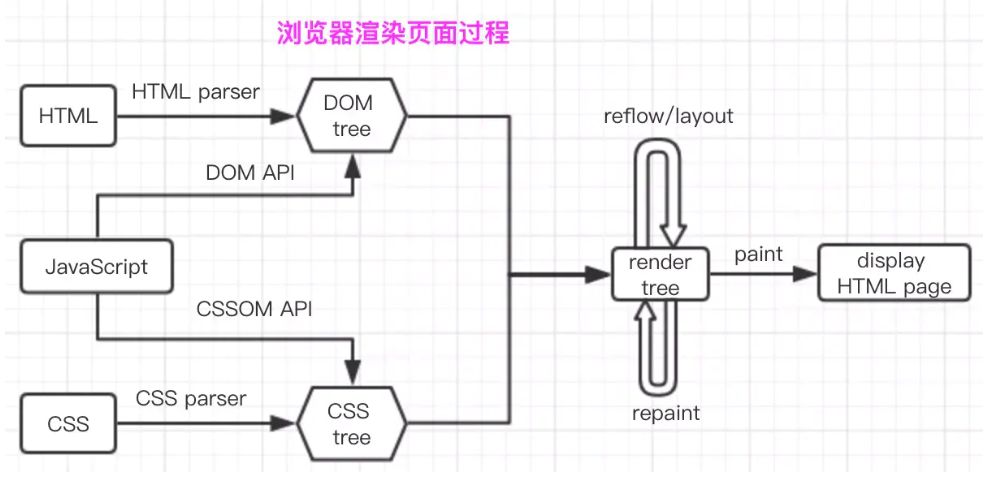
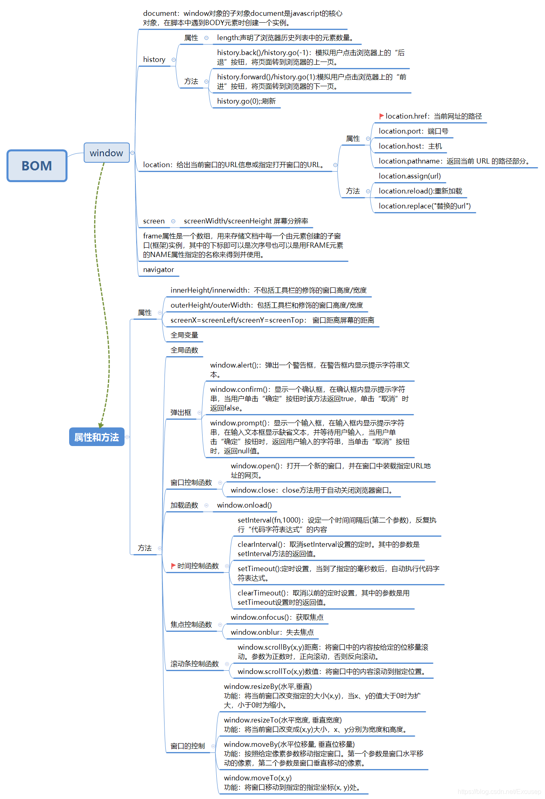

目录
- [1. webpack与grunt、gulp的不同](#1-webpack与gruntgulp的不同)
- [2. 常见的Loader和解决问题](#2-常见的loader和解决问题)
- [3. 常见的Plugin和解决问题](#3-常见的plugin和解决问题)
- [4. Loader和Plugin的不同](#4-loader和plugin的不同)
- [5. Webpack构建流程](#5-webpack构建流程)
- [6. 如何自动生成webpack配置？](#6-如何自动生成webpack配置)
  - [6.1 如何配置单页面和多页面的应用程序](#61-如何配置单页面和多页面的应用程序)
- [7. Webpack打包原理](#7-webpack打包原理)
- [8. Webpack热更新原理](#8-webpack热更新原理)
- [9. Webpack构建速度如何优化](#9-webpack构建速度如何优化)
- [10. 如何利用webpack来优化前端性能](#10-如何利用webpack来优化前端性能)
- [11. webpack3 to webpack4](#11-webpack3-to-webpack4)
- [12. 防抖与节流](#12-防抖与节流)
  - [12.1 防抖代码](#121-防抖代码)
  - [12.2 节流代码](#122-节流代码)
- [13. 重绘和重排(回流)](#13-重绘和重排回流)
  - [13.1 避免重绘与回流](#131-避免重绘与回流)
  - [13.2 渲染过程](#132-渲染过程)
- [14. 渲染URL(输入URL)](#14-渲染url输入url)
  - [14.1 服务端渲染和客户端渲染区别](#141-服务端渲染和客户端渲染区别)
  - [14.2 优劣](#142-优劣)
- [15. 浏览器登陆验证全程](#15-浏览器登陆验证全程)
- [16. DOM和BOM的区别](#16-dom和bom的区别)
- [17. 前端优化](#17-前端优化)

## 1. webpack与grunt、gulp的不同

三者都是前端构建工具，grunt和gulp在早期比较流行，现在webpack相对来说比较主流，不过一些轻量化的任务还是会用gulp来处理，比如单独打包CSS文件等。

grunt和gulp是基于任务和流（Task、Stream）的。类似jQuery，找到一个（或一类）文件，对其做一系列链式操作，更新流上的数据， 整条链式操作构成了一个任务，多个任务就构成了整个web的构建流程。

webpack是基于入口的。webpack会自动地递归解析入口所需要加载的所有资源文件，然后用不同的Loader来处理不同的文件，用Plugin来扩展webpack功能。

## 2. 常见的Loader和解决问题

- file-loader：把文件输出到一个文件夹中，在代码中通过相对 URL 去引用输出的文件
- url-loader：和 file-loader 类似，但是能在文件很小的情况下以 base64 的方式把文件内容注入到代码中去
- source-map-loader：加载额外的 Source Map 文件，以方便断点调试
- image-loader：加载并且压缩图片文件
- babel-loader：把 ES6 转换成 ES5
- css-loader：加载 CSS，支持模块化、压缩、文件导入等特性
- style-loader：把 CSS 代码注入到 JavaScript 中，通过 DOM 操作去加载 CSS。
- eslint-loader：通过 ESLint 检查 JavaScript 代码
- vue-loader：加载 Vue.js 单文件组件

## 3. 常见的Plugin和解决问题
- define-plugin：定义环境变量
- commons-chunk-plugin：提取公共代码
- uglifyjs-webpack-plugin：通过UglifyES压缩ES6代码

## 4. Loader和Plugin的不同

Loader 本质就是一个函数，在该函数中对接收到的内容进行转换，返回转换后的结果。
因为 Webpack 只认识 JavaScript，所以 Loader 就成了翻译官，对其他类型的资源进行转译的预处理工作。

Plugin 就是插件，基于事件流框架 Tapable，插件可以扩展 Webpack 的功能，在 Webpack 运行的生命周期中会广播出许多事件，Plugin 可以监听这些事件，在合适的时机通过 Webpack 提供的 API 改变输出结果。

Loader 在 module.rules 中配置，作为模块的解析规则，类型为数组。每一项都是一个 Object，内部包含了 test(类型文件)、loader、options (参数)等属性。

Plugin 在 plugins 中单独配置，类型为数组，每一项是一个 Plugin 的实例，参数都通过构造函数传入。


## 5. Webpack构建流程
- 初始化参数：从配置文件和 Shell 语句中读取与合并参数，得出最终的参数
- 开始编译：用上一步得到的参数初始化 Compiler 对象，加载所有配置的插件，执行对象的 run 方法开始执行编译
- 确定入口：根据配置中的 entry 找出所有的入口文件
- 编译模块：从入口文件出发，调用所有配置的 Loader 对模块进行翻译，再找出该模块依赖的模块，再递归本步骤直到所有入口依赖的文件都经过了本步骤的处理
- 完成模块编译：在经过第4步使用 Loader 翻译完所有模块后，得到了每个模块被翻译后的最终内容以及它们之间的依赖关系
- 输出资源：根据入口和模块之间的依赖关系，组装成一个个包含多个模块的 Chunk，再把每个 Chunk 转换成一个单独的文件加入到输出列表，这步是可以修改输出内容的最后机会
- 输出完成：在确定好输出内容后，根据配置确定输出的路径和文件名，把文件内容写入到文件系统

在以上过程中，Webpack 会在特定的时间点广播出特定的事件，插件在监听到感兴趣的事件后会执行特定的逻辑，并且插件可以调用 Webpack 提供的 API 改变 Webpack 的运行结果。

>entry 入口，告诉webpack要使用哪个模块作为构建项目的起点，默认为./src/index.js
>
>output 出口，告诉webpack在哪里输出它打包好的代码以及如何命名，默认为./dist

## 6. 如何自动生成webpack配置？
可以用一些官方脚手架

- webpack-cli
- vue-cli
```
// 首先安装
npm install -g @vue/cli
// 新建项目hello
vue create hello
```

- nuxt-cli
```
// 确保安装了npx,npx在npm5.2.0默认安装了
// 新建项目hello
npx create-nuxt-app hello
```

### 6.1 如何配置单页面和多页面的应用程序

- 单个页面
```
module.exports = {
    entry: './path/to/my/entry/file.js'
}
```

- 多页面应用程序
```
module.entrys = {
    entry: {
        pageOne: './src/pageOne/index.js',
        pageTwo: './src/pageTwo/index.js'
    }
}
```

## 7. Webpack打包原理
将所有依赖打包成一个js包（bundle.js），通过代码分割成单元片段按需加载。

Webpack 实际上为每个模块创造了一个可以导出和导入的环境，本质上并没有修改 代码的执行逻辑，代码执行顺序与模块加载顺序也完全一致。

## 8. Webpack热更新原理
Webpack 的热更新又称热替换（Hot Module Replacement），缩写为 HMR。 这个机制可以做到不用刷新浏览器而将新变更的模块替换掉旧的模块。

HMR的核心就是客户端从服务端拉去更新后的文件，准确的说是 chunk diff (chunk 需要更新的部分)，实际上 WDS（webpack-dev-server） 与浏览器之间维护了一个 Websocket，当本地资源发生变化时，WDS 会向浏览器推送更新，并带上构建时的 hash，让客户端与上一次资源进行对比。客户端对比出差异后会向 WDS 发起 Ajax 请求来获取更改内容(文件列表、hash)，这样客户端就可以再借助这些信息继续向 WDS 发起 jsonp 请求获取该chunk的增量更新。

后续的部分(拿到增量更新之后如何处理？哪些状态该保留？哪些又需要更新？)由 HotModulePlugin 来完成，提供了相关 API 以供开发者针对自身场景进行处理，像react-hot-loader 和 vue-loader 都是借助这些 API 实现 HMR。

## 9. Webpack构建速度如何优化
- 使用高版本的 Webpack 和 Node.js
- 使用多线程加速编译：HappyPack(不维护了)、thread-loader

- 压缩代码
  - 多进程并行压缩
    - webpack-paralle-uglify-plugin
    - uglifyjs-webpack-plugin 开启 parallel 参数 (不支持ES6)
    - terser-webpack-plugin 开启 parallel 参数
  - 通过 mini-css-extract-plugin 提取 Chunk 中的 CSS 代码到单独文件，通过 css-loader 的 minimize 选项开启 cssnano 压缩 CSS。
  
- 图片压缩
  - 使用基于 Node 库的 imagemin (很多定制选项、可以处理多种图片格式)
  - 配置 image-webpack-loader
  
- 使用Tree-shaking和Scope Hoisting来剔除多余代码

- 缩小打包作用域：

  - exclude/include (确定 loader 规则范围)
  - resolve.modules 指明第三方模块的绝对路径 (减少不必要的查找)
  - resolve.mainFields 只采用 main 字段作为入口文件描述字段 (减少搜索步骤，需要考虑到所有运行时依赖的第三方模块的入口文件描述字段)
  - resolve.extensions 尽可能减少后缀尝试的可能性
  - noParse 对完全不需要解析的库进行忽略 (不去解析但仍会打包到 bundle 中，注意被忽略掉的文件里不应该包含 import、require、define 等模块化语句)
  - IgnorePlugin (完全排除模块)合理使用alias

- DLL：

  - 使用 DllPlugin 进行分包，使用 DllReferencePlugin(索引链接) 对 manifest.json 引用，让一些基本不会改动的代码先打包成静态资源，避免反复编译浪费时间。
  - HashedModuleIdsPlugin 可以解决模块数字id问题


>- Tree shaking
>
>   - 打包过程中检测工程中没有引用过的模块并进行标记，在资源压缩时将它们从最终的bundle中去掉(只能对ES6 Modlue生效) 开发中尽可能使用ES6 Module的模块，提高tree shaking效率
>   - 禁用 babel-loader 的模块依赖解析，否则 Webpack 接收到的就都是转换过的 CommonJS 形式的模块，无法进行 tree-shaking
>   - 使用 PurifyCSS(不在维护) 或者 uncss 去除无用 CSS 代码
>       - purgecss-webpack-plugin 和 mini-css-extract-plugin配合使用(建议)
>
>- Scope hoisting
>
>   - 构建后的代码会存在大量闭包，造成体积增大，运行代码时创建的函数作用域变多，内存开销变大。Scope hoisting 将所有模块的代码按照引用顺序放在一个函数作用域里，然后适当的重命名一些变量以防止变量名冲突。
>   - 必须是ES6的语法，因为有很多第三方库仍采用 CommonJS 语法，为了充分发挥 Scope hoisting 的作用，需要配置 mainFields 对第三方模块优先采用 jsnext:main 中指向的ES6模块化语法

## 10. 如何利用webpack来优化前端性能

- 压缩代码。删除多余的代码、注释、简化代码的写法等等方式
- 利用 CDN 加速。在构建过程中，将引用的静态资源路径修改为 CDN 上对应的路径
- 删除死代码 Tree Shaking）。将代码中永远不会走到的片段删除掉
- 优化图片，对于小图可以使用 base64 的方式写入文件中
- 按照路由拆分代码，实现按需加载，提取公共代码
- 给打包出来的文件名添加哈希，实现浏览器缓存文件

## 11. webpack3 to webpack4

性能提升总结：

从3.12.0更新到4.29.6后webpack4整体打包速度有提升，如果不新增happypack大概提升20%。

happypack用了大概提升了50%打包速度（注意happypack对file-loader和url-loader的支持不友好，不建议图片以及文字之类的试用）

部分包升级和调整：

- html-webpack-plugin 升级至 3.0.4
- extract-text-webpack-plugin  改成 mini-css-extract-plugin
- url-loader、file-loader等升级，简单来讲，哪里报错就升级哪个包


## 12. 防抖与节流

在工作中，我们可能碰到这样的问题：

- 用户在搜索的时候，在不停敲字，如果每敲一个字我们就要调一次接口，接口调用太频繁，给卡住了。
- 用户在阅读文章的时候，我们需要监听用户滚动到了哪个标题，但是每滚动一下就监听，那样会太过频繁从而占内存，如果再加上其他的业务代码，就卡住了。

所以，这时候，我们就要用到 防抖与节流 了。

### 12.1 防抖代码
[完整代码](https://github.com/Fettes/Coding-Exercise/blob/master/Basic%20Knowledge/Code/%E9%98%B2%E6%8A%96.html)

```
    // 2、防抖功能函数，接受传参
    function debounce(fn) {
      // 4、创建一个标记用来存放定时器的返回值
      let timeout = null;
      return function() {
        // 5、每次当用户点击/输入的时候，把前一个定时器清除
        clearTimeout(timeout);
        // 6、然后创建一个新的 setTimeout，
        // 这样就能保证点击按钮后的 interval 间隔内
        // 如果用户还点击了的话，就不会执行 fn 函数
        timeout = setTimeout(() => {
          fn.call(this, arguments);
        }, 1000);
      };
    }
```

**防抖：任务频繁触发的情况下，只有任务触发的间隔超过指定间隔的时候，任务才会执行。**

结合上面的代码，我们可以了解到，在触发点击事件后，如果用户再次点击了，我们会清空之前的定时器，重新生成一个定时器。意思就是：这件事儿需要等待，如果你反复催促，我就重新计时！

实例：有个输入框，输入之后会调用接口，获取联想词。但是，因为频繁调用接口不太好，所以我们在代码中使用防抖功能，只有在用户输入完毕的一段时间后，才会调用接口，出现联想词。

### 12.2 节流代码
[完整代码](https://github.com/Fettes/Coding-Exercise/blob/master/Basic%20Knowledge/Code/%E8%8A%82%E6%B5%81.html)
```
    // 2、节流函数体
    function throttle(fn) {
      // 4、通过闭包保存一个标记
      let canRun = true;
      return function() {
        // 5、在函数开头判断标志是否为 true，不为 true 则中断函数
        if(!canRun) {
          return;
        }
        // 6、将 canRun 设置为 false，防止执行之前再被执行
        canRun = false;
        // 7、定时器
        setTimeout( () => {
          fn.call(this, arguments);
          // 8、执行完事件（比如调用完接口）之后，重新将这个标志设置为 true
          canRun = true;
        }, 1000);
      };
    }
```
**节流：指定时间间隔内只会执行一次任务。**

实例：

- 监听计算滚动条的位置，使用节流按一定时间的频率获取。
- 用户点击提交按钮，假设我们知道接口大致的返回时间的情况下，我们使用节流，只允许一定时间内点击一次。

这样，在某些特定的工作场景，我们就可以使用防抖与节流来减少不必要的损耗。

## 13. 重绘和重排(回流)

- 重绘(repaint)：当元素样式的改变不影响布局时，浏览器将使用重绘对元素进行更新，此时由于只需要 UI 层面的重新像素绘制，因此损耗较少。

    常见的重绘操作有：
    - 改变元素颜色
    - 改变元素背景色

- 回流(reflow)：又叫重排（layout）。当元素的尺寸、结构或者触发某些属性时，浏览器会重新渲染页面，称为回流。此时，浏览器需要重新经过计算，计算后还需要重新页面布局，因此是较重的操作。

    常见的回流操作有：

    - 页面初次渲染
    - 浏览器窗口大小改变
    - 元素尺寸/位置/内容发生改变
    - 元素字体大小变化
    - 添加或者删除可见的 DOM 元素
    - 激活 CSS 伪类（:hover……）


**重点：回流必定会触发重绘，重绘不一定会触发回流。重绘的开销较小，回流的代价较高。**

实例：界面上有个 div 框，用户可以在 input 框中输入 div 框的一些信息，例如宽、高等，输入完毕立即改变属性。但是，因为改变之后还要随时存储到数据库中，所以需要调用接口。如果不加限制……

>为什么需要节流，因为有些事情会造成浏览器的**回流**，而回流会使浏览器开销增大，所以我们通过节流来防止这种增大浏览器开销的事情。

### 13.1 避免重绘与回流

- 避免频繁操作样式，可汇总后统一一次修改
- 尽量使用 class 进行样式修改，而不是直接操作样式
- 减少 DOM 的操作，可使用字符串一次性插入

### 13.2 渲染过程

- 浏览器通过 HTMLParser 根据深度遍历的原则把 HTML 解析成 DOM Tree。
- 浏览器通过 CSSParser 将 CSS 解析成 CSS Rule Tree（CSSOM Tree）。
- 浏览器将 JavaScript 通过 DOM API 或者 CSSOM API 将 JS 代码解析并应用到布局中，按要求呈现响应的结果。
- 根据 DOM 树和 CSSOM 树来构造 render Tree（渲染树）。
- layout：重排（也可以叫回流），当 render tree 中任一节点的几何尺寸发生改变，render tree 就会重新布局，重新来计算所有节点在屏幕的位置。
- repaint：重绘，当 render tree 中任一元素样式属性（几何尺寸没改变）发生改变时，render tree 都会重新画，比如字体颜色，背景等变化。
- paint：遍历 render tree，并调动硬件图形 API 来绘制每个节点。



## 14. 渲染URL(输入URL) 

[跳转](https://github.com/Fettes/Coding-Exercise/blob/master/Basic%20Knowledge/%E5%90%8E%E5%8F%B0%E5%BC%80%E5%8F%91/Computer%20Network.md#5-%E5%9C%A8%E6%B5%8F%E8%A7%88%E5%99%A8%E4%B8%AD%E8%BE%93%E5%85%A5url%E5%9C%B0%E5%9D%80---%E6%98%BE%E7%A4%BA%E4%B8%BB%E9%A1%B5%E7%9A%84%E8%BF%87%E7%A8%8B)

### 14.1 服务端渲染和客户端渲染区别

>SPA（single page application） 单页面应用，是前后端分离时提出的一种解决方案。
>优点：页面之间切换快；减少了服务器压力；
>缺点：首屏打开速度慢，不利于 SEO 搜索引擎优。
>
>SEO（search engine optimization）搜索引擎优化，利用搜索引擎的规则提高网站在有关搜索引擎内的自然排名。
>我们之前说 SPA 单页面应用，通过 ajax 获取数据，这就难保证我们的页面能被搜索引擎收到。并且有一些搜索引擎不支持的 js 和通过 ajax 获取的数据，那就更不用提 SEO 了，为解决这个问题，SSR 登场了···

>SSR （server side rendering）服务端渲染，SSR 的出现一定程度上解决了 SPA 首屏慢的问题，又极大的减少了普通 SPA 对于 SEO 的不利影响。
>优点：更快的响应时间，不用等待所有 js 都下载完成，浏览器便能显示比较完整的页面；
>更好的 SSR，我们可以将 SEO 关键信息直接在后台就渲染成 html，从而保证搜索引擎都能爬取到关键数据。
>
>缺点：占用更多的 CUP 和内存资源；
>一些常用的浏览器的 api 可能无法正常使用，比如 window，document，alert等，如果使用的话需要对运行环境加以判断。


互联网早期，用户使用的浏览器浏览的都是一些没有复杂逻辑的、简单的页面，这些页面都是在后端将 html 拼接好的，然后返回给前端完整的 html 文件，浏览器拿到这个 html 文件之后就可以直接解析展示了，这也就是所谓的服务器端渲染。

而随着前端页面的复杂性提高，前端就不仅仅是普通的页面展示了，可能是添加更多功能的组件，复杂性更大，另外，此时 ajax 的兴起，使得页面就开始崇拜前后端分离的开发模式，即后端不提供完整的 html 页面，而是提供一些 api 使得前端可以获取 json 数据，然后前端拿到 json 数据之后再在前端进行 html 页面的拼接，然后展示在浏览器上，这就是所谓的客户端渲染，这样前端就可以专注 UI 的开发，后端专注与逻辑开发。

客户端渲染和服务器端渲染的最重要的区别就是究竟是谁来**完成html文件的完整拼接**，如果是在服务器端完成的，然后返回给客户端，就是服务器端渲染，而如果是前端做了更多的工作完成了html的拼接，则就是客户端渲染。

### 14.2 优劣
服务器端渲染的优缺点是？

优点：

- 前端耗时少。因为后端拼接完了html，浏览器只需要直接渲染出来。
- 有利于SEO。因为在后端有完整的html页面，所以爬虫更容易爬取获得信息，更有利于seo。
- 无需占用客户端资源。即解析模板的工作完全交由后端来做，客户端只要解析标准的html页面即可，这样对于客户端的资源占用更少，尤其是移动端，也可以更省电。
- 后端生成静态化文件。即生成缓存片段，这样就可以减少数据库查询浪费的时间了，且对于数据变化不大的页面非常高效 。
- 
缺点：

- 不利于前后端分离，开发效率低。使用服务器端渲染，则无法进行分工合作，则对于前端复杂度高的项目，不利于项目高效开发。另外，如果是服务器端渲染，则前端一般就是写一个静态html文件，然后后端再修改为模板，这样是非常低效的，并且还常常需要前后端共同完成修改的动作； 或者是前端直接完成html模板，然后交由后端。另外，如果后端改了模板，前端还需要根据改动的模板再调节css，这样使得前后端联调的时间增加。
- 占用服务器端资源。即服务器端完成html模板的解析，如果请求较多，会对服务器造成一定的访问压力。而如果使用前端渲染，就是把这些解析的压力分摊了前端，而这里确实完全交给了一个服务器。

客户端渲染的优缺点是？

优点：

- 前后端分离。前端专注于前端UI，后端专注于api开发，且前端有更多的选择性，而不需要遵循后端特定的模板。
体验更好。比如，我们将网站做成SPA或者部分内容做成SPA，这样，尤其是移动端，可以使体验更接近于原生app。

缺点：

- 前端响应较慢。如果是客户端渲染，前端还要进行拼接字符串的过程，需要耗费额外的时间，不如服务器端渲染速度快。
- 不利于SEO。目前比如百度、谷歌的爬虫对于SPA都是不认的，只是记录了一个页面，所以SEO很差。因为服务器端可能没有保存完整的html，而是前端通过js进行dom的拼接，那么爬虫无法爬取信息。 除非搜索引擎的seo可以增加对于JavaScript的爬取能力，这才能保证seo。

## 15. 浏览器登陆验证全程

输入了名称和密码 后提交是post动作，服务器收到用户名和密码后查询sql语句，select*from user where name =’’ and password=’’查看账户信息是否存在，在的话会在session里加入用户登录成功的信息，

Session对于浏览器会话来说，所有页面都一直有效，所有页面根据session里的信息判断用户是否登录，没有开cookie，session也失效，session id表示登录的信息，基于session id就知道用户是否登录了，sql语句可能从数据库里去，也可能从缓存里取，也可能直接用select * from user where user=’’,不加密码，直接把密码给查出来，查出来之后跟你输入的密码对比。

## 16. DOM和BOM的区别
首先我们来分别看一下bom和dom的概念。

1、BOM是浏览器对象模型

提供了独立于内容而与浏览器窗口进行交互的对象。描述了与浏览器进行交互的方法和接口，可以对浏览器窗口进行访问和操作，譬如可以弹出新的窗口，改变状态栏中的文本，对Cookie的支持，IE还扩展了BOM，加入了ActiveXObject类，可以通过js脚本实例化ActiveX对象等等）

2、DOM是文档对象模型

DOM是针对XML的基于树的API。描述了处理网页内容的方法和接口，是HTML和XML的API，DOM把整个页面规划成由节点层级构成的文档。DOM本身是与语言无关的API，它并不与Java，JavaScript或其他语言绑定。

看完了js中bom和dom的概念后，我们应该可以很容易就能够总结出关于js中bom和dom的区别。


js中bom和dom的区别之一：

1、BOM是Browser Object Model的缩写，即浏览器对象模型。

BOM和浏览器关系密切。浏览器的很多东西可以通过JavaScript控制的，例如打开新窗口、打开新选项卡（标签页）、关闭页面，把网页设为主页，或加入收藏夹，等等…这些涉及到的对象就是BOM。

2、DOM是Document Object Model的缩写，即文档对象模型。

DOM和文档有关，这里的文档指的是网页，也就是HTML文档。网页是由服务器发送给客户端浏览器的，无论用什么浏览器，接收到的HTML都是一样的，所以DOM和浏览器无关，它关注的是网页本身的内容。由于和浏览器关系不大，所以标准就好定了。

js中bom和dom的区别之二：

1、BOM没有相关标准。

由于没有标准，不同的浏览器实现同一功能，可以需要不同的实现方式。对于上面说的功能，不同的浏览器的实现功能所需要的JavaScript代码可能不相同。

2、DOM是W3C的标准。

既然有标准了，大家就要按标准来了。

js中bom和dom的区别之三：

1、BOM的最根本对象是window。

2、DOM最根本对象是document（实际上是window.document）。

最后，需要说明的是：

1、虽然BOM没有一套标准，但是各个浏览器的常用功能的JavaScript代码还是大同小异的，对于常用的功能实际上已经有默认的标准了。所以不用过于担心浏览器兼容问题，不是每个浏览器都有自己的BOM，也不需要为每个浏览器都学习一套BOM，只是个别浏览器会有新增的功能会在BOM上体现出来。

2、我们知道HTML是由标签组成的，标签套标签。JavaScript可以通过DOM获取到底有哪些标签，标签里面的属性是什么，内容是什么等。



## 17. 前端优化

**一、HTML优化**
渲染顺序

1、CSS样式表置于头部，CSS会一边加载一边渲染

2、JS脚本置于尾部，JS在未加载完成之前，会阻塞渲染

3、使用外部的样式表和脚本，优先加载出HTML结构

4、关键JS、CSS代码可以内嵌在HTML中，比如：rem动态等

5、避免使用iFrame

6、使用骨架屏

**二、CSS优化**
加载优化

1、避免使用css的@import

2、避免使用通配符

3、避免使用!impotant

4、优化css reset，项目中不会用到这么多reset

5、避免使用css表达式

动画优化

1、可以使用transform开启图形加速

2、用translate取代left，可以避免页面重排

选择器优化

1、选择器嵌套尽量不要超过三层

2、id选择器尽量不要嵌套

3、使用继承

体积优化

1、提取公共CSS

**三、JS优化**

运行速度

1、如果没有兼容问题，尽量使用原生方法

2、根据兼容浏览器的最低版本，考虑是否使用polyfill

3、switch语句相对if，可以较快通过将case语句按照最可能到最不可能的顺序进行组织

4、位运算较快。当进行数字运算时，位运算操作要比任何布尔运算或者算数运算快

5、巧用||和&&布尔运算符，可以减少执行代码语句

6、使用加号拼接是最快的，其次是String()、.toString()、new String()

7、需要使用定时器时，用setTimeout取代setInterval，setInterval会一直占用内存

8、制作JS动画时，使用requestAnimationFrame取代setTimeout和setInterval

**变量优化**

1、避免全局查找，可以将需要访问的属性用变量保存

2、使用变量比使用对象属性和数组元素要快

3、对于包含大量数据而不需要操作的对象，可以使用Object.freeze冻结对象，加快运行速度

减少无用操作

1、使用节流、防抖
2、使用事件委托取代大量事件的绑定
3、若需要对DOM进行大量操作，可以使用Fragment减少操作次数

减少未使用代码

1、进行tree-shaking，删减未使用的代码

**算法优化**

1、添加key值，最大效益的使用虚拟DOM，减少Diff时间

2、使用benchmark测试不同算法的性能，择优

四、**网络优化**

请求数量上限：

1、每个网站最多允许同时6个请求，可以考虑将资源分类部署

**请求速度优化：**

1、使用CDN，可以加速资源的请求速度

**加载时间分配：**


1、核心资源预加载


2、大体积资源按需加载（Webpack拆包）


减少加载体积

1、压缩图片

2、压缩HTML、CSS、JS代码

3、开启网络压缩，如：GZIP

减少加载次数

1、制作精灵图

2、将小图片转换为base64字符串

3、使用浏览器缓存

4、使用前端缓存，如: LocalStorage、Cookie、SessionStorage等

5、减少重定向请求，比如：nginx反向代理的重定向

6、避免使用服务端字体

### 17.1 性能优化

- 本地缓存

本地缓存，顾名思义是将数据缓存在应用服务器本地，可以存在内存中，也可以存在文件，组件。本地缓存的特点是速度快，但因为本地空间有限所以缓存数据量也有限。OSCache就是常用的本地缓存。

- 分布式缓存

分布式缓存的特点是，可以缓存海量的数据，并且扩展非常容易，在门户类网站中常常被使用，速度按理没有本地缓存快，常用的分布式缓存是Memcached、Redis。

- 反向代理

部署在网站的机房，当用户请求达到时首先访问反向代理服务器，反向代理服务器将缓存的数据返回给用户，如果没有缓存数据才会继续访问应用服务器获取，这样做减少了获取数据的成本。反向代理有Squid，Nginx。

- CDN
- 使用集群+负载均衡改善应用服务器性能

### 17.2 渲染10万条数据优化

我们在渲染十万掉数据的时候，要用到切片（有点类似react fiber的思想）。怎么理解呢？就是把十万掉数据分批次的渲染到页面，这个批次任务必须放到异步回调（首批任务不用），这样才能在后续的渲染中，把优先级让出给执行队列线程，当执行队列空闲时，再回过头来继续取出异步回调里面的切片来执行。

setTimeout执行。
