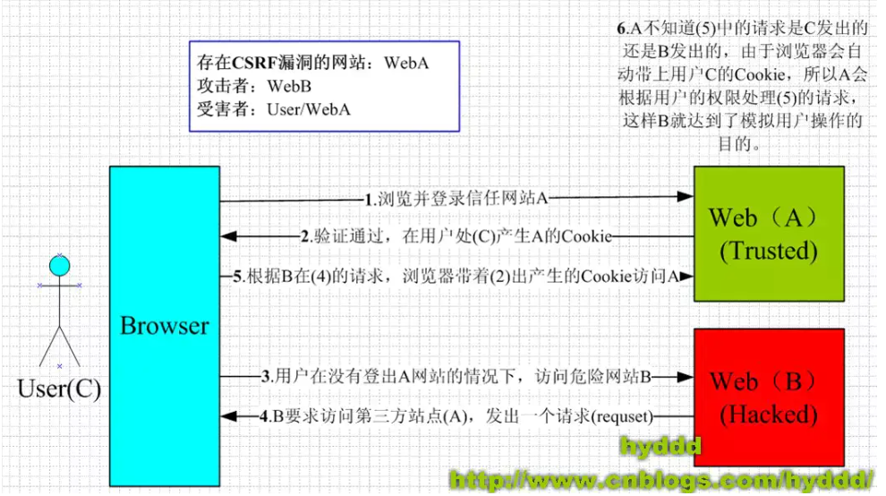
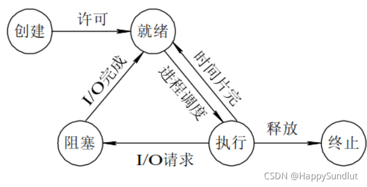

目录
- [1. 浏览器同源策略](#1-浏览器同源策略)
  - [1.1 什么是同源策略](#11-什么是同源策略)
  - [1.2 如何解决跨越问题](#12-如何解决跨越问题)
    - [CORS](#cors)
    - [JSONP](#jsonp)
    - [postMessage 跨域](#postmessage-跨域)
    - [nginx代理跨域](#nginx代理跨域)
    - [nodejs 中间件代理跨域](#nodejs-中间件代理跨域)
    - [document.domain + iframe跨域](#documentdomain--iframe跨域)
    - [location.hash + iframe跨域](#locationhash--iframe跨域)
    - [window.name + iframe跨域](#windowname--iframe跨域)
    - [WebSocket协议跨域](#websocket协议跨域)
  - [1.3 正向代理和反向代理的区别](#13-正向代理和反向代理的区别)
  - [1.4 Nginx的概念及其工作原理](#14-nginx的概念及其工作原理)
- [2. 浏览器安全](#2-浏览器安全)
  - [2.1 XSS攻击](#21-xss攻击)
    - [2.1.1 存储型 XSS](#211-存储型-xss)
    - [2.1.2 反射型 XSS](#212-反射型-xss)
    - [2.1.3 DOM 型 XSS](#213-dom-型-xss)
    - [2.1.4 常用防御](#214-常用防御)
      - [预防存储型和反射型 XSS 攻击](#预防存储型和反射型-xss-攻击)
      - [预防 DOM 型 XSS 攻击](#预防-dom-型-xss-攻击)
  - [2.2 CSRF 跨站点请求伪造](#22-csrf-跨站点请求伪造)
    - [2.2.1 GET类型的CSRF](#221-get类型的csrf)
    - [2.2.2 POST类型的CSRF](#222-post类型的csrf)
    - [2.2.3 链接类型的CSRF](#223-链接类型的csrf)
    - [2.2.4 CSRF特点](#224-csrf特点)
    - [2.2.5 CSRF 和 XSS 区别](#225-csrf-和-xss-区别)
    - [2.2.6 防御](#226-防御)
  - [2.3 什么是中间人攻击？如何防范中间人攻击？](#23-什么是中间人攻击如何防范中间人攻击)
  - [2.4 有哪些可能引起前端安全的问题?](#24-有哪些可能引起前端安全的问题)
  - [2.5 网络劫持有哪几种，如何防范？](#25-网络劫持有哪几种如何防范)
- [3. 进程与线程](#3-进程与线程)
  - [3.1 进程与线程的概念](#31-进程与线程的概念)
  - [3.2 进程和线程的区别](#32-进程和线程的区别)
  - [3.3 浏览器渲染进程的线程有哪些](#33-浏览器渲染进程的线程有哪些)
  - [3.4 进程之前的通信方式](#34-进程之前的通信方式)
  - [3.5 线程同步的方式](#35-线程同步的方式)
  - [3.6 进程有哪几种状态](#36-进程有哪几种状态)
  - [3.7 僵尸进程和孤儿进程是什么？](#37-僵尸进程和孤儿进程是什么)
  - [3.8 死锁产生的原因？ 如果解决死锁的问题？](#38-死锁产生的原因-如果解决死锁的问题)
  - [3.9 如何实现浏览器内多个标签页之间的通信?](#39-如何实现浏览器内多个标签页之间的通信)
  - [3.10 对Service Worker的理解](#310-对service-worker的理解)
- [4. 浏览器缓存](#4-浏览器缓存)
  - [4.1 对浏览器的缓存机制的理解](#41-对浏览器的缓存机制的理解)
  - [4.2 协商缓存和强缓存的区别](#42-协商缓存和强缓存的区别)
    - [强缓存(本地缓存)](#强缓存本地缓存)
    - [协商缓存](#协商缓存)
  - [4.3 为什么需要浏览器缓存？](#43-为什么需要浏览器缓存)
  - [4.4 点击刷新按钮或者按 F5、按 Ctrl+F5 （强制刷新）、地址栏回车有什么区别？](#44-点击刷新按钮或者按-f5按-ctrlf5-强制刷新地址栏回车有什么区别)
  - [4.5 用户行为与缓存](#45-用户行为与缓存)
- [5. 浏览器渲染原理](#5-浏览器渲染原理)
  - [5.1 浏览器的渲染过程](#51-浏览器的渲染过程)
  - [5.2 浏览器渲染优化](#52-浏览器渲染优化)
    - [JavaScript](#javascript)
    - [针对CSS](#针对css)
    - [针对DOM树、CSSOM树：](#针对dom树cssom树)
    - [减少回流与重绘：](#减少回流与重绘)
  - [5.3 渲染过程中遇到 JS 文件如何处理？](#53-渲染过程中遇到-js-文件如何处理)
  - [5.4 什么是文档的预解析？](#54-什么是文档的预解析)
  - [5.5 CSS 如何阻塞文档解析？](#55-css-如何阻塞文档解析)
  - [5.6 如何优化关键渲染路径？](#56-如何优化关键渲染路径)
  - [5.7 什么情况会阻塞渲染？](#57-什么情况会阻塞渲染)
- [6. 浏览器事件机制](#6-浏览器事件机制)
  - [6.1 事件是什么？事件模型？](#61-事件是什么事件模型)
  - [6.2 如何阻止事件冒泡](#62-如何阻止事件冒泡)
  - [6.3 对事件委托的理解](#63-对事件委托的理解)
  - [6.4 事件委托的使用场景](#64-事件委托的使用场景)
  - [6.5 同步和异步的区别](#65-同步和异步的区别)
  - [6.6 对事件循环的理解](#66-对事件循环的理解)
  - [6.7 宏任务和微任务分别有哪些](#67-宏任务和微任务分别有哪些)
  - [6.8 什么是执行栈](#68-什么是执行栈)
  - [6.9 Node 中的 Event Loop 和浏览器中的有什么区别？process.nextTick 执行顺序？](#69-node-中的-event-loop-和浏览器中的有什么区别processnexttick-执行顺序)
  - [6.10 事件触发的过程是怎样的](#610-事件触发的过程是怎样的)
- [7. 浏览器垃圾回收机制](#7-浏览器垃圾回收机制)
  - [7.1 V8的垃圾回收机制是怎样的](#71-v8的垃圾回收机制是怎样的)
  - [7.2 哪些操作会造成内存泄漏？](#72-哪些操作会造成内存泄漏)

## 1. 浏览器同源策略

### 1.1 什么是同源策略
跨域问题其实就是浏览器的同源策略造成的。
同源策略限制了从同一个源加载的文档或脚本如何与另一个源的资源进行交互。这是浏览器的一个用于隔离潜在恶意文件的重要的安全机制。同源指的是：协议、端口号、域名必须一致。

下表给出了与 URL http://store.company.com/dir/page.html 的源进行对比的示例:
|URL | 是否跨域 | 原因|
|--- | -------- |----|
|http://store.company.com/dir/page.html | 同源 | 完全相同
|http://store.company.com/dir/inner/another.html | 同源 | 只有路径不同
|https://store.company.com/secure.html | 跨域 | 协议不同
|http://store.company.com:81/dir/etc.html | 跨域 | 端口不同 默认80
|http://news.company.com/dir/other.html | 跨域 | 主机不同

**同源策略：protocol（协议）、domain（域名）、port（端口）三者必须一致。**

同源政策主要限制了三个方面：
- 当前域下的 js 脚本不能够访问其他域下的 cookie、localStorage 和 indexDB。
- 当前域下的 js 脚本不能够操作访问操作其他域下的 DOM。
- 当前域下 ajax 无法发送跨域请求。
  
同源政策的目的主要是为了保证用户的信息安全，它只是对 js 脚本的一种限制，并不是对浏览器的限制，对于一般的 img、或者script 脚本请求都不会有跨域的限制，这是因为这些操作都不会通过响应结果来进行可能出现安全问题的操作。

### 1.2 如何解决跨越问题

#### CORS
下面是MDN对于CORS的定义：

>跨域资源共享(CORS) 是一种机制，它使用额外的 HTTP 头来告诉浏览器  让运行在一个 origin (domain)上的Web应用被准许访问来自不同源服务器上的指定的资源。当一个资源从与该资源本身所在的服务器不同的域、协议或端口请求一个资源时，资源会发起一个跨域HTTP 请求。3

CORS需要浏览器和服务器同时支持，整个CORS过程都是浏览器完成的，无需用户参与。**因此实现CORS的关键就是服务器，只要服务器实现了CORS请求，就可以跨源通信了。**

浏览器将CORS分为简单请求和非简单请求：

简单请求不会触发CORS预检请求。若该请求满足以下两个条件，就可以看作是简单请求：
1）请求方法是以下三种方法之一：
- HEAD
- GET
- POST
  
2）HTTP的头信息不超出以下几种字段：
- Accept
- Accept-Language
- Content-Language
- Last-Event-ID
- Content-Type：只限于三个值application/x-www-form-urlencoded、multipart/form-data、text/plain

（1）简单请求过程：

对于简单请求，浏览器会直接发出CORS请求，它会在请求的头信息中增加一个Orign字段，该字段用来说明本次请求来自哪个源（协议+端口+域名），服务器会根据这个值来决定是否同意这次请求。如果Orign指定的域名在许可范围之内，服务器返回的响应就会多出以下信息头：
```
Access-Control-Allow-Origin: http://api.bob.com  // 和Orign一直
Access-Control-Allow-Credentials: true   // 表示是否允许发送Cookie
Access-Control-Expose-Headers: FooBar   // 指定返回其他字段的值
Content-Type: text/html; charset=utf-8   // 表示文档类型
```

如果Orign指定的域名不在许可范围之内，服务器会返回一个正常的HTTP回应，浏览器发现没有上面的Access-Control-Allow-Origin头部信息，就知道出错了。这个错误无法通过状态码识别，因为返回的状态码可能是200。

**在简单请求中，在服务器内，至少需要设置字段：`Access-Control-Allow-Origin`**

（2）非简单请求过程

非简单请求是对服务器有特殊要求的请求，比如请求方法为DELETE或者PUT等。非简单请求的CORS请求会在正式通信之前进行一次HTTP查询请求，**称为预检请求**。

浏览器会询问服务器，当前所在的网页是否在服务器允许访问的范围内，以及可以使用哪些HTTP请求方式和头信息字段，只有得到肯定的回复，才会进行正式的HTTP请求，否则就会报错。

预检请求使用的请求方法是OPTIONS，表示这个请求是来询问的。他的头信息中的关键字段是Orign，表示请求来自哪个源。除此之外，头信息中还包括两个字段：
- Access-Control-Request-Method：该字段是必须的，用来列出浏览器的CORS请求会用到哪些HTTP方法。
- Access-Control-Request-Headers： 该字段是一个逗号分隔的字符串，指定浏览器CORS请求会额外发送的头信息字段。

服务器在收到浏览器的预检请求之后，会根据头信息的三个字段来进行判断，如果返回的头信息在中有Access-Control-Allow-Origin这个字段就是允许跨域请求，如果没有，就是不同意这个预检请求，就会报错。

服务器回应的CORS的字段如下：
```
Access-Control-Allow-Origin: http://api.bob.com  // 允许跨域的源地址
Access-Control-Allow-Methods: GET, POST, PUT // 服务器支持的所有跨域请求的方法
Access-Control-Allow-Headers: X-Custom-Header  // 服务器支持的所有头信息字段
Access-Control-Allow-Credentials: true   // 表示是否允许发送Cookie
Access-Control-Max-Age: 1728000  // 用来指定本次预检请求的有效期，单位为秒
```

只要服务器通过了预检请求，在以后每次的CORS请求都会自带一个Origin头信息字段。服务器的回应，也都会有一个Access-Control-Allow-Origin头信息字段。


在非简单请求中，至少需要设置以下字段：
```
'Access-Control-Allow-Origin'  
'Access-Control-Allow-Methods'
'Access-Control-Allow-Headers'
```

**减少OPTIONS请求次数：**
OPTIONS请求次数过多就会损耗页面加载的性能，降低用户体验度。所以尽量要减少OPTIONS请求次数，可以后端在请求的返回头部添加：Access-Control-Max-Age：number。它表示预检请求的返回结果可以被缓存多久，单位是秒。该字段只对完全一样的URL的缓存设置生效，所以设置了缓存时间，在这个时间范围内，再次发送请求就不需要进行预检请求了。

**CORS中Cookie相关问题**：
在CORS请求中，如果想要传递Cookie，就要满足以下三个条件：
- 在请求中设置 `withCredentials`
- Access-Control-Allow-Credentials 设置为 true
- Access-Control-Allow-Origin 设置为非 `*`

#### JSONP

jsonp的原理就是利用`<script>`标签没有跨域限制，通过`<script>`标签src属性，发送带有callback参数的GET请求，服务端将接口返回数据拼凑到callback函数中，返回给浏览器，浏览器解析执行，从而前端拿到callback函数返回的数据。

1）原生JS实现：
```
<script>
    var script = document.createElement('script');
    script.type = 'text/javascript';
    // 传参一个回调函数名给后端，方便后端返回时执行这个在前端定义的回调函数
    script.src = 'http://www.domain2.com:8080/login?user=admin&callback=handleCallback';
    document.head.appendChild(script);
    // 回调执行函数
    function handleCallback(res) {
        alert(JSON.stringify(res));
    }
 </script>
```

服务端返回如下（返回时即执行全局函数）：
```
handleCallback({"success": true, "user": "admin"})
```

2）Vue axios实现：
```
this.$http = axios;
this.$http.jsonp('http://www.domain2.com:8080/login', {
    params: {},
    jsonp: 'handleCallback'
}).then((res) => {
    console.log(res); 
})
```

后端node.js代码：
```
var querystring = require('querystring');
var http = require('http');
var server = http.createServer();
server.on('request', function(req, res) {
    var params = querystring.parse(req.url.split('?')[1]);
    var fn = params.callback;
    // jsonp返回设置
    res.writeHead(200, { 'Content-Type': 'text/javascript' });
    res.write(fn + '(' + JSON.stringify(params) + ')');
    res.end();
});
server.listen('8080');
console.log('Server is running at port 8080...');
```
JSONP的缺点：
- 具有局限性， 仅支持get方法
- 不安全，可能会遭受XSS攻击
  

#### postMessage 跨域
postMessage是HTML5 XMLHttpRequest Level 2中的API，且是为数不多可以跨域操作的window属性之一，它可用于解决以下方面的问题：
- 页面和其打开的新窗口的数据传递
- 多窗口之间消息传递
- 页面与嵌套的iframe消息传递
- 上面三个场景的跨域数据传递
  
用法：postMessage(data,origin)方法接受两个参数：
- data： html5规范支持任意基本类型或可复制的对象，但部分浏览器只支持字符串，所以传参时最好用JSON.stringify()序列化。
- origin： 协议+主机+端口号，也可以设置为"*"，表示可以传递给任意窗口，如果要指定和当前窗口同源的话设置为"/"。

#### nginx代理跨域
nginx代理跨域，实质和CORS跨域原理一样，通过配置文件设置请求响应头Access-Control-Allow-Origin…等字段。

1）nginx配置解决iconfont跨域

浏览器跨域访问js、css、img等常规静态资源被同源策略许可，但iconfont字体文件(eot|otf|ttf|woff|svg)例外，此时可在nginx的静态资源服务器中加入以下配置。

2）nginx反向代理接口跨域

跨域问题：同源策略仅是针对浏览器的安全策略。服务器端调用HTTP接口只是使用HTTP协议，不需要同源策略，也就不存在跨域问题。

实现思路：通过Nginx配置一个代理服务器域名与domain1相同，端口不同）做跳板机，反向代理访问domain2接口，并且可以顺便修改cookie中domain信息，方便当前域cookie写入，实现跨域访问。

nginx具体配置：
```
#proxy服务器
server {
    listen       81;
    server_name  www.domain1.com;
    location / {
        proxy_pass   http://www.domain2.com:8080;  #反向代理
        proxy_cookie_domain www.domain2.com www.domain1.com; #修改cookie里域名
        index  index.html index.htm;
        # 当用webpack-dev-server等中间件代理接口访问nignx时，此时无浏览器参与，故没有同源限制，下面的跨域配置可不启用
        add_header Access-Control-Allow-Origin http://www.domain1.com;  #当前端只跨域不带cookie时，可为*
        add_header Access-Control-Allow-Credentials true;
    }
}
```

#### nodejs 中间件代理跨域
node中间件实现跨域代理，原理大致与nginx相同，都是通过启一个代理服务器，实现数据的转发，也可以通过设置cookieDomainRewrite参数修改响应头中cookie中域名，实现当前域的cookie写入，方便接口登录认证。

1）非vue框架的跨域
使用node + express + http-proxy-middleware搭建一个proxy服务器。

2）vue框架的跨域
node + vue + webpack + webpack-dev-server搭建的项目，跨域请求接口，直接修改webpack.config.js配置。开发环境下，vue渲染服务和接口代理服务都是webpack-dev-server同一个，所以页面与代理接口之间不再跨域。


#### document.domain + iframe跨域
此方案仅限主域相同，子域不同的跨域应用场景。实现原理：两个页面都通过js强制设置document.domain为基础主域，就实现了同域。

1）父窗口：(domain.com/a.html)
```
<iframe id="iframe" src="http://child.domain.com/b.html"></iframe>
<script>
    document.domain = 'domain.com';
    var user = 'admin';
</script>
```

1）子窗口：(child.domain.com/a.html)
```
<script>
    document.domain = 'domain.com';
    // 获取父窗口中变量
    console.log('get js data from parent ---> ' + window.parent.user);
</script>
```

#### location.hash + iframe跨域
实现原理：a域与b跨域相互通信，通过中间页c来实现。 三个页面，不同域之间利用iframe的location.hash传值，相同域之间直接js访问来通信。

具体实现：A域：a.html -> B域：b.html -> A域：c.html，a与b不同域只能通过hash值单向通信，b与c也不同域也只能单向通信，但c与a同域，所以c可通过parent.parent访问a页面所有对象。


#### window.name + iframe跨域
window.name属性的独特之处：name值在不同的页面（甚至不同域名）加载后依旧存在，并且可以支持非常长的 name 值（2MB）。

1）a.html：(domain1.com/a.html)
2）proxy.html：(domain1.com/proxy.html)
中间代理页，与a.html同域，内容为空即可。
3）b.html：(domain2.com/b.html)
通过iframe的src属性由外域转向本地域，跨域数据即由iframe的window.name从外域传递到本地域。这个就巧妙地绕过了浏览器的跨域访问限制，但同时它又是安全操作。

#### WebSocket协议跨域
WebSocket protocol是HTML5一种新的协议。它实现了浏览器与服务器全双工通信，同时允许跨域通讯，是server push技术的一种很好的实现。
把 Websocket 放在这里其实算是作弊了。因为我们所说的跨域是指，浏览器和服务端基于 HTTP 协议进行通信时出现同源限制了。而 Websocket 根本就不是基于 HTTP 协议的，它是位于 TCP/IP 上层，跟 HTTP 协议同层的浏览器通信协议。

它大概是上面这个样子的，Webscoket 与 HTTP 是同层协议，所以 HTTP 的限制对于 Webscoket 来说，人家根本不鸟你，同级关系，你凭啥管我～但是呢，还有个小箭头，是指 WebSocket 在建立握手连接时（TCP三次握手），数据是通过 HTTP 协议传输的，但是在建立连接之后，真正的数据传输阶段是不需要 HTTP 协议参与的。

Websocket 的重要之处其实并不在于解决跨域，事实上应该也没人用它解决跨域。它的重要之处在于，它提供了客户端主动与服务端主动推送消息的能力。如果是使用 HTTP，我们一般都只是，客户端发起一个请求，服务端响应这个请求，没办法做到彼此主动推送消息，因此，如果不使用 Websocket 的时候，一般都是通过一个 AJAX 长轮训，设置定时器不断的去发送请求更新数据，这样做其实浪费性能并且也不是很优雅。所以 Websocket 概括起来的优点就是：

- 没有同源限制，不跨域
- 全双工通信，双端都能主动推送消息
- 实时性更好，灵活性更高

Websocket 的适用场景也就是那些实时性很高的应用，比如通讯类，股票基金类，基于位类等应用。


### 1.3 正向代理和反向代理的区别

正向代理：
客户端想获得一个服务器的数据，但是因为种种原因无法直接获取。于是客户端设置了一个代理服务器，并且指定目标服务器，之后代理服务器向目标服务器转交请求并将获得的内容发送给客户端。这样本质上起到了对真实服务器隐藏真实客户端的目的。实现正向代理需要修改客户端，比如修改浏览器配置。

反向代理：
服务器为了能够将工作负载分不到多个服务器来提高网站性能 (负载均衡)等目的，当其受到请求后，会首先根据转发规则来确定请求应该被转发到哪个服务器上，然后将请求转发到对应的真实服务器上。这样本质上起到了对客户端隐藏真实服务器的作用。

一般使用反向代理后，需要通过修改 DNS 让域名解析到代理服务器 IP，这时浏览器无法察觉到真正服务器的存在，当然也就不需要修改配置了。


正向代理和反向代理的结构是一样的，都是 client-proxy-server 的结构，它们主要的区别就在于中间这个 proxy 是哪一方设置的。在正向代理中，proxy 是 client 设置的，用来隐藏 client；而在反向代理中，proxy 是 server 设置的，用来隐藏 server。

### 1.4 Nginx的概念及其工作原理

Nginx 是一款轻量级的 Web 服务器，也可以用于反向代理、负载平衡和 HTTP 缓存等。Nginx 使用异步事件驱动的方法来处理请求，是一款面向性能设计的 HTTP 服务器。

传统的 Web 服务器如 Apache 是 process-based 模型的，而 Nginx 是基于event-driven模型的。正是这个主要的区别带给了 Nginx 在性能上的优势。

Nginx 架构的最顶层是一个 master process，这个 master process 用于产生其他的 worker process，这一点和Apache 非常像，但是 Nginx 的 worker process 可以同时处理大量的HTTP请求，而每个 Apache process 只能处理一个。


## 2. 浏览器安全

### 2.1 XSS攻击
Cross-Site Scripting（跨站脚本攻击）简称 XSS，是一种代码注入攻击。攻击者通过在目标网站上注入恶意脚本，使之在用户的浏览器上运行。利用这些恶意脚本，攻击者可获取用户的敏感信息如 Cookie、SessionID 等，进而危害数据安全。

所以,网页上哪些部分会引起XSS攻击?简单来说,任何可以输入的地方都有可能引起,包括URL!

XSS 常见的注入方法：

- 在 HTML 中内嵌的文本中，恶意内容以 script 标签形成注入。
- 在内联的 JavaScript 中，拼接的数据突破了原本的限制（字符串，变量，方法名等）。
- 在标签属性中，恶意内容包含引号，从而突破属性值的限制，注入其他属性或者标签。
- 在标签的 href、src 等属性中，包含 javascript: (伪协议)等可执行代码。
- 在 onload、onerror、onclick 等事件中，注入不受控制代码。
- 在 style 属性和标签中，包含类似 background-image:url("javascript:..."); 的代码（新版本浏览器已经可以防范）。
- 在 style 属性和标签中，包含类似 expression(...) 的 CSS 表达式代码（新版本浏览器已经可以防范）。

#### 2.1.1 存储型 XSS

存储型 XSS 的攻击步骤：

- 攻击者将恶意代码提交到目标网站的数据库中。
- 用户打开目标网站时，网站服务端将恶意代码从数据库取出，拼接在 HTML 中返回给浏览器。
- 用户浏览器接收到响应后解析执行，混在其中的恶意代码也被执行。
- 恶意代码窃取用户数据并发送到攻击者的网站，或者冒充用户的行为，调用目标网站接口执行攻击者指定的操作。

存储型 XSS(又被称为持久性XSS)攻击常见于带有用户保存数据的网站功能，如论坛发帖、商品评论、用户私信等。

它是最危险的一种跨站脚本，相比反射型XSS和DOM型XSS具有更高的隐蔽性，所以危害更大，因为它不需要用户手动触发。

任何允许用户存储数据的web程序都可能存在存储型XSS漏洞，当攻击者提交一段XSS代码后，被服务器端接收并存储，当所有浏览者访问某个页面时都会被XSS。

#### 2.1.2 反射型 XSS

反射型 XSS 的攻击步骤：

- 攻击者构造出特殊的 URL，其中包含恶意代码。
- 用户打开带有恶意代码的 URL 时，网站服务端将恶意代码从 URL 中取出，拼接在 HTML 中返回给浏览器。
- 用户浏览器接收到响应后解析执行，混在其中的恶意代码也被执行。
- 恶意代码窃取用户数据并发送到攻击者的网站，或者冒充用户的行为，调用目标网站接口执行攻击者指定的操作。

反射型 XSS 跟存储型 XSS 的区别是：存储型 XSS 的恶意代码存在数据库里，反射型 XSS 的恶意代码存在 URL 里。

反射型 XSS (也被称为非持久性XSS)漏洞常见于通过 URL 传递参数的功能，如网站搜索、跳转等。

由于需要用户主动打开恶意的 URL 才能生效，攻击者往往会结合多种手段诱导用户点击。

POST 的内容也可以触发反射型 XSS，只不过其触发条件比较苛刻（需要构造表单提交页面，并引导用户点击），所以非常少见。

#### 2.1.3 DOM 型 XSS

DOM 型 XSS 的攻击步骤：

- 攻击者构造出特殊的 URL，其中包含恶意代码。
- 用户打开带有恶意代码的 URL。
- 用户浏览器接收到响应后解析执行，前端 JavaScript 取出 URL 中的恶意代码并执行。
- 恶意代码窃取用户数据并发送到攻击者的网站，或者冒充用户的行为，调用目标网站接口执行攻击者指定的操作。

DOM 型 XSS 跟前两种 XSS 的区别：DOM 型 XSS 攻击中，取出和执行恶意代码由浏览器端完成，属于前端 JavaScript 自身的安全漏洞，而其他两种 XSS 都属于服务端的安全漏洞。

注意:
DOM通常代表在html、xhtml和xml中的对象，使用DOM可以允许程序和脚本动态的访问和更新文档的内容、结构和样式。它不需要服务器解析响应的直接参与，触发XSS靠的是浏览器端的DOM解析，所以防范DOM型XSS完全就是前端的责任,必须注意!!!。

#### 2.1.4 常用防御

常用防范方法

- httpOnly: 在 cookie 中设置 HttpOnly 属性后，js脚本将无法读取到 cookie 信息。

- 输入过滤: 一般是用于对于输入格式的检查，例如：邮箱，电话号码，用户名，密码……等，按照规定的格式输入。不仅仅是前端负责，后端也要做相同的过滤检查。因为攻击者完全可以绕过正常的输入流程，直接利用相关接口向服务器发送设置。

- 转义 HTML: 如果拼接 HTML 是必要的，就需要对于引号，尖括号，斜杠进行转义,但这还不是很完善.想对 HTML 模板各处插入点进行充分的转义,就需要采用合适的转义库。

- 白名单: 对于显示富文本来说，不能通过上面的办法来转义所有字符，因为这样会把需要的格式也过滤掉。这种情况通常采用白名单过滤的办法，当然也可以通过黑名单过滤，但是考虑到需要过滤的标签和标签属性实在太多，更加推荐使用白名单的方式。


##### 预防存储型和反射型 XSS 攻击

存储型和反射型 XSS 都是在服务端取出恶意代码后，插入到响应 HTML 里的，攻击者刻意编写的“数据”被内嵌到“代码”中，被浏览器所执行。

预防这两种漏洞，有两种常见做法：

- 改成纯前端渲染，把代码和数据分隔开。
- 对 HTML 做充分转义。

> 纯前端渲染过程
> 
>浏览器先加载一个静态 HTML，此 HTML 中不包含任何跟业务相关的数据。
>然后浏览器执行 HTML 中的 JavaScript。
>JavaScript 通过 Ajax 加载业务数据，调用 DOM API 更新到页面上。
>
##### 预防 DOM 型 XSS 攻击

DOM 型 XSS 攻击，实际上就是网站前端 JavaScript代码本身不够严谨，把不可信的数据当作代码执行了。

在使用 .innerHTML、.outerHTML、document.write() 时要特别小心，不要把不可信的数据作为 HTML 插到页面上，而应尽量使用 .textContent、.setAttribute() 等。

如果用 Vue/React 技术栈，并且不使用 v-html/dangerouslySetInnerHTML 功能，就在前端 render 阶段避免 innerHTML、outerHTML 的 XSS 隐患。

DOM 中的内联事件监听器，如 location、onclick、onerror、onload、onmouseover 等，`<a>` 标签的 href 属性，JavaScript 的 eval()、setTimeout()、setInterval() 等，都能把字符串作为代码运行。如果不可信的数据拼接到字符串中传递给这些 API，很容易产生安全隐患，请务必避免。

### 2.2 CSRF 跨站点请求伪造

跨站请求伪造（英语：Cross-site request forgery），也被称为 one-click attack 或者 session riding，通常缩写为 CSRF 或者 XSRF。

是一种挟制用户在当前已登录的 Web 应用程序上执行非本意的操作的攻击方法。如:攻击者诱导受害者进入第三方网站，在第三方网站中，向被攻击网站发送跨站请求。利用受害者在被攻击网站已经获取的注册凭证，绕过后台的用户验证，达到冒充用户对被攻击的网站执行某项操作的目的。



#### 2.2.1 GET类型的CSRF

GET类型的CSRF利用非常简单，只需要一个HTTP请求，一般会这样利用：
```
 
```

在受害者访问含有这个img的页面后，浏览器会自动向http://bank.example/withdraw?account=xiaoming&amount=10000&for=hacker发出一次HTTP请求。bank.example就会收到包含受害者登录信息的一次跨域请求。

#### 2.2.2 POST类型的CSRF

利用起来通常使用的是一个自动提交的表单，如：
```
 <form action="http://bank.example/withdraw" method=POST>
    <input type="hidden" name="account" value="xiaoming" />
    <input type="hidden" name="amount" value="10000" />
    <input type="hidden" name="for" value="hacker" />
</form>
<script> document.forms[0].submit(); </script> 
```

访问该页面后，表单会自动提交，相当于模拟用户完成了一次POST操作。

POST类型的攻击通常比GET要求更加严格一点，但仍并不复杂。任何个人网站、博客，被黑客上传页面的网站都有可能是发起攻击的来源，后端接口不能将安全寄托在仅允许POST上面。

#### 2.2.3 链接类型的CSRF
链接类型的CSRF并不常见，比起其他两种用户打开页面就中招的情况，这种需要用户点击链接才会触发。这种类型通常是在论坛中发布的图片中嵌入恶意链接，或者以广告的形式诱导用户中招，攻击者通常会以比较夸张的词语诱骗用户点击，例如：
```
<a href="http://test.com/csrf/withdraw.php?amount=1000&for=hacker" taget="_blank">
重磅消息！！
<a/>
```

#### 2.2.4 CSRF特点
CSRF的特点

- 攻击一般发起在第三方网站，而不是被攻击的网站。被攻击的网站无法防止攻击发生。
- 攻击利用受害者在被攻击网站的登录凭证，冒充受害者提交操作；而不是直接窃取数据。
- 整个过程攻击者并不能获取到受害者的登录凭证，仅仅是“冒用”。
- 跨站请求可以用各种方式：图片URL、超链接、CORS、Form提交等等。部分请求方式可以直接嵌入在第三方论坛、文章中，难以进行追踪。

CSRF通常是跨域的，因为外域通常更容易被攻击者掌控。但是如果本域下有容易被利用的功能，**比如可以发图和链接的论坛和评论区，攻击可以直接在本域下进行，而且这种攻击更加危险。**

#### 2.2.5 CSRF 和 XSS 区别

- 通常来说 CSRF 是由 XSS 实现的，CSRF 时常也被称为 XSRF（CSRF 实现的方式还可以是直接通过命令行发起请求等）。
  
- 本质上讲，XSS 是代码注入问题，CSRF 是 HTTP 问题。 XSS 是内容没有过滤导致浏览器将攻击者的输入当代码执行。CSRF 则是因为浏览器在发送 HTTP 请求时候自动带上 cookie，而一般网站的 session 都存在 cookie里面(Token验证可以避免)。

#### 2.2.6 防御

- 验证码；强制用户必须与应用进行交互，才能完成最终请求。此种方式能很好的遏制 csrf，但是用户体验比较差。
- Referer check；请求来源限制，此种方法成本最低，但是并不能保证 100% 有效，因为服务器并不是什么时候都能取到 Referer，而且低版本的浏览器存在伪造 Referer 的风险。
- token；token 验证的 CSRF 防御机制是公认最合适的方案。(具体可以查看本系列前端鉴权中对token有详细描述)若网站同时存在 XSS 漏洞的时候，这个方法也是空谈。

### 2.3 什么是中间人攻击？如何防范中间人攻击？

中间⼈ (Man-in-the-middle attack, MITM) 是指攻击者与通讯的两端分别创建独⽴的联系, 并交换其所收到的数据, 使通讯的两端认为他们正在通过⼀个私密的连接与对⽅直接对话, 但事实上整个会话都被攻击者完全控制。在中间⼈攻击中，攻击者可以拦截通讯双⽅的通话并插⼊新的内容。

- 客户端发送请求到服务端，请求被中间⼈截获 
- 服务器向客户端发送公钥 
- 中间⼈截获公钥，保留在⾃⼰⼿上。然后⾃⼰⽣成⼀个伪造的公钥，发给客户端 
- 客户端收到伪造的公钥后，⽣成加密hash值发给服务器 
- 中间⼈获得加密hash值，⽤⾃⼰的私钥解密获得真秘钥,同时⽣成假的加密hash值，发给服务器 
- 服务器⽤私钥解密获得假密钥,然后加密数据传输给客户端 


### 2.4 有哪些可能引起前端安全的问题? 

- 跨站脚本 (Cross-Site Scripting, XSS): ⼀种代码注⼊⽅式, 为了与 CSS 区分所以被称作 XSS。早期常⻅于⽹络论坛, 起因是⽹站没有对⽤户的输⼊进⾏严格的限制, 使得攻击者可以将脚本上传到帖⼦让其他⼈浏览到有恶意脚本的⻚⾯, 其注⼊⽅式很简单包括但不限于 JavaScript / CSS / Flash 等； 
- iframe的滥⽤: iframe中的内容是由第三⽅来提供的，默认情况下他们不受控制，他们可以在iframe中运⾏JavaScirpt脚本、Flash插件、弹出对话框等等，这可能会破坏前端⽤户体验；
- 跨站点请求伪造（Cross-Site Request Forgeries，CSRF）: 指攻击者通过设置好的陷阱，强制对已完成认证的⽤户进⾏⾮预期的个⼈信息或设定信息等某些状态更新，属于被动攻击 
- 恶意第三⽅库: ⽆论是后端服务器应⽤还是前端应⽤开发，绝⼤多数时候都是在借助开发框架和各种类库进⾏快速开发，⼀旦第三⽅库被植⼊恶意代码很容易引起安全问题。

### 2.5 网络劫持有哪几种，如何防范？

⽹络劫持分为两种: 
（1）DNS劫持: (输⼊京东被强制跳转到淘宝这就属于dns劫持) 
- DNS强制解析: 通过修改运营商的本地DNS记录，来引导⽤户流量到缓存服务器
- 302跳转的⽅式: 通过监控⽹络出⼝的流量，分析判断哪些内容是可以进⾏劫持处理的,再对劫持的内存发起302跳转的回复，引导⽤户获取内容 
（2）HTTP劫持: (访问⾕歌但是⼀直有贪玩蓝⽉的⼴告),由于http明⽂传输,运营商会修改你的http响应内容(即加⼴告) 

DNS劫持由于涉嫌违法，已经被监管起来，现在很少会有DNS劫持，⽽http劫持依然⾮常盛⾏，最有效的办法就是全站HTTPS，将HTTP加密，这使得运营商⽆法获取明⽂，就⽆法劫持你的响应内容。 

## 3. 进程与线程

### 3.1 进程与线程的概念
从本质上说，进程和线程都是 CPU 工作时间片的一个描述：
- 进程描述了 CPU 在运行指令及加载和保存上下文所需的时间，放在应用上来说就代表了一个程序。
- 线程是进程中的更小单位，描述了执行一段指令所需的时间。

**进程是资源分配的最小单位，线程是CPU调度的最小单位。**

一个进程就是一个程序的运行实例。详细解释就是，启动一个程序的时候，操作系统会为该程序创建一块内存，用来存放代码、运行中的数据和一个执行任务的主线程，我们把这样的一个运行环境叫进程。进程是运行在虚拟内存上的，虚拟内存是用来解决用户对硬件资源的无限需求和有限的硬件资源之间的矛盾的。从操作系统角度来看，虚拟内存即交换文件；从处理器角度看，虚拟内存即虚拟地址空间。

如果程序很多时，内存可能会不够，操作系统为每个进程提供一套独立的虚拟地址空间，从而使得同一块物理内存在不同的进程中可以对应到不同或相同的虚拟地址，变相的增加了程序可以使用的内存。

进程和线程之间的关系有以下四个特点：
（1）**进程中的任意一线程执行出错，都会导致整个进程的崩溃。**
（2）线程之间共享进程中的数据。
（3）当一个进程关闭之后，操作系统会回收进程所占用的内存，当一个进程退出时，操作系统会回收该进程所申请的所有资源；即使其中任意线程因为操作不当导致内存泄漏，当进程退出时，这些内存也会被正确回收。
（4）进程之间的内容相互隔离。进程隔离就是为了使操作系统中的进程互不干扰，每一个进程只能访问自己占有的数据，也就避免出现进程 A 写入数据到进程 B 的情况。正是因为进程之间的数据是严格隔离的，所以一个进程如果崩溃了，或者挂起了，是不会影响到其他进程的。如果进程之间需要进行数据的通信，这时候，就需要使用用于进程间通信的机制了。

Chrome浏览器的架构图：
(图像)

从图中可以看出，最新的 Chrome 浏览器包括：
- 1 个浏览器主进程
- 1 个 GPU 进程
- 1 个网络进程
- 多个渲染进程
- 多个插件进程

这些进程的功能：

- 浏览器进程：主要负责界面显示、用户交互、子进程管理，同时提供存储等功能。
- 渲染进程：核心任务是将 HTML、CSS 和 JavaScript 转换为用户可以与之交互的网页，排版引擎 Blink 和 JavaScript 引擎 V8 都是运行在该进程中，默认情况下，Chrome 会为每个 Tab 标签创建一个渲染进程。出于安全考虑，渲染进程都是运行在沙箱模式下。
- GPU 进程：其实， GPU 的使用初衷是为了实现 3D CSS 的效果，只是随后网页、Chrome 的 UI 界面都选择采用 GPU 来绘制，这使得 GPU 成为浏览器普遍的需求。最后，Chrome 在其多进程架构上也引入了 GPU 进程。
- 网络进程：主要负责页面的网络资源加载，之前是作为一个模块运行在浏览器进程里面的，直至最近才独立出来，成为一个单独的进程。
- 插件进程：主要是负责插件的运行，因插件易崩溃，所以需要通过插件进程来隔离，以保证插件进程崩溃不会对浏览器和页面造成影响。


所以，打开一个网页，最少需要四个进程：1 个网络进程、1 个浏览器进程、1 个 GPU 进程以及 1 个渲染进程。如果打开的页面有运行插件的话，还需要再加上 1 个插件进程。

虽然多进程模型提升了浏览器的稳定性、流畅性和安全性，但同样不可避免地带来了一些问题：
- 更高的资源占用：因为每个进程都会包含公共基础结构的副本（如 JavaScript 运行环境），这就意味着浏览器会消耗更多的内存资源。
- 更复杂的体系架构：浏览器各模块之间耦合性高、扩展性差等问题，会导致现在的架构已经很难适应新的需求了。


### 3.2 进程和线程的区别

- 进程可以看做独立应用，线程不能
- 资源：进程是cpu资源分配的最小单位（是能拥有资源和独立运行的最小单位）；线程是cpu调度的最小单位（线程是建立在进程的基础上的一次程序运行单位，一个进程中可以有多个线程）。
- 通信方面：线程间可以通过直接共享同一进程中的资源，而进程通信需要借助 进程间通信。
- 调度：进程切换比线程切换的开销要大。线程是CPU调度的基本单位，线程的切换不会引起进程切换，但某个进程中的线程切换到另一个进程中的线程时，会引起进程切换。
- 系统开销：由于创建或撤销进程时，系统都要为之分配或回收资源，如内存、I/O 等，其开销远大于创建或撤销线程时的开销。同理，在进行进程切换时，涉及当前执行进程 CPU 环境还有各种各样状态的保存及新调度进程状态的设置，而线程切换时只需保存和设置少量寄存器内容，开销较小。

### 3.3 浏览器渲染进程的线程有哪些
浏览器的渲染进程的线程总共有五种：
(图像)

（1）GUI渲染线程

负责渲染浏览器页面，解析HTML、CSS，构建DOM树、构建CSSOM树、构建渲染树和绘制页面；当界面需要重绘或由于某种操作引发回流时，该线程就会执行。

注意：GUI渲染线程和JS引擎线程是互斥的，当JS引擎执行时GUI线程会被挂起，GUI更新会被保存在一个队列中等到JS引擎空闲时立即被执行。

（2）JS引擎线程

JS引擎线程也称为JS内核，负责处理Javascript脚本程序，解析Javascript脚本，运行代码；JS引擎线程一直等待着任务队列中任务的到来，然后加以处理，一个Tab页中无论什么时候都只有一个JS引擎线程在运行JS程序；

注意：GUI渲染线程与JS引擎线程的互斥关系，所以如果JS执行的时间过长，会造成页面的渲染不连贯，导致页面渲染加载阻塞。

（3）时间触发线程

时间触发线程属于浏览器而不是JS引擎，用来控制事件循环；当JS引擎执行代码块如setTimeOut时（也可是来自浏览器内核的其他线程,如鼠标点击、AJAX异步请求等），会将对应任务添加到事件触发线程中；当对应的事件符合触发条件被触发时，该线程会把事件添加到待处理队列的队尾，等待JS引擎的处理；

注意：由于JS的单线程关系，所以这些待处理队列中的事件都得排队等待JS引擎处理（当JS引擎空闲时才会去执行）；

（4）定时器触发进程

定时器触发进程即setInterval与setTimeout所在线程；浏览器定时计数器并不是由JS引擎计数的，因为JS引擎是单线程的，如果处于阻塞线程状态就会影响记计时的准确性；因此使用单独线程来计时并触发定时器，计时完毕后，添加到事件队列中，等待JS引擎空闲后执行，所以定时器中的任务在设定的时间点不一定能够准时执行，定时器只是在指定时间点将任务添加到事件队列中；

注意：W3C在HTML标准中规定，定时器的定时时间不能小于4ms，如果是小于4ms，则默认为4ms。

（5）异步http请求线程

- XMLHttpRequest连接后通过浏览器新开一个线程请求；
- 检测到状态变更时，如果设置有回调函数，异步线程就产生状态变更事件，将回调函数放入事件队列中，等待JS引擎空闲后执行；

### 3.4 进程之前的通信方式
（1）管道通信
管道是一种最基本的进程间通信机制。管道就是操作系统在内核中开辟的一段缓冲区，进程1可以将需要交互的数据拷贝到这段缓冲区，进程2就可以读取了。
管道的特点：
- 只能单向通信
- 只能血缘关系的进程进行通信
- 依赖于文件系统
- 生命周期随进程
- 面向字节流的服务
- 管道内部提供了同步机制

（2）消息队列通信

消息队列就是一个消息的列表。用户可以在消息队列中添加消息、读取消息等。消息队列提供了一种从一个进程向另一个进程发送一个数据块的方法。 每个数据块都被认为含有一个类型，接收进程可以独立地接收含有不同类型的数据结构。可以通过发送消息来避免命名管道的同步和阻塞问题。但是消息队列与命名管道一样，每个数据块都有一个最大长度的限制。

使用消息队列进行进程间通信，可能会收到数据块最大长度的限制约束等，这也是这种通信方式的缺点。如果频繁的发生进程间的通信行为，那么进程需要频繁地读取队列中的数据到内存，相当于间接地从一个进程拷贝到另一个进程，这需要花费时间。

（3）信号量通信

共享内存最大的问题就是多进程竞争内存的问题，就像类似于线程安全问题。我们可以使用信号量来解决这个问题。信号量的本质就是一个计数器，用来实现进程之间的互斥与同步。例如信号量的初始值是 1，然后 a 进程来访问内存1的时候，我们就把信号量的值设为 0，然后进程b 也要来访问内存1的时候，看到信号量的值为 0 就知道已经有进程在访问内存1了，这个时候进程 b 就会访问不了内存1。所以说，信号量也是进程之间的一种通信方式。

（4）信号通信

信号（Signals ）是Unix系统中使用的最古老的进程间通信的方法之一。操作系统通过信号来通知进程系统中发生了某种预先规定好的事件（一组事件中的一个），它也是用户进程之间通信和同步的一种原始机制。

（5）共享内存通信

共享内存就是映射一段能被其他进程所访问的内存，这段共享内存由一个进程创建，但多个进程都可以访问（使多个进程可以访问同一块内存空间）。共享内存是最快的 IPC 方式，它是针对其他进程间通信方式运行效率低而专门设计的。它往往与其他通信机制，如信号量，配合使用，来实现进程间的同步和通信。

（6）套接字通信

上面我们说的共享内存、管道、信号量、消息队列，他们都是多个进程在一台主机之间的通信，那两个相隔几千里的进程能够进行通信吗？答是必须的，这个时候 Socket 这家伙就派上用场了，例如我们平时通过浏览器发起一个 http 请求，然后服务器给你返回对应的数据，这种就是采用 Socket 的通信方式了。

### 3.5 线程同步的方式
- 互斥量：采用互斥对象机制，只有拥有互斥对象的线程才有访问公共资源的权限。因为互斥对象只有一个，所以可以保证公共资源不会被多个线程同时访问。
- 信号量：它允许同一时刻多个线程访问同一资源，但是需要控制同一时刻访问此资源的最大线程数量。
- 事件（信号）：通过通知操作的方式来保持多线程同步，还可以方便的实现多线程优先级的比较操作。

### 3.6 进程有哪几种状态
- 建状态(new) ：进程正在被创建，尚未到就绪状态。
- 就绪状态(ready) ：进程已处于准备运行状态，即进程获得了除了处理器之外的一切所需资源，一旦得到处理器资源(处理器分配的时间片)即可运行。
- 运行状态(running) ：进程正在处理器上上运行(单核 CPU 下任意时刻只有一个进程处于运行状态)。
- 阻塞状态(waiting) ：又称为等待状态，进程正在等待某一事件而暂停运行如等待某资源为可用或等待 IO 操作完成。即使处理器空闲，该进程也不能运行。
- 结束状态(terminated) ：进程正在从系统中消失。可能是进程正常结束或其他原因中断退出运行。



### 3.7 僵尸进程和孤儿进程是什么？
- 孤儿进程：父进程退出了，而它的一个或多个进程还在运行，那这些子进程都会成为孤儿进程。孤儿进程将被init进程(进程号为1)所收养，并由init进程对它们完成状态收集工作。
- 僵尸进程：子进程比父进程先结束，而父进程又没有释放子进程占用的资源，那么子进程的进程描述符仍然保存在系统中，这种进程称之为僵死进程。

### 3.8 死锁产生的原因？ 如果解决死锁的问题？
所谓死锁，是指多个进程在运行过程中因争夺资源而造成的一种僵局，当进程处于这种僵持状态时，若无外力作用，它们都将无法再向前推进。
系统中的资源可以分为两类：
- 可剥夺资源，是指某进程在获得这类资源后，该资源可以再被其他进程或系统剥夺，CPU和主存均属于可剥夺性资源；
- 不可剥夺资源，当系统把这类资源分配给某进程后，再不能强行收回，只能在进程用完后自行释放，如磁带机、打印机等。
  
产生死锁的原因：
（1）竞争资源

- 产生死锁中的竞争资源之一指的是竞争不可剥夺资源（例如：系统中只有一台打印机，可供进程P1使用，假定P1已占用了打印机，若P2继续要求打印机打印将阻塞）
- 产生死锁中的竞争资源另外一种资源指的是竞争临时资源（临时资源包括硬件中断、信号、消息、缓冲区内的消息等），通常消息通信顺序进行不当，则会产生死锁
（2）进程间推进顺序非法

若P1保持了资源R1，P2保持了资源R2，系统处于不安全状态，因为这两个进程再向前推进，便可能发生死锁。例如，当P1运行到P1：Request（R2）时，将因R2已被P2占用而阻塞；当P2运行到P2：Request（R1）时，也将因R1已被P1占用而阻塞，于是发生进程死锁
产生死锁的必要条件：
- 互斥条件：进程要求对所分配的资源进行排它性控制，即在一段时间内某资源仅为一进程所占用。
- 请求和保持条件：当进程因请求资源而阻塞时，对已获得的资源保持不放。
- 不剥夺条件：进程已获得的资源在未使用完之前，不能剥夺，只能在使用完时由自己释放。
- 环路等待条件：在发生死锁时，必然存在一个进程——资源的环形链。
  
预防死锁的方法：

- 资源一次性分配：一次性分配所有资源，这样就不会再有请求了（破坏请求条件）
- 只要有一个资源得不到分配，也不给这个进程分配其他的资源（破坏请保持条件）
- 可剥夺资源：即当某进程获得了部分资源，但得不到其它资源，则释放已占有的资源（破坏不可剥夺条件）
- 资源有序分配法：系统给每类资源赋予一个编号，每一个进程按编号递增的顺序请求资源，释放则相反（破坏环路等待条件）

### 3.9 如何实现浏览器内多个标签页之间的通信?
实现多个标签页之间的通信，本质上都是通过中介者模式来实现的。因为标签页之间没有办法直接通信，因此我们可以找一个中介者，让标签页和中介者进行通信，然后让这个中介者来进行消息的转发。
通信方法如下：

- 使用 websocket 协议，因为 websocket 协议可以实现服务器推送，所以服务器就可以用来当做这个中介者。标签页通过向服务器发送数据，然后由服务器向其他标签页推送转发。
- 使用 ShareWorker 的方式，shareWorker 会在页面存在的生命周期内创建一个唯一的线程，并且开启多个页面也只会使用同一个线程。这个时候共享线程就可以充当中介者的角色。标签页间通过共享一个线程，然后通过这个共享的线程来实现数据的交换。
- 使用 localStorage 的方式，我们可以在一个标签页对 localStorage 的变化事件进行监听，然后当另一个标签页修改数据的时候，我们就可以通过这个监听事件来获取到数据。这个时候 localStorage 对象就是充当的中介者的角色。
- 使用 postMessage 方法，如果我们能够获得对应标签页的引用，就可以使用postMessage 方法，进行通信。

### 3.10 对Service Worker的理解
Service Worker 是运行在浏览器背后的独立线程，一般可以用来实现缓存功能。使用 Service Worker的话，传输协议必须为 HTTPS。因为 Service Worker 中涉及到请求拦截，所以必须使用 HTTPS 协议来保障安全。
Service Worker 实现缓存功能一般分为三个步骤：首先需要先注册 Service Worker，然后监听到 `install` 事件以后就可以缓存需要的文件，那么在下次用户访问的时候就可以通过拦截请求的方式查询是否存在缓存，存在缓存的话就可以直接读取缓存文件，否则就去请求数据。以下是这个步骤的实现：
```
// index.js
if (navigator.serviceWorker) {
  navigator.serviceWorker
    .register('sw.js')
    .then(function(registration) {
      console.log('service worker 注册成功')
    })
    .catch(function(err) {
      console.log('servcie worker 注册失败')
    })
}
// sw.js
// 监听 `install` 事件，回调中缓存所需文件
self.addEventListener('install', e => {
  e.waitUntil(
    caches.open('my-cache').then(function(cache) {
      return cache.addAll(['./index.html', './index.js'])
    })
  )
})
// 拦截所有请求事件
// 如果缓存中已经有请求的数据就直接用缓存，否则去请求数据
self.addEventListener('fetch', e => {
  e.respondWith(
    caches.match(e.request).then(function(response) {
      if (response) {
        return response
      }
      console.log('fetch source')
    })
  )
})
```
打开页面，可以在开发者工具中的 `Application` 看到 Service Worker 已经启动了：
(图像)
在 Cache 中也可以发现所需的文件已被缓存：
(图像)

## 4. 浏览器缓存

### 4.1 对浏览器的缓存机制的理解

浏览器缓存的全过程：

- 浏览器第一次加载资源，服务器返回 200，浏览器从服务器下载资源文件，并缓存资源文件与 response header，以供下次加载时对比使用；
- 下一次加载资源时，由于强制缓存优先级较高，先比较当前时间与上一次返回 200 时的时间差，如果没有超过 cache-control 设置的 max-age，则没有过期，并命中强缓存，直接从本地读取资源。如果浏览器不支持HTTP1.1，则使用 expires 头判断是否过期；
- 如果资源已过期，则表明强制缓存没有被命中，则开始协商缓存，向服务器发送带有 If-None-Match 和 If-Modified-Since 的请求；
- 服务器收到请求后，优先根据 Etag 的值判断被请求的文件有没有做修改，Etag 值一致则没有修改，命中协商缓存，返回 304；如果不一致则有改动，直接返回新的资源文件带上新的 Etag 值并返回 200；
- 如果服务器收到的请求没有 Etag 值，则将 If-Modified-Since 和被请求文件的最后修改时间做比对，一致则命中协商缓存，返回 304；不一致则返回新的 last-modified 和文件并返回 200；

很多网站的资源后面都加了版本号，这样做的目的是：每次升级了 JS 或 CSS 文件后，为了防止浏览器进行缓存，强制改变版本号，客户端浏览器就会重新下载新的 JS 或 CSS 文件 ，以保证用户能够及时获得网站的最新更新。

### 4.2 协商缓存和强缓存的区别


#### 强缓存(本地缓存)

使用强缓存策略时，如果缓存资源有效，则直接使用缓存资源，不必再向服务器发起请求。

强缓存策略可以通过两种方式来设置，分别是 http 头信息中的 Expires 属性和 Cache-Control 属性。

（1）服务器通过在响应头中添加 Expires 属性，来指定资源的过期时间。在过期时间以内，该资源可以被缓存使用，不必再向服务器发送请求。这个时间是一个绝对时间，它是服务器的时间，因此可能存在这样的问题，就是客户端的时间和服务器端的时间不一致，或者用户可以对客户端时间进行修改的情况，这样就可能会影响缓存命中的结果。
（2）Expires 是 http1.0 中的方式，因为它的一些缺点，在 HTTP 1.1 中提出了一个新的头部属性就是 Cache-Control 属性，它提供了对资源的缓存的更精确的控制。它有很多不同的值:

- `Cache-Control`可设置的字段：
- `public`：设置了该字段值的资源表示可以被任何对象（包括：发送请求的客户端、代理服务器等等）缓存。这个字段值不常用，一般还是使用max-age=来精确控制；
- `private`：设置了该字段值的资源只能被用户浏览器缓存，不允许任何代理服务器缓存。在实际开发当中，对于一些含有用户信息的HTML，通常都要设置这个字段值，避免代理服务器(CDN)缓存；
- `no-cache`：设置了该字段需要先和服务端确认返回的资源是否发生了变化，如果资源未发生变化，则直接使用缓存好的资源；
- `no-store`：设置了该字段表示禁止任何缓存，每次都会向服务端发起新的请求，拉取最新的资源；
- `max-age=`：设置缓存的最大有效期，单位为秒；
- `s-maxage=`：优先级高于max-age=，仅适用于共享缓存(CDN)，优先级高于max-age或者Expires头；
- `max-stale[=]`：设置了该字段表明客户端愿意接收已经过期的资源，但是不能超过给定的时间限制。

一般来说只需要设置其中一种方式就可以实现强缓存策略，当两种方式一起使用时，Cache-Control 的优先级要高于 Expires。

>no-cache和no-store很容易混淆：
>no-cache 是指先要和服务器确认是否有资源更新，在进行判断。也就是说没有强缓存，但是会有协商缓存；
>no-store 是指不使用任何缓存，每次请求都直接从服务器获取资源。

#### 协商缓存

如果命中强制缓存，我们无需发起新的请求，直接使用缓存内容，如果没有命中强制缓存，如果设置了协商缓存，这个时候协商缓存就会发挥作用了。

上面已经说到了，命中协商缓存的条件有两个：
- `max-age=xxx` 过期了
- 值为`no-store`
- 
使用协商缓存策略时，会先向服务器发送一个请求，如果资源没有发生修改，则返回一个 304 状态，让浏览器使用本地的缓存副本。如果资源发生了修改，则返回修改后的资源。

协商缓存也可以通过两种方式来设置，分别是 http 头信息中的 Etag 和 Last-Modified 属性。

（1）服务器通过在响应头中添加 Last-Modified 属性来指出资源最后一次修改的时间，当浏览器下一次发起请求时，会在请求头中添加一个 If-Modified-Since 的属性，属性值为上一次资源返回时的 Last-Modified 的值。当请求发送到服务器后服务器会通过这个属性来和资源的最后一次的修改时间来进行比较，以此来判断资源是否做了修改。如果资源没有修改，那么返回 304 状态，让客户端使用本地的缓存。如果资源已经被修改了，则返回修改后的资源。使用这种方法有一个缺点，就是 Last-Modified 标注的最后修改时间只能精确到秒级，如果某些文件在1秒钟以内，被修改多次的话，那么文件已将改变了但是 Last-Modified 却没有改变，这样会造成缓存命中的不准确。

（2）因为 Last-Modified 的这种可能发生的不准确性，http 中提供了另外一种方式，那就是 Etag 属性。服务器在返回资源的时候，在头信息中添加了 Etag 属性，这个属性是资源生成的唯一标识符，当资源发生改变的时候，这个值也会发生改变。在下一次资源请求时，浏览器会在请求头中添加一个 If-None-Match 属性，这个属性的值就是上次返回的资源的 Etag 的值。服务接收到请求后会根据这个值来和资源当前的 Etag 的值来进行比较，以此来判断资源是否发生改变，是否需要返回资源。通过这种方式，比 Last-Modified 的方式更加精确。

当 Last-Modified 和 Etag 属性同时出现的时候，Etag 的优先级更高。使用协商缓存的时候，服务器需要考虑负载平衡的问题，因此多个服务器上资源的 Last-Modified 应该保持一致，因为每个服务器上 Etag 的值都不一样，因此在考虑负载平衡时，最好不要设置 Etag 属性。

总结：
**强缓存策略和协商缓存策略在缓存命中时都会直接使用本地的缓存副本，区别只在于协商缓存会向服务器发送一次请求**。它们缓存不命中时，都会向服务器发送请求来获取资源。在实际的缓存机制中，强缓存策略和协商缓存策略是一起合作使用的。浏览器首先会根据请求的信息判断，强缓存是否命中，如果命中则直接使用资源。如果不命中则根据头信息向服务器发起请求，使用协商缓存，如果协商缓存命中的话，则服务器不返回资源，浏览器直接使用本地资源的副本，如果协商缓存不命中，则浏览器返回最新的资源给浏览器。

### 4.3 为什么需要浏览器缓存？

对于浏览器的缓存，主要针对的是前端的静态资源，最好的效果就是，在发起请求之后，拉取相应的静态资源，并保存在本地。如果服务器的静态资源没有更新，那么在下次请求的时候，就直接从本地读取即可，如果服务器的静态资源已经更新，那么我们再次请求的时候，就到服务器拉取新的资源，并保存在本地。这样就大大的减少了请求的次数，提高了网站的性能。这就要用到浏览器的缓存策略了。

所谓的浏览器缓存指的是浏览器将用户请求过的静态资源，存储到电脑本地磁盘中，当浏览器再次访问时，就可以直接从本地加载，不需要再去服务端请求了。

使用浏览器缓存，有以下优点：
- 减少了服务器的负担，提高了网站的性能
- 加快了客户端网页的加载速度
- 减少了多余网络数据传输

### 4.4 点击刷新按钮或者按 F5、按 Ctrl+F5 （强制刷新）、地址栏回车有什么区别？

- 点击刷新按钮或者按 F5：浏览器直接对本地的缓存文件过期，但是会带上If-Modifed-Since，If-None-Match，这就意味着服务器会对文件检查新鲜度，返回结果可能是 304，也有可能是 200。
- 用户按 Ctrl+F5（强制刷新）：浏览器不仅会对本地文件过期，而且不会带上 If-Modifed-Since，If-None-Match，相当于之前从来没有请求过，返回结果是 200。
- 地址栏回车： 浏览器发起请求，按照正常流程，本地检查是否过期，然后服务器检查新鲜度，最后返回内容。

### 4.5 用户行为与缓存
|  用户操作  | Expires/Cache-Control | Last-Modified/Etag | 具体|
| -------- |------------------- | ------|----|
| 地址栏回车 | 有效 | 有效 | 如果值为private或must-revalidate,则只有第一次访问时会访问服务器,以后就不再访问。如果值为no-cache,那么每次都会访问。如果值为max-age,则在过期之前不会重复访问。|
| 页面链接跳转 | 有效 | 有效
| 新开窗口 | 有效 | 有效 |如果指定cache-control的值为private、no-cache、must-revalidate,那么打开新窗口访问时都会重新访问服务器。而如果指定了max-age值,那么在此值内的时间里就不会重新访问服务器,例如：Cache-control: max-age=5 表示当访问此网页后的5秒内不会去再次访问服务器。|
| 前进、后退 | 有效 | 有效 | 如果值为private、must-revalidate、max-age,则不会重访问,而如果为no-cache,则每次都重复访问。
| F5/按钮刷新 | 无效（浏览器重置max-age=0) | 有效 | 无论为何值,都会重复访问.（可能返回状态码：200、304，这个不同浏览器处理是不一样的，FireFox正常，Chrome则会启用缓存(200 from cache) |
| Ctrl+F5刷新 | 无效（重置CC=no-cache）| 无效（请求头丢弃该选项）| 当做首次进入重新请求(返回状态码200)

## 5. 浏览器渲染原理

### 5.1 浏览器的渲染过程
浏览器渲染主要有以下步骤：

- 首先解析收到的文档，根据文档定义构建一棵 DOM 树，DOM 树是由 DOM 元素及属性节点组成的。
- 然后对 CSS 进行解析，生成 CSSOM 规则树
- 根据 DOM 树和 CSSOM 规则树构建渲染树。渲染树的节点被称为渲染对象，渲染对象是一个包含有颜色和大小等属性的矩形，渲染对象和 DOM 元素相对应，但这种对应关系不是一对一的，不可见的 DOM 元素不会被插入渲染树。还有一些 DOM元素对应几个可见对象，它们一般是一些具有复杂结构的元素，无法用一个矩形来描述。
- 当渲染对象被创建并添加到树中，它们并没有位置和大小，所以当浏览器生成渲染树以后，就会根据渲染树来进行布局（也可以叫做回流）。这一阶段浏览器要做的事情是要弄清楚各个节点在页面中的确切位置和大小。通常这一行为也被称为“自动重排”。
- 布局阶段结束后是绘制阶段，遍历渲染树并调用渲染对象的 paint 方法将它们的内容显示在屏幕上，绘制使用 UI 基础组件。
大致过程如图所示：


注意：这个过程是逐步完成的，为了更好的用户体验，渲染引擎将会尽可能早的将内容呈现到屏幕上，并不会等到所有的html 都解析完成之后再去构建和布局 render 树。它是解析完一部分内容就显示一部分内容，同时，可能还在通过网络下载其余内容。

### 5.2 浏览器渲染优化

#### JavaScript

JavaScript既会阻塞HTML的解析，也会阻塞CSS的解析。因此我们可以对JavaScript的加载方式进行改变，来进行优化：
（1）尽量将JavaScript文件放在body的最后
（2） body中间尽量不要写`<script>`标签
（3）`<script>`标签的引入资源方式有三种，有一种就是我们常用的直接引入，还有两种就是使用 async 属性和 defer 属性来异步引入，两者都是去异步加载外部的JS文件，不会阻塞DOM的解析（尽量使用异步加载）。

三者的区别如下：
- script 立即停止页面渲染去加载资源文件，当资源加载完毕后立即执行js代码，js代码执行完毕后继续渲染页面；
- async 是在下载完成之后，立即异步加载，加载好后立即执行，多个带async属性的标签，不能保证加载的顺序；
- defer 是在下载完成之后，立即异步加载。加载好后，如果 DOM 树还没构建好，则先等 DOM 树解析好再执行；如果DOM树已经准备好，则立即执行。多个带defer属性的标签，按照顺序执行。
  
#### 针对CSS

使用CSS有三种方式：使用link、@import、内联样式，其中link和@import都是导入外部样式。它们之间的区别：
- link：浏览器会派发一个新等线程(HTTP线程)去加载资源文件，与此同时GUI渲染线程会继续向下渲染代码
- @import：GUI渲染线程会暂时停止渲染，去服务器加载资源文件，资源文件没有返回之前不会继续渲染(阻碍浏览器渲染)
- style：GUI直接渲染

外部样式如果长时间没有加载完毕，浏览器为了用户体验，会使用浏览器会默认样式，确保首次渲染的速度。所以CSS一般写在headr中，让浏览器尽快发送请求去获取css样式。

所以，在开发过程中，导入外部样式使用link，而不用@import。如果css少，尽可能采用内嵌样式，直接写在style标签中。

#### 针对DOM树、CSSOM树：
可以通过以下几种方式来减少渲染的时间：
- HTML文件的代码层级尽量不要太深
- 使用语义化的标签，来避免不标准语义化的特殊处理
- 减少CSSD代码的层级，因为选择器是从左向右进行解析的

#### 减少回流与重绘：
- 操作DOM时，尽量在低层级的DOM节点进行操作
- 不要使用`table`布局， 一个小的改动可能会使整个`table`进行重新布局
- 使用CSS的表达式
- 不要频繁操作元素的样式，对于静态页面，可以修改类名，而不是样式。
- 使用absolute或者fixed，使元素脱离文档流，这样他们发生变化就不会影响其他元素
- 避免频繁操作DOM，可以创建一个文档片段`documentFragment`，在它上面应用所有DOM操作，最后再把它添加到文档中
- 将元素先设置`display: none`，操作结束后再把它显示出来。因为在display属性为none的元素上进行的DOM操作不会引发回流和重绘。
- 将DOM的多个读操作（或者写操作）放在一起，而不是读写操作穿插着写。这得益于浏览器的渲染队列机制。
  
浏览器针对页面的回流与重绘，进行了自身的优化——渲染队列

浏览器会将所有的回流、重绘的操作放在一个队列中，当队列中的操作到了一定的数量或者到了一定的时间间隔，浏览器就会对队列进行批处理。这样就会让多次的回流、重绘变成一次回流重绘。

将多个读操作（或者写操作）放在一起，就会等所有的读操作进入队列之后执行，这样，原本应该是触发多次回流，变成了只触发一次回流。

### 5.3 渲染过程中遇到 JS 文件如何处理？
JavaScript 的加载、解析与执行会阻塞文档的解析，也就是说，在构建 DOM 时，HTML 解析器若遇到了 JavaScript，那么它会暂停文档的解析，将控制权移交给 JavaScript 引擎，等 JavaScript 引擎运行完毕，浏览器再从中断的地方恢复继续解析文档。也就是说，如果想要首屏渲染的越快，就越不应该在首屏就加载 JS 文件，这也是都建议将 script 标签放在 body 标签底部的原因。当然在当下，并不是说 script 标签必须放在底部，因为你可以给 script 标签添加 defer 或者 async 属性。

### 5.4 什么是文档的预解析？
Webkit 和 Firefox 都做了这个优化，当执行 JavaScript 脚本时，另一个线程解析剩下的文档，并加载后面需要通过网络加载的资源。这种方式可以使资源并行加载从而使整体速度更快。需要注意的是，预解析并不改变 DOM 树，它将这个工作留给主解析过程，自己只解析外部资源的引用，比如外部脚本、样式表及图片。

### 5.5 CSS 如何阻塞文档解析？
理论上，既然样式表不改变 DOM 树，也就没有必要停下文档的解析等待它们。然而，存在一个问题，JavaScript 脚本执行时可能在文档的解析过程中请求样式信息，如果样式还没有加载和解析，脚本将得到错误的值，显然这将会导致很多问题。所以如果浏览器尚未完成 CSSOM 的下载和构建，而我们却想在此时运行脚本，那么浏览器将延迟 JavaScript 脚本执行和文档的解析，直至其完成 CSSOM 的下载和构建。也就是说，在这种情况下，浏览器会先下载和构建 CSSOM，然后再执行 JavaScript，最后再继续文档的解析。

### 5.6 如何优化关键渲染路径？
为尽快完成首次渲染，我们需要最大限度减小以下三种可变因素：
 （1）关键资源的数量。
 （2）关键路径长度。
 （3）关键字节的数量。

关键资源是可能阻止网页首次渲染的资源。这些资源越少，浏览器的工作量就越小，对 CPU 以及其他资源的占用也就越少。同样，关键路径长度受所有关键资源与其字节大小之间依赖关系图的影响：某些资源只能在上一资源处理完毕之后才能开始下载，并且资源越大，下载所需的往返次数就越多。最后，浏览器需要下载的关键字节越少，处理内容并让其出现在屏幕上的速度就越快。要减少字节数，我们可以减少资源数（将它们删除或设为非关键资源），此外还要压缩和优化各项资源，确保最大限度减小传送大小。

优化关键渲染路径的常规步骤如下：
 （1）对关键路径进行分析和特性描述：资源数、字节数、长度。
 （2）最大限度减少关键资源的数量：删除它们，延迟它们的下载，将它们标记为异步等。
 （3）优化关键字节数以缩短下载时间（往返次数）。
 （4）优化其余关键资源的加载顺序：您需要尽早下载所有关键资产，以缩短关键路径长度

### 5.7 什么情况会阻塞渲染？
首先渲染的前提是生成渲染树，所以 HTML 和 CSS 肯定会阻塞渲染。如果你想渲染的越快，你越应该降低一开始需要渲染的文件大小，并且扁平层级，优化选择器。然后当浏览器在解析到 script 标签时，会暂停构建 DOM，完成后才会从暂停的地方重新开始。也就是说，如果你想首屏渲染的越快，就越不应该在首屏就加载 JS 文件，这也是都建议将 script 标签放在 body 标签底部的原因。

当然在当下，并不是说 script 标签必须放在底部，因为你可以给 script 标签添加 defer 或者 async 属性。当 script 标签加上 defer 属性以后，表示该 JS 文件会并行下载，但是会放到 HTML 解析完成后顺序执行，所以对于这种情况你可以把 script 标签放在任意位置。对于没有任何依赖的 JS 文件可以加上 async 属性，表示 JS 文件下载和解析不会阻塞渲染。


## 6. 浏览器事件机制

### 6.1 事件是什么？事件模型？

事件是用户操作网页时发生的交互动作，比如 click/move， 事件除了用户触发的动作外，还可以是文档加载，窗口滚动和大小调整。事件被封装成一个 event 对象，包含了该事件发生时的所有相关信息（ event 的属性）以及可以对事件进行的操作（ event 的方法）。

事件是用户操作网页时发生的交互动作或者网页本身的一些操作，现代浏览器一共有三种事件模型：

- DOM0 级事件模型，这种模型不会传播，所以没有事件流的概念，但是现在有的浏览器支持以冒泡的方式实现，它可以在网页中直接定义监听函数，也可以通过 js 属性来指定监听函数。所有浏览器都兼容这种方式。直接在dom对象上注册事件名称，就是DOM0写法。
- IE 事件模型，在该事件模型中，一次事件共有两个过程，事件处理阶段和事件冒泡阶段。事件处理阶段会首先执行目标元素绑定的监听事件。然后是事件冒泡阶段，冒泡指的是事件从目标元素冒泡到 document，依次检查经过的节点是否绑定了事件监听函数，如果有则执行。这种模型通过attachEvent 来添加监听函数，可以添加多个监听函数，会按顺序依次执行。
- DOM2 级事件模型，在该事件模型中，一次事件共有三个过程，第一个过程是事件捕获阶段。捕获指的是事件从 document 一直向下传播到目标元素，依次检查经过的节点是否绑定了事件监听函数，如果有则执行。后面两个阶段和 IE 事件模型的两个阶段相同。这种事件模型，事件绑定的函数是addEventListener，其中第三个参数可以指定事件是否在捕获阶段执行。

### 6.2 如何阻止事件冒泡
- 普通浏览器使用：event.stopPropagation() 
- IE浏览器使用：event.cancelBubble = true;
  
### 6.3 对事件委托的理解

（1）事件委托的概念

事件委托本质上是利用了**浏览器事件冒泡**的机制。因为事件在冒泡过程中会上传到父节点，父节点可以通过事件对象获取到目标节点，因此可以把子节点的监听函数定义在父节点上，由父节点的监听函数统一处理多个子元素的事件，这种方式称为事件委托（事件代理）。

使用事件委托可以不必要为每一个子元素都绑定一个监听事件，这样减少了内存上的消耗。并且使用事件代理还可以实现事件的动态绑定，比如说新增了一个子节点，并不需要单独地为它添加一个监听事件，它绑定的事件会交给父元素中的监听函数来处理。

（2）事件委托的特点

-  减少内存消耗
如果有一个列表，列表之中有大量的列表项，需要在点击列表项的时候响应一个事件：

如果给每个列表项一一都绑定一个函数，那对于内存消耗是非常大的，效率上需要消耗很多性能。因此，比较好的方法就是把这个点击事件绑定到他的父层，也就是 ul 上，然后在执行事件时再去匹配判断目标元素，所以事件委托可以减少大量的内存消耗，节约效率。

- 动态绑定事件
给上述的例子中每个列表项都绑定事件，在很多时候，需要通过 AJAX 或者用户操作动态的增加或者去除列表项元素，那么在每一次改变的时候都需要重新给新增的元素绑定事件，给即将删去的元素解绑事件；如果用了事件委托就没有这种麻烦了，因为事件是绑定在父层的，和目标元素的增减是没有关系的，执行到目标元素是在真正响应执行事件函数的过程中去匹配的，所以使用事件在动态绑定事件的情况下是可以减少很多重复工作的。
```
// 来实现把 #list 下的 li 元素的事件代理委托到它的父层元素也就是 #list 上：
// 给父层元素绑定事件
document.getElementById('list').addEventListener('click', function (e) {
  // 兼容性处理
  var event = e || window.event;
  var target = event.target || event.srcElement;
  // 判断是否匹配目标元素
  if (target.nodeName.toLocaleLowerCase === 'li') {
    console.log('the content is: ', target.innerHTML);
  }
});
```

在上述代码中， target 元素则是在 #list 元素之下具体被点击的元素，然后通过判断 target 的一些属性（比如：nodeName，id 等等）可以更精确地匹配到某一类 #list li 元素之上；

（3）局限性

当然，事件委托也是有局限的。比如 focus、blur 之类的事件没有事件冒泡机制，所以无法实现事件委托；mousemove、mouseout 这样的事件，虽然有事件冒泡，但是只能不断通过位置去计算定位，对性能消耗高，因此也是不适合于事件委托的。

当然事件委托不是只有优点，它也是有缺点的，事件委托会影响页面性能，主要影响因素有：
- 元素中，绑定事件委托的次数；
- 点击的最底层元素，到绑定事件元素之间的`DOM`层数；
  
在必须使用事件委托的地方，可以进行如下的处理：
- 只在必须的地方，使用事件委托，比如：`ajax`的局部刷新区域
- 尽量的减少绑定的层级，不在`body`元素上，进行绑定
- 减少绑定的次数，如果可以，那么把多个事件的绑定，合并到一次事件委托中去，由这个事件委托的回调，来进行分发。

### 6.4 事件委托的使用场景
场景：给页面的所有的a标签添加click事件，代码如下：
```
document.addEventListener("click", function(e) {
	if (e.target.nodeName == "A")
		console.log("a");
}, false);
```

但是这些a标签可能包含一些像span、img等元素，如果点击到了这些a标签中的元素，就不会触发click事件，因为事件绑定上在a标签元素上，而触发这些内部的元素时，e.target指向的是触发click事件的元素（span、img等其他元素）。

这种情况下就可以使用事件委托来处理，将事件绑定在a标签的内部元素上，当点击它的时候，就会逐级向上查找，知道找到a标签为止，代码如下：
```
document.addEventListener("click", function(e) {
	var node = e.target;
	while (node.parentNode.nodeName != "BODY") {
		if (node.nodeName == "A") {
			console.log("a");
			break;
		}
		node = node.parentNode;
	}
}, false);
```

### 6.5 同步和异步的区别
- 同步指的是当一个进程在执行某个请求时，如果这个请求需要等待一段时间才能返回，那么这个进程会一直等待下去，直到消息返回为止再继续向下执行。
- 异步指的是当一个进程在执行某个请求时，如果这个请求需要等待一段时间才能返回，这个时候进程会继续往下执行，不会阻塞等待消息的返回，当消息返回时系统再通知进程进行处理。

### 6.6 对事件循环的理解
因为 js 是单线程运行的，在代码执行时，通过将不同函数的执行上下文压入执行栈中来保证代码的有序执行。在执行同步代码时，如果遇到异步事件，js 引擎并不会一直等待其返回结果，而是会将这个事件挂起，继续执行执行栈中的其他任务。当异步事件执行完毕后，再将异步事件对应的回调加入到一个任务队列中等待执行。任务队列可以分为宏任务队列和微任务队列，当当前执行栈中的事件执行完毕后，js 引擎首先会判断微任务队列中是否有任务可以执行，如果有就将微任务队首的事件压入栈中执行。当微任务队列中的任务都执行完成后再去执行宏任务队列中的任务。
(图像)
Event Loop 执行顺序如下所示：
- 首先执行同步代码，这属于宏任务
- 当执行完所有同步代码后，执行栈为空，查询是否有异步代码需要执行
- 执行所有微任务
- 当执行完所有微任务后，如有必要会渲染页面
- 然后开始下一轮 Event Loop，执行宏任务中的异步代码

### 6.7 宏任务和微任务分别有哪些
Macrotask（宏任务） 常见的任务：
- setTimeout
- setInterval
- setImmediate
- I/O
- 用户交互操作，UI渲染

Microtask（微任务） 常见的任务：

- Promise(重点)
- process.nextTick(nodejs)
- Object.observe(不推荐使用)
- MutationObserver

执行流程：

1.  检查 Macrotask 队列是否为空,若不为空，则进行下一步，若为空，则跳到3
2.  从 Macrotask 队列中取队首(在队列时间最长)的任务进去执行栈中执行(仅仅一个)，执行完后进入下一步
3.  检查 Microtask 队列是否为空，若不为空，则进入下一步，否则，跳到1（开始新的事件循环）
4.  从 Microtask 队列中取队首(在队列时间最长)的任务进去事件队列执行,执行完后，跳到3

其中，在执行代码过程中新增的microtask任务会在当前事件循环周期内执行，而新增的macrotask任务只能等到下一个事件循环才能执行了。

```
console.log(1)
setTimeout(function() {
  //settimeout1
  console.log(2)
}, 0);

const intervalId = setInterval(function() {
  //setinterval1
  console.log(3)
}, 0)

setTimeout(function() {
  //settimeout2
  console.log(10)
  new Promise(function(resolve) {
    //promise1
    console.log(11)
    resolve()
  })
  .then(function() {
    console.log(12)
  })
  .then(function() {
    console.log(13)
    clearInterval(intervalId)
  })
}, 0);

//promise2
Promise.resolve()
  .then(function() {
    console.log(7)
  })
  .then(function() {
    console.log(8)
  })
console.log(9)

```

第一次事件循环:

- console.log(1)被执行，输出1
- settimeout1执行，加入macrotask队列
- setinterval1执行，加入macrotask队列
- settimeout2执行，加入macrotask队列
- promise2执行，它的两个then函数加入microtask队列
- console.log(9)执行，输出9

根据事件循环的定义，接下来会执行新增的microtask任务，按照进入队列的顺序，执行console.log(7)和console.log(8),输出7和8
microtask队列为空，回到第一步，进入下一个事件循环，此时macrotask队列为: settimeout1,setinterval1,settimeout2

第二次事件循环:

从macrotask队列里取位于队首的任务(settimeout1)并执行，输出2
microtask队列为空，回到第一步，进入下一个事件循环，此时macrotask队列为: setinterval1,settimeout2

第三次事件循环:

从macrotask队列里取位于队首的任务(setinterval1)并执行，输出3,然后又将新生成的setinterval1加入macrotask队列
microtask队列为空，回到第一步，进入下一个事件循环，此时macrotask队列为: **settimeout2,setinterval1**

第四次事件循环:

从macrotask队列里取位于队首的任务(settimeout2)并执行,输出10，并且执行new Promise内的函数(new Promise内的函数是同步操作，并不是异步操作),输出11，并且将它的两个then函数加入microtask队列

从microtask队列中，取队首的任务执行，直到为空为止。因此，两个新增的microtask任务按顺序执行，输出12和13，并且将setinterval1清空。

### 6.8 什么是执行栈
可以把执行栈认为是一个存储函数调用的栈结构，遵循先进后出的原则。

当开始执行 JS 代码时，根据先进后出的原则，后执行的函数会先弹出栈，可以看到，`foo` 函数后执行，当执行完毕后就从栈中弹出了。


### 6.9 Node 中的 Event Loop 和浏览器中的有什么区别？process.nextTick 执行顺序？
Node 中的 Event Loop 和浏览器中的是完全不相同的东西。

Node 的 Event Loop 分为 6 个阶段，它们会按照顺序反复运行。每当进入某一个阶段的时候，都会从对应的回调队列中取出函数去执行。当队列为空或者执行的回调函数数量到达系统设定的阈值，就会进入下一阶段。

（1）Timers（计时器阶段）：初次进入事件循环，会从计时器阶段开始。此阶段会判断是否存在过期的计时器回调（包含 setTimeout 和 setInterval），如果存在则会执行所有过期的计时器回调，执行完毕后，如果回调中触发了相应的微任务，会接着执行所有微任务，执行完微任务后再进入 Pending callbacks 阶段。

（2）Pending callbacks：执行推迟到下一个循环迭代的I / O回调（系统调用相关的回调）。

（3）Idle/Prepare：仅供内部使用。

（4）Poll（轮询阶段）：
- 当回调队列不为空时：会执行回调，若回调中触发了相应的微任务，这里的微任务执行时机和其他地方有所不同，不会等到所有回调执行完毕后才执行，而是针对每一个回调执行完毕后，就执行相应微任务。执行完所有的回调后，变为下面的情况。
- 当回调队列为空时（没有回调或所有回调执行完毕）：但如果存在有计时器（setTimeout、setInterval和setImmediate）没有执行，会结束轮询阶段，进入 Check 阶段。否则会阻塞并等待任何正在执行的I/O操作完成，并马上执行相应的回调，直到所有回调执行完毕。
  
（5）Check（查询阶段）：会检查是否存在 setImmediate 相关的回调，如果存在则执行所有回调，执行完毕后，如果回调中触发了相应的微任务，会接着执行所有微任务，执行完微任务后再进入 Close callbacks 阶段。

（6）Close callbacks：执行一些关闭回调，比如socket.on('close', ...)等。


最后来看 Node 中的 `process.nextTick`，这个函数其实是独立于 Event Loop 之外的，它有一个自己的队列，当每个阶段完成后，如果存在 nextTick 队列，就会清空队列中的所有回调函数，并且优先于其他 microtask 执行。
```
setTimeout(() => {
 console.log('timer1')
 Promise.resolve().then(function() {
   console.log('promise1')
 })
}, 0)
process.nextTick(() => {
 console.log('nextTick')
 process.nextTick(() => {
   console.log('nextTick')
   process.nextTick(() => {
     console.log('nextTick')
     process.nextTick(() => {
       console.log('nextTick')
     })
   })
 })
})
```
对于以上代码，永远都是先把 nextTick 全部打印出来。

### 6.10 事件触发的过程是怎样的 
事件触发有三个阶段：
- `window` 往事件触发处传播，遇到注册的捕获事件会触发
- 传播到事件触发处时触发注册的事件
- 从事件触发处往 `window` 传播，遇到注册的冒泡事件会触发
  
事件触发一般来说会按照上面的顺序进行，但是也有特例，如果给一个 `body` 中的子节点同时注册冒泡和捕获事件，事件触发会按照注册的顺序执行。

通常使用 `addEventListener` 注册事件，该函数的第三个参数可以是布尔值，也可以是对象。对于布尔值 `useCapture` 参数来说，该参数默认值为 `false` ，`useCapture` 决定了注册的事件是捕获事件还是冒泡事件。对于对象参数来说，可以使用以下几个属性：
- `capture`：布尔值，和 `useCapture` 作用一样
- `once`：布尔值，值为 `true` 表示该回调只会调用一次，调用后会移除监听
- `passive`：布尔值，表示永远不会调用 `preventDefault`
  
一般来说，如果只希望事件只触发在目标上，这时候可以使用 `stopPropagation` 来阻止事件的进一步传播。通常认为 `stopPropagation` 是用来阻止事件冒泡的，其实该函数也可以阻止捕获事件。

`stopImmediatePropagation` 同样也能实现阻止事件，但是还能阻止该事件目标执行别的注册事件。

## 7. 浏览器垃圾回收机制

### 7.1 V8的垃圾回收机制是怎样的
V8 实现了准确式 GC，GC 算法采用了分代式垃圾回收机制。因此，V8 将内存（堆）分为新生代和老生代两部分。

（1）新生代算法
新生代中的对象一般存活时间较短，使用 Scavenge GC 算法。
在新生代空间中，内存空间分为两部分，分别为 From 空间和 To 空间。在这两个空间中，必定有一个空间是使用的，另一个空间是空闲的。新分配的对象会被放入 From 空间中，当 From 空间被占满时，新生代 GC 就会启动了。算法会检查 From 空间中存活的对象并复制到 To 空间中，如果有失活的对象就会销毁。当复制完成后将 From 空间和 To 空间互换，这样 GC 就结束了。

（2）老生代算法
老生代中的对象一般存活时间较长且数量也多，使用了两个算法，分别是标记清除算法和标记压缩算法。
先来说下什么情况下对象会出现在老生代空间中：
- 新生代中的对象是否已经经历过一次 Scavenge 算法，如果经历过的话，会将对象从新生代空间移到老生代空间中。
- To 空间的对象占比大小超过 25 %。在这种情况下，为了不影响到内存分配，会将对象从新生代空间移到老生代空间中。
  
老生代中的空间很复杂，有如下几个空间
```
enum AllocationSpace {
  // TODO(v8:7464): Actually map this space's memory as read-only.
  RO_SPACE,    // 不变的对象空间
  NEW_SPACE,   // 新生代用于 GC 复制算法的空间
  OLD_SPACE,   // 老生代常驻对象空间
  CODE_SPACE,  // 老生代代码对象空间
  MAP_SPACE,   // 老生代 map 对象
  LO_SPACE,    // 老生代大空间对象
  NEW_LO_SPACE,  // 新生代大空间对象
  FIRST_SPACE = RO_SPACE,
  LAST_SPACE = NEW_LO_SPACE,
  FIRST_GROWABLE_PAGED_SPACE = OLD_SPACE,
  LAST_GROWABLE_PAGED_SPACE = MAP_SPACE
};
```

在老生代中，以下情况会先启动标记清除算法：
- 某一个空间没有分块的时候
- 空间中被对象超过一定限制
- 空间不能保证新生代中的对象移动到老生代中


在这个阶段中，会遍历堆中所有的对象，然后标记活的对象，在标记完成后，销毁所有没有被标记的对象。在标记大型对内存时，可能需要几百毫秒才能完成一次标记。这就会导致一些性能上的问题。为了解决这个问题，2011 年，V8 从 stop-the-world 标记切换到增量标志。在增量标记期间，GC 将标记工作分解为更小的模块，可以让 JS 应用逻辑在模块间隙执行一会，从而不至于让应用出现停顿情况。但在 2018 年，GC 技术又有了一个重大突破，这项技术名为并发标记。该技术可以让 GC 扫描和标记对象时，同时允许 JS 运行。

清除对象后会造成堆内存出现碎片的情况，当碎片超过一定限制后会启动压缩算法。在压缩过程中，将活的对象向一端移动，直到所有对象都移动完成然后清理掉不需要的内存。

### 7.2 哪些操作会造成内存泄漏？
- 第一种情况是由于使用未声明的变量，而意外的创建了一个全局变量，而使这个变量一直留在内存中无法被回收。
- 第二种情况是设置了 setInterval 定时器，而忘记取消它，如果循环函数有对外部变量的引用的话，那么这个变量会被一直留在内存中，而无法被回收。
- 第三种情况是获取一个 DOM 元素的引用，而后面这个元素被删除，由于我们一直保留了对这个元素的引用，所以它也无法被回收。
- 第四种情况是不合理的使用闭包，从而导致某些变量一直被留在内存当中。
