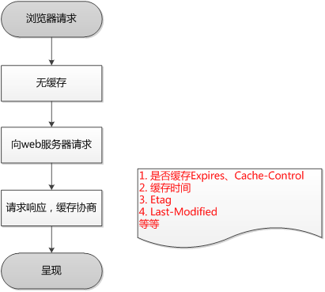

## 1. OSI七层模型 
(转载链接：[简书](https://www.jianshu.com/p/0125d110e3bb))
|  OSI模型  | 对应协议           |
| -------- |------------------- |
应用层(Application) | HTTP,TFTP; FTP; NFS; WAIS, SMTP
表示层(Presentation) | Telnet, Rlogin, SNMP, Gopher
会话层(Session) | SMTP, DNS
传输层(Transport) | TCP, UDP
网络层(Network) | IP, ICMP, ARP, RARP, AKP, UUCP
数据链路层(Data Link) | FDDI, Ethernet, Arpanet, PDN, SLIP, PPP
物理层(Physical) | IEEE 802.1A, IEEE 802.2到IEEE 802.11

### 1.1 物理层
在OSI参考模型中，物理层（Physical Layer）是参考模型的最低层，也是OSI模型的第一层。

物理层的功能：利用传输介质为数据链路层提供物理连接，实现比特流的传输。

物理层的作用：物理层的作用是实现相邻计算机节点之间**比特流的透明传送**，尽可能屏蔽掉具体传输介质和物理设备的差异。使其上面的数据链路层不必考虑网络的具体传输介质是什么。

> “透明传送比特流”表示经实际电路传送后的比特流没有发生变化，对传送的比特流来说，这个电路好像是看不见的
> 
> 把二进制转换成电流，把电流转换成二进制（单位是bit比特）
> 
> 与物理层有关的设备：中继器（将电信号方法，因为电缆是金属有电阻）

### 1.2 数据链路层
数据链路层（Data Link Layer）是OSI模型的第二层，负责建立和管理节点间的链路。该层的主要功能是：通过各种控制协议，将有差错的物理信道变为无差错的、能可靠传输数据帧的数据链路。

在计算机网络中由于各种干扰的存在，物理链路是不可靠的。因此，这一层的主要功能是在物理层提供的比特流的基础上，通过**差错控制、流量控制**方法，使有差错的物理线路变为无差错的数据链路，即提供可靠的通过物理介质传输数据的方法。

数据链路层的具体工作是：接收来自物理层的位流形式的数据，并封装成帧，传送到上一层；同样，也将来自上层的数据帧，拆装为位流形式的数据转发到物理层。

数据链路层使用的主要是**点对点信道和广播信道**两种。

将二进制数据转换成标准帧格式（起始位、数据、地址、校验、结束位）

与数据链路层有关的设备：交换机，也就是大家常说的猫（为数据帧从一个端口到另一个任意端口的转发提供了低时延、低开销的通路）

>如果把电脑比如成客户，数据链路比喻成物流，那么快递小哥如何找到客户地址？
>
>答：通过电脑MAC地址（MAC地址由网卡决定）

### 1.3 网络层
网络层（Network Layer）是OSI模型的第三层，它是OSI参考模型中最复杂的一层，也是**通信子网的最高一层**。它在下两层的基础上向资源子网提供服务。其主要任务是：通过路由选择算法，为报文或分组通过通信子网选择最适当的路径。该层控制**数据链路层**与**传输层**之间的信息转发，**建立、维持和终止网络的连接**。具体地说，数据链路层的数据在这一层被转换为数据包，然后通过路径选择、分段组合、顺序、进/出路由等控制，将信息从一个网络设备传送到另一个网络设备。

寻址：数据链路层中使用的物理地址（如MAC地址）仅解决网络内部的寻址问题。在不同子网之间通信时，为了识别和找到网络中的设备，每一子网中的设备都会被分配一个唯一的地址。由于各子网使用的物理技术可能不同，因此这个地址应当是**逻辑地址（如IP地址）**。

交换：规定不同的信息交换方式。常见的交换技术有：线路交换技术和存储转发技术，后者又包括报文交换技术和分组交换技术。

路由算法：当源节点和目的节点之间存在多条路径时，本层可以根据路由算法，通过网络为数据分组选择最佳路径，并将信息从最合适的路径由发送端传送到接收端。

连接服务：与数据链路层流量控制不同的是，前者控制的是网络相邻节点间的流量，后者控制的是从源节点到目的节点间的流量。其目的在于防止阻塞，并进行差错检测。

网络层有关的设备：**路由器**（一个作用是连通不同的网络，另一个作用是选择信息传送的线路）

>1.网络层主要有两个作用:
>   - 选择数据传输的最优路径，解决网络阻塞问题（网络阻塞的原因主要是CPU需要处理数据有一定延迟）
>   - 将大的数据切割成小的数据包，根据不同时间段的不同最优路径进行传输（可以联想看片时候的断点续传）
>
>2.互联网如何识别电脑？
>
>答: 通过ip地址

### 1.4 传输层
OSI下3层的主要任务是**数据通信**，上3层的任务是**数据处理**。而传输层（Transport Layer）是OSI模型的第4层。因此该层是通信子网和资源子网的接口和桥梁，起到承上启下的作用。

该层的主要任务是：定义了一些传输数据的协议和端口号（如HTTP的端口80等），TCP（传输控制协议，传输效率低，可靠性强，可以用于传输可靠性要求高，数据量大的数据），UDP（用户数据报协议，与TCP特性恰恰相反，用于传输可靠性要求不高，数据量小的数据，如QQ聊天数据就是通过这种方式传输的）。 主要是从下层接收的数据进行分段和传输，到达目的地址后再进行重组。常常把这一层数据叫做报文段(Message Segment)。

>1.**协议和端口号是在传输层定义的**
>
>2.电脑如何识别某一个应用程序？
>
>答：通过端口号：每一个应用程序都有很多的服务，每一个服务对应着一个端口号
>
>3.MAC地址、ip地址、端口号的理解
>
>答：假如我想在淘宝买一个娃娃，首先需要登录淘宝账号，下单购买后卖家开始联系寄东西过来。如果把卖家比喻成电脑A，我比喻成电脑B，买的东西相当于A给B传输的数据，那么MAC地址就相当于B下单时填写的收货地址，这个地址是固定的，如果搬家了换了地址就相当于换了网卡更换了MAC地址，而ip地址就相当淘宝这个平台，我可以在淘宝买东西，也可以在京东买，ip地址是不固定的，端口号就相当于学校有很多楼也有很多教室，每一个教室对应的是一个端口号（好比用淘宝程序购买，虽然找到了这台电脑的地址但是电脑中有很多应用程序，如何找到你是用淘宝客户端发起的获取数据请求而不是你的其他软件就是通过端口号来识别的）


### 1.5 会话层
会话层（Session Layer）是OSI模型的第5层，是用户应用程序和网络之间的接口，主要任务是：向两个实体的表示层提供建立和使用连接的方法。将不同实体之间的表示层的连接称为会话。因此会话层的任务就是组织和协调两个会话进程之间的通信，并对数据交换进行管理。

通过传输层（端口号：传输端口与接收端口）建立数据传输的通路。主要在你的系统之间发起会话或者接受会话请求（设备之间需要互相认识可以是IP也可以是MAC或者是主机名）。

**数据的传输是在会话层完成的，而不是传输层**，传输层只是定义了数据传输的协议。

在这层我们可以将小心进行加密，如：Transport Layer Security（传输层安全协定）。

### 1.6 表示层
表示层（Presentation Layer）是OSI模型的第六层，它对来自应用层的命令和数据进行解释，对各种语法赋予相应的含义，并按照一定的格式传送给会话层。其主要功能是“处理用户信息的表示问题，如编码、数据格式转换和加密解密”等

可确保一个系统的应用层所发送的信息可以被另一个系统的应用层读取。例如，PC程序与另一台计算机进行通信，其中一台计算机使用扩展二一十进制交换码（EBCDIC），而另一台则使用美国信息交换标准码（ASCII）来表示相同的字符。如有必要，表示层会通过使用一种通格式来实现多种数据格式之间的转换。

表示层的任务：**数据格式转换**（可以理解成iOS中将c语言的char字符转换成OC语言的NSString）

### 1.7 应用层
应用层（Application Layer）是OSI参考模型的最高层，它是计算机用户，以及各种应用程序和网络之间的接口，其功能是直接向用户提供服务，完成用户希望在网络上完成的各种工作

是最靠近用户的OSI层。这一层为用户的应用程序（例如电子邮件、文件传输和终端仿真）提供网络服务。 


## 2. TCP/IP的四层协议


网络接口层(Network Access Layer)：处理数据在媒介上的表示、传输以及与硬件交互的细节。

包括用于协作IP数据在已有网络介质上传输的协议。实际上TCP/IP标准并不定义与OSI数据链路层和物理层相对应的功能。相反，它定义像地址解析协议(Address Resolution Protocol,ARP)这样的协议，提供TCP/IP协议的数据结构和实际物理硬件之间的接口。

网络层：IP层负责IP数据报的路由转发，所有的TCP、UDP、ICMP和IGMP数据都通过IP数据报传输。网络层（IP）提供了一种尽力而为、无连接、不可靠的数据报交付服务，IP负责将IP数据报（又叫分组），放入数据链路层传输，负责分片和重组逻辑。

本层包含IP协议、RIP协议(Routing Information Protocol，路由信息协议)，负责数据的包装、寻址和路由。同时还包含网间控制报文协议(Internet Control Message Protocol,ICMP)用来提供网络诊断信息。

传输层：为端主机上运行的应用程序提供端到端服务，包括TCP和UDP。TCP提供了带流量控制、拥塞控制、有序、可靠的流交付，TCP需要处理丢包检测重传、重排序等IP层不处理的问题，TCP面向连接，不保留消息边界；而UDP提供的功能基本上没有超越IP，不提供速率控制和差错控制，不保证可靠性，UDP只是提供一套端口号，用于复用、多路分解（即把收到的UDP数据报交给应用层对应程序处理）和校验数据完整性（只检错不纠错），UDP面向非连接，保留消息边界。

提供两种端到端的通信服务。其中TCP协议(Transmission Control Protocol)提供可靠的数据流运输服务，UDP协议(Use Datagram Protocol)提供不可靠的用户数据报服务。

应用层：负责处理特定应用的细节，通常应用的实现都是基于TCP/IP或者UDP/IP。应用层与应用细节相关，与网络数据传输无关，而之下的三层（链路层、网络层、传输层）则对应用一无所知，但需要处理通信的细节。

因特网的应用层协议包括Finger、Whois、FTP(文件传输协议)、Gopher、HTTP(超文本传输协议)、Telent(远程终端协议)、SMTP(简单邮件传送协议)、IRC(因特网中继会话)、NNTP（网络新闻传输协议）等。

## 3. 各层对应设备

- 中继器：物理层（在比特级别对网络信号进行再生和重定时，从而使得它们能够在网络上传输更长的距离）
- 集线器（Hub）：物理层（纯硬件设备，主要用来连接计算机等网络终端）
- 网桥：数据链路层（将两个LAN连起来，根据MAC地址来转发帧）
- 交换机：数据链路层、网络层（识别数据包中的MAC地址信息，根据MAC地址进行转发，并将这些MAC地址与对应的端口记录在自己内部的一个地址表中）
- 路由器：网络层（路由选择、存储转发）
- 网关：应用层、传输层（网关在传输层上以实现网络互连，是最复杂的网络互连设备，仅用于两个高层协议不同的网络互连。网关的结构也和路由器类似，不同的是互连层。网关既可以用于广域网互连，也可以用于局域网互连）

>不同点：
>
>首先说HUB,也就是集线器。它的作用可以简单的理解为将一些机器连接起来组成一个局域网。
>
>而交换机（又名交换式集线器）作用与集线器大体相同。但是两者在性能上有区别：集线器采用的式共享带宽的工作方式，而交换机是独享带宽。这样在机器很多或数据量很大时，两者将会有比较明显的。
>
>而路由器与以上两者有明显区别，它的作用在于连接不同的网段并且找到网络中数据传输最合适的路径。路由器是产生于交换机之后，就像交换机产生于集线器之后，所以路由器与交换机也有一定联系，不是完全独立的两种设备。路由器主要克服了交换机不能路由转发数据包的不足。

## 4. 各层协议基础

### 4.1 传输层协议

#### 4.1.1 TCP协议，报文格式


- 序号：用于对字节流进行编号，例如序号为 301，表示第一个字节的编号为 301，如果携带的数据长度为 100 字节，那么下一个报文段的序号应为 401。

- 确认号：期望收到的下一个报文段的序号。例如 B 正确收到 A 发送来的一个报文段，序号为 501，携带的数据长度为 200 字节，因此 B 期望下一个报文段的序号为 701，B 发送给 A 的确认报文段中确认号就为 701。

- 数据偏移：指的是数据部分距离报文段起始处的偏移量，实际上指的是首部的长度。

- 控制位：八位从左到右分别是 CWR，ECE，URG，ACK，PSH，RST，SYN，FIN。

>CWR：CWR 标志与后面的 ECE 标志都用于 IP 首部的 ECN 字段，ECE 标志为 1 时，则通知对方已将拥塞窗口缩小；
>
>ECE：若其值为 1 则会通知对方，从对方到这边的网络有阻塞。在收到数据包的 IP 首部中 ECN 为 1 时将 TCP 首部中的 ECE 设为 1；
>
>URG：该位设为 1，表示包中有需要紧急处理的数据，对于需要紧急处理的数据，与后面的紧急指针有关；
>
>ACK：该位设为 1，确认应答的字段有效，TCP规定除了最初建立连接时的 SYN 包之外该位必须设为 1；
>
>PSH：该位设为 1，表示需要将收到的数据立刻传给上层应用协议，若设为 0，则先将数据进行缓存；
>
>RST：该位设为 1，表示 TCP 连接出现异常必须强制断开连接；
>
>SYN：用于建立连接，该位设为 1，表示希望建立连接，并在其序列号的字段进行序列号初值设定；
>
>FIN：该位设为 1，表示今后不再有数据发送，希望断开连接。当通信结束希望断开连接时，通信双方的主机之间就可以相互交换 FIN 位置为 1 的 TCP 段。
>
>每个主机又对对方的 FIN 包进行确认应答之后可以断开连接。不过，主机收到 FIN 设置为 1 的 TCP 段之后不必马上回复一个 FIN 包，而是可以等到缓冲区中的所有数据都因为已成功发送而被自动删除之后再发 FIN 包；

- 窗口：窗口值作为接收方让发送方设置其发送窗口的依据。之所以要有这个限制，是因为接收方的数据缓存空间是有限的。

- 检验和：TCP报头中有对应的检验和字段，发送的数据包的二进制相加然后取反，目的是检测数据在传输过程中的任何变化。如果收到段的检验和有差错，TCP将丢弃这个报文段和不确认收到此报文段。

#### 4.1.2 UDP协议，报文格式


#### 4.1.3 TCP/UDP 的区别

- 用户数据报协议 UDP（User Datagram Protocol）

    是无连接的，尽最大可能交付，没有拥塞控制，面向报文（对于应用程序传下来的报文不合并也不拆分，只是添加 UDP 首部），支持一对一、一对多、多对一和多对多的交互通信。虽然UDP不提供可靠交付，但在某些情况下UDP确是一种最有效的工作方式（一般用于即时通信），比如： QQ语音, QQ视频, 直播等等

    对应协议：
    1.  DNS：用于域名解析服务，将域名地址转换为IP地址。DNS用的是53号端口。
    2.  SNMP：简单网络管理协议，使用161号端口，是用来管理网络设备的。由于网络设备很多，无连接的服务就体现出其优势。
    3.  TFTP(Trival File Tranfer Protocal)，简单文件传输协议，该协议在熟知端口69上使用UDP服务。

- 传输控制协议 TCP（Transmission Control Protocol）

    是面向连接的，提供可靠交付，有流量控制，拥塞控制，提供全双工通信，面向字节流（把应用层传下来的报文看成字节流，把字节流组织成大小不等的数据块），每一条 TCP 连接只能是点对点的（一对一）。TCP一般用于文件传输、发送和接收邮件、远程登录等场景。

    对应协议：
    1.  FTP：定义了文件传输协议，使用21端口。
    2.  Telnet：一种用于远程登陆的端口，使用23端口，用户可以以自己的身份远程连接到计算机上，可提供基于DOS模式下的通信服务。
    3.  SMTP：邮件传送协议，用于发送邮件。服务器开放的是25号端口。
    4.  POP3：它是和SMTP对应，POP3用于接收邮件。POP3协议所用的是110端口。
    8.  HTTP：是从Web服务器传输超文本到本地浏览器的传送协议。

总结：

UDP的主要特点：
- UDP是无连接的；
- UDP使用尽最大努力交付，即不保证可靠交付，因此主机不需要维持复杂的链接状态（这里面有许多参数）；
- UDP是面向报文的；
- UDP没有拥塞控制，因此网络出现拥塞不会使源主机的发送速率降低（对实时应用很有用，如IP电话，实时视频会议等）；
- UDP支持一对一、一对多、多对一和多对多的交互通信；
- UDP的首部开销小，只有8个字节，比TCP的20个字节的首部要短。

TCP的主要特点：

- TCP是面向连接的。（就好像打电话一样，通话前需要先拨号建立连接，通话结束后要挂机释放连接）；
- 每一条TCP连接只能有两个端点，每一条TCP连接只能是点对点的（一对一）；
- TCP提供可靠交付的服务。通过TCP连接传送的数据，无差错、不丢失、不重复、并且按序到达；
- TCP提供全双工通信。TCP允许通信双方的应用进程在任何时候都能发送数据。TCP连接的两端都设有发送缓存和接收缓存，用来临时存放双方通信的数据；
- 面向字节流。TCP中的“流”（stream）指的是流入进程或从进程流出的字节序列。“面向字节流”的含义是：虽然应用程序和TCP的交互是一次一个数据块（大小不等），但TCP把应用程序交下来的数据仅仅看成是一连串的无结构的字节流。

#### 4.1.4 TCP三次握手


- 第一次握手：Client将标志位SYN置为1，随机产生一个值seq=J，并将该数据包发送给Server，Client进入SYN_SENT状态，等待Server确认。

- 第二次握手：Server收到数据包后由标志位SYN=1知道Client请求建立连接，Server将标志位SYN和ACK都置为1，ack=J+1，随机产生一个值seq=K，并将该数据包发送给Client以确认连接请求，Server进入SYN_RCVD状态。

- 第三次握手：Client收到确认后，检查ack是否为J+1，ACK是否为1，如果正确则将标志位ACK置为1，ack=K+1，并将该数据包发送给Server，Server检查ack是否为K+1，ACK是否为1，如果正确则连接建立成功，Client和Server进入ESTABLISHED状态，完成三次握手，随后Client与Server之间可以开始传输数据了。

>为什么要三次握手：
>
>客户端和服务端通信前要进行连接，“3次握手”的作用就是双方都能明确自己和对方的收、发能力是正常的。
>
>第一次握手：客户端发送网络包，服务端收到了。这样服务端就能得出结论：客户端的发送能力、服务端的接收能力是正常的。
>
>第二次握手：服务端发包，客户端收到了。这样客户端就能得出结论：服务端的接收、发送能力，客户端的接收、发送能力是正常的。从客户端的视角来看，我接到了服务端发送过来的响应数据包，说明服务端接收到了我在第一次握手时发送的网络包，并且成功发送了响应数据包，这就说明，服务端的接收、发送能力正常。而另一方面，我收到了服务端的响应数据包，说明我第一次发送的网络包成功到达服务端，这样，我自己的发送和接收能力也是正常的。
>
>第三次握手：客户端发包，服务端收到了。这样服务端就能得出结论：客户端的接收、发送能力，服务端的发送、接收能力是正常的。第一、二次握手后，服务端并不知道客户端的接收能力以及自己的发送能力是否正常。
>
>而在第三次握手时，服务端收到了客户端对第二次握手作的回应。从服务端的角度，我在第二次握手时的响应数据发送出去了，客户端接收到了。所以，我的发送能力是正常的。而客户端的接收能力也是正常的。
>
>经历了上面的三次握手过程，客户端和服务端都确认了自己的接收、发送能力是正常的。之后就可以正常通信了。
>
>每次都是接收到数据包的一方可以得到一些结论，发送的一方其实没有任何头绪。我虽然有发包的动作，但是我怎么知道我有没有发出去，而对方有没有接收到呢？
>
>而从上面的过程可以看到，最少是需要三次握手过程的。两次达不到让双方都得出自己、对方的接收、发送能力都正常的结论。

#### 4.1.5 TCP四次挥手


由于TCP连接时全双工的，因此，每个方向都必须要单独进行关闭，这一原则是当一方完成数据发送任务后，发送一个FIN来终止这一方向的连接，收到一个FIN只是意味着这一方向上没有数据流动了，即不会再收到数据了，但是在这个TCP连接上仍然能够发送数据，直到这一方向也发送了FIN。首先进行关闭的一方将执行主动关闭，而另一方则执行被动关闭，上图描述的即是如此。

- 第一次挥手：Client发送一个FIN，用来关闭Client到Server的数据传送，Client进入FIN_WAIT_1状态。

- 第二次挥手：Server收到FIN后，发送一个ACK给Client，确认序号为收到序号+1（与SYN相同，一个FIN占用一个序号），Server进入CLOSE_WAIT状态。

- 第三次挥手：Server发送一个FIN，用来关闭Server到Client的数据传送，Server进入LAST_ACK状态。

- 第四次挥手：Client收到FIN后，Client进入TIME_WAIT状态，接着发送一个ACK给Server，确认序号为收到序号+1，Server进入CLOSED状态，完成四次挥手。

>为什么建立连接是三次握手，而关闭连接却是四次挥手呢？
>
>1. TCP连接是双向传输的对等的模式，就是说双方都可以同时向对方发送或接收数据。当有一方要关闭连接时，会发送指令告知对方，我要关闭连接了。
>
>2. 这时对方会回一个ACK，此时一个方向的连接关闭。但是另一个方向仍然可以继续传输数据，也就是说，服务端收到客户端的 FIN 标志，知道客户端想要断开这次连接了，但是，我服务端，我还想发数据呢？我等到发送完了所有的数据后，会发送一个 FIN 段来关闭此方向上的连接。接收方发送 ACK确认关闭连接。
>
>注意，接收到FIN报文的一方只能回复一个ACK, 它是无法马上返回对方一个FIN报文段的，因为结束数据传输的“指令”是上层应用层给出的，我只是一个“搬运工”，我无法了解“上层的意志”。
>
>3. 客户端发送了 FIN 连接释放报文之后，服务器收到了这个报文，就进入了 CLOSE-WAIT 状态。这个状态是为了让服务器端发送还未传送完毕的数据，传送完毕之后，服务器会发送 FIN 连接释放报文。
>
>4. 因为服务端在 LISTEN 状态下，收到建立连接请求的 SYN 报文后，把 ACK 和 SYN 放在一个报文里发送给客户端。而关闭连接时，当收到对方的 FIN 报文时，仅仅表示对方不再发送数据了但是还能接收数据，己方是否现在关闭发送数据通道，需要上层应用来决定，因此，己方 ACK 和 FIN 一般都会分开发。

```
各个状态的意义：

LISTEN - 侦听来自远方TCP端口的连接请求；
SYN-SENT - 在发送连接请求后等待匹配的连接请求；
SYN-RECEIVED - 在收到和发送一个连接请求后等待对连接请求的确认；
ESTABLISHED- 代表一个打开的连接，数据可以传送给用户；
FIN-WAIT-1 - 等待远程TCP的连接中断请求，或先前的连接中断请求的确认；
FIN-WAIT-2 - 从远程TCP等待连接中断请求；
CLOSE-WAIT - 等待从本地用户发来的连接中断请求；
CLOSING - 等待远程TCP对连接中断的确认；
LAST-ACK - 等待原来发向远程TCP的连接中断请求的确认；
TIME-WAIT -等待足够的时间以确保远程TCP接收到连接中断请求的确认；
CLOSED - 没有任何连接状态；
```

#### 4.1.6 如何保证可靠性传输？

##### 4.1.6.1 停止等待-自动重传请求协议（Stop-and-wait Automatic Repeat-reQuest）


发送一个分组，必须等到接收方的确认之后才继续发送下一个分组，否则重传该分组。

1.  无差错情况: 发送方发送分组，接收方在规定时间内收到，并且回复确认。发送方再次发送。
2.  超时重传有以下三种情况:
    - 分组丢失: 发送方发送分组，接收方没有收到分组，那么接收方不会发出确认，只要发送方过一段时间没有收到确认，就认为刚才的分组丢了，那么发送方就会再次发送。
    - 确认丢失: 发送方发送成功，接收方接收成功，确认分组也被发送，但是分组丢失，那么到了等待时间，发送方没有收到确认，又会发送分组过去，此时接收方前面已经收到了分组，那么此时接收方要做的事就是：**丢弃分组，重新发送确认。**
    - 传送延迟: 发送方发送成功，接收方接收成功，确认分组也被发送，没有丢失。但是由于传输太慢，等到了发送方设置的时间，发送方又会重新发送分组，此时接收方要做的事情：丢弃分组，重新发送确认。 发送方如果收到两个或者多个确认，就停止发送，丢弃其他确认。

##### 4.1.6.2 连续ARQ协议 
由于停止等待ARQ协议信道利用率太低，所以需要使用连续ARQ协议来进行改善。这个协议会连续发送一组数据包，然后再等待这些数据包的ACK。

发送方采用流水线传输。流水线传输就是发送方可以连续发送多个分组，不必每发完一个分组就停下来等待对方确认。如下图所示：


连续ARQ协议通常是结合滑动窗口协议来使用的，发送方需要维持一个发送窗口，如下图所示：


图（a）是发送方维持的发送窗口，它的意义是：位于发送窗口内的5个分组都可以连续发送出去，而不需要等待对方的确认，这样就提高了信道利用率。 

连续ARQ协议规定，发送方每收到一个确认，就把发送窗口向前滑动一个分组的位置。例如上面的图（b），当发送方收到第一个分组的确认，就把发送窗口向前移动一个分组的位置。如果原来已经发送了前5个分组，则现在可以发送窗口内的第6个分组。 

接收方一般都是采用累积确认的方式。也就是说接收方不必对收到的分组逐个发送确认。而是在收到几个分组后，对按序到达的最后一个分组发送确认。如果收到了这个分组确认信息，则表示到这个分组为止的所有分组都已经正确接收到了。 

累积确认的优点是容易实现，即使确认丢失也不必重传。但缺点是，不能正确的向发送方反映出接收方已经正确收到的所以分组的信息。比如发送方发送了前5个分组，而中间的第3个分组丢失了，这时候接收方只能对前2个发出确认。而不知道后面3个分组的下落，因此只能把后面的3个分组都重传一次，这种机制叫Go-back-N（回退N），表示需要再退回来重传已发送过的N个分组。即中间一旦发生丢包，会默认后边的数据都丢失，将后边的数据全部重传，浪费带宽。

##### 4.1.6.3 滑动窗口协议
滑动窗口协议在在发送方和接收方之间各自维持一个滑动窗口，发送发是发送窗口，接收方是接收窗口，而且这个窗口是随着时间变化可以向前滑动的。它允许发送方发送多个分组而不需等待确认。TCP的滑动窗口是以字节为单位的。

如下图所示，发送窗口中有四个概念：：已发送并收到确认的数据（不在发送窗口和发送缓冲区之内）、已发送但未收到确认的数据（位于发送窗口之内）、允许发送但尚未发送的数据（位于发送窗口之内）、发送窗口之外的缓冲区内暂时不允许发送的数据。

接收窗口中也有四个概念：已发送确认并交付主机的数据（不在接收窗口和接收缓冲区之内）、未按序收到的数据（位于接收窗口之内）、允许的数据（位于接收窗口之内）、不允许接收的数据（位于发送窗口之内）。


例子：


>滑动窗口的重要特性: 
>
>只有接收窗口向前滑动时（同时接收方发送确认帧）发送窗口才有可能（只有发送方收到确认帧才是一定）向前滑动。
>
>从滑动窗口的概念看，停止-等待协议、后退N帧协议和选择重传协议只有在发送窗口大小和接收窗口大小有区别。
>   - 停止等待协议：发送窗口大小=1，接收窗口大小=1；
>   - 后退N帧协议：发送窗口大小>1，接收窗口大小=1；
>   - 选择重传协议：发送窗口大小>1，就收窗口大小>1;
> 
>当滑动窗口大小为1时，可保证帧的有序接收；
>
>数据链路层的滑动窗口协议中 ，窗口的大小在传输过程中是固定的（注意与传输层的滑动窗口协议的区别）。

##### 4.1.6.4 Go-Back-N协议
在后退N帧ARQ中，发送方不需要收到上一帧的ACK后才开始发送下一帧，而是可以连续发送帧。当接收方检测出失去的信息帧后，可以要求发送方重发最后一个正确接收的信息帧之后的所有未确认的帧；或者当发送方发送了N个帧后，若发现该N个帧的前一个帧被判为出错或丢失，此时发送方就不得不重传该出错帧及随后的N个帧。换句话说，接收帧方只允许按顺序接收帧。

后退N帧协议的接收窗口为1，可以保证按序接收数据帧。若采用n个比特对帧编号，则期发送窗口的尺寸 Wt 应满足：1 <= Wt <= 2^n - 1。若发送窗口的尺寸大于2^n - 1，则会造成接收方无法分辨新帧和旧帧。

>为什么当用n个比特进行编号时 ，若接收窗口的大小为 1，则只有在发送窗口的大小 Wt <= 2^n-1 时，连续ARQ 协议才能正确运行 ?
>
>答:
>例如用3比特可编出8个不同的序号，因而发送窗口的最大值似乎应为8。但设置发送窗口为8将使协议在某些情况下无法工作。
>
>设发送窗口Wt =8，发送端发送完0~7号共8个数据帧。因发送窗口已满，发送暂停。假定这8个数据帧均已正确到达接收端，并且对每一个数据帧，接收端都发送出确认帧。下面考虑两种不同的情况。
>
>第一种情况是:所有的确认帧都正确到达了发送端，因而发送端接着又发送8个新的数据帧，其编号应当是0~7。请注意，序号是循环使用的。所以序号虽然相同，但8个帧都是新的帧。
>
>第二种情况是:所有的确认帧都丢失了。经过一段由超时计时器控制的时间后，发送端重传这8个旧的数据帧，其编号仍为0~7。
>
>于是，当接收端第二次收到编号为0~7的8个数据帧时，就无法判定: 这是8个新的数据帧，或这是8个旧的、重传的数据帧。

后退N帧协议一方面因连续发送数据帧而提高了信道的利用率，但另一方面，在重传时又必须把原来已发送正确的数据帧进行重传（仅因这些数据帧的前面有一个数据帧出了错），这种做法又使传送速率降低。由此可见，若信道的传输质量很差导致误码率较大时，后退N帧协议不一定优于停止等待协议。

##### 4.1.6.5 选择重传协议
在选择重传协议中，每一个发送缓冲区对应一个计时器，当计时器超时时，缓冲区的帧就会重传。一旦接收方怀疑帧出错，就会发送一个否定帧NAK给发送方，要求发送方对NAK中指定的帧进行重传。

选择重传协议的接收窗口尺寸 Wr 和发送窗口尺寸 Wt 都大于1，一次可以发送或接收多个帧。若采用 n 比特对帧编号，为了保证接收方向向前移动窗口后，新窗口序号与旧窗口序号没有重叠部分，需要满足条件：接收窗口Wr + 发送窗口Wt <= 2^n。假定仍然采用累计确认的方法，并且接收窗口 Wr 显然不应超过发送窗口 Wt(否则无意义)，那么接收窗口尺寸不应超过序号范围的一半 Wr <= 2^(n-1)。当接收窗口为最大值时，Wtmax = Wrmax = 2^(n-1)。

选择重传协议可以避免重复传送那些本已正确到达接收端的数据帧，但在接收端要设置具有相当容量的缓冲区来暂存那些未按序正确收到的帧。接收端不能接收窗口以下或窗口上界以上的序号的帧，因此所需缓冲区的数目等于窗口的大小，而不是序号数目。

##### 4.5.6.6 校验和
TCP报头中有对应的检验和字段，发送的数据包的二进制相加然后取反，目的是检测数据在传输过程中的任何变化。如果收到段的检验和有差错，TCP将丢弃这个报文段和不确认收到此报文段。

##### 4.5.6.7 序列号和确认应答(和前面一样)
TCP给发送的每一个包进行编号（序列号依次递增），接收方对数据包进行排序，把有序数据传送给应用层。
接收方收到报文就会确认（累积确认：对所有按序接收的数据的确认）

##### 4.5.6.8 拥塞控制
如果网络出现拥塞，分组将会丢失，此时发送方会继续重传，从而导致网络拥塞程度更高。因此当出现拥塞时，应当控制发送方的速率。这一点和流量控制很像，但是出发点不同。流量控制是为了让接收方能来得及接收，而拥塞控制是为了降低整个网络的拥塞程度。

TCP 主要通过四个算法来进行拥塞控制：**慢开始、拥塞避免、快重传、快恢复。**

- 慢开始:

    当最开始发送数据时，因为不知道网络的情况，所以不能立即注入大量的数据到网络中，不然可能会引起网络拥塞。较好的方法是先探测一下，由小到大逐渐增加发送窗口的大小，cwnd 的初始值是 1 ，没经过一个传播轮次，cwnd 就翻倍。

- 拥塞避免:
    拥塞避免听名字就很"谨慎"，当窗口大小达到一定的门限值/阈值 (ssthresh) 后，就让拥塞窗口 cwnd 缓慢增大，每经过一个往返时间 RTT 就把发送方的 cwnd 增加 1 。

- 快重传、快恢复:
    主要作用就是快速恢复丢失的数据包。没有 FRR(快速重传和恢复) ，如果数据包丢失了，TCP 会使用定时器来要求传输暂停；有了 FRR ，如果接收方收到一个不按顺序的数据段，他会立刻给发送方发送一个重复确认，如果发送方连续收到三个重复确认，它会认为重复确认指出的数据段丢失了，并立即重传这些丢失的数据段，并且不会因为重传而要求传输暂停。

    每当发生三次重复确认，就认为当前为本网络设置的拥塞避免门限值太大了，于是 ssthresh 就重新设定为当前窗口的一半，同时当前窗口大小也减半后，继续执行拥塞避免算法。

    如果网络中发生发送方没有及时接收到 ACK 确认，也就是超时的情况，则认为在本网络中当前发送窗口过大了，于是 ssthresh 重新设定为当前窗口的一半，同时当前窗口大小降为 1 ，并执行慢开始算法。


## 5. 在浏览器中输入url地址 ->> 显示主页的过程


1.  先从本地缓存中查找 URL 对应的 IP 地址，如果本地缓存没有，会使用 DNS 协议，先从当地的根域名服务器查找对应的 IP 地址，如果没有则去对应的顶级 DNS 服务器查找，如果还没有则会去权威 DNS 服务器查找。

2.  一般具体的查询顺序是( 浏览器缓存，系统缓存，路由器缓存，IPS服务器缓存，根域名服务器缓存，顶级域名服务器缓存，权威域名服务器缓存 )

3.  三次握手建立 TCP 连接。（如果需要使用 HTTPS 协议，还需要进行 TLS 四次握手协商加密套件和会话秘钥用来实现之后的加密通信）

4.  客户端通过已经建立的 TCP 连接，向服务器指定端口(HTTP 80/HTTPS 443)发送 HTTP 请求。

5.  服务器接受处理客户端发来的 HTTP 请求，并返回 HTTP 响应报文。
   
6.  服务器关闭TCP连接（4次挥手）。 

7.  客户端根据服务端响应来的各种数据，边解析边渲染构建 DOM 树、构建渲染树等等。并将其绘制到屏幕上。


## 6. Get和Post的区别


## 7. HTTP状态码


常见的状态码有如下几种：

- 200 OK 客户端请求成功
- 301 Moved Permanently 请求永久重定向
- 302 Moved Temporarily 请求临时重定向
- 304 Not Modified 文件未修改，可以直接使用缓存的文件。
- 400 Bad Request 由于客户端请求有语法错误，不能被服务器所理解。
- 401 Unauthorized 请求未经授权。这个状态代码必须和WWW-Authenticate报头域一起使用
- 403 Forbidden 服务器收到请求，但是拒绝提供服务。服务器通常会在响应正文中给出不提供服务的原因
- 404 Not Found 请求的资源不存在，例如，输入了错误的URL
- 500 Internal Server Error 服务器发生不可预期的错误，导致无法完成客户端的请求。
- 503 Service Unavailable 服务器当前不能够处理客户端的请求，在一段时间之后，服务器可能会恢复正常。

### 8. HTTP1.0 vs HTTP 1.1 vs HTTP2.0
#### 8.1 HTTP1.0和HTTP1.1的区别

- 长连接
    - HTTP1.0默认使用短连接，每次请求都需要建立新的TCP连接，连接不能复用。
    - HTTP1.1支持持久连接和请求的流水线处理，在一个TCP连接上可以传送多个HTTP请求和响应，减少建立和关闭TCP连接的消耗和延迟，提高效率。HTTP1.1默认开启“Connection:Keep-Alive”，使用长连接，加入“Connection:close”才关闭。

- host字段
    - 在HTTP1.0中为每台服务器绑定一个唯一的IP地址，因此，请求消息中的URL并没有传递主机名（hostname）。但是随着虚拟主机技术的发展，在一台物理服务器上可以存在多个虚机主机，并且它们共享一个IP地址。
    - HTTP1.1的请求消息和响应消息都应支持Host头域，且请求消息中如果没有Host头域，会报400 Bad Request错误。

- 缓存处理
    - 在HTTP1.0中主要使用header里的If-Modified-Since，Expires来做为缓存判断的标准。
    - HTTP1.1则引入了更多的缓存控制策略例如Entity tag，If-Unmodified-Since, If-Match, If-None-Match等更多可供选择的缓存头来控制缓存策略。

- 带宽优化及网络连接的使用
    - HTTP1.0中存在一些浪费带宽的现象，不支持断点续传例如：（1）客户端只需要某个对象的一部分，而服务器却将整个对象发送过来；(2)下载大文件不支持断点续传功能，在发生断连后需要重新下载完整的包。
    - HTTP1.1则在请求头中引入range头域，它允许只请求资源的某个部分，即返回码是206（Partial Content），这样就方便了开发者自由的选择以便于充分利用带宽和连接。

- 新增一些错误通知状态码
    - HTTP1.1中新增了24个错误状态响应码，如409（Conflict）表示请求的资源与资源的当前状态发生冲突。

#### 8.2 HTTP1.1和HTTP2.0的区别


### 9. HTTP 缓存

#### 9.1 缓存的分类

缓存分为**服务端侧**（server side，比如 Nginx、Apache）和**客户端侧**（client side，比如 web browser）。

服务端缓存又分为**代理服务器缓存**和**反向代理服务器缓存**（也叫网关缓存，比如 Nginx反向代理、Squid等），其实广泛使用的 CDN 也是一种服务端缓存，目的都是让用户的请求走”捷径“，并且都是缓存图片、文件等静态资源。

客户端侧缓存一般指的是**浏览器缓存**，目的就是加速各种静态资源的访问，想想现在的大型网站，随便一个页面都是一两百个请求，每天 pv 都是亿级别，如果没有缓存，用户体验会急剧下降、同时服务器压力和网络带宽都面临严重的考验。

#### 9.2 缓存的机制
浏览器缓存机制，其实主要就是HTTP协议定义的缓存机制（如： Expires； Cache-control等）。

浏览器第一次请求流程图和浏览器再次请求时：




- Expires策略：

    Expires是Web服务器响应消息头字段，在响应http请求时告诉浏览器在过期时间前浏览器可以直接从浏览器缓存取数据，而无需再次请求。不过Expires 是HTTP 1.0的东西，现在默认浏览器均默认使用HTTP 1.1，所以它的作用基本忽略。Expires 的一个缺点就是，返回的到期时间是服务器端的时间，这样存在一个问题，如果客户端的时间与服务器的时间相差很大（比如时钟不同步，或者跨时区），那么误差就很大，所以在HTTP 1.1版开始，使用Cache-Control: max-age=秒替代。

- **Cache-control策略**：
  
    Cache-Control与Expires的作用一致，都是指明当前资源的有效期，控制浏览器是否直接从浏览器缓存取数据还是重新发请求到服务器取数据。只不过Cache-Control的选择更多，设置更细致，如果同时设置的话，其优先级高于Expires。

>值可以是public、private、no-cache、no- store、no-transform、must-revalidate、proxy-revalidate、max-age
>
>各个消息中的指令含义如下：
>
>Public指示响应可被任何缓存区缓存。
>
>Private指示对于单个用户的整个或部分响应消息，不能被共享缓存处理。这允许服务器仅仅描述当用户的部分响应消息，此响应消息对于其他用户的请求无效。
>
>no-cache指示请求或响应消息不能缓存，该选项并不是说可以设置”不缓存“，容易望文生义~
>
>no-store用于防止重要的信息被无意的发布。在请求消息中发送将使得请求和响应消息都不使用缓存，完全不存下來。
>
>max-age指示客户机可以接收生存期不大于指定时间（以秒为单位）的响应。
>
>min-fresh指示客户机可以接收响应时间小于当前时间加上指定时间的响应。
>
>max-stale指示客户机可以接收超出超时期间的响应消息。如果指定max-stale消息的值，那么客户机可以接收超出超时期指定值之内的响应消息。

- Last-Modified/If-Modified-Since：Last-Modified/If-Modified-Since要配合Cache-Control使用。

    Last-Modified：标示这个响应资源的最后修改时间。web服务器在响应请求时，告诉浏览器资源的最后修改时间。

    If-Modified-Since：当资源过期时（使用Cache-Control标识的max-age），发现资源具有Last-Modified声明，则再次向web服务器请求时带上头 If-Modified-Since，表示请求时间。web服务器收到请求后发现有头If-Modified-Since 则与被请求资源的最后修改时间进行比对。若最后修改时间较新，说明资源又被改动过，则响应整片资源内容（写在响应消息包体内），HTTP 200；若最后修改时间较旧，说明资源无新修改，则响应HTTP 304 (无需包体，节省浏览)，告知浏览器继续使用所保存的cache。

- Etag/If-None-Match：Etag/If-None-Match也要配合Cache-Control使用。
    
    Etag：web服务器响应请求时，告诉浏览器当前资源在服务器的唯一标识（生成规则由服务器决定）。Apache中，ETag的值，默认是对文件的索引节（INode），大小（Size）和最后修改时间（MTime）进行Hash后得到的。

    If-None-Match：当资源过期时（使用Cache-Control标识的max-age），发现资源具有Etage声明，则再次向web服务器请求时带上头If-None-Match （Etag的值）。web服务器收到请求后发现有头If-None-Match 则与被请求资源的相应校验串进行比对，决定返回200或304。

>既生Last-Modified何生Etag？你可能会觉得使用Last-Modified已经足以让浏览器知道本地的缓存副本是否足够新，为什么还需要Etag（实体标识）呢？HTTP1.1中Etag的出现主要是为了解决几个Last-Modified比较难解决的问题：
>
>Last-Modified标注的最后修改只能精确到秒级，如果某些文件在1秒钟以内，被修改多次的话，它将不能准确标注文件的修改时间
>如果某些文件会被定期生成，当有时内容并没有任何变化，但Last-Modified却改变了，导致文件没法使用缓存
>有可能存在服务器没有准确获取文件修改时间，或者与代理服务器时间不一致等情形
>Etag是服务器自动生成或者由开发者生成的对应资源在服务器端的唯一标识符，能够更加准确的控制缓存。Last-Modified与ETag一起使用时，服务器会优先验证ETag。

- Pragma行是为了兼容HTTP1.0，作用与Cache-Control: no-cache是一样的。

- 最后总结下几种状态码的区别:

    

#### 9.2 用户行为与缓存
|  用户操作  | Expires/Cache-Control | Last-Modified/Etag |
| -------- |------------------- | ------|
| 地址栏回车 | 有效 | 有效
| 页面链接跳转 | 有效 | 有效
| 新开窗口 | 有效 | 有效
| 前进、后退 | 有效 | 有效
| F5/按钮刷新 | 无效（浏览器重置max-age=0) | 有效
| Ctrl+F5刷新 | 无效（重置CC=no-cache）| 无效（请求头丢弃该选项）

### 10. Cookies 和 Session的区别
HTTP 协议是一种无状态协议，即每次服务端接收到客户端的请求时，都是一个全新的请求，服务器并不知道客户端的历史请求记录；Session 和 Cookie 的主要目的就是为了弥补 HTTP 的无状态特性。

>Session 是什么?
>客户端请求服务端，服务端会为这次请求开辟一块内存空间，这个对象便是 Session 对象，存储结构为 ConcurrentHashMap。Session 弥补了 HTTP 无状态特性，服务器可以利用 Session 存储客户端在同一个会话期间的一些操作记录。

>HTTP 协议中的 Cookie 包括 Web Cookie 和浏览器 Cookie，它是服务器发送到 Web 浏览器的一小块数据。服务器发送到浏览器的 Cookie，浏览器会进行存储，并与下一个请求一起发送到服务器。通常，它用于判断两个请求是否来自于同一个浏览器，例如用户保持登录状态。

- cookie 是一种发送到客户浏览器的文本串句柄，并保存在客户机硬盘上，可以用来在某个WEB站点会话间持久的保持数据。
  
- session其实指的就是访问者从到达某个特定主页到离开为止的那段时间。 Session其实是利用Cookie进行信息处理的，当用户首先进行了请求后，服务端就在用户浏览器上创建了一个Cookie，当这个Session结束时，其实就是意味着这个Cookie就过期了。

- cookie数据保存在客户端，session数据保存在服务器端

- cookie不是很安全，别人可以分析存放在本地的COOKIE并进行COOKIE欺骗。考虑到安全应当使用session。

>禁用cookie怎么办？
>客户端禁用cookie以后 session还是可以用，此时session的id值是基于cookie传递的，所以session就不能共享传递了，可以通过在url中附加PHPSESSID的值进行传递，这个就是session的id值。
>
>禁用cookie，sessionid就不能直接传递了，因为http请求时sessionid就是放在cookie里的。你说的通过url传递的，那是变通的方法，服务器端通过session_id()函数可以获知当前session的sessionid，然后在用PHP生成页面的时候，把sessionid作为参数附加到url里，确实可以实现在禁用cookie的情况下传递sessionid。
>
>例子：在每个超链接上添加一个PHPSESSID=$sid 或者 使用session.use_trans_sid=1，php.ini中配置

### 11. DNS解析过程

1、DNS客户端（DNS_Client）检查HOSTS文件及本地DNS缓存，没有找到对应的记录；

2、DNS_Client 联系本地的DNS服务器（DNS_Server），查询域名www.google.com；

3、DNS_Server 联系根提示中的某个根域服务器（Root_Server），查询域名www.google.com；

4、根域名服务器（Root_Server）也不知道www.google.com的对应值，于是向 DNS_Server 返回一个参考答复，告诉其.com顶级域的权威DNS服务器（.com_DNS_Server）;

5、DNS_Server 联系 .com_DNS_Server ，查询域名 www.google.com；

6、.com_DNS_Server 也不知道www.google.com的对应值，于是就向 DNS_Server 返回一个参考答复，告诉它google.com域的权威DNS服务器（google.com_DNS_Server）地址；

7、DNS_Server 联系 google.com_DNS_Server，查询域名 www.google.com；

8、google.com_DNS_Server 知道对应IP地址（IP_Address），并将其返回给DNS_Server；

9、DNS_Server 向 DNS_Client 返回 www.google.com 的 IP_Address；

10、DNS_Client 向 IP_Address 的服务器发送数据传输请求，建立连接，解析完毕。

### 12. 常用协议的端口


