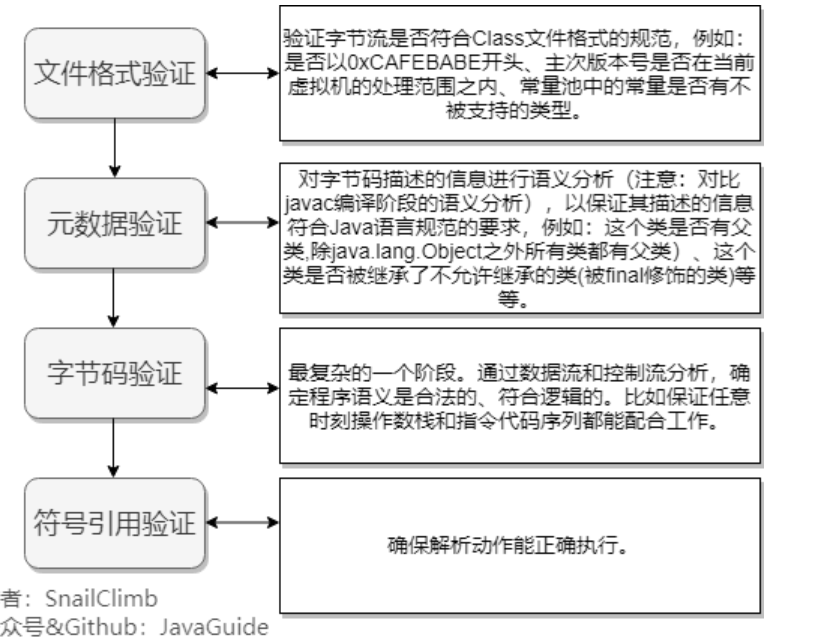

目录
- [1. JVM内存区域](#1-jvm内存区域)
  - [1.1 组成部分](#11-组成部分)
  - [1.2 JVM Runtime data area](#12-jvm-runtime-data-area)
  - [1.3 **Java堆和栈的区别?**](#13-java堆和栈的区别)
  - [1.4 JVM对象创建的步骤](#14-jvm对象创建的步骤)
    - [1.4.1 如何分配内存？](#141-如何分配内存)
    - [1.4.2 保证线程并发安全](#142-保证线程并发安全)
    - [1.4.3 对象的访问定位](#143-对象的访问定位)
    - [1.4.4 判断对象是否死亡（何时垃圾回收）？](#144-判断对象是否死亡何时垃圾回收)
  - [1.5 内存泄露和内存溢出](#15-内存泄露和内存溢出)
    - [1.5.1 内存泄漏（memory leak）](#151-内存泄漏memory-leak)
    - [1.5.2 内存溢出（out of memory）](#152-内存溢出out-of-memory)
    - [1.5.3 内存溢出的原因](#153-内存溢出的原因)
    - [1.5.4 内存溢出的解决方案](#154-内存溢出的解决方案)
    - [1.5.5 内存泄漏排查](#155-内存泄漏排查)
- [2. Java垃圾回收](#2-java垃圾回收)
  - [2.1 JVM垃圾回收方法](#21-jvm垃圾回收方法)
    - [2.1.1 标记-清除算法](#211-标记-清除算法)
    - [2.1.2 复制算法](#212-复制算法)
    - [2.1.3 标记-整理算法](#213-标记-整理算法)
    - [2.1.4 分代算法](#214-分代算法)
  - [2.2 JVM 垃圾回收器](#22-jvm-垃圾回收器)
    - [2.2.1 CMS收集器](#221-cms收集器)
    - [2.2.2 G1收集器](#222-g1收集器)
  - [2.3 内存分配](#23-内存分配)
- [3. JVM类加载](#3-jvm类加载)
  - [3.1 JVM加载Class原理机制](#31-jvm加载class原理机制)
  - [3.2 类加载器](#32-类加载器)
  - [3.3 类加载过程](#33-类加载过程)
  - [3.4 双亲委派模型](#34-双亲委派模型)
- [4. JVM调优](#4-jvm调优)
  - [4.1 JVM 调优的工具？](#41-jvm-调优的工具)
  - [4.2 常用的 JVM 调优的参数都有哪些？](#42-常用的-jvm-调优的参数都有哪些)

## 1. JVM内存区域

### 1.1 组成部分

JVM包含两个子系统和两个组件。

两个子系统为**Class loader(类装载)、Execution engine(执行引擎)**；

两个组件为**Runtime data area(运行时数据区)、Native Interface(本地接口)**。

- Class loader(类装载)：根据给定的全限定名类名(如：java.lang.Object)来装载class文件到Runtime data area中的method area。

- Execution engine（执行引擎）：执行classes中的指令。

- Native Interface(本地接口)：与native libraries交互，是其它编程语言交互的接口。

- Runtime data area(运行时数据区域)：这就是我们常说的JVM的内存。

### 1.2 JVM Runtime data area

不同虚拟机的运行时数据区可能略微有所不同，但都会遵从 Java 虚拟机规范， Java 虚拟机规范规定的区域分为以下 5 个部分：

- 程序计数器（Program Counter Register）：当前线程所执行的字节码的行号指示器，字节码解析器的工作是通过改变这个计数器的值，来选取下一条需要执行的字节码指令，分支、循环、跳转、异常处理、线程恢复等基础功能，都需要依赖这个计数器来完成；

- Java 虚拟机栈（Java Virtual Machine Stacks）：用于存储局部变量表、操作数栈、动态链接、方法出口等信息；

- 本地方法栈（Native Method Stack）：与虚拟机栈的作用是一样的，只不过虚拟机栈是服务 Java 方法的，而本地方法栈是为虚拟机调用 Native 方法服务的；

- Java 堆（Java Heap）：Java 虚拟机中内存最大的一块，是被所有线程共享的，几乎所有的对象实例都在这里分配内存；

- 方法区（Methed Area）：用于存储已被虚拟机加载的类信息、常量、静态变量、即时编译后的代码等数据。

### 1.3 **Java堆和栈的区别?**

- 物理地址

    - 堆的物理地址分配对对象是不连续的。因此性能慢些。在GC的时候也要考虑到不连续的分配，所以有各种算法。比如，标记-消除，复制，标记-压缩，分代（即新生代使用复制算法，老年代使用标记——压缩）
    - 栈使用的是数据结构中的栈，先进后出的原则，物理地址分配是连续的。所以性能快。

- 内存分别

    - 堆因为是不连续的，所以分配的内存是在运行期确认的，因此大小不固定。一般堆大小远远大于栈。
    - 栈是连续的，所以分配的内存大小要在编译期就确认，大小是固定的。

- 存放的内容

    - 堆存放的是对象的实例和数组。因此该区更关注的是数据的存储
    - 栈存放：局部变量，操作数栈，返回结果。该区更关注的是程序方法的执行。
    > 静态变量放在方法区; 静态的对象还是放在堆。

- 程序的可见度

  - 堆对于整个应用程序都是共享、可见的。
  - 栈只对于线程是可见的。所以也是线程私有。他的生命周期和线程相同。

### 1.4 JVM对象创建的步骤

① **类加载检查**：虚拟机遇到一条 new 指令时，首先将去检查这个指令的参数是否能在常量池中定位到这个类的符号引用，并且检查这个符号引用代表的类是否已被加载过、解析和初始化过。如果没有，那必须先执行相应的类加载过程。

② **分配内存**：在类加载检查通过后，接下来虚拟机将为新生对象分配内存。对象所需的内存大小在类加载完成后便可确定，为对象分配空间的任务等同于把一块确定大小的内存从 Java 堆中划分出来。分配方式有 “指针碰撞” 和 “空闲列表” 两种，选择那种分配方式由 Java 堆是否规整决定，而Java堆是否规整又由所采用的垃圾收集器是否带有压缩整理功能决定（“标记-清除”、“标记-压缩”）。

③ **初始化零值**：内存分配完成后，虚拟机需要将分配到的内存空间都初始化为零值（不包括对象头），这一步操作保证了对象的实例字段在 Java 代码中可以不赋初始值就直接使用。

④ **设置对象头**：初始化零值完成之后，虚拟机要对对象进行必要的设置，例如这个对象是那个类的实例、如何才能找到类的元数据信息、对象的哈希吗、对象的 GC 分代年龄等信息。 这些信息存放在对象头中。

⑤ **执行 init 方法**：执行 new 指令之后会接着执行 <init>方法，把对象按照程序员的意愿进行初始化，这样一个真正可用的对象才算完全产生出来。

#### 1.4.1 如何分配内存？

类加载完成后，接着会在Java堆中划分一块内存分配给对象。内存分配根据Java堆是否规整，有两种方式：

- 指针碰撞：如果Java堆的内存是规整，即所有用过的内存放在一边，而空闲的的放在另一边。分配内存时将位于中间的指针指示器向空闲的内存移动一段与对象大小相等的距离，这样便完成分配内存工作。
  
- 空闲列表：如果Java堆的内存不是规整的，则需要由虚拟机维护一个列表来记录那些内存是可用的，这样在分配的时候可以从列表中查询到足够大的内存分配给对象，并在分配后更新列表记录。

选择哪种分配方式是由 Java 堆是否规整来决定的，而 Java 堆是否规整又由所采用的垃圾收集器是否带有压缩整理功能决定。

#### 1.4.2 保证线程并发安全

对象的创建在虚拟机中是一个非常频繁的行为，哪怕只是修改一个指针所指向的位置，在并发情况下也是不安全的，可能出现正在给对象 A 分配内存，指针还没来得及修改，对象 B 又同时使用了原来的指针来分配内存的情况。

- 同步处理：对分配内存空间的动作进行同步处理（采用 CAS + 失败重试来保障更新操作的原子性）；
- 本地线程分配缓冲：把内存分配的动作按照线程划分在不同的空间之中进行，即每个线程在 Java 堆中预先分配一小块内存，称为本地线程分配缓冲（Thread Local Allocation Buffer, TLAB）。哪个线程要分配内存，就在哪个线程的 TLAB 上分配。只有 TLAB 用完并分配新的 TLAB 时，才需要同步锁。通过-XX:+/-UserTLAB参数来设定虚拟机是否使用TLAB。

#### 1.4.3 对象的访问定位

Java程序需要通过 JVM 栈上的引用访问堆中的具体对象。对象的访问方式取决于 JVM 虚拟机的实现。目前主流的访问方式有**句柄**和**直接指针**两种方式。

>指针： 指向对象，代表一个对象在内存中的起始地址。
>
>句柄： 可以理解为指向指针的指针，维护着对象的指针。句柄不直接指向对象，而是指向对象的指针（句柄不发生变化，指向固定内存地址），再由对象的指针指向对象的真实内存地址。

- 直接指针
  
    如果使用直接指针访问，**引用**中存储的直接就是对象地址，那么Java堆对象内部的布局中就必须考虑如何放置访问类型数据的相关信息。

    

    优势：速度更快，节省了一次指针定位的时间开销。由于对象的访问在Java中非常频繁，因此这类开销积少成多后也是非常可观的执行成本。HotSpot 中采用的就是这种方式。

- 句柄访问
  
    Java堆中划分出一块内存来作为句柄池，引用中存储对象的句柄地址，而句柄中包含了对象实例数据与对象类型数据各自的具体地址信息。

    

    优势：引用中存储的是稳定的句柄地址，在对象被移动（垃圾收集时移动对象是非常普遍的行为）时只会改变句柄中的实例数据指针，而引用本身不需要修改。

#### 1.4.4 判断对象是否死亡（何时垃圾回收）？

引用计数法和可达性分析法。

- 引用计数法：给对象中添加一个引用计数器，每当有一个地方引用它，计数器就加1；当引用失效，计数器就减1；任何时候计数器为0的对象就是不可能再被使用的。
    - 难以解决对象之间相互循环引用的问题（这样的话计数器永远不为0）

- 可达性分析法：通过一系列的称为 “GC Roots” 的对象作为起点，从这些节点开始向下搜索，节点所走过的路径称为引用链，当一个对象到 GC Roots 没有任何引用链相连的话，则证明此对象是不可用的。

    对于可达性分析算法而言，不可达的对象并非是“非死不可”的，**若要宣判一个对象死亡**，至少需要经历两次标记阶段：

    - 如果对象在进行可达性分析后发现没有与GCRoots相连的引用链，则该对象被第一次标记并进行一次筛选，筛选条件为是否有必要执行该对象的finalize方法，若对象没有覆盖finalize方法或者该finalize方法是否已经被虚拟机执行过了，则均视作不必要执行该对象的finalize方法，即该对象将会被回收。
    - 反之，若对象覆盖了finalize方法并且该finalize方法并没有被执行过，那么，这个对象会被放置在一个叫F-Queue的队列中，之后会由虚拟机自动建立的、优先级低的Finalizer线程去执行，而虚拟机不必要等待该线程执行结束，即虚拟机只负责建立线程，其他的事情交给此线程去处理。
    - 对F-Queue中对象进行第二次标记，如果对象在finalize方法中拯救了自己，即关联上了GCRoots引用链，如把this关键字赋值给其他变量，那么在第二次标记的时候该对象将从“即将回收”的集合中移除，如果对象还是没有拯救自己，那就会被回收。

### 1.5 内存泄露和内存溢出

二者的关系：

- 内存泄漏的堆积最终会导致内存溢出

- 内存溢出就是你要的内存空间超过了系统实际分配给你的空间，此时系统相当于没法满足你的需求，就会报内存溢出的错误。

#### 1.5.1 内存泄漏（memory leak）
是指程序在申请内存后，无法释放已申请的内存空间，一次内存泄漏似乎不会有大的影响，但内存泄漏堆积后的后果就是内存溢出。

内存泄漏是指你向系统申请分配内存进行使用(new)，可是使用完了以后却不归还(delete)，结果你申请到的那块内存你自己也不能再访问（也许你把它的地址给弄丢了），而系统也不能再次将它分配给需要的程序。

就相当于你租了个带钥匙的柜子，你存完东西之后把柜子锁上之后，把钥匙丢了或者没有将钥匙还回去，那么结果就是这个柜子将无法供给任何人使用，也无法被垃圾回收器回收，因为找不到他的任何信息。

**如果长生命周期的对象持有短生命周期的引用，就很可能会出现内存泄露**。

>内存泄漏的分类
>
>- 常发性内存泄漏。发生内存泄漏的代码会被多次执行到，每次被执行的时候都会导致一块内存泄漏。
>
>- 偶发性内存泄漏。发生内存泄漏的代码只有在某些特定环境或操作过程下才会发生。常发性和偶发性是相对的。对于特定的环境，偶发性的也许就变成了常发性的。所以测试环境和测试方法对检测内存泄漏至关重要。
>
>- 一次性内存泄漏。发生内存泄漏的代码只会被执行一次，或者由于算法上的缺陷，导致总会有一块仅且一块内存发生泄漏。比如，在类的构造函数中分配内存，在析构函数中却没有释放该内存，所以内存泄漏只会发生一次。
>
>- 隐式内存泄漏。程序在运行过程中不停的分配内存，但是直到结束的时候才释放内存。严格的说这里并没有发生内存泄漏，因为最终程序释放了所有申请的内存。但是对于一个服务器程序，需要运行几天，几周甚至几个月，不及时释放内存也可能导致最终耗尽系统的所有内存。所以，我们称这类内存泄漏为隐式内存泄漏。

#### 1.5.2 内存溢出（out of memory）

指程序申请内存时，没有足够的内存供申请者使用，或者说，给了你一块存储int类型数据的存储空间，但是你却存储long类型的数据，那么结果就是内存不够用，此时就会报错OOM，即所谓的内存溢出。

内存溢出：一个盘子用尽各种方法只能装4个果子，你装了5个，结果掉倒地上不能吃了。这就是溢出。

比方说栈，栈满时再做进栈必定产生空间溢出，叫上溢，栈空时再做退栈也产生空间溢出，称为下溢。就是分配的内存不足以放下数据项序列,称为内存溢出。说白了就是我承受不了那么多，那我就报错。

#### 1.5.3 内存溢出的原因

- 内存中加载的数据量过于庞大，如一次从数据库取出过多数据；
- 集合类中有对对象的引用，使用完后未清空，使得JVM不能回收；
- 代码中存在死循环或循环产生过多重复的对象实体；
- 使用的第三方软件中的BUG；
- 启动参数内存值设定的过小

#### 1.5.4 内存溢出的解决方案

1.  修改JVM启动参数，直接增加内存。(-Xms，-Xmx参数一定不要忘记加。)

2.  检查错误日志，查看“OutOfMemory”错误前是否有其 它异常或错误。

3.  对代码进行查找分析，找出可能发生内存溢出的位置。

4.  使用内存查看工具动态查看内存使用情况。

#### 1.5.5 内存泄漏排查

- 检查对数据库查询中，是否有一次获得全部数据的查询。一般来说，如果一次取十万条记录到内存，就可能引起内存溢出。这个问题比较隐蔽，在上线前，数据库中数据较少，不容易出问题，上线后，数据库中数据多了，一次查询就有可能引起内存溢出。因此对于数据库查询尽量采用分页的方式查询。

- 检查代码中是否有死循环或递归调用。

- 检查是否有大循环重复产生新对象实体。

- 检查对数据库查询中，是否有一次获得全部数据的查询。一般来说，如果一次取十万条记录到内存，就可能引起内存溢出。这个问题比较隐蔽，在上线前，数据库中数据较少，不容易出问题，上线后，数据库中数据多了，一次查询就有可能引起内存溢出。因此对于数据库查询尽量采用分页的方式查询。

- 检查List、MAP等集合对象是否有使用完后，未清除的问题。List、MAP等集合对象会始终存有对对象的引用，使得这些对象不能被GC回收。

## 2. Java垃圾回收

在java中，程序员是不需要显示的去释放一个对象的内存的，而是由虚拟机自行执行。

在JVM中，有一个垃圾回收线程，它是低优先级的，在正常情况下是不会执行的，只有在虚拟机空闲或者当前堆内存不足时，才会触发执行，扫面那些没有被任何引用的对象，并将它们添加到要回收的集合中，进行回收。

### 2.1 JVM垃圾回收方法

#### 2.1.1 标记-清除算法
标记无用对象，然后进行清除回收。

标记-清除算法（Mark-Sweep）是一种常见的基础垃圾收集算法，它将垃圾收集分为两个阶段：

- 标记阶段：标记出可以回收的对象。
- 清除阶段：回收被标记的对象所占用的空间。
  
标记-清除算法之所以是基础的，是因为后面讲到的垃圾收集算法都是在此算法的基础上进行改进的。

优点：实现简单，不需要对象进行移动。

缺点：标记、清除过程效率低，产生大量不连续的内存碎片，提高了垃圾回收的频率。

#### 2.1.2 复制算法

为了解决标记-清除算法的效率不高的问题，产生了复制算法。它把内存空间划为两个相等的区域，每次只使用其中一个区域。垃圾收集时，遍历当前使用的区域，把存活对象复制到另外一个区域中，最后将当前使用的区域的可回收的对象进行回收。

优点：按顺序分配内存即可，实现简单、运行高效，不用考虑内存碎片。

缺点：可用的内存大小缩小为原来的一半，对象存活率高时会频繁进行复制。

#### 2.1.3 标记-整理算法

标记无用对象，让所有存活的对象都向一端移动，然后直接清除掉端边界以外的内存。

在新生代中可以使用复制算法，但是在老年代就不能选择复制算法了，因为老年代的对象存活率会较高，这样会有较多的复制操作，导致效率变低。

标记-清除算法可以应用在老年代中，但是它效率不高，在内存回收后容易产生大量内存碎片。因此就出现了一种标记-整理算法（Mark-Compact）算法，与标记-整理算法不同的是，在标记可回收的对象后将所有存活的对象压缩到内存的一端，使他们紧凑的排列在一起，然后对端边界以外的内存进行回收。回收后，已用和未用的内存都各自一边。

优点：解决了标记-清理算法存在的内存碎片问题。

缺点：仍需要进行局部对象移动，一定程度上降低了效率。

#### 2.1.4 分代算法

当前商业虚拟机都采用分代收集的垃圾收集算法。分代收集算法，顾名思义是根据对象的存活周期将内存划分为几块。一般包括年轻代、老年代 和 永久代。

- 年轻代
  
    年轻代用来存放新近创建的对象，尺寸随堆大小的增大和减小而相应的变化，默认值是保持为堆大小的1/15，可以通过 -Xmn 参数设置年轻代为固定大小，也可以通过 -XX:NewRatio 来设置年轻代与年老代的大小比例，年青代的特点是对象更新速度快，在短时间内产生大量的**死亡对象**。

    年轻代的特点是产生大量的死亡对象,并且要是产生连续可用的空间, 所以使用**复制清除算法和并行收集器进行垃圾回收**.对年轻代的垃圾回收称作初级回收 (minor gc)。

    初级回收将年轻代分为三个区域, 一个新生代 , 2个大小相同的复活代, 应用程序只能使用一个新生代和一个复活代, 当发生初级垃圾回收的时候,gc挂起程序, 然后将新生代和复活代中的存活对象复制到另外一个非活动的复活代中,然后一次性清除新生代和复活代，将原来的非复活代标记成为活动复活代。将在指定次数回收后仍然存在的对象移动到老年代中，初级回收后，得到一个空的可用的新生代。

    **新生代**几乎是所有 Java 对象出生的地方，即 Java 对象申请的内存以及存放都是在这个地方。Java 中的大部分对象通常不需长久存活，具有**朝生夕灭**的性质。 当一个对象被判定为 “死亡” 的时候，GC 就有责任来回收掉这部分对象的内存空间。新生代是 GC 收集垃圾的频繁区域。 

    >当对象在 Eden 出生后，在经过一次 Minor GC 后，如果对象还存活，并且能够被另外一块 Survivor 区域所容纳，则使用复制算法将这些仍然还存活的对象复制到另外一块 Survivor 区域中，然后清理所使用过的 Eden 以及 Survivor 区域，并且将这些对象的年龄设置为1，以后对象在 Survivor 区每熬过一次 Minor GC，就将对象的年龄 + 1，当对象的年龄达到某个值时 ( 默认是 15 岁，可以通过参数 -XX:MaxTenuringThreshold 来设定 )，这些对象就会成为老年代。 但这也不是一定的，对于一些较大的对象 ( 即需要分配一块较大的连续内存空间 ) 则是直接进入到老年代。

- 老年代
  
    Full GC 是发生在老年代的垃圾收集动作，所采用的是**标记-清除算法**。

    现实的生活中，老年代的人通常会比新生代的人 “早死”。堆内存中的老年代(Old)不同于这个，老年代里面的对象几乎个个都是在 Survivor 区域中熬过来的，它们是不会那么容易就 “死掉” 了的。因此，Full GC 发生的次数不会有 Minor GC 那么频繁，并且做一次 Full GC 要比进行一次 Minor GC 的时间更长。 另外，标记-清除算法收集垃圾的时候会产生许多的内存碎片 ( 即不连续的内存空间 )，此后需要为较大的对象分配内存空间时，若无法找到足够的连续的内存空间，就会提前触发一次 GC 的收集动作。

- 永久代
    永久代是Hotspot虚拟机特有的概念，是方法区的一种实现，别的JVM都没有这个东西。在Java 8中，永久代被彻底移除，取而代之的是另一块与堆不相连的本地内存——元空间。

    永久代或者“Perm Gen”包含了JVM需要的应用元数据，这些元数据描述了在应用里使用的类和方法。注意，永久代不是Java堆内存的一部分。永久代存放JVM运行时使用的类。永久代同样包含了Java SE库的类和方法。永久代的对象在full GC时进行垃圾收集。

### 2.2 JVM 垃圾回收器

如果说垃圾收集算法是内存回收的方法论，那么垃圾收集器就是内存回收的具体实现。

回收新生代的收集器包括Serial、PraNew、Parallel Scavenge，回收老年代的收集器包括Serial Old、Parallel Old、CMS，还有用于回收整个Java堆的G1收集器。不同收集器之间的连线表示它们可以搭配使用。

- Serial收集器（复制算法): 新生代单线程收集器，标记和清理都是单线程，优点是简单高效；
- ParNew收集器 (复制算法): 新生代收并行集器，实际上是Serial收集器的多线程版本，在多核CPU环境下有着比Serial更好的表现；
- Parallel Scavenge收集器 (复制算法): 新生代并行收集器，追求高吞吐量，高效利用 CPU。吞吐量 = 用户线程时间/(用户线程时间+GC线程时间)，高吞吐量可以高效率的利用CPU时间，尽快完成程序的运算任务，适合后台应用等对交互相应要求不高的场景；
- Serial Old收集器 (标记-整理算法): 老年代单线程收集器，Serial收集器的老年代版本；
- Parallel Old收集器 (标记-整理算法)： 老年代并行收集器，吞吐量优先，Parallel Scavenge收集器的老年代版本；
- CMS(Concurrent Mark Sweep)收集器（标记-清除算法）： 老年代并行收集器，以获取最短回收停顿时间为目标的收集器，具有高并发、低停顿的特点，追求最短GC回收停顿时间。
- G1(Garbage First)收集器 (标记-整理算法)： Java堆并行收集器，G1收集器是JDK1.7提供的一个新收集器，G1收集器基于“标记-整理”算法实现，也就是说不会产生内存碎片。此外，G1收集器不同于之前的收集器的一个重要特点是：G1回收的范围是整个Java堆(包括新生代，老年代)，而前六种收集器回收的范围仅限于新生代或老年代。

#### 2.2.1 CMS收集器

CMS收集器是 HotSpot 虚拟机第一款真正意义上的并发收集器，它第一次实现了让垃圾收集线程与用户线程（基本上）同时工作。它是一种以获取最短回收停顿时间为目标的收集器，非常符合在注重用户体验的应用上使用。

CMS 收集器是基于 “标记-清除”算法实现的，它的运作过程分为四个步骤：

- 初始标记： 暂停所有的其他线程，并标记直接与 GC Roots 相连的对象，速度很快 ；
- 并发标记： 同时开启 GC 和用户线程，用一个闭包结构去记录可达对象（标记可达对象）。但在这个阶段结束，这个闭包结构并不能保证包含当前所有的可达对象。因为用户线程可能会不断的更新引用域，所以 GC 线程无法保证可达性分析的实时性。所以这个算法里会跟踪记录这些发生引用更新的地方。
- 重新标记： 重新标记阶段就是为了修正并发标记期间因为用户程序继续运行而导致标记产生变动的那一部分对象的标记记录，这个阶段的停顿时间一般会比初始标记阶段的时间稍长，远远比并发标记阶段时间短。
- 并发清除： 开启用户线程，同时 GC 线程开始对为标记的区域做清扫。

    

　　CMS垃圾收集器主要优点：并发收集、低停顿。

但是它有下面三个明显的缺点：
  - 对 CPU 资源敏感；
  - 无法处理浮动垃圾；
  - 它使用的回收算法-“标记-清除”算法会导致收集结束时会有大量空间碎片产生。

#### 2.2.2 G1收集器
G1 (Garbage-First)是一款面向服务器的垃圾收集器,主要针对配备多颗处理器及大容量内存的机器. 以极高概率满足GC停顿时间要求的同时,还具备高吞吐量性能特征.

与其他GC收集器相比，G1具备如下特点：

- 并行与并发：G1能充分利用CPU、多核环境下的硬件优势，使用多个CPU（CPU或者CPU核心）来缩短Stop-The-World停顿时间。部分其他收集器原本需要停顿Java线程执行的GC动作，G1收集器仍然可以通过并发的方式让java程序继续执行。
- 分代收集：虽然G1可以不需要其他收集器配合就能独立管理整个GC堆，但是还是保留了分代的概念。
- 空间整合：与CMS的“标记--清理”算法不同，G1从整体来看是基于“标记整理”算法实现的收集器；从局部上来看是基于“复制”算法实现的。
- 可预测的停顿：这是G1相对于CMS的另一个大优势，降低停顿时间是G1 和 CMS 共同的关注点，但G1 除了追求低停顿外，还能建立可预测的停顿时间模型，能让使用者明确指定在一个长度为M毫秒的时间片段内。
  
在G1之前的其他收集器进行收集的范围都是整个新生代或者老年代，但G1不再是这样。 使用G1收集器时，**它将整个Java堆划分成多个大小相等的独立区域（Region）**，虽然还保留新生代和老年代的概念，但新生代和老年代不再是物理隔离的了，他们都是一部分独立区域的集合。

**G1收集器之所以能建立可预测的停顿时间模型，是因为它可以有计划地避免在整个Java堆中进行全区域的垃圾收集。**G1跟踪各个Region里面的垃圾堆积的价值大小（回收所获得的空间大小以及回收所需时间的经验值），在后台维护一个优先列表，每次根据允许的收集时间，优先回收价值最大的Region。这种使用Region划分内存空间以及有优先级的区域回收方式，保证了G1收集器在有限的时间内可以获取尽可能高的收集效率（把内存化整为零）。

G1收集器的运作大致分为以下几个步骤：

- 初始标记：标记GC Roots能直接关联到的对象，并修改TAMS的值让下一阶段用户程序并发运行时能在正确可用的Region中创建新对象。这阶段需要停顿线程，但耗时很短。
- 并发标记：从GC Roots开始对堆中对象进行可达性分析，找出存活的对象。这阶段耗时较长，但可与用户并发执行。
- 最终标记：为了修正在并发标记期间因用户程序继续运作而导致标记产生变动的那一部分标记记录，虚拟机将这段时间对象变化记录在线程Remember Set Logs里面，最终标记阶段需要把Remember Set Logs的数据合并到Rememberd Set中，这阶段需要停顿线程，但是可并发执行。
- 筛选回收：首先对各个Region的回收价值和成本进行排序，然后根据用户所期望的GC停顿时间来制定回收计划。

### 2.3 内存分配

- 对象优先在 Eden 区分配
  
    - 多数情况，对象都在新生代 Eden 区分配。当 Eden 区分配没有足够的空间进行分配时，虚拟机将会发起一次 Minor GC。如果本次 GC 后还是没有足够的空间，则将启用分配担保机制在老年代中分配内存。

    - 这里我们提到 Minor GC，如果你仔细观察过 GC 日常，通常我们还能从日志中发现 Major GC/Full GC。

    - Minor GC 是指发生在新生代的 GC，因为 Java 对象大多都是朝生夕死，所有 Minor GC 非常频繁，一般回收速度也非常快；

    - Major GC/Full GC 是指发生在老年代的 GC，出现了 Major GC 通常会伴随至少一次 Minor GC。Major GC 的速度通常会比 Minor GC 慢 10 倍以上。

- 大对象直接进入老年代
  
    所谓大对象是指需要大量连续内存空间的对象，频繁出现大对象是致命的，会导致在内存还有不少空间的情况下提前触发 GC 以获取足够的连续空间来安置新对象。

    前面我们介绍过新生代使用的是标记-清除算法来处理垃圾回收的，**如果大对象直接在新生代分配就会导致 Eden 区和两个 Survivor 区之间发生大量的内存复制**。因此对于大对象都会直接在老年代进行分配。

- 长期存活对象将进入老年代
  
    虚拟机采用分代收集的思想来管理内存，那么内存回收时就必须判断哪些对象应该放在新生代，哪些对象应该放在老年代。因此虚拟机给每个对象定义了一个对象年龄的计数器，如果对象在 Eden 区出生，并且能够被 Survivor 容纳，将被移动到 Survivor 空间中，这时设置对象年龄为 1。对象在 Survivor 区中每「熬过」一次 Minor GC 年龄就加 1，当年龄达到一定程度（默认 15） 就会被晋升到老年代。

## 3. JVM类加载

虚拟机把描述类的数据从Class文件加载到内存，并对数据进行校验，解析和初始化，最终形成可以被虚拟机直接使用的java类型。

### 3.1 JVM加载Class原理机制

Java中的所有类，都需要由类加载器装载到JVM中才能运行。类加载器本身也是一个类，而它的工作就是把class文件从硬盘读取到内存中。在写程序的时候，我们几乎不需要关心类的加载，因为这些都是隐式装载的，除非我们有特殊的用法，像是反射，就需要显式的加载所需要的类。

类装载方式，有两种 ：

1.隐式装载， 程序在运行过程中当碰到通过new 等方式生成对象时，隐式调用类装载器加载对应的类到jvm中，

2.显式装载， 通过class.forname()等方法，显式加载需要的类

Java类的加载是动态的，它并不会一次性将所有类全部加载后再运行，而是保证程序运行的基础类(像是基类)完全加载到jvm中，至于其他类，则在需要的时候才加载。这当然就是为了节省内存开销。

### 3.2 类加载器
实现通过类的权限定名获取该类的二进制字节流的代码块叫做类加载器。

主要有一下四种类加载器:

- 启动类加载器(Bootstrap ClassLoader)用来加载java核心类库，无法被java程序直接引用。
- 扩展类加载器(extensions class loader):它用来加载 Java 的扩展库。Java 虚拟机的实现会提供一个扩展库目录。该类加载器在此目录里面查找并加载 Java 类。
- 系统类加载器（system class loader）：它根据 Java 应用的类路径（CLASSPATH）来加载 Java 类。一般来说，Java 应用的类都是由它来完成加载的。可以通过 ClassLoader.getSystemClassLoader()来获取它。
- 用户自定义类加载器，通过继承 java.lang.ClassLoader类的方式实现。

### 3.3 类加载过程

系统加载 Class 类型的文件主要五步：加载->验证->准备->解析->初始化。

- 在加载阶段，虚拟机需要完成以下3件事情：

    - 通过一个类的全限定名来获取定义此类的二进制字节流 到JVM内部。
    - 将这个字节流所代表的静态存储结构转化为方法区的运行时数据结构。
    - 在内存中生成一个代表这个类的java.lang.Class对象，作为方法区这个类的各种数据的访问入口。
    >数组类型不通过类加载器创建，它由 Java 虚拟机直接创建。

- 验证：这一阶段的目的是为了确保Class文件的字节流中所包含的信息符合当前虚拟机的要求，并且不会危害迅疾自身的安全。

    从整体上看，验证阶段大致上会完成下面4个阶段的校验动作：文件格式验证、元数据验证、字节码验证、符号引用验证。

    

　　

- 准备：正式为类变量分配内存并设置类变量初始值的阶段，这些变量所使用的内存都将在方法区中进行分配。

    >这时候进行内存分配的仅包括类变量（被static修饰的变量），而不包括实例变量，实例变量将会在对象实例化时随着对象一起分配在Java堆中。
    >
    >这里所设置的初始值"通常情况"下是数据类型默认的零值（如0、0L、null、false等）
    >（比如我们定义了public static int value=111 ，那么 value 变量在准备阶段的初始值就是 0 而不是111（把value赋值为111的动作在初始化阶段才会执行）。特殊情况：比如给 value 变量加上了 fianl 关键字public static final int value=111 ，那么准备阶段 value 的值就被复制为 111。）

- 解析：是虚拟机将常量池内的符号引用替换为直接引用的过程，也就是得到类或者字段、方法在内存中的指针或者偏移量。

    在程序实际运行时，只有符号引用是不够的，举个例子：在程序执行方法时，系统需要明确知道这个方法所在的位置。Java 虚拟机为每个类都准备了一张方法表来存放类中所有的方法。当需要调用一个类的方法的时候，只要知道这个方法在方发表中的偏移量就可以直接调用该方法了。通过解析操作符号引用就可以直接转变为目标方法在类中方法表的位置，从而使得方法可以被调用。

- 初始化：开始真正执行类中定义的Java程序代码（或者说是字节码）。
    > 何时触发初始化？
    >
    >- 当遇到 new 、getstatic、putstatic或invokestatic 这4条直接码指令时，比如 new 一个类，读取一个静态字段(未被 final 修饰)、或调用一个类的静态方法时。
    >
    >- 使用 java.lang.reflect 包的方法对类进行反射调用时 ，如果类没初始化，需要触发其初始化。
    >
    >- 初始化一个类，如果其父类还未初始化，则先触发该父类的初始化。
    >
    >- 当虚拟机启动时，用户需要定义一个要执行的主类 (包含 main 方法的那个类)，虚拟机会先初始化这个类。
    >
    >- 当使用 JDK1.7 的动态动态语言时，如果一个 MethodHandle 实例的最后解析结构为 REF_getStatic、REF_putStatic、REF_invokeStatic、的方法句柄，并且这个句柄没有初始化，则需要先触发器初始化。

### 3.4 双亲委派模型

每一个类都有一个对应它的类加载器。系统中的类加载器在协同工作的时候会默认使用双亲委派模型。除了启动类加载器，每个类都有其父类加载器（父子关系由组合（不是继承）来实现）。

双亲委派模型工作过程：

如果一个类加载器收到了类加载的请求，系统会首先判断当前类是否被加载过。已经被加载的类会直接返回，否则才会尝试加载。

加载的时候，它首先不会自己去尝试加载这个类，而是把这个请求委派给父类加载器去完成，因此所有的加载请求最终都应该传送到顶层的启动类加载器（Bootstrap ClassLoader）中。

只有当父加载器无法处理（它的搜索范围中没有找到所需的类）时，子下载器才会尝试自己去加载。 当父类加载器为null时，会使用启动类加载器 BootstrapClassLoader 作为父类加载器。

双亲委派好处：

- 避免同一个类被多次加载；
- 每个加载器只能加载自己范围内的类；

## 4. JVM调优

### 4.1 JVM 调优的工具？

JDK 自带了很多监控工具，都位于 JDK 的 bin 目录下，其中最常用的是 jconsole 和 jvisualvm 这两款视图监控工具。

- jconsole：用于对 JVM 中的内存、线程和类等进行监控；
- jvisualvm：JDK 自带的全能分析工具，可以分析：内存快照、线程快照、程序死锁、监控内存的变化、gc 变化等。

### 4.2 常用的 JVM 调优的参数都有哪些？

- -Xms2g：初始化推大小为 2g；
- -Xmx2g：堆最大内存为 2g；
- -XX:NewRatio=4：设置年轻的和老年代的内存比例为 1:4；
- -XX:SurvivorRatio=8：设置新生代 Eden 和 Survivor 比例为 8:2；
- –XX:+UseParNewGC：指定使用 ParNew + Serial Old 垃圾回收器组合；
- -XX:+UseParallelOldGC：指定使用 ParNew + ParNew Old 垃圾回收器组合；
- -XX:+UseConcMarkSweepGC：指定使用 CMS + Serial Old 垃圾回收器组合；
- -XX:+PrintGC：开启打印 gc 信息；
- -XX:+PrintGCDetails：打印 gc 详细信息。