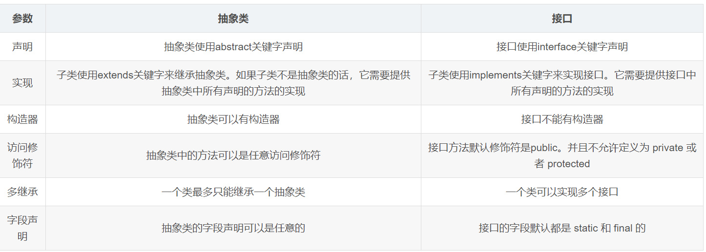

目录
- [1. Java概述](#1-java概述)
  - [1.1 JVM、JRE和JDK的关系](#11-jvmjre和jdk的关系)
  - [1.2 特性](#12-特性)
    - [1.2.1 跨平台性](#121-跨平台性)
    - [1.2.2 Java和C++的区别](#122-java和c的区别)
    - [1.2.3 Java应用程序与小程序差别](#123-java应用程序与小程序差别)
- [2. 数据类型](#2-数据类型)
  - [2.1 switch(byte, long, String)](#21-switchbyte-long-string)
  - [2.2 short值 + 1](#22-short值--1)
- [3. 访问修饰符](#3-访问修饰符)
- [4. 运算符](#4-运算符)
- [5. 关键字](#5-关键字)
  - [5.1 goto](#51-goto)
  - [5.2 final](#52-final)
    - [5.2.1 final finally finalize区别](#521-final-finally-finalize区别)
  - [5.3 this](#53-this)
  - [5.4 super](#54-super)
  - [5.5 static](#55-static)
    - [5.5.1 static特性](#551-static特性)
    - [5.5.2 static应用场景](#552-static应用场景)
- [6. 面向对象](#6-面向对象)
  - [6.1 面向对象的特征](#61-面向对象的特征)
    - [6.1.1 override 和 overload 区别](#611-override-和-overload-区别)
    - [6.1.2 多态的实现](#612-多态的实现)
  - [6.2 类和接口](#62-类和接口)
  - [6.3 内部类](#63-内部类)


## 1. Java概述

### 1.1 JVM、JRE和JDK的关系

JVM

Java Virtual Machine是Java虚拟机，Java程序需要运行在虚拟机上，不同的平台有自己的虚拟机，因此Java语言可以实现跨平台。

JRE

Java Runtime Environment包括Java虚拟机和Java程序所需的核心类库等。核心类库主要是java.lang包：包含了运行Java程序必不可少的系统类，如基本数据类型、基本数学函数、字符串处理、线程、异常处理类等，系统缺省加载这个包

如果想要运行一个开发好的Java程序，计算机中只需要安装JRE即可。

JDK

Java Development Kit是提供给Java开发人员使用的，其中包含了Java的开发工具，也包括了JRE。所以安装了JDK，就无需再单独安装JRE了。其中的开发工具：编译工具(javac.exe)，打包工具(jar.exe)等。

### 1.2 特性

- 面向对象（封装，继承，多态）
- 平台无关性（Java虚拟机实现平台无关性）
- 支持网络编程并且很方便（Java语言诞生本身就是为简化网络编程设计的）
- 支持多线程（多线程机制使应用程序在同一时间并行执行多项任）
- 健壮性（Java语言的强类型机制、异常处理、垃圾的自动收集等）
- 安全性

#### 1.2.1 跨平台性

所谓跨平台性，是指java语言编写的程序，一次编译后，可以在多个系统平台上运行。

实现原理：Java程序是通过java虚拟机在系统平台上运行的，只要该系统可以安装相应的java虚拟机，该系统就可以运行java程序。

#### 1.2.2 Java和C++的区别

- 都是面向对象的语言，都支持封装、继承和多态
- Java不提供指针来直接访问内存，程序内存更加安全
- Java的类是单继承的，C++支持多重继承；虽然Java的类不可以多继承，但是接口可以多继承。
- Java有自动内存管理机制，不需要程序员手动释放无用内存

#### 1.2.3 Java应用程序与小程序差别

简单说应用程序是从主线程启动(也就是main()方法)。applet小程序没有main方法，主要是嵌在浏览器页面上运行(调用init()线程或者run()来启动)，嵌入浏览器这点跟flash的小游戏类似。

## 2. 数据类型


### 2.1 switch(byte, long, String)

在 Java 5 以前，switch(expr)中，expr 只能是 byte、short、char、int。

从 Java5 开始，Java 中引入了枚举类型，expr 也可以是 enum 类型。

从 Java 7 开始，expr 还可以是字符串（String），但是长整型（long）在目前所有的版本中都是不可以的。

### 2.2 short值 + 1

对于 short s1 = 1; s1 = s1 + 1：

由于 1 是 int 类型，因此 s1+1 运算结果也是 int型，需要强制转换类型才能赋值给 short 型。

而 short s1 = 1; s1 += 1：

可以正确编译，因为 s1+= 1;相当于 s1 = (short(s1 + 1);其中有隐含的强制类型转换。

## 3. 访问修饰符


## 4. 运算符

&运算符有两种用法：(1)按位与；(2)逻辑与。

& 在判断语句中，需要判断所有的判断语句。例如：

```
if((23!=23)&&(100/0==0))
```

&&运算符是短路与运算。逻辑与跟短路与的差别是非常巨大的，虽然二者都要求运算符左右两端的布尔值都是true 整个表达式的值才是 true。

&&之所以称为短路运算，**是因为如果&&左边的表达式的值是 false，右边的表达式会被直接短路掉，**不会进行运算。

注意：逻辑或运算符（|）和短路或运算符（||）的差别也是如此。

## 5. 关键字

### 5.1 goto
goto 是 Java 中的保留字，在目前版本的 Java 中没有使用。

### 5.2 final

用于修饰类、属性和方法；

- 被final修饰的类不可以被继承
- 被final修饰的方法不可以被重写
- 被final修饰的变量不可以被改变，被final修饰不可变的是变量的引用，而不是引用指向的内容，引用指向的内容是可以改变的

#### 5.2.1 final finally finalize区别

- final可以修饰类、变量、方法，修饰类表示该类不能被继承、修饰方法表示该方法不能被重写、修饰变量表
示该变量是一个常量不能被重新赋值。
- finally一般作用在try-catch代码块中，在处理异常的时候，通常我们将一定要执行的代码方法finally代码块
中，表示不管是否出现异常，该代码块都会执行，一般用来存放一些关闭资源的代码。
- finalize是一个方法，属于Object类的一个方法，而Object类是所有类的父类，该方法一般由垃圾回收器来调
用，当我们调用System.gc() 方法的时候，由垃圾回收器调用finalize()，回收垃圾，一个对象是否可回收的
最后判断。

### 5.3 this

this是自身的一个对象，代表对象本身，可以理解为：指向对象本身的一个指针。

this的用法在java中大体可以分为3种：

1.普通的直接引用，this相当于是指向当前对象本身。

2.形参与成员名字重名，用this来区分：

```
public Person(String name, int age) {
    this.name = name;
    this.age = age;
}
```

3.引用本类的构造函数
```
class Person{
    private String name;
    private int age;
    
    public Person() {
    }
 
    public Person(String name) {
        this.name = name;
    }
    public Person(String name, int age) {
        this(name);
        this.age = age;
    }
}
```

### 5.4 super
super可以理解为是指向自己超（父）类对象的一个指针，而这个超类指的是离自己最近的一个父类。

super也有三种用法：

1.普通的直接引用

与this类似，super相当于是指向当前对象的父类的引用，这样就可以用super.xxx来引用父类的成员。

2.子类中的成员变量或方法与父类中的成员变量或方法同名时，用super进行区分。

```
class Person{
    protected String name;
 
    public Person(String name) {
        this.name = name;
    }
 
}
 
class Student extends Person{
    private String name;
 
    public Student(String name, String name1) {
        super(name);
        this.name = name1;
    }
 
    public void getInfo(){
        System.out.println(this.name);      //Child
        System.out.println(super.name);     //Father
    }
 
}

public class Test {
    public static void main(String[] args) {
       Student s1 = new Student("Father","Child");
       s1.getInfo();
 
    }
}
```

3.引用父类构造函数

- super（参数）：调用父类中的某一个构造函数（应该为构造函数中的第一条语句）。
- this（参数）：调用本类中另一种形式的构造函数（应该为构造函数中的第一条语句）。

### 5.5 static

static的主要意义是在于创建独立于具体对象的域变量或者方法。以致于即使没有创建对象，也能使用属性和调用方法！

static关键字还有一个比较关键的作用就是 用来形成静态代码块以优化程序性能。static块可以置于类中的任何地方，类中可以有多个static块。在类初次被加载的时候，会按照static块的顺序来执行每个static块，并且只会执行一次。

为什么说static块可以用来优化程序性能，是因为它的特性:只会在类加载的时候执行一次。因此，很多时候会将一些只需要进行一次的初始化操作都放在static代码块中进行。

#### 5.5.1 static特性
1、 被static修饰的变量或者方法是独立于该类的任何对象，也就是说，这些变量和方法不属于任何一个实例对象，而是被类的实例对象所共享。

2、 在该类被第一次加载的时候，就会去加载被static修饰的部分，而且只在类第一次使用时加载并进行初始化，注意这是第一次用就要初始化，后面根据需要是可以再次赋值的。

3、 static变量值在类加载的时候分配空间，以后创建类对象的时候不会重新分配。赋值的话，是可以任意赋值的！

4、 被static修饰的变量或者方法是优先于对象存在的，也就是说当一个类加载完毕之后，即便没有创建对象，也可以去访问。

#### 5.5.2 static应用场景

因为static是被类的实例对象所共享，因此如果某个成员变量是被所有对象所共享的，那么这个成员变量就应该定义为静态变量。

因此比较常见的static应用场景有：

1.  修饰成员变量 
2.  修饰成员方法 
3.  静态代码块
4.  修饰类【只能修饰内部类也就是静态内部类】
5.  静态导包

static注意事项
1.  静态只能访问静态。
2.  非静态既可以访问非静态的，也可以访问静态的。

## 6. 面向对象

### 6.1 面向对象的特征

- 抽象
  
    抽象是将一类对象的共同特征总结出来构造类的过程，包括数据抽象和行为抽象两方面。抽象只关注对象有哪些属性和行为，并不关注这些行为的细节是什么。

- 封装
  
    封装把一个对象的属性私有化，同时提供一些可以被外界访问的属性的方法，如果属性不想被外界访问，我们大可不必提供方法给外界访问。但是如果一个类没有提供给外界访问的方法，那么这个类也没有什么意义了。

- 继承
  
    继承是使用已存在的类的定义作为基础建立新类的技术，新类的定义可以增加新的数据或新的功能，也可以用父类的功能，但不能选择性地继承父类。通过使用继承我们能够非常方便地复用以前的代码。

    >关于继承如下 3 点请记住：
    >
    >- 子类拥有父类非 private 的属性和方法。
    >
    >- 子类可以拥有自己属性和方法，即子类可以对父类进行扩展。
    >
    >- 子类可以用自己的方式实现父类的方法。（以后介绍）。

- 多态

    父类或接口定义的引用变量可以指向子类或具体实现类的实例对象。提高了程序的拓展性。

    所谓多态就是指程序中定义的引用变量所指向的具体类型和通过该引用变量发出的方法调用在编程时并不确定，而是在程序运行期间才确定，即一个引用变量到底会指向哪个类的实例对象，该引用变量发出的方法调用到底是哪个类中实现的方法，必须在由程序运行期间才能决定。

    在Java中有两种形式可以实现多态：继承（多个子类对同一方法的重写）和接口（实现接口并覆盖接口中同一方法）。

    方法重载（overload）实现的是编译时的多态性（也称为前绑定），而方法重写（override）实现的是运行时的多态性（也称为后绑定）。

#### 6.1.1 override 和 overload 区别

- override（重写，覆盖） 
  - 方法名、参数、返回值相同。
  - 子类方法不能缩小父类方法的访问权限。 
  - 子类方法不能抛出比父类方法更多的异常(但子类方法可以不抛出异常)。 
  - 存在于父类和子类之间。
  - 方法被定义为final不能被重写。 
  - 被覆盖的方法不能为private，否则在其子类中只是新定义了一个方法，并没有对其进行覆盖。

    ```
    public static void main(String[] args){
        System.out.println(add(1,2));
        System.out.println(add(1.11,2.22));
    }
    //返回一个int类型相加的和
    public static int add(int a, int b){
        return a + b;
    }
    //返回一个double类型想加的和
    public static double add(double a, double b){
        return a + b;
    ```

- overload（重载，过载） 
  - 参数类型、个数、顺序至少有一个不相同。
  - 不能重载只有返回值不同的方法名。 
  - 针对于一个类而言。 
  - 不能通过访问权限、返回类型、抛出的异常进行重载；
  - 方法的异常类型和数目不会对重载造成影响；

    ```
    
    class Father{
        int num = 3;
    }
    class Son extends Father{
        int num = 5;
    }
    ```

    override应用中，最熟悉的覆盖就是对接口方法的实现，在接口中一般只是对方法进行了声明，而我们在实现时，就需要实现接口声明的所有方法。 除了这个典型的用法以外，我们在继承中也可能会在子类覆盖父类中的方法。

    override是在不同类之间的行为，overload是在同一个类中的行为。

#### 6.1.2 多态的实现

Java实现多态有三个必要条件：继承、重写、向上转型。

**继承**：在多态中必须存在有继承关系的子类和父类。

**重写**：子类对父类中某些方法进行重新定义，在调用这些方法时就会调用子类的方法。

**向上转型**：在多态中需要将子类的引用赋给父类对象，只有这样该引用才能够具备技能调用父类的方法和子类的方法。

只有满足了上述三个条件，我们才能够在同一个继承结构中使用统一的逻辑实现代码处理不同的对象，从而达到执行不同的行为。

对于Java而言，它多态的实现机制遵循一个原则：当超类对象引用变量引用子类对象时，被引用对象的类型而不是引用变量的类型决定了调用谁的成员方法，但是这个被调用的方法必须是在超类中定义过的，也就是说被子类覆盖的方法。

### 6.2 类和接口

抽象类是用来捕捉子类的通用特性的。接口是抽象方法的集合。

相同点：

- 接口和抽象类都不能实例化
- 都位于继承的顶端，用于被其他实现或继承
- 都包含抽象方法，其子类都必须覆写这些抽象方法

不同点：



>抽象类能使用 final 修饰吗？
>
>不能，定义抽象类就是让其他类继承的，如果定义为 final 该类就不能被继承，这样彼此就会产生矛盾，所以 final 不能修饰抽象类

### 6.3 内部类

在Java中，可以将一个类的定义放在另外一个类的定义内部，这就是内部类。内部类本身就是类的一个属性，与其他属性定义方式一致。

内部类可以分为四种：成员内部类、局部内部类、匿名内部类和静态内部类。

静态内部类：定义在类内部的静态类，就是静态内部类。静态内部类可以访问外部类所有的静态变量，而不可访问外部类的非静态变量。

成员内部类：定义在类内部，成员位置上的非静态类，就是成员内部类。成员内部类可以访问外部类所有的变量和方法，包括静态和非静态，私有和公有。

局部内部类：定义在方法中的内部类，就是局部内部类。定义在实例方法中的局部类可以访问外部类的所有变量和方法，定义在静态方法中的局部类只能访问外部类的静态变量和方法。

匿名内部类：匿名内部类就是没有名字的内部类，日常开发中使用的比较多。
```
public class Outer {

    private void test(final int i) {
        new Service() {
            public void method() {
                for (int j = 0; j < i; j++) {
                    System.out.println("匿名内部类" );
                }
            }
        }.method();
    }
 }
 //匿名内部类必须继承或实现一个已有的接口 
 interface Service{
    void method();
}
```

除了没有名字，匿名内部类还有以下特点：

- 匿名内部类必须继承一个抽象类或者实现一个接口。
- 匿名内部类不能定义任何静态成员和静态方法。
- 当所在的方法的形参需要被匿名内部类使用时，必须声明为 final。
- 匿名内部类不能是抽象的，它必须要实现继承的类或者实现的接口的所有抽象方法。

#### 6.3.1 局部内部类和匿名内部类访问局部变量的时候，为什么变量必须要加上final？

```
public class Outer {

    void outMethod(){
        final int a =10;
        class Inner {
            void innerMethod(){
                System.out.println(a);
            }

        }
    }
}

```

是因为**生命周期**不一致， 局部变量直接存储在栈中，当方法执行结束后，非final的局部变量就被销毁。

而局部内部类对局部变量的引用依然存在，如果局部内部类要调用局部变量时，就会出错。加了final，可以确保局部内部类使用的变量与外层的局部变量区分开，解决了这个问题。