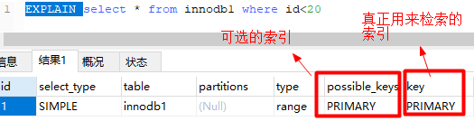

目录
- [1. 为什么要使用数据库](#1-为什么要使用数据库)
- [2. 三大范式](#2-三大范式)
- [3. MySQL存储引擎MyISAM与InnoDB区别](#3-mysql存储引擎myisam与innodb区别)
- [4. 索引](#4-索引)
  - [4.1 索引使用场景](#41-索引使用场景)
    - [4.1.1 where](#411-where)
    - [4.1.2 order by](#412-order-by)
    - [4.1.3 join](#413-join)
    - [4.1.4 索引覆盖](#414-索引覆盖)
  - [4.2 索引分类](#42-索引分类)
  - [4.3 索引的基本原理](#43-索引的基本原理)
  - [4.4 索引算法有哪些？](#44-索引算法有哪些)
  - [4.5 创建索引的原则（重中之重）](#45-创建索引的原则重中之重)
- [- 定义有外键的数据列一定要建立索引。](#ulli定义有外键的数据列一定要建立索引liul)
  - [4.6 什么是最左前缀原则？什么是最左匹配原则？](#46-什么是最左前缀原则什么是最左匹配原则)
  - [4.7 B树，B+树，红黑树的区别](#47-b树b树红黑树的区别)
  - [4.8 什么是聚簇索引？何时使用聚簇索引与非聚簇索引？](#48-什么是聚簇索引何时使用聚簇索引与非聚簇索引)
- [5. 事物的四大特性(ACID)](#5-事物的四大特性acid)
- [6. 什么是脏读？幻读？不可重复读？](#6-什么是脏读幻读不可重复读)
- [7. 什么是事务的隔离级别？MySQL的默认隔离级别是什么？](#7-什么是事务的隔离级别mysql的默认隔离级别是什么)
- [8. MySQL的锁](#8-mysql的锁)
  - [8.1 照锁的粒度分数据库锁有哪些？锁机制与InnoDB锁算法](#81-照锁的粒度分数据库锁有哪些锁机制与innodb锁算法)
    - [8.1.1 行级锁，表级锁和页级锁对比](#811-行级锁表级锁和页级锁对比)
  - [8.2 共享锁和排他锁。](#82-共享锁和排他锁)
  - [8.3 隔离级别与锁的关系](#83-隔离级别与锁的关系)
  - [8.4 死锁](#84-死锁)
  - [8.5 数据库的乐观锁和悲观锁是什么？怎么实现的？](#85-数据库的乐观锁和悲观锁是什么怎么实现的)
- [9. Sql执行顺序](#9-sql执行顺序)
- [10. SQL语句主要分为哪几类](#10-sql语句主要分为哪几类)
- [11. drop、delete与truncate的区别](#11-dropdelete与truncate的区别)
- [12. SQL语句的优化](#12-sql语句的优化)
  - [12.1 怎么发现有问题的SQL?（通过MySQL慢查询日志对有效率问题的SQL进行监控）](#121-怎么发现有问题的sql通过mysql慢查询日志对有效率问题的sql进行监控)
  - [12.2 通过explain查询和分析SQL的执行计划](#122-通过explain查询和分析sql的执行计划)
  - [12.3 SQL语句的优化](#123-sql语句的优化)

## 1. 为什么要使用数据库
- 数据保存在内存

    优点： 存取速度快；
    缺点： 数据不能永久保存。

- 数据保存在文件

    优点： 数据永久保存；
    缺点：1）速度比内存操作慢，频繁的IO操作。2）查询数据不方便。

- 数据保存在数据库

    1）数据永久保存。
    2）使用SQL语句，查询方便效率高。
    3）管理数据方便。

## 2. 三大范式
第一范式（1NF）：每一列属性都是不可再分的属性值，确保每一列的原子性。两列的属性相近或相似或一样，尽量合并属性一样的列，确保不产生冗余数据。


第二范式（2NF）：第二范式（2NF）是在第一范式（1NF）的基础上建立起来的。在第一范式的基础上，非主键列完全依赖于主键，而不能是依赖于主键的一部分。第二范式（2NF）要求数据库表中的每个实例或行必须可以被惟一地区分。


第三范式（3NF）：在第二范式的基础上，数据表中如果不存在非关键字段对任一候选关键字段的传递函数依赖则符合第三范式。所谓传递函数依赖，指的是如 果存在"A → B → C"的决定关系，则C传递函数依赖于A。因此，满足第三范式的数据库表应该不存在如下依赖关系： 关键字段 → 非关键字段 x → 非关键字段y

例子：比如Student表（学号，姓名，年龄，性别，所在院校，院校地址，院校电话）

这样一个表结构，就存在上述关系。 学号--> 所在院校 --> (院校地址，院校电话)

这样的表结构，我们应该拆开来，如下。

（学号，姓名，年龄，性别，所在院校）--（所在院校，院校地址，院校电话）

## 3. MySQL存储引擎MyISAM与InnoDB区别
|  | MyISAM | Innodb |
|------- | -------| -------|
| 存储结构 | 每张表被存放在三个文件：frm-表格定义、MYD(MYData)-数据文件、MYI(MYIndex)-索引文件| 所有的表都保存在同一个数据文件中（也可能是多个文件，或者是独立的表空间文件），InnoDB表的大小只受限于操作系统文件的大小，一般为2GB|
|存储空间| MyISAM可被压缩，存储空间较小 | InnoDB的表需要更多的内存和存储，它会在主内存中建立其专用的缓冲池用于高速缓冲数据和索引|
|可移植性、备份及恢复| 由于MyISAM的数据是以文件的形式存储，所以在跨平台的数据转移中会很方便。在备份和恢复时可单独针对某个表进行操作| 免费的方案可以是拷贝数据文件、备份 binlog，或者用 mysqldump，在数据量达到几十G的时候就相对痛苦了|
|文件格式|数据和索引是分别存储的，数据.MYD，索引.MYI|数据和索引是集中存储的。.ibd|
|记录存储顺序|按记录插入顺序保存|按主键大小有序插入|
|外键|不支持|支持|
|ACID事务|不支持|支持
|锁支持（锁是避免资源争用的一个机制，MySQL锁对用户几乎是透明的）|表级锁定|行级锁定、表级锁定，锁定力度小并发能力高|
|SELECT|MyISAM更优|	
|INSERT、UPDATE、DELETE||InnoDB更优|
|select count(*)|	myisam更快，因为myisam内部维护了一个计数器，可以直接调取。||	
|索引的实现方式|B+树索引，myisam 是堆表	|B+树索引，Innodb 是索引组织表
|哈希索引| 不支持| 支持
|全文索引| 支持|不支持

>MyISAM索引与InnoDB索引的区别？
> - InnoDB索引是聚簇索引，MyISAM索引是非聚簇索引。
> - InnoDB的主键索引的叶子节点存储着行数据，因此主键索引非常高效。
> - MyISAM索引的叶子节点存储的是行数据地址，需要再寻址一次才能得到数据。
> - InnoDB非主键索引的叶子节点存储的是主键和其他带索引的列数据，因此查询时做到覆盖索引会非常高效。

## 4. 索引

### 4.1 索引使用场景

#### 4.1.1 where



上图中，根据id查询记录，因为id字段仅建立了主键索引，因此此SQL执行可选的索引只有主键索引，如果有多个，最终会选一个较优的作为检索的依据。

#### 4.1.2 order by
当我们使用order by将查询结果按照某个字段排序时，如果该字段没有建立索引，那么执行计划会将查询出的所有数据使用外部排序（将数据从硬盘分批读取到内存使用内部排序，最后合并排序结果），这个操作是很影响性能的，因为需要将查询涉及到的所有数据从磁盘中读到内存（如果单条数据过大或者数据量过多都会降低效率），更无论读到内存之后的排序了。

但是如果我们对该字段建立索引alter table(表名) add index(字段名)，那么由于索引本身是有序的，因此直接按照索引的顺序和映射关系逐条取出数据即可。而且如果分页的，那么只用取出索引表某个范围内的索引对应的数据，而不用像上述那取出所有数据进行排序再返回某个范围内的数据。（从磁盘取数据是最影响性能的）

#### 4.1.3 join
对join语句匹配关系（on）涉及的字段建立索引能够提高效率。

#### 4.1.4 索引覆盖
如果要查询的字段都建立过索引，那么引擎会直接在索引表中查询而不会访问原始数据（否则只要有一个字段没有建立索引就会做全表扫描），这叫索引覆盖。因此我们需要尽可能的在select后只写必要的查询字段，以增加索引覆盖的几率。

这里值得注意的是不要想着为每个字段建立索引，因为优先使用索引的优势就在于其体积小。

### 4.2 索引分类

- 主键索引: 数据列不允许重复，不允许为NULL，一个表只能有一个主键。
- 唯一索引: 数据列不允许重复，允许为NULL值，一个表允许多个列创建唯一索引。
  - 可以通过 ALTER TABLE table_name ADD UNIQUE (column); 创建唯一索引
  - 可以通过 ALTER TABLE table_name ADD UNIQUE (column1,column2); 创建唯一组合索引
- 普通索引: 基本的索引类型，没有唯一性的限制，允许为NULL值。
  - 可以通过ALTER TABLE table_name ADD INDEX index_name (column);创建普通索引
  - 可以通过ALTER TABLE table_name ADD INDEX index_name(column1, column2, column3);创建组合索引
- 全文索引： 是目前搜索引擎使用的一种关键技术
  - 可以通过ALTER TABLE table_name ADD FULLTEXT (column);创建全文索引

### 4.3 索引的基本原理
索引用来快速地寻找那些具有特定值的记录。如果没有索引，一般来说执行查询时遍历整张表。

索引的原理很简单，就是把无序的数据变成有序的查询

把创建了索引的列的内容进行排序，对排序结果生成倒排表，在倒排表内容上拼上数据地址链

在查询的时候，先拿到倒排表内容，再取出数据地址链，从而拿到具体数据。

### 4.4 索引算法有哪些？
索引算法有 BTree算法和Hash算法

- BTree算法

    BTree是最常用的mysql数据库索引算法，也是mysql默认的算法。因为它不仅可以被用在=,>,>=,<,<=和between这些比较操作符上，而且还可以用于like操作符，只要它的查询条件是一个不以通配符开头的常量， 例如：

    ```
    -- 只要它的查询条件是一个不以通配符开头的常量
    select * from user where name like 'jack%'; 
    -- 如果一通配符开头，或者没有使用常量，则不会使用索引，例如： 
    select * from user where name like '%jack';
    ```

- Hash算法

    Hash Hash索引只能用于对等比较，例如=,<=>（相当于=）操作符。由于是一次定位数据，不像BTree索引需要从根节点到枝节点，最后才能访问到页节点这样多次IO访问，所以检索效率远高于BTree索引。

### 4.5 创建索引的原则（重中之重）
索引虽好，但也不是无限制的使用，最好符合一下几个原则

- 最左前缀匹配原则，组合索引非常重要的原则，mysql会一直向右匹配直到遇到范围查询(>、<、between、like)就停止匹配，比如a = 1 and b = 2 and c > 3 and d = 4 如果建立(a,b,c,d)顺序的索引，d是用不到索引的，如果建立(a,b,d,c)的索引则都可以用到，a,b,d的顺序可以任意调整。

- 较频繁作为查询条件的字段才去创建索引

- 尽量的扩展索引，不要新建索引。比如表中已经有a的索引，现在要加(a,b)的索引，那么只需要修改原来的索引即可。

- 定义有外键的数据列一定要建立索引。
-------------
- 更新频繁字段不适合创建索引

- 若是不能有效区分数据的列不适合做索引列(如性别，男女未知，最多也就三种，区分度实在太低)

- 对于那些查询中很少涉及的列，重复值比较多的列不要建立索引。

- 对于定义为text、image和bit的数据类型的列不要建立索引。

### 4.6 什么是最左前缀原则？什么是最左匹配原则？
顾名思义，就是最左优先，在创建多列索引时，要根据业务需求，where子句中使用最频繁的一列放在最左边。

最左前缀匹配原则，非常重要的原则，mysql会一直向右匹配直到遇到范围查询(>、<、between、like)就停止匹配，比如a = 1 and b = 2 and c > 3 and d = 4 如果建立(a,b,c,d)顺序的索引，d是用不到索引的，如果建立(a,b,d,c)的索引则都可以用到，a,b,d的顺序可以任意调整。

=和in可以乱序，比如a = 1 and b = 2 and c = 3 建立(a,b,c)索引可以任意顺序，mysql的查询优化器会帮你优化成索引可以识别的形式

### 4.7 B树，B+树，红黑树的区别

- 红黑树和AVL树区别

    AVL树是严格的平衡二叉树，平衡条件必须满足（所有节点的左右子树高度差不超过1）。不管我们是执行插入还是删除操作，只要不满足上面的条件，就要通过旋转来保持平衡。所以AVL树适合用于插入与删除次数比较少，但查找多的情况。

    红黑树是弱平衡二叉树，它通过着色限制的关系，确保没有一条路径会比其它路径长出两倍，相对于AVL树来说，它的旋转次数少，所以对于搜索，插入，删除操作较多的情况下，我们就用红黑树。

>红黑树的性质(必背，面试必问必介绍)：
>
>红色结点不可能相连，黑色节点可以相连
>根节点是黑色节点
>每个红色节点的两个子节点都是黑色，叶子节点都是黑色(Null节点)
>从任一节点到其每个叶子的所有路径都包含相同数目的黑色节点。
>插入的点默认都是红色

- B树和B+树区别
    在B树中，你可以将键和值存放在内部节点和叶子节点；但在B+树中，内部节点都是键，没有值，叶子节点同时存放键和值。

    B+树的叶子节点有一条链相连，而B树的叶子节点各自独立。

总结：

红黑树

优点：

- 保证了不会出现不平衡情况，适合用于内存型数据结构(为什么hashmap用红黑树）

缺点：
- 索引是存储在磁盘文件上，磁盘上的存储是随机存储，每次都需要转圈去读取一个节点，这样当**树的深度过大而造成磁盘IO读写过于频繁**，进而导致效率低效的情况
- 磁盘每次读取是读一页，一页只是为了获取一个节点的数据，也会造成性能浪费3

B树

优点：
- 一个节点存储多个数据，更好的利用磁盘页的大小
- n叉树树的高度降低，磁盘读取次数降低

缺点：
- 非叶节点存储数据，查询效率不稳定
- 非叶节点存储key和data指针，导致一个节点内能存的key数量降低，导致树的高度增高
- B树不适合做范围查询，必须用中序遍历的方法按序扫库
  
B+树

优点：
- 叶子节点用指针连在一起形成双向链表，增加了遍历的高效性
- 非叶节点不带数据，可以更高效使用索引空间

缺点：
- B+树的数据只出现在叶子节点上，单次查询性能不如B树


>索引为何使用B+树?
>- B树只适合随机检索，而B+树同时支持随机检索和顺序检索；
>
>- B+树空间利用率更高，可减少I/O次数，磁盘读写代价更低。一般来说，索引本身也很大，不可能全部存储在内存中，因此索引往往以索引文件的形式存储的磁盘上。这样的话，索引查找过程中就要产生磁盘I/O消耗。B+树的内部结点并没有指向关键字具体信息的指针，只是作为索引使用，其内部结点比B树小，盘块能容纳的结点中关键字数量更多，一次性读入内存中可以查找的关键字也就越多，相对的，IO读写次数也就降低了。而IO读写次数是影响索引检索效率的最大因素；
>- B+树的查询效率更加稳定。B树搜索有可能会在非叶子结点结束，越靠近根节点的记录查找时间越短，只要找到关键字即可确定记录的存在，其性能等价于在关键字全集内做一次二分查找。而在B+树中，顺序检索比较明显，随机检索时，任何关键字的查找都必须走一条从根节点到叶节点的路，所有关键字的查找路径长度相同，导致每一个关键字的查询效率相当。
>- B树在提高了磁盘IO性能的同时并没有解决元素遍历的效率低下的问题。B+树的叶子节点使用指针顺序连接在一起，只要遍历叶子节点就可以实现整棵树的遍历。而且在数据库中基于范围的查询是非常频繁的，而B树不支持这样的操作。
>- 增删文件（节点）时，效率更高。因为B+树的叶子节点包含所有关键字，并以有序的链表结构存储，这样可很好提高增删效率。

### 4.8 什么是聚簇索引？何时使用聚簇索引与非聚簇索引？

聚簇索引：将数据存储与索引放到了一块，找到索引也就找到了数据。聚簇索引按照数据的物理存储进行划分的。对于一堆记录来说，使用聚集索引就是对这堆记录进行堆划分，即主要描述的是物理上的存储。正是因为这种划分方法，导致聚簇索引必须是唯一的。聚集索引可以帮助把很大的范围，迅速减小范围。但是查找该记录，就要从这个小范围中Scan了。

非聚簇索引：把一个很大的范围，转换成一个小的地图，然后你需要在这个小地图中找你要寻找的信息的位置，最后通过这个位置，再去找你所需要的记录。将数据存储于索引分开结构，索引结构的叶子节点指向了数据的对应行，myisam通过key_buffer把索引先缓存到内存中，当需要访问数据时（通过索引访问数据），在内存中直接搜索索引，然后通过索引找到磁盘相应数据，这也就是为什么索引不在key buffer命中时，速度慢的原因。

澄清一个概念：innodb中，在聚簇索引之上创建的索引称之为辅助索引，辅助索引访问数据总是需要二次查找，非聚簇索引都是辅助索引，像复合索引、前缀索引、唯一索引，辅助索引叶子节点存储的不再是行的物理位置，而是主键值。

## 5. 事物的四大特性(ACID)

- 原子性： 事务是最小的执行单位，不允许分割。事务的原子性确保动作要么全部完成，要么完全不起作用；
- 一致性： 执行事务前后，数据保持一致，多个事务对同一个数据读取的结果是相同的；
- 隔离性： 并发访问数据库时，一个用户的事务不被其他事务所干扰，各并发事务之间数据库是独立的；
- 持久性： 一个事务被提交之后。它对数据库中数据的改变是持久的，即使数据库发生故障也不应该对其有任何影响。

## 6. 什么是脏读？幻读？不可重复读？
- 脏读(Drity Read)：某个事务已更新一份数据，另一个事务在此时读取了同一份数据，由于某些原因，前一个RollBack了操作，则后一个事务所读取的数据就会是不正确的。
- 不可重复读(Non-repeatable read):在一个事务的两次查询之中数据不一致，这可能是两次查询过程中间插入了一个事务更新的原有的数据。
- 幻读(Phantom Read):在一个事务的两次查询中数据笔数不一致，例如有一个事务查询了几列(Row)数据，而另一个事务却在此时插入了新的几列数据，先前的事务在接下来的查询中，就会发现有几列数据是它先前所没有的。

## 7. 什么是事务的隔离级别？MySQL的默认隔离级别是什么？
为了达到事务的四大特性，数据库定义了4种不同的事务隔离级别，由低到高依次为Read uncommitted、Read committed、Repeatable read、Serializable，这四个级别可以逐个解决脏读、不可重复读、幻读这几类问题。


SQL 标准定义了四个隔离级别：

- READ-UNCOMMITTED(读取未提交)： 最低的隔离级别，允许读取尚未提交的数据变更，可能会导致脏读、幻读或不可重复读。
- READ-COMMITTED(读取已提交)： 允许读取并发事务已经提交的数据，可以阻止脏读，但是幻读或不可重复读仍有可能发生。
- REPEATABLE-READ(可重复读)： 对同一字段的多次读取结果都是一致的，除非数据是被本身事务自己所修改，可以阻止脏读和不可重复读，但幻读仍有可能发生。
- SERIALIZABLE(可串行化)： 最高的隔离级别，完全服从ACID的隔离级别。所有的事务依次逐个执行，这样事务之间就完全不可能产生干扰，也就是说，该级别可以防止脏读、不可重复读以及幻读。

## 8. MySQL的锁
当数据库有并发事务的时候，可能会产生数据的不一致，这时候需要一些机制来保证访问的次序，锁机制就是这样的一个机制。

就像酒店的房间，如果大家随意进出，就会出现多人抢夺同一个房间的情况，而在房间上装上锁，申请到钥匙的人才可以入住并且将房间锁起来，其他人只有等他使用完毕才可以再次使用。

### 8.1 照锁的粒度分数据库锁有哪些？锁机制与InnoDB锁算法

在关系型数据库中，可以按照锁的粒度把数据库锁分为行级锁(INNODB引擎)、表级锁(MYISAM引擎)和页级锁(BDB引擎 )。

MyISAM和InnoDB存储引擎使用的锁：

- MyISAM采用表级锁(table-level locking)。
- InnoDB支持行级锁(row-level locking)和表级锁，默认为行级锁。
  

#### 8.1.1 行级锁，表级锁和页级锁对比

行级锁 

行级锁是Mysql中锁定粒度最细的一种锁，表示只针对当前操作的行进行加锁。行级锁能大大减少数据库操作的冲突。其加锁粒度最小，但加锁的开销也最大。行级锁分为共享锁和排他锁。

特点：开销大，加锁慢；会出现死锁；锁定粒度最小，发生锁冲突的概率最低，并发度也最高。

表级锁 

表级锁是MySQL中锁定粒度最大的一种锁，表示对当前操作的整张表加锁，它实现简单，资源消耗较少，被大部分MySQL引擎支持。最常使用的MYISAM与INNODB都支持表级锁定。表级锁定分为表共享读锁（共享锁）与表独占写锁（排他锁）。

特点：开销小，加锁快；不会出现死锁；锁定粒度大，发出锁冲突的概率最高，并发度最低。

页级锁 

页级锁是MySQL中锁定粒度介于行级锁和表级锁中间的一种锁。表级锁速度快，但冲突多，行级冲突少，但速度慢。所以取了折衷的页级，一次锁定相邻的一组记录。

特点：开销和加锁时间界于表锁和行锁之间；会出现死锁；锁定粒度界于表锁和行锁之间，并发度一般

### 8.2 共享锁和排他锁。
共享锁: 又叫做读锁。 当用户要进行数据的读取时，对数据加上共享锁。共享锁可以同时加上多个。

排他锁: 又叫做写锁。 当用户要进行数据的写入时，对数据加上排他锁。排他锁只可以加一个，他和其他的排他锁，共享锁都相斥。

用上面的例子来说就是用户的行为有两种，一种是来看房，多个用户一起看房是可以接受的。 一种是真正的入住一晚，在这期间，无论是想入住的还是想看房的都不可以。

锁的粒度取决于具体的存储引擎，InnoDB实现了行级锁，页级锁，表级锁。

他们的加锁开销从大到小，并发能力也是从大到小。

### 8.3 隔离级别与锁的关系
- 在Read Uncommitted级别下，读取数据不需要加共享锁，这样就不会跟被修改的数据上的排他锁冲突。
- 在Read Committed级别下，读操作需要加共享锁，但是在语句执行完以后释放共享锁；
- 在Repeatable Read级别下，读操作需要加共享锁，但是在事务提交之前并不释放共享锁，也就是必须等待事务执行完毕以后才释放共享锁。
- SERIALIZABLE 是限制性最强的隔离级别，因为该级别锁定整个范围的键，并一直持有锁，直到事务完成。

### 8.4 死锁
死锁是指两个或多个事务在同一资源上相互占用，并请求锁定对方的资源，从而导致恶性循环的现象。

常见的解决死锁的方法

1、如果不同程序会并发存取多个表，尽量约定以相同的顺序访问表，可以大大降低死锁机会。

2、在同一个事务中，尽可能做到一次锁定所需要的所有资源，减少死锁产生概率；

3、对于非常容易产生死锁的业务部分，可以尝试使用升级锁定颗粒度，通过表级锁定来减少死锁产生的概率；

如果业务处理不好可以用分布式事务锁或者使用乐观锁。

### 8.5 数据库的乐观锁和悲观锁是什么？怎么实现的？
数据库管理系统（DBMS）中的并发控制的任务是确保在多个事务同时存取数据库中同一数据时不破坏事务的隔离性和统一性以及数据库的统一性。乐观并发控制（乐观锁）和悲观并发控制（悲观锁）是并发控制主要采用的技术手段。

- 悲观锁：假定会发生并发冲突，屏蔽一切可能违反数据完整性的操作。在查询完数据的时候就把事务锁起来，直到提交事务。实现方式：使用数据库中的锁机制

- 乐观锁：假设不会发生并发冲突，只在提交操作时检查是否违反数据完整性。在修改数据的时候把事务锁起来，通过version的方式来进行锁定。实现方式：乐观锁一般会使用版本号机制或CAS算法实现。

>两种锁的使用场景
>
>从上面对两种锁的介绍，我们知道两种锁各有优缺点，不可认为一种好于另一种，像乐观锁适用于写比较少的情况下（多读场景），即冲突真的很少发生的时候，这样可以省去了锁的开销，加大了系统的整个吞吐量。
>
>但如果是多写的情况，一般会经常产生冲突，这就会导致上层应用会不断的进行retry，这样反倒是降低了性能，所以一般多写的场景下用悲观锁就比较合适。

## 9. Sql执行顺序 
(1)from 
(2) on 
(3) join
(4) where 
(5)group by(开始使用select中的别名，后面的语句中都可以使用)
(6)avg,sum.... 
(7)having 
(8)select 
(9)distinct 
(10)order by

## 10. SQL语句主要分为哪几类
- 数据定义语言DDL（Data Ddefinition Language）CREATE，DROP，ALTER

主要为以上操作 即对逻辑结构等有操作的，其中包括表结构，视图和索引。

- 数据查询语言DQL（Data Query Language）SELECT

这个较为好理解 即查询操作，以select关键字。各种简单查询，连接查询等 都属于DQL。

- 数据操纵语言DML（Data Manipulation Language）INSERT，UPDATE，DELETE

主要为以上操作 即对数据进行操作的，对应上面所说的查询操作 DQL与DML共同构建了多数初级程序员常用的增删改查操作。而查询是较为特殊的一种 被划分到DQL中。

- 数据控制功能DCL（Data Control Language）GRANT，REVOKE，COMMIT，ROLLBACK

主要为以上操作 即对数据库安全性完整性等有操作的，可以简单的理解为权限控制等。

## 11. drop、delete与truncate的区别
||Delete	| Truncate| Drop |
| ------ |-------| --------| -----|
|类型| 属于数据操纵语言(DML)| 属于数据定义语言(DDL) | 属于数据定义语言(DDL)|
|回滚| 可回滚| 不可回滚| 不可回滚
|删除内容 |表结构还在，删除表的全部或者一部分数据行 |表结构还在，删除表中的所有数据 |从数据库中删除表，所有的数据行，索引和权限也会被删除
|删除速度 |删除速度慢，需要逐行删除 |删除速度快 |删除速度最快

## 12. SQL语句的优化

SQL语句的优化主要包括三个问题，即如何发现有问题的SQL、如何分析SQL的执行计划以及如何优化SQL，下面将逐一解释。

### 12.1 怎么发现有问题的SQL?（通过MySQL慢查询日志对有效率问题的SQL进行监控）
MySQL的慢查询日志是MySQL提供的一种日志记录，它用来记录在MySQL中响应时间超过阀值的语句，具体指运行时间超过long_query_time值的SQL，则会被记录到慢查询日志中。long_query_time的默认值为10，意思是运行10s以上的语句。

通过MySQL的慢查询日志，我们可以查询出执行的次数多占用的时间长的SQL、可以通过pt_query_disgest(一种mysql慢日志分析工具)分析Rows examine(MySQL执行器需要检查的行数)项去找出IO大的SQL以及发现未命中索引的SQL，对于这些SQL，都是我们优化的对象。

### 12.2 通过explain查询和分析SQL的执行计划

　使用 EXPLAIN 关键字可以知道MySQL是如何处理你的SQL语句的，以便分析查询语句或是表结构的性能瓶颈。通过explain命令可以得到表的读取顺序、数据读取操作的操作类型、哪些索引可以使用、哪些索引被实际使用、表之间的引用以及每张表有多少行被优化器查询等问题。当扩展列extra出现Using filesort和Using temporay，则往往表示SQL需要优化了。

### 12.3 SQL语句的优化

优化insert语句：一次插入多值；

应尽量避免在 where 子句中使用!=或<>操作符，否则将引擎放弃使用索引而进行全表扫描；

应尽量避免在 where 子句中对字段进行null值判断，否则将导致引擎放弃使用索引而进行全表扫描；

优化嵌套查询：子查询可以被更有效率的连接(Join)替代；

很多时候用 exists 代替 in 是一个好的选择。