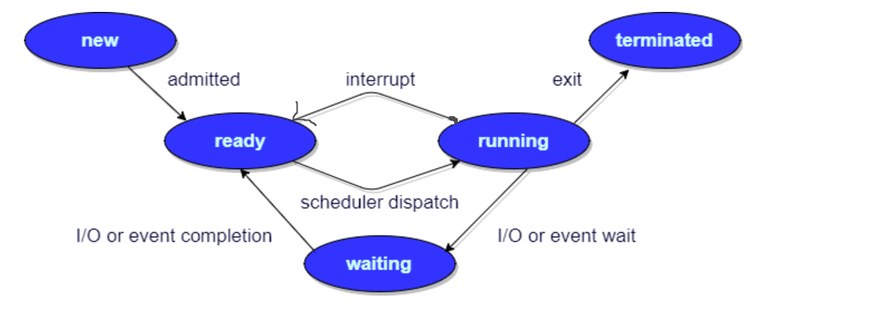

目录
- [1. 线程和进程](#1-线程和进程)
  - [1.1 区别](#11-区别)
  - [1.2 进程有哪几种状态](#12-进程有哪几种状态)
  - [1.3 进程的通信方式](#13-进程的通信方式)
  - [1.4 进程的调度算法](#14-进程的调度算法)
  - [1.5 线程同步的方式](#15-线程同步的方式)
  - [1.6 用户级线程，内核级线程](#16-用户级线程内核级线程)
- [2. 虚拟内存](#2-虚拟内存)
  - [2.1 什么是虚拟内存(Virtual Memory)](#21-什么是虚拟内存virtual-memory)
  - [2.2 虚拟存储器](#22-虚拟存储器)
  - [2.3 虚拟内存的技术实现](#23-虚拟内存的技术实现)
  - [2.4 页面置换算法](#24-页面置换算法)
- [3. 死锁](#3-死锁)

## 1. 线程和进程

### 1.1 区别

- 进程是具有一定功能的程序关于某个数据集合上的一次运行活动，进程是系统进行资源调度和分配的一个独立单位。
- 线程是进程的实体，是CPU调度和分派的基本单位，它是比进程更小的能独立运行的基本单位。
- 一个进程可以有多个线程，多个线程也可以并发执行

>解释：计算机的核心是CPU，它承担了所有的计算任务。它就像一座工厂，时刻在运行。
>
>假定工厂的电力有限，一次只能供给一个车间使用。也就是说，一个车间开工的时候，其他车间都必须停工。背后的含义就是，单个CPU一次只能运行一个任务。
>
>进程就好比工厂的车间，它代表CPU所能处理的单个任务。任一时刻，CPU总是运行一个进程，其他进程处于非运行状态。
>
>一个车间里，可以有很多工人。他们协同完成一个任务。线程就好比车间里的工人。一个进程可以包括多个线程。车间的空间是工人们共享的，比如许多房间是每个工人都可以进出的。这象征一个进程的内存空间是共享的，每个线程都可以使用这些共享内存。
>
>可是，每间房间的大小不同，有些房间最多只能容纳一个人，比如厕所。里面有人的时候，其他人就不能进去了。这代表一个线程使用某些共享内存时，其他线程必须等它结束，才能使用这一块内存。一个防止他人进入的简单方法，就是门口加一把锁。先到的人锁上门，后到的人看到上锁，就在门口排队，等锁打开再进去。这就叫"互斥锁"（Mutual exclusion，缩写 Mutex），防止多个线程同时读写某一块内存区域。
>
>还有些房间，可以同时容纳n个人，比如厨房。也就是说，如果人数大于n，多出来的人只能在外面等着。这好比某些内存区域，只能供给固定数目的线程使用。这时的解决方法，就是在门口挂n把钥匙。进去的人就取一把钥匙，出来时再把钥匙挂回原处。后到的人发现钥匙架空了，就知道必须在门口排队等着了。这种做法叫做"信号量"（Semaphore），用来保证多个线程不会互相冲突。不难看出，mutex是semaphore的一种特殊情况（n=1时）。也就是说，完全可以用后者替代前者。但是，因为mutex较为简单，且效率高，所以在必须保证资源独占的情况下，还是采用这种设计。

### 1.2 进程有哪几种状态
- 建状态(new) ：进程正在被创建，尚未到就绪状态。
- 就绪状态(ready) ：进程已处于准备运行状态，即进程获得了除了处理器之外的一切所需资源，一旦得到处理器资源(处理器分配的时间片)即可运行。
- 运行状态(running) ：进程正在处理器上上运行(单核 CPU 下任意时刻只有一个进程处于运行状态)。
- 阻塞状态(waiting) ：又称为等待状态，进程正在等待某一事件而暂停运行如等待某资源为可用或等待 IO 操作完成。即使处理器空闲，该进程也不能运行。
- 结束状态(terminated) ：进程正在从系统中消失。可能是进程正常结束或其他原因中断退出运行。



### 1.3 进程的通信方式
- 管道/匿名管道(Pipes) ：用于具有亲缘关系的父子进程间或者兄弟进程之间的通信。
- 有名管道(Names Pipes) : 匿名管道由于没有名字，只能用于亲缘关系的进程间通信。为了克服这个缺点，提出了有名管道。有名管道严格遵循先进先出(first in first out)。有名管道以磁盘文件的方式存在，可以实现本机任意两个进程通信。
- 信号(Signal) ：信号是一种比较复杂的通信方式，用于通知接收进程某个事件已经发生；
- 消息队列(Message Queuing) ：消息队列是消息的链表,具有特定的格式,存放在内存中并由消息队列标识符标识。管道和消息队列的通信数据都是先进先出的原则。与管道（无名管道：只存在于内存中的文件；命名管道：存在于实际的磁盘介质或者文件系统）不同的是消息队列存放在内核中，只有在内核重启(即，操作系统重启)或者显示地删除一个消息队列时，该消息队列才会被真正的删除。消息队列可以实现消息的随机查询,消息不一定要以先进先出的次序读取,也可以按消息的类型读取.比 FIFO 更有优势。消息队列克服了信号承载信息量少，管道只能承载无格式字 节流以及缓冲区大小受限等缺。
- 信号量(Semaphores) ：信号量是一个计数器，用于多进程对共享数据的访问，信号量的意图在于进程间同步。这种通信方式主要用于解决与同步相关的问题并避免竞争条件。
- 共享内存(Shared memory) ：使得多个进程可以访问同一块内存空间，不同进程可以及时看到对方进程中对共享内存中数据的更新。这种方式需要依靠某种同步操作，如互斥锁和信号量等。可以说这是最有用的进程间通信方式。
- 套接字(Sockets) : 此方法主要用于在客户端和服务器之间通过网络进行通信。套接字是支持 TCP/IP 的网络通信的基本操作单元，可以看做是不同主机之间的进程进行双向通信的端点，简单的说就是通信的两方的一种约定，用套接字中的相关函数来完成通信过程。

### 1.4 进程的调度算法
- 先到先服务(FCFS)调度算法 : 
  
  从就绪队列中选择一个最先进入该队列的进程为之分配资源，使它立即执行并一直执行到完成或发生某事件而被阻塞放弃占用 CPU 时再重新调度。
- 短作业优先(SJF)的调度算法 : 
  
  从就绪队列中选出一个估计运行时间最短的进程为之分配资源，使它立即执行并一直执行到完成或发生某事件而被阻塞放弃占用 CPU 时再重新调度。
- 时间片轮转调度算法 : 
  
  时间片轮转调度是一种最古老，最简单，最公平且使用最广的算法，又称 RR(Round robin)调度。每个进程被分配一个时间段，称作它的时间片，即该进程允许运行的时间。
- 多级反馈队列调度算法 ：
  
  前面介绍的几种进程调度的算法都有一定的局限性。如短进程优先的调度算法，仅照顾了短进程而忽略了长进程 。多级反馈队列调度算法既能使高优先级的作业得到响应又能使短作业（进程）迅速完成。，因而它是目前被公认的一种较好的进程调度算法，UNIX 操作系统采取的便是这种调度算法。
- 优先级调度 ：
  
  为每个流程分配优先级，首先执行具有最高优先级的进程，依此类推。具有相同优先级的进程以 FCFS 方式执行。可以根据内存要求，时间要求或任何其他资源要求来确定优先级。

### 1.5 线程同步的方式
- 互斥量：采用互斥对象机制，只有拥有互斥对象的线程才有访问公共资源的权限。因为互斥对象只有一个，所以可以保证公共资源不会被多个线程同时访问。
- 信号量：它允许同一时刻多个线程访问同一资源，但是需要控制同一时刻访问此资源的最大线程数量。
- 事件（信号）：通过通知操作的方式来保持多线程同步，还可以方便的实现多线程优先级的比较操作。

### 1.6 用户级线程，内核级线程
- 用户级线程:

    是指不需要内核支持而在用户程序中实现的线程，它的内核的切换是由用户态程序自己控制内核的切换，不需要内核的干涉。但是它不能像内核级线程一样更好的运用多核CPU。

```
优点：

（1） 线程的调度不需要内核直接参与，控制简单。

（2） 可以在不支持线程的操作系统中实现。

（3） 同一进程中只能同时有一个线程在运行，如果有一个线程使用了系统调用而阻塞，那么整个进程都会被挂起，可以节约更多的系统资源。

缺点：

（1） 一个用户级线程的阻塞将会引起整个进程的阻塞。

（2） 用户级线程不能利用系统的多重处理，仅有一个用户级线程可以被执行。
```

- 内核级线程:

    切换由内核控制，当线程进行切换的时候，由用户态转化为内核态。切换完毕要从内核态返回用户态。可以很好的运用多核CPU，就像Windows电脑的四核八线程，双核四线程一样。

```
优点：

（1）当有多个处理机时，一个进程的多个线程可以同时执行。

（2） 由于内核级线程只有很小的数据结构和堆栈，切换速度快，当然它本身也可以用多线程技术实现，提高系统的运行速率。

缺点：

（1） 线程在用户态的运行，而线程的调度和管理在内核实现，在控制权从一个线程传送到另一个线程需要用户态到内核态再到用户态的模式切换，比较占用系统资源。（就是必须要受到内核的监控）
```

## 2. 虚拟内存

### 2.1 什么是虚拟内存(Virtual Memory)

这个在我们平时使用电脑特别是 Windows 系统的时候太常见了。很多时候我们使用点开了很多占内存的软件，这些软件占用的内存可能已经远远超出了我们电脑本身具有的物理内存。为什么可以这样呢？ **正是因为虚拟内存的存在**，通过虚拟内存可以让程序可以拥有超过系统物理内存大小的可用内存空间。另外，虚拟内存为每个进程提供了一个一致的、私有的地址空间，它让每个进程产生了一种自己在独享主存的错觉（每个进程拥有一片连续完整的内存空间）。这样会更加有效地管理内存并减少出错。

**虚拟内存**是计算机系统内存管理的一种技术，我们可以手动设置自己电脑的虚拟内存。不要单纯认为虚拟内存只是“使用硬盘空间来扩展内存“的技术。虚拟内存的重要意义是它定义了一个连续的虚拟地址空间，并且 把内存扩展到硬盘空间。

### 2.2 虚拟存储器

在程序装入时，可以将程序的一部分装入内存，而将其他部分留在外存，就可以启动程序执行。由于外存往往比内存大很多，所以我们运行的软件的内存大小实际上是可以比计算机系统实际的内存大小大的。在程序执行过程中，当所访问的信息不在内存时，由操作系统将所需要的部分调入内存，然后继续执行程序。另一方面，操作系统将内存中暂时不使用的内容换到外存上，从而腾出空间存放将要调入内存的信息。这样，**计算机好像为用户提供了一个比实际内存大的多的存储器——虚拟存储器**。

实际上，我觉得虚拟内存同样是一种时间换空间的策略，你用 CPU 的计算时间，页的调入调出花费的时间，换来了一个虚拟的更大的空间来支持程序的运行。

### 2.3 虚拟内存的技术实现

虚拟内存的实现需要建立在离散分配的内存管理方式的基础上。 虚拟内存的实现有以下三种方式：

- 请求分页存储管理(页式管理)：建立在分页管理之上，为了支持虚拟存储器功能而增加了请求调页功能和页面置换功能。请求分页是目前最常用的一种实现虚拟存储器的方法。**请求分页存储管理系统中**，在作业开始运行之前，仅装入当前要执行的部分段即可运行。假如在作业运行的过程中发现要访问的页面不在内存，则由处理器通知操作系统按照对应的页面置换算法将相应的页面调入到主存，同时操作系统也可以将暂时不用的页面置换到外存中。
  
- 请求分段存储管理(段式管理)：建立在分段存储管理之上，增加了请求调段功能、分段置换功能。请求分段储存管理方式就如同请求分页储存管理方式一样，在作业开始运行之前，**仅装入当前要执行的部分段即可运行**；在执行过程中，可使用请求调入中断动态装入要访问但又不在内存的程序段；当内存空间已满，而又需要装入新的段时，根据置换功能适当调出某个段，以便腾出空间而装入新的段。

- 请求段页式存储管理: 系统必须为每个作业或者进程建立一张段表以管理内存分配与释放、缺段处理等。另外由于一个段又被划分为若干个页，每个段必须建立一张页表以把段中的虚页变换为内存中的实际页面。显然与页式管理时相同，页表也要有相应的实现缺页中断处理和页面保护等功能的表项。

>这里多说一下？很多人容易搞混请求分页与分页存储管理，两者有何不同呢？
>
>请求分页存储管理建立在分页管理之上。他们的根本区别是是否将程序全部所需的全部地址空间都装入主存，这也是请求分页存储管理可以提供虚拟内存的原因，我们在上面已经分析过了。
>
>它们之间的根本区别在于是否将一作业的全部地址空间同时装入主存。请求分页存储管理不要求将作业全部地址空间同时装入主存。基于这一点，请求分页存储管理可以提供虚存，而分页存储管理却不能提供虚存。

不管是上面那种实现方式，我们一般都需要：

- 一定容量的内存和外存：在载入程序的时候，只需要将程序的一部分装入内存，而将其他部分留在外存，然后程序就可以执行了；
- **缺页中断**：如果需执行的指令或访问的数据尚未在内存（称为缺页或缺段），则由处理器通知操作系统将相应的页面或段调入到内存，然后继续执行程序；
- 虚拟地址空间 ：逻辑地址到物理地址的变换。

### 2.4 页面置换算法

地址映射过程中，若在页面中发现所要访问的页面不在内存中，则发生缺页中断 。

**缺页中断**就是要访问的页不在主存，需要操作系统将其调入主存后再进行访问。 在这个时候，被内存映射的文件实际上成了一个分页交换文件。

当发生缺页中断时，如果当前内存中并没有空闲的页面，操作系统就必须在内存选择一个页面将其移出内存，以便为即将调入的页面让出空间。用来选择淘汰哪一页的规则叫做**页面置换算法**，我们可以把页面置换算法看成是淘汰页面的规则。

- OPT 页面置换算法（最佳页面置换算法） ：最佳(Optimal, OPT)置换算法所选择的被淘汰页面将是以后永不使用的，或者是在最长时间内不再被访问的页面,这样可以保证获得最低的缺页率。但由于人们目前无法预知进程在内存下的若千页面中哪个是未来最长时间内不再被访问的，因而该算法无法实现。一般作为衡量其他置换算法的方法。
- FIFO（First In First Out） 页面置换算法（先进先出页面置换算法） : 总是淘汰最先进入内存的页面，即选择在内存中驻留时间最久的页面进行淘汰。
- LRU （Least Currently Used）页面置换算法（最近最久未使用页面置换算法） ：LRU算法赋予每个页面一个访问字段，用来记录一个页面自上次被访问以来所经历的时间 T，当须淘汰一个页面时，选择现有页面中其 T 值最大的，即最近最久未使用的页面予以淘汰。
- LFU （Least Frequently Used）页面置换算法（最少使用页面置换算法） : 该置换算法选择在之前时期使用最少的页面作为淘汰页。

## 3. 死锁
什么是死锁？死锁产生的条件？

在两个或者多个并发进程中，如果每个进程持有某种资源而又等待其它进程释放它或它们现在保持着的资源，在未改变这种状态之前都不能向前推进，称这一组进程产生了死锁。通俗的讲就是两个或多个进程无限期的阻塞、相互等待的一种状态。

死锁产生的四个条件（有一个条件不成立，则不会产生死锁）

- 互斥条件：一个资源一次只能被一个进程使用
- 请求与保持条件：一个进程因请求资源而阻塞时，对已获得资源保持不放
- 不剥夺条件：进程获得的资源，在未完全使用完之前，不能强行剥夺
- 循环等待条件：若干进程之间形成一种头尾相接的环形等待资源关系
