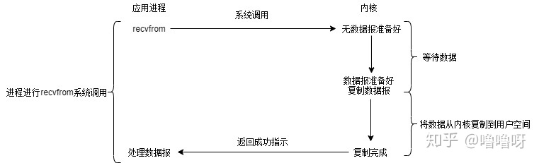
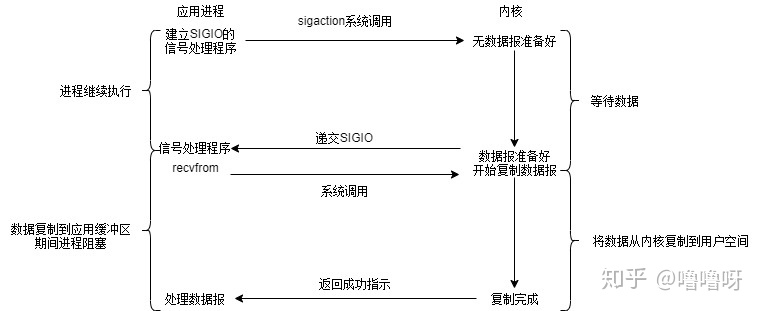
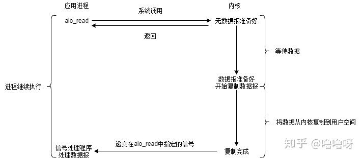

目录
- [1. 线程和进程](#1-线程和进程)
  - [1.1 区别](#11-区别)
  - [1.2 进程有哪几种状态](#12-进程有哪几种状态)
  - [1.3 进程的通信方式](#13-进程的通信方式)
  - [1.4 进程的调度算法](#14-进程的调度算法)
  - [1.5 线程同步的方式](#15-线程同步的方式)
  - [1.6 用户级线程，内核级线程](#16-用户级线程内核级线程)
- [2. 虚拟内存](#2-虚拟内存)
  - [2.1 什么是虚拟内存(Virtual Memory)](#21-什么是虚拟内存virtual-memory)
  - [2.2 虚拟存储器](#22-虚拟存储器)
  - [2.3 虚拟内存的技术实现](#23-虚拟内存的技术实现)
  - [2.4 页面置换算法](#24-页面置换算法)
- [3. 死锁](#3-死锁)
- [4. IO模型](#4-io模型)
- [4. Linux IO](#4-linux-io)
  - [4.1 epoll, select, poll](#41-epoll-select-poll)
    - [4.1.1 select](#411-select)
    - [4.1.2 poll](#412-poll)
    - [4.1.3 epoll](#413-epoll)

## 1. 线程和进程

### 1.1 区别

- 进程是具有一定功能的程序关于某个数据集合上的一次运行活动，进程是系统进行资源调度和分配的一个独立单位。
- 线程是进程的实体，是CPU调度和分派的基本单位，它是比进程更小的能独立运行的基本单位。
- 一个进程可以有多个线程，多个线程也可以并发执行

>解释：计算机的核心是CPU，它承担了所有的计算任务。它就像一座工厂，时刻在运行。
>
>假定工厂的电力有限，一次只能供给一个车间使用。也就是说，一个车间开工的时候，其他车间都必须停工。背后的含义就是，单个CPU一次只能运行一个任务。
>
>进程就好比工厂的车间，它代表CPU所能处理的单个任务。任一时刻，CPU总是运行一个进程，其他进程处于非运行状态。
>
>一个车间里，可以有很多工人。他们协同完成一个任务。线程就好比车间里的工人。一个进程可以包括多个线程。车间的空间是工人们共享的，比如许多房间是每个工人都可以进出的。这象征一个进程的内存空间是共享的，每个线程都可以使用这些共享内存。
>
>可是，每间房间的大小不同，有些房间最多只能容纳一个人，比如厕所。里面有人的时候，其他人就不能进去了。这代表一个线程使用某些共享内存时，其他线程必须等它结束，才能使用这一块内存。一个防止他人进入的简单方法，就是门口加一把锁。先到的人锁上门，后到的人看到上锁，就在门口排队，等锁打开再进去。这就叫"互斥锁"（Mutual exclusion，缩写 Mutex），防止多个线程同时读写某一块内存区域。
>
>还有些房间，可以同时容纳n个人，比如厨房。也就是说，如果人数大于n，多出来的人只能在外面等着。这好比某些内存区域，只能供给固定数目的线程使用。这时的解决方法，就是在门口挂n把钥匙。进去的人就取一把钥匙，出来时再把钥匙挂回原处。后到的人发现钥匙架空了，就知道必须在门口排队等着了。这种做法叫做"信号量"（Semaphore），用来保证多个线程不会互相冲突。不难看出，mutex是semaphore的一种特殊情况（n=1时）。也就是说，完全可以用后者替代前者。但是，因为mutex较为简单，且效率高，所以在必须保证资源独占的情况下，还是采用这种设计。

### 1.2 进程有哪几种状态
- 建状态(new) ：进程正在被创建，尚未到就绪状态。
- 就绪状态(ready) ：进程已处于准备运行状态，即进程获得了除了处理器之外的一切所需资源，一旦得到处理器资源(处理器分配的时间片)即可运行。
- 运行状态(running) ：进程正在处理器上上运行(单核 CPU 下任意时刻只有一个进程处于运行状态)。
- 阻塞状态(waiting) ：又称为等待状态，进程正在等待某一事件而暂停运行如等待某资源为可用或等待 IO 操作完成。即使处理器空闲，该进程也不能运行。
- 结束状态(terminated) ：进程正在从系统中消失。可能是进程正常结束或其他原因中断退出运行。


### 1.3 进程的通信方式
- 管道/匿名管道(Pipes) ：用于具有亲缘关系的父子进程间或者兄弟进程之间的通信。
- 有名管道(Names Pipes) : 匿名管道由于没有名字，只能用于亲缘关系的进程间通信。为了克服这个缺点，提出了有名管道。有名管道严格遵循先进先出(first in first out)。有名管道以磁盘文件的方式存在，可以实现本机任意两个进程通信。
- 信号(Signal) ：信号是一种比较复杂的通信方式，用于通知接收进程某个事件已经发生；
- 消息队列(Message Queuing) ：消息队列是消息的链表,具有特定的格式,存放在内存中并由消息队列标识符标识。管道和消息队列的通信数据都是先进先出的原则。与管道（无名管道：只存在于内存中的文件；命名管道：存在于实际的磁盘介质或者文件系统）不同的是消息队列存放在内核中，只有在内核重启(即，操作系统重启)或者显示地删除一个消息队列时，该消息队列才会被真正的删除。消息队列可以实现消息的随机查询,消息不一定要以先进先出的次序读取,也可以按消息的类型读取.比 FIFO 更有优势。消息队列克服了信号承载信息量少，管道只能承载无格式字 节流以及缓冲区大小受限等缺。
- 信号量(Semaphores) ：信号量是一个计数器，用于多进程对共享数据的访问，信号量的意图在于进程间同步。这种通信方式主要用于解决与同步相关的问题并避免竞争条件。
- 共享内存(Shared memory) ：使得多个进程可以访问同一块内存空间，不同进程可以及时看到对方进程中对共享内存中数据的更新。这种方式需要依靠某种同步操作，如互斥锁和信号量等。可以说这是最有用的进程间通信方式。
- 套接字(Sockets) : 此方法主要用于在客户端和服务器之间通过网络进行通信。套接字是支持 TCP/IP 的网络通信的基本操作单元，可以看做是不同主机之间的进程进行双向通信的端点，简单的说就是通信的两方的一种约定，用套接字中的相关函数来完成通信过程。

### 1.4 进程的调度算法
- 先到先服务(FCFS)调度算法 : 
  
  从就绪队列中选择一个最先进入该队列的进程为之分配资源，使它立即执行并一直执行到完成或发生某事件而被阻塞放弃占用 CPU 时再重新调度。
- 短作业优先(SJF)的调度算法 : 
  
  从就绪队列中选出一个估计运行时间最短的进程为之分配资源，使它立即执行并一直执行到完成或发生某事件而被阻塞放弃占用 CPU 时再重新调度。
- 时间片轮转调度算法 : 
  
  时间片轮转调度是一种最古老，最简单，最公平且使用最广的算法，又称 RR(Round robin)调度。每个进程被分配一个时间段，称作它的时间片，即该进程允许运行的时间。
- 多级反馈队列调度算法 ：
  
  前面介绍的几种进程调度的算法都有一定的局限性。如短进程优先的调度算法，仅照顾了短进程而忽略了长进程 。多级反馈队列调度算法既能使高优先级的作业得到响应又能使短作业（进程）迅速完成。，因而它是目前被公认的一种较好的进程调度算法，UNIX 操作系统采取的便是这种调度算法。
- 优先级调度 ：
  
  为每个流程分配优先级，首先执行具有最高优先级的进程，依此类推。具有相同优先级的进程以 FCFS 方式执行。可以根据内存要求，时间要求或任何其他资源要求来确定优先级。

### 1.5 线程同步的方式
- 互斥量：采用互斥对象机制，只有拥有互斥对象的线程才有访问公共资源的权限。因为互斥对象只有一个，所以可以保证公共资源不会被多个线程同时访问。
- 信号量：它允许同一时刻多个线程访问同一资源，但是需要控制同一时刻访问此资源的最大线程数量。
- 事件（信号）：通过通知操作的方式来保持多线程同步，还可以方便的实现多线程优先级的比较操作。

### 1.6 用户级线程，内核级线程
- 用户级线程:

    是指不需要内核支持而在用户程序中实现的线程，它的内核的切换是由用户态程序自己控制内核的切换，不需要内核的干涉。但是它不能像内核级线程一样更好的运用多核CPU。

```
优点：

（1） 线程的调度不需要内核直接参与，控制简单。

（2） 可以在不支持线程的操作系统中实现。

（3） 同一进程中只能同时有一个线程在运行，如果有一个线程使用了系统调用而阻塞，那么整个进程都会被挂起，可以节约更多的系统资源。

缺点：

（1） 一个用户级线程的阻塞将会引起整个进程的阻塞。

（2） 用户级线程不能利用系统的多重处理，仅有一个用户级线程可以被执行。
```

- 内核级线程:

    切换由内核控制，当线程进行切换的时候，由用户态转化为内核态。切换完毕要从内核态返回用户态。可以很好的运用多核CPU，就像Windows电脑的四核八线程，双核四线程一样。

```
优点：

（1）当有多个处理机时，一个进程的多个线程可以同时执行。

（2） 由于内核级线程只有很小的数据结构和堆栈，切换速度快，当然它本身也可以用多线程技术实现，提高系统的运行速率。

缺点：

（1） 线程在用户态的运行，而线程的调度和管理在内核实现，在控制权从一个线程传送到另一个线程需要用户态到内核态再到用户态的模式切换，比较占用系统资源。（就是必须要受到内核的监控）
```

## 2. 虚拟内存

### 2.1 什么是虚拟内存(Virtual Memory)

这个在我们平时使用电脑特别是 Windows 系统的时候太常见了。很多时候我们使用点开了很多占内存的软件，这些软件占用的内存可能已经远远超出了我们电脑本身具有的物理内存。为什么可以这样呢？ **正是因为虚拟内存的存在**，通过虚拟内存可以让程序可以拥有超过系统物理内存大小的可用内存空间。另外，虚拟内存为每个进程提供了一个一致的、私有的地址空间，它让每个进程产生了一种自己在独享主存的错觉（每个进程拥有一片连续完整的内存空间）。这样会更加有效地管理内存并减少出错。

**虚拟内存**是计算机系统内存管理的一种技术，我们可以手动设置自己电脑的虚拟内存。不要单纯认为虚拟内存只是“使用硬盘空间来扩展内存“的技术。虚拟内存的重要意义是它定义了一个连续的虚拟地址空间，并且 把内存扩展到硬盘空间。

### 2.2 虚拟存储器

在程序装入时，可以将程序的一部分装入内存，而将其他部分留在外存，就可以启动程序执行。由于外存往往比内存大很多，所以我们运行的软件的内存大小实际上是可以比计算机系统实际的内存大小大的。在程序执行过程中，当所访问的信息不在内存时，由操作系统将所需要的部分调入内存，然后继续执行程序。另一方面，操作系统将内存中暂时不使用的内容换到外存上，从而腾出空间存放将要调入内存的信息。这样，**计算机好像为用户提供了一个比实际内存大的多的存储器——虚拟存储器**。

实际上，我觉得虚拟内存同样是一种时间换空间的策略，你用 CPU 的计算时间，页的调入调出花费的时间，换来了一个虚拟的更大的空间来支持程序的运行。

### 2.3 虚拟内存的技术实现

虚拟内存的实现需要建立在离散分配的内存管理方式的基础上。 虚拟内存的实现有以下三种方式：

- 请求分页存储管理(页式管理)：建立在分页管理之上，为了支持虚拟存储器功能而增加了请求调页功能和页面置换功能。请求分页是目前最常用的一种实现虚拟存储器的方法。**请求分页存储管理系统中**，在作业开始运行之前，仅装入当前要执行的部分段即可运行。假如在作业运行的过程中发现要访问的页面不在内存，则由处理器通知操作系统按照对应的页面置换算法将相应的页面调入到主存，同时操作系统也可以将暂时不用的页面置换到外存中。
  
- 请求分段存储管理(段式管理)：建立在分段存储管理之上，增加了请求调段功能、分段置换功能。请求分段储存管理方式就如同请求分页储存管理方式一样，在作业开始运行之前，**仅装入当前要执行的部分段即可运行**；在执行过程中，可使用请求调入中断动态装入要访问但又不在内存的程序段；当内存空间已满，而又需要装入新的段时，根据置换功能适当调出某个段，以便腾出空间而装入新的段。

- 请求段页式存储管理: 系统必须为每个作业或者进程建立一张段表以管理内存分配与释放、缺段处理等。另外由于一个段又被划分为若干个页，每个段必须建立一张页表以把段中的虚页变换为内存中的实际页面。显然与页式管理时相同，页表也要有相应的实现缺页中断处理和页面保护等功能的表项。

>这里多说一下？很多人容易搞混请求分页与分页存储管理，两者有何不同呢？
>
>请求分页存储管理建立在分页管理之上。他们的根本区别是是否将程序全部所需的全部地址空间都装入主存，这也是请求分页存储管理可以提供虚拟内存的原因，我们在上面已经分析过了。
>
>它们之间的根本区别在于是否将一作业的全部地址空间同时装入主存。请求分页存储管理不要求将作业全部地址空间同时装入主存。基于这一点，请求分页存储管理可以提供虚存，而分页存储管理却不能提供虚存。

不管是上面那种实现方式，我们一般都需要：

- 一定容量的内存和外存：在载入程序的时候，只需要将程序的一部分装入内存，而将其他部分留在外存，然后程序就可以执行了；
- **缺页中断**：如果需执行的指令或访问的数据尚未在内存（称为缺页或缺段），则由处理器通知操作系统将相应的页面或段调入到内存，然后继续执行程序；
- 虚拟地址空间 ：逻辑地址到物理地址的变换。

### 2.4 页面置换算法

地址映射过程中，若在页面中发现所要访问的页面不在内存中，则发生缺页中断 。

**缺页中断**就是要访问的页不在主存，需要操作系统将其调入主存后再进行访问。 在这个时候，被内存映射的文件实际上成了一个分页交换文件。

当发生缺页中断时，如果当前内存中并没有空闲的页面，操作系统就必须在内存选择一个页面将其移出内存，以便为即将调入的页面让出空间。用来选择淘汰哪一页的规则叫做**页面置换算法**，我们可以把页面置换算法看成是淘汰页面的规则。

- OPT 页面置换算法（最佳页面置换算法） ：最佳(Optimal, OPT)置换算法所选择的被淘汰页面将是以后永不使用的，或者是在最长时间内不再被访问的页面,这样可以保证获得最低的缺页率。但由于人们目前无法预知进程在内存下的若千页面中哪个是未来最长时间内不再被访问的，因而该算法无法实现。一般作为衡量其他置换算法的方法。
- FIFO（First In First Out） 页面置换算法（先进先出页面置换算法） : 总是淘汰最先进入内存的页面，即选择在内存中驻留时间最久的页面进行淘汰。
- LRU （Least Currently Used）页面置换算法（最近最久未使用页面置换算法） ：LRU算法赋予每个页面一个访问字段，用来记录一个页面自上次被访问以来所经历的时间 T，当须淘汰一个页面时，选择现有页面中其 T 值最大的，即最近最久未使用的页面予以淘汰。
- LFU （Least Frequently Used）页面置换算法（最少使用页面置换算法） : 该置换算法选择在之前时期使用最少的页面作为淘汰页。

## 3. 死锁
什么是死锁？死锁产生的条件？

在两个或者多个并发进程中，如果每个进程持有某种资源而又等待其它进程释放它或它们现在保持着的资源，在未改变这种状态之前都不能向前推进，称这一组进程产生了死锁。通俗的讲就是两个或多个进程无限期的阻塞、相互等待的一种状态。

死锁产生的四个条件（有一个条件不成立，则不会产生死锁）

- 互斥条件：一个资源一次只能被一个进程使用
- 请求与保持条件：一个进程因请求资源而阻塞时，对已获得资源保持不放
- 不剥夺条件：进程获得的资源，在未完全使用完之前，不能强行剥夺
- 循环等待条件：若干进程之间形成一种头尾相接的环形等待资源关系

## 4. IO模型

## 4. Linux IO
>在了解不同的IO之前先了解：同步与异步，阻塞与非阻塞的区别
>
>同步，一个任务的完成之前不能做其他操作，必须等待（等于在打电话）
>
>异步，一个任务的完成之前，可以进行其他操作（等于在聊QQ）
>
>阻塞，是相对于CPU来说的， 挂起当前线程，不能做其他操作只能等待
>
>非阻塞,，无须挂起当前线程，可以去执行其他操作

- 阻塞 IO(Blocking IO)

    此时我已饥渴难耐，全程盯着后厨，等待着一分一秒（别多想 ），终于全家桶做好了，在此期间虽然什么事也没干，但是最后能吃到全家桶，我很幸福。

    此处需要一个清新的脑回路，我就是程序，我想要全家桶，于是发起了系统调用，而后厨加工的过程就是在做数据准备和拷贝工作。全家桶最终到手，数据终于从内核空间拷贝到了用户空间。

    简单看下执行流程：

    
    
    流程：阻塞IO的执行过程是进程进行系统调用，等待内核将数据准备好并复制到用户态缓冲区后，进程放弃使用CPU并一直阻塞在此，直到数据准备好。

    优点：程序简单，在阻塞等待数据期间进程/线程挂起，基本不会占用 CPU 资源。

    缺点：每个连接需要独立的进程/线程单独处理，当并发请求量大时为了维护程序，内存、线程切换开销较大，这种模型在实际生产中很少使用。

- 非阻塞式 IO (Non-blocking IO)

    此时我每隔5分钟询问全家桶好了没，在数次盘问后，终于出炉了。在每一次盘问之前，对于程序来说是非阻塞的，占用CPU资源，可以做其他事情。

    每次应用程序询问内核是否有数据准备好。如果就绪，就进行拷贝操作；如果未就绪，就不阻塞程序，内核直接返回未就绪的返回值，等待用户程序下一个轮询。

    

    大致经历两个阶段：

    - 等待数据阶段：未阻塞， 用户进程需要盲等，不停的去轮询内核。
    - 数据复制阶段：阻塞，此时进行数据复制。
  
    在这两个阶段中，用户进程只有在数据复制阶段被阻塞了，而等待数据阶段没有阻塞，但是用户进程需要盲等，不停地轮询内核，看数据是否准备好。

    优点：不会阻塞在内核的等待数据过程，每次发起的 I/O 请求可以立即返回，不用阻塞等待，实时性较好。

    缺点：轮询将会不断地询问内核，这将占用大量的 CPU 时间，系统资源利用率较低，所以一般 Web 服务器不使用这种 I/O 模型。 

- **IO多路复用** (I/O multiplexing)

    排了很长的队，终于轮到我支付后，拿到了一张小票，上面有号次。当全家桶出炉后，会喊相应的号次来取。KFC营业员小姐姐打小票出号次的动作相当于操作系统多开了个线程，专门接收客户端的连接。我只关注叫到的是不是我的号，因此程序还需在服务端注册我想监听的事件类型。

    多路复用一般都是用于网络IO，服务端与多个客户端的建立连接。下面是神奇的多路复用执行过程：

    

    相比于阻塞IO模型，多路复用只是多了一个select/poll/epoll函数。select函数会不断地轮询自己所负责的文件描述符/套接字的到达状态，当某个套接字就绪时，就对这个套接字进行处理。select负责轮询等待，recvfrom负责拷贝。当用户进程调用该select，select会监听所有注册好的IO，如果所有IO都没注册好，调用进程就阻塞。

    对于客户端来说，一般感受不到阻塞，因为请求来了，可以用放到线程池里执行；但对于执行select的操作系统而言，是阻塞的，需要阻塞地等待某个套接字变为可读。

    IO多路复用其实是阻塞在**select，poll，epoll这类系统调用上的，复用的是执行select，poll，epoll的线程。**

    >IO复用应用的场合：
    >
    >（1）当客户处理多个描述字时（一般是交互式输入和网络套接口），必须使用I/O复用。
    >
    >（2）当一个客户同时处理多个套接口时，而这种情况是可能的，但很少出现。
    >
    >（3）如果一个TCP服务器既要处理监听套接口，又要处理已连接套接口，一般也要用到I/O复用。
    >
    >（4）如果一个服务器即要处理TCP，又要处理UDP，一般要使用I/O复用。
    >
    >（5）如果一个服务器要处理多个服务或多个协议，一般要使用I/O复用。

    优点：可以基于一个阻塞对象，同时在多个描述符上等待就绪，而不是使用多个线程(每个文件描述符一个线程)，这样可以大大节省系统资源。

    缺点：当连接数较少时效率相比多线程+阻塞 I/O 模型效率较低，可能延迟更大，因为单个连接处理需要 2 次系统调用，占用时间会有增加。

- 信号驱动式 IO (signal driven I/O (SIGIO))

    跑KFC嫌麻烦，刚好有个会员，直接点份外卖，美滋滋。当外卖送达时，会收到取餐电话（信号）。在收到取餐电话之前，我可以愉快地吃鸡或者学习。

    当数据报准备好的时候，内核会向应用程序发送一个信号，进程对信号进行捕捉，并且调用信号处理函数来获取数据报。

    

    该模型也分为两个阶段：

    - 数据准备阶段：未阻塞，当数据准备完成之后，会主动的通知用户进程数据已经准备完成，对用户进程做一个回调。
    - 数据拷贝阶段：阻塞用户进程，等待数据拷贝。

    优点：线程并没有在等待数据时被阻塞，可以提高资源的利用率。

    缺点：信号 I/O 在大量 IO 操作时可能会因为信号队列溢出导致没法通知。
    信号驱动 I/O 尽管对于处理 UDP 套接字来说有用，即这种信号通知意味着到达一个数据报，或者返回一个异步错误。
    但是，对于 TCP 而言，信号驱动的 I/O 方式近乎无用，因为导致这种通知的条件为数众多，每一个来进行判别会消耗很大资源，与前几种方式相比优势尽失。

- 异步 IO (asynchronous I/O)

    此时科技的发展已经超乎想象了，外卖机器人将全家桶自动送达并转换成营养快速注入我的体内，同时还能得到口感的满足。注入结束后，机器人会提醒我注入完毕。在这个期间我可以放心大胆的玩，甚至注射的时候也不需要停下来！

    类比一下，就是用户进程发起系统调用后，立刻就可以开始去做其他的事情，然后直到I/O数据准备好并复制完成后，内核会给用户进程发送通知，告诉用户进程操作已经完成了。

    

    特点：

    异步I/O执行的两个阶段都不会阻塞读写操作，由内核完成。
    
    完成后内核将数据放到指定的缓冲区，通知应用程序来取。

    优点：异步 I/O 能够充分利用 DMA 特性，让 I/O 操作与计算重叠。

    缺点：要实现真正的异步 I/O，操作系统需要做大量的工作。目前 Windows 下通过 IOCP 实现了真正的异步 I/O。

### 4.1 epoll, select, poll

#### 4.1.1 select

select 允许进程指示内核等待多个事件中的任何一个发生，并只在有一个或多个事件发生或指定时间后返回它。

```
#include <sys/select.h>
#include <sys/time.h>
int select(int maxfd,fd_set *rdset,fd_set *wrset,fd_set *exset,struct timeval *timeout);
```

**返回值**：

监听到有事件发生的文件描述符的个数，超时为0，错误为 -1.

1.  当监视的相应的文件描述符集中满足条件时，比如说读文件描述符集中有数据到来时，内核(I/O)根据状态修改文件描述符集，并返回一个大于0的数。
2.  当没有满足条件的文件描述符，且设置的timeval监控时间超时时，select函数会返回一个为0的值。
3.  当select返回负值时，发生错误。

**参数**：

- maxfd：是需要监视的最大的文件描述符值+1；
- rdset、wrset、exset：是传入传出参数，fd_set类型，分别对应于需要检测的可读文件描述符的集合、可写文件描述符的集合、异常文件描述符的集合。若对其中任何参数条件不感兴趣，则可将其设为NULL。
- timeout：设置超时时间，指定select在返回前没有接收事件时应该等待的时间。

**理解select模型**:

API:
```
void FD_SET(int fd, fd_set *fdset);   // 设置文件描述符集fdset中对应于文件描述符fd的位(设置为1)
void FD_CLR(int fd, fd_set *fdset);   // 清除文件描述符集fdset中对应于文件描述符fd的位(设置为0)
void FD_ISSET(int fd, fd_set *fdset); // 检测文件描述符集fdset中对应于文件描述符fd的位是否被设置
void FD_ZERO(fd_set *fdset);          // 清除文件描述符集fdset中的所有位(既把所有位都设置为0)
```

必须理解fd_set。假如fd_set长度为1字节，fd_set中的每一bit可以对应一个文件描述符fd。则1字节长的fd_set最大可以对应8个fd。

1.  执行fd_set set，FD_ZERO(&set)，则set用位表示是0000,0000。
2.  若fd＝5，执行FD_SET(fd,&set)，后set变为0001,0000(第5位置为1)
3.  若再加入fd＝2，fd=1，则set变为0001,0011
4.  执行select(6,&set,0,0,0)阻塞等待
5.  若fd=1，fd=2上都发生可读事件，则select返回，此时set变为0000,0011。注意：没有事件发生的fd=5被清空。

**实现**：

select模型的描述符集合，内部实现是**位图**，每一个特定位来标志相应大小文件描述符。这个集合中存放的是文件描述符(file descriptor)，即文件句柄。我们也可以认为它只是一个由很多二进制位构成的**数组**。

**特点**：

- 可监控的文件描述符个数取决与fd_set的值。一般为1024，每bit表示一个文件描述符，则支持的最大文件描述符是1024。64位默认时2048。可以通过修改宏定义甚至重新编译内核的方式提升这一限制，但是这样也会造成效率的降低。
  
- 每次调用 select()，都需要把描述符集合从用户态拷贝到内核态，这个开销在 fd 很多时会很大，同时每次调用 select() 都需要在内核中轮询最大描述符数+1个描述符，这个开销在 fd 很多时也很大。
  
- 返回后的集合，需要轮询数组中保存的描述符的每一个与集合中进行FD_ISSET操作，排查当文件描述符个数很多时，效率很低。

#### 4.1.2 poll

poll本质上和select没有区别，它将用户传入的数组拷贝到内核空间，然后查询每个fd对应的设备状态，如果设备就绪则在设备等待队列中加入一项并继续遍历，如果遍历完所有fd后没有发现就绪设备，则挂起当前进程，直到设备就绪或者主动超时，被唤醒后它又要再次遍历fd。这个过程经历了多次无谓的遍历。

特点：

- poll没有最大连接数的限制，原因是它是基于链表来存储的。在select中，被监听集合和返回集合是一个集合，在poll中将监听和返回的事件都在结构体中不同的成员中，它们互补干扰，poll 中将有事件发生的文件描述符设置其结构体的revents，不需要向select一样用一个数组存储原来的文件描述符。
  
- poll函数中fds数组中元素是pollfd结构体，该结构体保存描述符的信息，每增加一个文件描述符就向数组中结构体加入一个描述符，结构体只需要拷贝一次到内核态。poll解决了select重复初始化的问题。但轮寻检查事件发生的问题仍然未解决。
  
- poll还有一个特点是“水平触发”，如果报告了fd后，没有被处理，那么下次poll时会再次报告该fd。
  
- 与select一样，poll返回后，需要轮询每个pollfd结构体的revents来获取就绪的描述符，这样会使性能下降 ，poll会遍历到数组已使用的最大下标，如果同时连接的大量客户端在一时刻可能只有很少的就绪状态，就是最大下标很大，而只有几个描述符发生事件，因此随着监视的描述符数量的增长，其效率也会线性下降。

#### 4.1.3 epoll
是基于事件驱动的，如果某个流准备好了，会以事件通知，知道具体是哪个流，因此不需要遍历，函数的时间复杂度为O(1)。

epoll 是之前的 select 和 poll 的增强版本。相对于 select 和 poll 来说，epoll更加灵活，没有描述符限制。epoll使用一个epoll句柄管理多个描述符，将用户关心的文件描述符的事件存放到内核的一个事件表中，这样在用户空间和内核空间的copy只需一次。

**特点**：

epoll模型的特点
- 本身没有最大并发连接的限制，仅受系统中进程能打开的最大文件数目限制。

- 基于事件就绪通知方式：一旦被监听的某个文件描述符就绪，内核会采用类似于callback的回调机制，迅速激活这个文件描述符，这样随着文件描述符数量的增加，也不会影响判定就绪的性能。不会像select/poll中轮询检测每个描述符是否就绪。

- 当文件描述符就绪，就会被放到一个数组中，这样调用epoll_weit获取就绪文件描述符的时候，只要取数组中的返回的个数个元素即可，不需要全部做轮询检测。

- 内存拷贝是利用mmap()文件映射内存的方式加速与内核空间的消息传递，减少复制开销。（内核与用户空间共享一块内存）