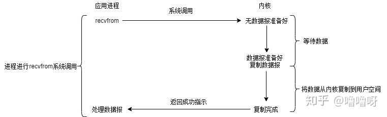
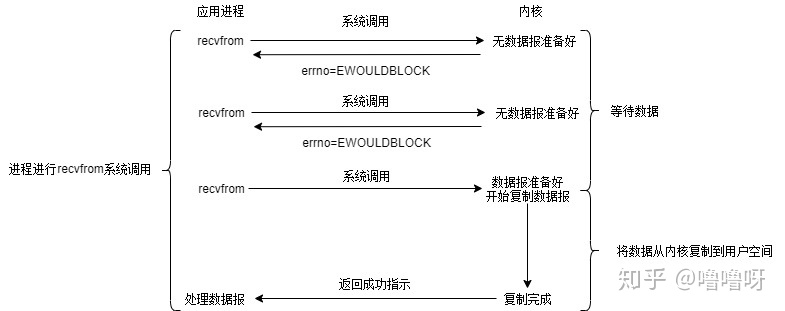
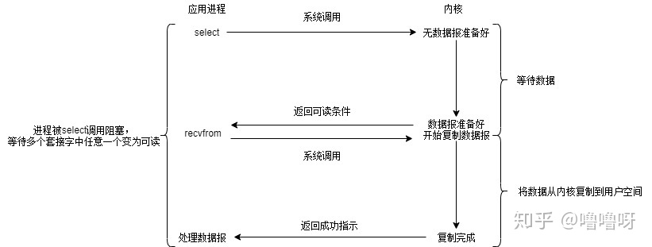
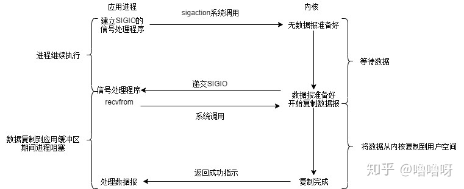
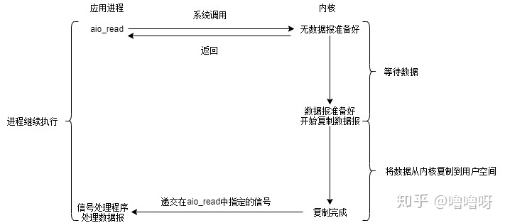

目录
- [1. Linux启动过程](#1-linux启动过程)
- [2. Linux 文件系统结构](#2-linux-文件系统结构)
- [3. Linux 的目录结构是怎样的？](#3-linux-的目录结构是怎样的)
- [4. Linux IO](#4-linux-io)
  - [4.1 epoll, select, poll](#41-epoll-select-poll)
- [5. 文件管理命令](#5-文件管理命令)
  - [cat 命令](#cat-命令)
  - [chmod 命令](#chmod-命令)
  - [chown 命令](#chown-命令)
  - [cp&find](#cpfind)
  - [more 命令](#more-命令)
  - [less 命令](#less-命令)
  - [locate 命令](#locate-命令)
  - [mv&rm](#mvrm)
  - [tail 命令](#tail-命令)
  - [touch 命令](#touch-命令)
  - [whereis 命令](#whereis-命令)
  - [which 命令](#which-命令)
- [6. 文档编辑命令](#6-文档编辑命令)
  - [grep 命令](#grep-命令)
  - [awk 命令](#awk-命令)
  - [sed 命令](#sed-命令)
- [7. 网络通讯命令](#7-网络通讯命令)
  - [netstat 命令](#netstat-命令)
- [8. 系统管理命令](#8-系统管理命令)
  - [iostat 命令](#iostat-命令)
  - [top 命令](#top-命令)
  - [ps 命令](#ps-命令)
- [9. 磁盘命令](#9-磁盘命令)
  - [fdisk 命令](#fdisk-命令)
  - [df 命令](#df-命令)

## 1. Linux启动过程
Linux 开机启动过程？

1.  主机加电自检，加载 BIOS 硬件信息。
2.  读取 MBR 的引导文件(GRUB、LILO)。
3.  引导 Linux 内核。
4.  运行第一个进程 init (进程号永远为 1 )。
5.  进入相应的运行级别。
6.  运行终端，输入用户名和密码。

## 2. Linux 文件系统结构

在 Linux 操作系统中，所有被操作系统管理的资源，例如网络接口卡、磁盘驱动器、打印机、输入输出设备、普通文件或是目录都被看作是一个文件。

也就是说在 Linux 系统中有一个重要的概念：**一切都是文件**。其实这是 Unix 哲学的一个体现，而 Linux 是重写 Unix 而来，所以这个概念也就传承了下来。在 Unix 系统中，把一切资源都看作是文件，包括硬件设备。UNIX系统把每个硬件都看成是一个文件，通常称为设备文件，这样用户就可以用读写文件的方式实现对硬件的访问。

## 3. Linux 的目录结构是怎样的？


常见目录说明：

/bin： 存放二进制可执行文件(ls,cat,mkdir等)，常用命令一般都在这里；

/etc： 存放系统管理和配置文件；

/home： 存放所有用户文件的根目录，是用户主目录的基点，比如用户user的主目录就是/home/user，可以用~user表示；

**/usr** ： 用于存放系统应用程序；

/opt： 额外安装的可选应用程序包所放置的位置。一般情况下，我们可以把tomcat等都安装到这里；

**/proc**： 虚拟文件系统目录，是系统内存的映射。可直接访问这个目录来获取系统信息；

/root： 超级用户（系统管理员）的主目录（特权阶级o）；

/sbin: 存放二进制可执行文件，只有root才能访问。这里存放的是系统管理员使用的系统级别的管理命令和程序。如ifconfig等；

/dev： 用于存放设备文件；

/mnt： 系统管理员安装临时文件系统的安装点，系统提供这个目录是让用户临时挂载其他的文件系统；

/boot： 存放用于系统引导时使用的各种文件；

**/lib**： 存放着和系统运行相关的库文件；

/tmp： 用于存放各种临时文件，是公用的临时文件存储点；

/var： 用于存放运行时需要改变数据的文件，也是某些大文件的溢出区，比方说各种服务的日志文件（系统启动日志等。）等；

/lost+found： 这个目录平时是空的，系统非正常关机而留下“无家可归”的文件（windows下叫什么.chk）就在这里。
## 4. Linux IO
>在了解不同的IO之前先了解：同步与异步，阻塞与非阻塞的区别
>
>同步，一个任务的完成之前不能做其他操作，必须等待（等于在打电话）
>
>异步，一个任务的完成之前，可以进行其他操作（等于在聊QQ）
>
>阻塞，是相对于CPU来说的， 挂起当前线程，不能做其他操作只能等待
>
>非阻塞,，无须挂起当前线程，可以去执行其他操作

- 阻塞 IO(Blocking IO)

    此时我已饥渴难耐，全程盯着后厨，等待着一分一秒（别多想 ），终于全家桶做好了，在此期间虽然什么事也没干，但是最后能吃到全家桶，我很幸福。

    此处需要一个清新的脑回路，我就是程序，我想要全家桶，于是发起了系统调用，而后厨加工的过程就是在做数据准备和拷贝工作。全家桶最终到手，数据终于从内核空间拷贝到了用户空间。

    简单看下执行流程：

    
    
    流程：阻塞IO的执行过程是进程进行系统调用，等待内核将数据准备好并复制到用户态缓冲区后，进程放弃使用CPU并一直阻塞在此，直到数据准备好。

    优点：程序简单，在阻塞等待数据期间进程/线程挂起，基本不会占用 CPU 资源。

    缺点：每个连接需要独立的进程/线程单独处理，当并发请求量大时为了维护程序，内存、线程切换开销较大，这种模型在实际生产中很少使用。

- 非阻塞式 IO (Non-blocking IO)

    此时我每隔5分钟询问全家桶好了没，在数次盘问后，终于出炉了。在每一次盘问之前，对于程序来说是非阻塞的，占用CPU资源，可以做其他事情。

    每次应用程序询问内核是否有数据准备好。如果就绪，就进行拷贝操作；如果未就绪，就不阻塞程序，内核直接返回未就绪的返回值，等待用户程序下一个轮询。

    

    大致经历两个阶段：

    - 等待数据阶段：未阻塞， 用户进程需要盲等，不停的去轮询内核。
    - 数据复制阶段：阻塞，此时进行数据复制。
  
    在这两个阶段中，用户进程只有在数据复制阶段被阻塞了，而等待数据阶段没有阻塞，但是用户进程需要盲等，不停地轮询内核，看数据是否准备好。

    优点：不会阻塞在内核的等待数据过程，每次发起的 I/O 请求可以立即返回，不用阻塞等待，实时性较好。

    缺点：轮询将会不断地询问内核，这将占用大量的 CPU 时间，系统资源利用率较低，所以一般 Web 服务器不使用这种 I/O 模型。 

- IO多路复用 (I/O multiplexing)

    排了很长的队，终于轮到我支付后，拿到了一张小票，上面有号次。当全家桶出炉后，会喊相应的号次来取。KFC营业员小姐姐打小票出号次的动作相当于操作系统多开了个线程，专门接收客户端的连接。我只关注叫到的是不是我的号，因此程序还需在服务端注册我想监听的事件类型。

    多路复用一般都是用于网络IO，服务端与多个客户端的建立连接。下面是神奇的多路复用执行过程：

    

    相比于阻塞IO模型，多路复用只是多了一个select/poll/epoll函数。select函数会不断地轮询自己所负责的文件描述符/套接字的到达状态，当某个套接字就绪时，就对这个套接字进行处理。select负责轮询等待，recvfrom负责拷贝。当用户进程调用该select，select会监听所有注册好的IO，如果所有IO都没注册好，调用进程就阻塞。

    对于客户端来说，一般感受不到阻塞，因为请求来了，可以用放到线程池里执行；但对于执行select的操作系统而言，是阻塞的，需要阻塞地等待某个套接字变为可读。

    IO多路复用其实是阻塞在select，poll，epoll这类系统调用上的，复用的是执行select，poll，epoll的线程。

    优点：可以基于一个阻塞对象，同时在多个描述符上等待就绪，而不是使用多个线程(每个文件描述符一个线程)，这样可以大大节省系统资源。

    缺点：当连接数较少时效率相比多线程+阻塞 I/O 模型效率较低，可能延迟更大，因为单个连接处理需要 2 次系统调用，占用时间会有增加。

- 信号驱动式 IO (signal driven I/O (SIGIO))

    跑KFC嫌麻烦，刚好有个会员，直接点份外卖，美滋滋。当外卖送达时，会收到取餐电话（信号）。在收到取餐电话之前，我可以愉快地吃鸡或者学习。

    当数据报准备好的时候，内核会向应用程序发送一个信号，进程对信号进行捕捉，并且调用信号处理函数来获取数据报。

    

    该模型也分为两个阶段：

    - 数据准备阶段：未阻塞，当数据准备完成之后，会主动的通知用户进程数据已经准备完成，对用户进程做一个回调。
    - 数据拷贝阶段：阻塞用户进程，等待数据拷贝。

    优点：线程并没有在等待数据时被阻塞，可以提高资源的利用率。

    缺点：信号 I/O 在大量 IO 操作时可能会因为信号队列溢出导致没法通知。
    信号驱动 I/O 尽管对于处理 UDP 套接字来说有用，即这种信号通知意味着到达一个数据报，或者返回一个异步错误。
    但是，对于 TCP 而言，信号驱动的 I/O 方式近乎无用，因为导致这种通知的条件为数众多，每一个来进行判别会消耗很大资源，与前几种方式相比优势尽失。

- 异步 IO (asynchronous I/O)

    此时科技的发展已经超乎想象了，外卖机器人将全家桶自动送达并转换成营养快速注入我的体内，同时还能得到口感的满足。注入结束后，机器人会提醒我注入完毕。在这个期间我可以放心大胆的玩，甚至注射的时候也不需要停下来！

    类比一下，就是用户进程发起系统调用后，立刻就可以开始去做其他的事情，然后直到I/O数据准备好并复制完成后，内核会给用户进程发送通知，告诉用户进程操作已经完成了。

    

    特点：

    异步I/O执行的两个阶段都不会阻塞读写操作，由内核完成。
    
    完成后内核将数据放到指定的缓冲区，通知应用程序来取。

    优点：异步 I/O 能够充分利用 DMA 特性，让 I/O 操作与计算重叠。

    缺点：要实现真正的异步 I/O，操作系统需要做大量的工作。目前 Windows 下通过 IOCP 实现了真正的异步 I/O。

### 4.1 epoll, select, poll

- select
select系统调用允许程序同时在多个底层文件描述符上，等待输入的到达或输出的完成。以数组形式存储文件描述符，64位机器默认2048个。当有数据准备好时，无法感知具体是哪个流OK了，所以需要一个一个的遍历，函数的时间复杂度为O(n)。

- poll
以链表形式存储文件描述符，没有长度限制。本质与select相同，函数的时间复杂度也为O(n)。它将用户传入的数组拷贝到内核空间，然后查询每个fd对应的设备状态，如果设备就绪则在设备等待队列中加入一项并继续遍历，如果遍历完所有fd后没有发现就绪设备，则挂起当前进程，直到设备就绪或者主动超时，被唤醒后它又要再次遍历fd。这个过程经历了多次无谓的遍历。

- epoll
是基于事件驱动的，如果某个流准备好了，会以事件通知，知道具体是哪个流，因此不需要遍历，函数的时间复杂度为O(1)。

## 5. 文件管理命令
### cat 命令
cat 命令用于连接文件并打印到标准输出设备上。

功能：
1.  一次显示整个文件:
    ```
    cat filename
    ```

2.  从键盘创建一个文件:
    ```
    cat > filename //只能创建新文件，不能编辑已有文件。
    ```

3.  将几个文件合并为一个文件:
    ```
    //-b 对非空输出行号
    //-n 输出所有行号
    cat file1 file2 > file
    ```

### chmod 命令
每一文件或目录的访问权限都有三组，每组用三位表示，分别为文件属主的读、写和执行权限；与属主同组的用户的读、写和执行权限；系统中其他用户的读、写和执行权限。可使用 ls -l test.txt 查找。

以文件 log2012.log 为例：
```
-rw-r--r-- 1 root root 296K 11-13 06:03 log2012.log
```
第一列共有 10 个位置，第一个字符指定了文件类型。在通常意义上，一个目录也是一个文件。如果第一个字符是横线，表示是一个非目录的文件。如果是 d，表示是一个目录。从第二个字符开始到第十个 9 个字符，3 个字符一组，分别表示了 3 组用户对文件或者目录的权限。权限字符用横线代表空许可，r 代表只读，w 代表写，x 代表可执行。

常用参数：
```
-c 当发生改变时，报告处理信息
-R 处理指定目录以及其子目录下所有文件
```
权限范围：
```
u ：目录或者文件的当前的用户
g ：目录或者文件的当前的群组
o ：除了目录或者文件的当前用户或群组之外的用户或者群组
a ：所有的用户及群组
```
权限代号：
```
r ：读权限，用数字4表示
w ：写权限，用数字2表示
x ：执行权限，用数字1表示
- ：删除权限，用数字0表示
s ：特殊权限
```
举例：

1.  增加文件 t.log 所有用户可执行权限
    ```
    chmod a+x t.log
    ```

2.  撤销原来所有的权限，然后使拥有者具有可读权限,并输出处理信息
    ```
    chmod u=r t.log -c
    ```

3.  给 file 的属主分配读、写、执行(7)的权限，给file的所在组分配读、执行(5)的权限，给其他用户分配执行(1)的权限
    ```
    chmod 751 t.log -c（或者：chmod u=rwx,g=rx,o=x t.log -c)
    ```

4.  将 test 目录及其子目录所有文件添加可读权限
    ```
    chmod u+r,g+r,o+r -R text/ -c
    ```

### chown 命令
chown 将指定文件的拥有者改为指定的用户或组，用户可以是用户名或者用户 ID；组可以是组名或者组 ID；文件是以空格分开的要改变权限的文件列表，支持通配符。

常用参数：
```
-c 当发生改变时，报告处理信息
-R 处理指定目录以及其子目录下所有文件
```

实例：

1.  改变拥有者和群组 并显示改变信息
    ```
    chown -c mail:mail log2012.log
    ```

2.  改变文件群组
    ```
    chown -c :mail t.log
    ```

3.  改变文件夹及子文件目录属主及属组为 mail
    ```
    chown -cR mail: test/
    ```

### cp&find
1.  复制 a.txt 到 test 目录下，保持原文件时间，如果原文件存在提示是否覆盖。
    ```
    cp -ai a.txt test
    ```

2.  为 a.txt 建议一个链接（快捷方式）
    ```
    cp -s a.txt link_a.txt
    ```

1.  查找 48 小时内修改过的文件
    ```
    find -atime -2
    ```

2.  在当前目录查找 以 .log 结尾的文件。 . 代表当前目录
    ```
    find ./ -name '*.log'
    ```

3.  查找 /opt 目录下 权限为 777 的文件
    ```
    find /opt -perm 777
    ```

4.  查找大于 1K 的文件
    ```
    find -size +1000c
    ```
### more 命令
功能类似于 cat, more 会以一页一页的显示方便使用者逐页阅读，而最基本的指令就是按空白键（space）就往下一页显示，按 b 键就会往回（back）一页显示。

1.  显示文件中从第3行起的内容
    ```
    more +3 text.txt
    ```

2.  在所列出文件目录详细信息，借助管道使每次显示 5 行
    ```
    ls -l | more -5
    ```

### less 命令
less 与 more 类似，但使用 less 可以随意浏览文件，而 more 仅能向前移动，却不能向后移动，而且 less 在查看之前不会加载整个文件。

1.  ps 查看进程信息并通过 less 分页显示
    ```
    ps -aux | less -N
    ```

2.  查看多个文件
    ```
    less 1.log 2.log
    ```

### locate 命令
locate 通过搜寻系统内建文档数据库达到快速找到档案，数据库由 updatedb 程序来更新，updatedb 是由 cron daemon 周期性调用的。默认情况下 locate 命令在搜寻数据库时比由整个由硬盘资料来搜寻资料来得快，但较差劲的是 locate 所找到的档案若是最近才建立或刚更名的，可能会找不到，在内定值中，updatedb 每天会跑一次，可以由修改 crontab 来更新设定值 (etc/crontab)。

locate 与 find 命令相似，可以使用如 *、? 等进行正则匹配查找

常用参数：
```
-l num（要显示的行数）
-f   将特定的档案系统排除在外，如将proc排除在外
-r   使用正则运算式做为寻找条件
```

实例：

1.  查找和 pwd 相关的所有文件(文件名中包含 pwd）
    ```
    locate pwd
    ```

2.  搜索 etc 目录下所有以 sh 开头的文件
    ```
    locate /etc/sh
    ```

3.  查找 /var 目录下，以 reason 结尾的文件
    ```
    locate -r '^/var.*reason$'（其中.表示一个字符，*表示任务多个；.*表示任意多个字符）
    ```

### mv&rm

### tail 命令
用于显示指定文件末尾内容，不指定文件时，作为输入信息进行处理。常用查看日志文件。

常用参数：
```
-f 循环读取（常用于查看递增的日志文件）
-n<行数> 显示行数（从后向前）
```


例子：循环读取逐渐增加的文件内容
```
ping 127.0.0.1 > ping.log &
```
    
后台运行：可使用 jobs -l 查看，也可使用 fg 将其移到前台运行。

```
tail -f ping.log
```


### touch 命令
Linux touch命令用于修改文件或者目录的时间属性，包括存取时间和更改时间。若文件不存在，系统会建立一个新的文件。

ls -l 可以显示档案的时间记录。

1.  使用指令"touch"修改文件"testfile"的时间属性为当前系统时间，输入如下命令：
    ```
    touch testfile             //修改文件的时间属性 
    ```
2.  使用ls命令查看testfile文件的属性:
    ```
    ls -l testfile             //查看文件的时间属性  
    //原来文件的修改时间为16:09  
    -rw-r--r-- 1 hdd hdd 55 2011-08-22 16:09 testfile  
    ```
3.  执行指令"touch"修改文件属性以后，并再次查看该文件的时间属性，如下所示：
    ```
    touch testfile              //修改文件时间属性为当前系统时间  
    $ ls -l testfile            //查看文件的时间属性  
    //修改后文件的时间属性为当前系统时间  
    -rw-r--r-- 1 hdd hdd 55 2011-08-22 19:53 testfile  
    ```

### whereis 命令
whereis 命令只能用于程序名的搜索，而且只搜索二进制文件（参数-b）、man说明文件（参数-m）和源代码文件（参数-s）。如果省略参数，则返回所有信息。whereis 及 locate 都是基于系统内建的数据库进行搜索，因此效率很高，而find则是遍历硬盘查找文件。

1.  查找 locate 程序相关文件
    ```
    whereis locate
    ```

2.  查找 locate 的源码文件
    ```
    whereis -s locate
    ```

3.  查找 lcoate 的帮助文件
    ```
    whereis -m locate
    ```

### which 命令

在 linux 要查找某个文件，但不知道放在哪里了，可以使用下面的一些命令来搜索：
```
which       查看可执行文件的位置。
whereis     查看文件的位置。
locate      配合数据库查看文件位置。
find        实际搜寻硬盘查询文件名称。
```

## 6. 文档编辑命令

### grep 命令
强大的文本搜索命令，grep(Global Regular Expression Print) 全局正则表达式搜索。

grep 的工作方式是这样的，它在一个或多个文件中搜索字符串模板。如果模板包括空格，则必须被引用，模板后的所有字符串被看作文件名。搜索的结果被送到标准输出，不影响原文件内容。

常用参数：
```
-A n --after-context显示匹配字符后n行
-B n --before-context显示匹配字符前n行
-C n --context 显示匹配字符前后n行
-c --count 计算符合样式的列数
-i 忽略大小写
-l 只列出文件内容符合指定的样式的文件名称
-f 从文件中读取关键词
-n 显示匹配内容的所在文件中行数
-R 递归查找文件夹
```

1.  查找指定进程
    ```
    ps -ef | grep svn
    ```

2.  查找指定进程个数
    ```
    ps -ef | grep svn -c
    ```

3.  从文件中读取关键词
    ```
    cat test1.txt | grep -f key.log
    ```

4.  从文件夹中递归查找以grep开头的行，并只列出文件
    ```
    grep -lR '^grep' /tmp
    ```

5.  查找非x开关的行内容
    ```
    grep '^[^x]' test.txt
    ```

6.  显示包含 ed 或者 at 字符的内容行
    ```
    grep -E 'ed|at' test.txt
    ```

### awk 命令
简单来说awk就是把文件逐行的读入，以空格为默认分隔符将每行切片，切开的部分再进行各种分析处理。

### sed 命令
Linux sed命令是利用script来处理文本文件。sed可依照script的指令，来处理、编辑文本文件。Sed主要用来自动编辑一个或多个文件；简化对文件的反复操作；编写转换程序等。

常用参数：
```
-e< script> 或–expression=< script> 以选项中指定的script来处理输入的文本文件。
-f< script文件>或–file=< script文件> 以选项中指定的script文件来处理输入的文本文件。
-h或–help 显示帮助。
-n或–quiet或–silent 仅显示script处理后的结果。
-V或–version 显示版本信息。
```
动作说明：
```
a ：新增， a 的后面可以接字串，而这些字串会在新的一行出现(目前的下一行)
c ：取代， c 的后面可以接字串，这些字串可以取代 n1,n2 之间的行！
d ：删除，因为是删除啊，所以 d 后面通常不接任何咚咚；
i ：插入， i 的后面可以接字串，而这些字串会在新的一行出现(目前的上一行)；
p ：打印，亦即将某个选择的数据印出。通常 p 会与参数 sed -n 一起运行
s ：取代，可以直接进行取代的工作哩！通常这个 s 的动作可以搭配正规表示法！例如 1,20s/old/new/g
```

例子：在testfile文件的第四行后添加一行，并将结果输出到标准输出，在命令行提示符下输入如下命令：
```
sed -e 4a\newLine testfile
```

首先查看testfile中的内容如下：
```
$ cat testfile #查看testfile 中的内容
HELLO LINUX!
Linux is a free unix-type opterating system.
This is a linux testfile!
Linux test
```

使用sed命令后，输出结果如下:
```
$ sed -e 4a\newline testfile #使用sed 在第四行后添加新字符串
HELLO LINUX! #testfile文件原有的内容
Linux is a free unix-type opterating system.
This is a linux testfile!
Linux test
newline
```
>awk、sed、grep对比
>grep 更适合单纯的查找或匹配文本
>sed 更适合编辑匹配到的文本
>awk 更适合格式化文本，对文本进行较复杂格式处理

## 7. 网络通讯命令

### netstat 命令

```
参数说明：

-a或–all 显示所有连线中的Socket。
-A<网络类型>或–<网络类型> 列出该网络类型连线中的相关地址。
-c或–continuous 持续列出网络状态。
-C或–cache 显示路由器配置的快取信息。
-e或–extend 显示网络其他相关信息。
-F或–fib 显示FIB。
-g或–groups 显示多重广播功能群组组员名单。
-h或–help 在线帮助。
-i或–interfaces 显示网络界面信息表单。
-l或–listening 显示监控中的服务器的Socket。
-M或–masquerade 显示伪装的网络连线。
-n或–numeric 直接使用IP地址，而不通过域名服务器。
-N或–netlink或–symbolic 显示网络硬件外围设备的符号连接名称。
-o或–timers 显示计时器。
-p或–programs 显示正在使用Socket的程序识别码和程序名称。
-r或–route 显示Routing Table。
-s或–statistice 显示网络工作信息统计表。
-t或–tcp 显示TCP传输协议的连线状况。
-u或–udp 显示UDP传输协议的连线状况。
-v或–verbose 显示指令执行过程。
-V或–version 显示版本信息。
-w或–raw 显示RAW传输协议的连线状况。
-x或–unix 此参数的效果和指定"-A unix"参数相同。
–ip或–inet 此参数的效果和指定"-A inet"参数相同。
```

1.  如何查看系统都开启了哪些端口？
    ```
    netstat -lnp
    ```

2.  如何查看网络连接状况？
    ```
    netstat -an
    ```

3.  如何统计系统当前进程连接数？
    ```
    netstat -an | grep ESTABLISHED | wc -l
    ```

4.  用 netstat 命令配合其他命令，按照源 IP 统计所有到 80 端口的 ESTABLISHED 状态链接的个数？
    ```
    netstat -an|grep ESTABLISHED
    ```

## 8. 系统管理命令

### iostat 命令
iostat命令被用于监视系统输入输出设备和CPU的使用情况。它的特点是汇报磁盘活动统计情况，同时也会汇报出CPU使用情况。同vmstat一样，iostat也有一个弱点，就是它不能对某个进程进行深入分析，仅对系统的整体情况进行分析。

常用参数：
```
-c：仅显示CPU使用情况；
-d：仅显示设备利用率；
-k：显示状态以千字节每秒为单位，而不使用块每秒；
-m：显示状态以兆字节每秒为单位；
-p：仅显示块设备和所有被使用的其他分区的状态；
-t：显示每个报告产生时的时间；
-V：显示版号并退出；
-x：显示扩展状态。
```

1.  用iostat -x /dev/sda1来观看磁盘I/O的详细情况：
    ```
    iostat -x /dev/sda1 
    ```

### top 命令
显示当前系统正在执行的进程的相关信息，包括进程 ID、内存占用率、CPU 占用率等。

常用参数：
```
-c 显示完整的进程命令
-s 保密模式
-p <进程号> 指定进程显示
-n <次数>循环显示次数
```
例子：

```
top - 14:06:23 up 70 days, 16:44,  2 users,  load average: 1.25, 1.32, 1.35
Tasks: 206 total,   1 running, 205 sleeping,   0 stopped,   0 zombie
Cpu(s):  5.9%us,  3.4%sy,  0.0%ni, 90.4%id,  0.0%wa,  0.0%hi,  0.2%si,  0.0%st
Mem:  32949016k total, 14411180k used, 18537836k free,   169884k buffers
Swap: 32764556k total,        0k used, 32764556k free,  3612636k cached
PID USER      PR  NI  VIRT  RES  SHR S %CPU %MEM    TIME+  COMMAND  
28894 root      22   0 1501m 405m  10m S 52.2  1.3   2534:16 java  
```

- 第一行，任务队列信息，同 uptime 命令的执行结果。
- 第二行，Tasks — 任务（进程），具体信息说明如下：

系统现在共有206个进程，其中处于运行中的有1个，205个在休眠（sleep），stoped状态的有0个，zombie状态（僵尸）的有0个。

- 第三行，cpu状态信息，具体属性说明如下：
    ```
    5.9%us — 用户空间占用CPU的百分比。
    3.4% sy — 内核空间占用CPU的百分比。
    0.0% ni — 改变过优先级的进程占用CPU的百分比
    90.4% id — 空闲CPU百分比
    0.0% wa — IO等待占用CPU的百分比
    0.0% hi — 硬中断（Hardware IRQ）占用CPU的百分比
    0.2% si — 软中断（Software Interrupts）占用CPU的百分比
    ```
- 第四行，内存状态，具体信息如下：
    ```
    32949016k total — 物理内存总量（32GB）
    14411180k used — 使用中的内存总量（14GB）
    18537836k free — 空闲内存总量（18GB）
    169884k buffers — 缓存的内存量 （169M）
    ```
- 第五行，swap交换分区信息，具体信息说明如下：
    ```
    32764556k total — 交换区总量（32GB）
    0k used — 使用的交换区总量（0K）
    32764556k free — 空闲交换区总量（32GB）
    3612636k cached — 缓冲的交换区总量（3.6GB）
    ```
- 第六行，空行。
- 第七行以下：各进程（任务）的状态监控，项目列信息说明如下：
    ```
    PID — 进程id
    USER — 进程所有者
    PR — 进程优先级
    NI — nice值。负值表示高优先级，正值表示低优先级
    VIRT — 进程使用的虚拟内存总量，单位kb。VIRT=SWAP+RES
    RES — 进程使用的、未被换出的物理内存大小，单位kb。RES=CODE+DATA
    SHR — 共享内存大小，单位kb
    S — 进程状态。D=不可中断的睡眠状态 R=运行 S=睡眠 T=跟踪/停止 Z=僵尸进程
    %CPU — 上次更新到现在的CPU时间占用百分比
    %MEM — 进程使用的物理内存百分比
    TIME+ — 进程使用的CPU时间总计，单位1/100秒
    COMMAND — 进程名称（命令名/命令行）
    ```
### ps 命令
ps(process status)，用来查看当前运行的进程状态，一次性查看，如果需要动态连续结果使用 top

linux上进程有5种状态:

运行(正在运行或在运行队列中等待)

中断(休眠中, 受阻, 在等待某个条件的形成或接受到信号)

不可中断(收到信号不唤醒和不可运行, 进程必须等待直到有中断发生)

僵死(进程已终止, 但进程描述符存在, 直到父进程调用wait4()系统调用后释放)

停止(进程收到SIGSTOP, SIGSTP, SIGTIN, SIGTOU信号后停止运行运行)

ps 工具标识进程的5种状态码:
```
D 不可中断 uninterruptible sleep (usually IO)
R 运行 runnable (on run queue)
S 中断 sleeping
T 停止 traced or stopped
Z 僵死 a defunct (”zombie”) process
```

常用参数：
```
-A 显示所有进程
a 显示所有进程
-a 显示同一终端下所有进程
c 显示进程真实名称
e 显示环境变量
f 显示进程间的关系
r 显示当前终端运行的进程
-aux 显示所有包含其它使用的进程
```

实例：

1.  显示当前所有进程环境变量及进程间关系
    ```
    ps -ef
    ```

2.  显示当前所有进程
    ```
    ps -A
    ```

3.  与grep联用查找某进程
    ```
    ps -aux | grep apache
    ```

4.  找出与 cron 与 syslog 这两个服务有关的 PID 号码
    ```
    ps aux | grep '(cron|syslog)'
    ```

## 9. 磁盘命令

### fdisk 命令
fdisk命令用于观察硬盘实体使用情况，也可对硬盘分区。它采用传统的问答式界面，而非类似DOS fdisk的cfdisk互动式操作界面，因此在使用上较为不便，但功能却丝毫不打折扣。

常用参数：
```
-b<分区大小>：指定每个分区的大小；
-l：列出指定的外围设备的分区表状况；
-s<分区编号>：将指定的分区大小输出到标准输出上，单位为区块；
-u：搭配"-l"参数列表，会用分区数目取代柱面数目，来表示每个分区的起始地址；
-v：显示版本信息。
```

直接：
```
fdisk /dev/sdb
```

### df 命令
df命令用于显示磁盘分区上的可使用的磁盘空间。默认显示单位为KB。可以利用该命令来获取硬盘被占用了多少空间，目前还剩下多少空间等信息。

```
-a或--all：包含全部的文件系统；
--block-size=<区块大小>：以指定的区块大小来显示区块数目；
-h或--human-readable：以可读性较高的方式来显示信息；
-H或--si：与-h参数相同，但在计算时是以1000 Bytes为换算单位而非1024 Bytes；
-i或--inodes：显示inode的信息；
-k或--kilobytes：指定区块大小为1024字节；
-l或--local：仅显示本地端的文件系统；
-m或--megabytes：指定区块大小为1048576字节；
--no-sync：在取得磁盘使用信息前，不要执行sync指令，此为预设值；
-P或--portability：使用POSIX的输出格式；
--sync：在取得磁盘使用信息前，先执行sync指令；
-t<文件系统类型>或--type=<文件系统类型>：仅显示指定文件系统类型的磁盘信息；
-T或--print-type：显示文件系统的类型；
-x<文件系统类型>或--exclude-type=<文件系统类型>：不要显示指定文件系统类型的磁盘信息；
--help：显示帮助；
--version：显示版本信息。
```
直接：
```
df
```