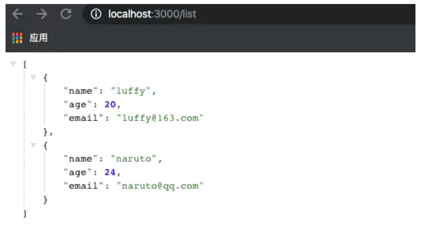
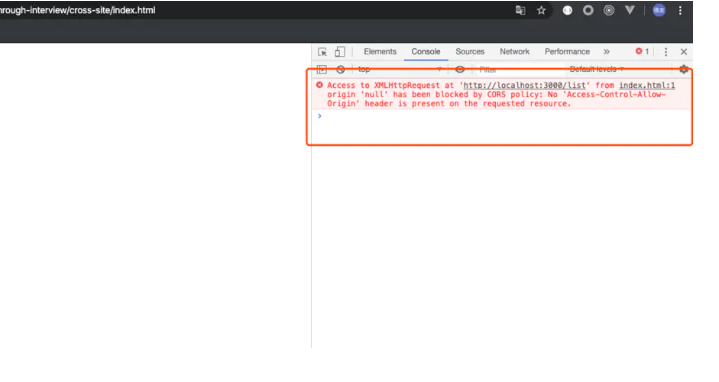

目录
- [1. 跨域](#1-跨域)
  - [1.1 解决跨域的方式](#11-解决跨域的方式)
    - [1.1.1 CORS](#111-cors)
    - [1.1.2 JSONP](#112-jsonp)
    - [1.1.3 NGINX](#113-nginx)
    - [1.1.4 window.name](#114-windowname)
    - [1.1.5 document.domain](#115-documentdomain)
    - [1.1.6 WebScoket](#116-webscoket)
    - [1.1.7 对比 CORS 和 JSONP](#117-对比-cors-和-jsonp)
- [2. XSS攻击](#2-xss攻击)
  - [2.1 存储型 XSS](#21-存储型-xss)
  - [2.2 反射型 XSS](#22-反射型-xss)
  - [2.3 DOM 型 XSS](#23-dom-型-xss)
  - [2.4 常用防御](#24-常用防御)
    - [2.4.1 预防存储型和反射型 XSS 攻击](#241-预防存储型和反射型-xss-攻击)
    - [2.4.2 预防 DOM 型 XSS 攻击](#242-预防-dom-型-xss-攻击)
- [3. CSRF 跨站点请求伪造](#3-csrf-跨站点请求伪造)
  - [3.1 GET类型的CSRF](#31-get类型的csrf)
  - [3.2 POST类型的CSRF](#32-post类型的csrf)
  - [3.3 链接类型的CSRF](#33-链接类型的csrf)
  - [3.4 CSRF特点](#34-csrf特点)
  - [3.5 CSTF 和 XSS 区别](#35-cstf-和-xss-区别)
  - [3.6 防御](#36-防御)

## 1. 跨域

在前端页面请求 url 地址的时候,该 url 与浏览器上的 url 地址必须处于同域上，也就是域名、端口以及协议三者相同。如果其中任何一个不同，就属于跨域范畴。

```
// express 起了一个小型服务，并且写了一个接口 /list
app.get('/list', (req, res) => {
  const list = [
    {
      name: 'luffy',
      age: 20,
      email: 'luffy@163.com' 
    }, {
      name: 'naruto',
      age: 24,
      email: 'naruto@qq.com'
    }
  ]
  res.status(200).json(list);
});
```


再写一个html页面调用这个接口：
```
<script>
  window.onload = function() {
    const xhr = new XMLHttpRequest();
    xhr.open('GET', 'http://localhost:3000/list');
    xhr.onreadystatechange = function () { 
      if (xhr.readyState === 4 && xhr.status === 200) {
        const resData = JSON.parse(xhr.responseText);
        console.log(resData);
      }
    };
    xhr.send();
  }
</script>
```



### 1.1 解决跨域的方式

#### 1.1.1 CORS

当下项目中如果涉及到跨域，实际上都应该是后端通过设置 CORS 来解决的。CORS 是目前最主流的跨域解决方案，跨域资源共享(CORS) 是一种机制，它使用额外的 HTTP 头来告诉浏览器 让运行在一个 origin (domain) 上的Web应用被准许访问来自不同源服务器上的指定的资源。

```
// 在node端设置一下请求头，允许接收所有源地址的请求
res.header('Access-Control-Allow-Origin', '*');
res.header('Access-Control-Allow-Methods', 'GET,PUT,POST,DELETE');
res.header('Access-Control-Allow-Headers', '*');
```

#### 1.1.2 JSONP

原理: 使用非同源限制的标签

同源限制是跨域的本质，也就是没有同源限制这么个东西，那么也就不存在跨域了。事实上，存在一些标签没有同源限制：
`<script>/<link>/`。JSONP 利用的原理就是这些标签来解决跨域的问题。

1. 假设后台有一个接口 /jsonp/list

    ```
    // 按钮获取数据
    <button onclick="loadJsonpData()">JSONP获取数据</button>

    <script>
    function loadJsonpData() {
        const script = document.createElement('script');
        script.src='http://localhost:3000/jsonp/list';
        document.body.appendChild(script);
    }
    </script>

    ```
    点击按钮，就会向`<body>`标签内部插入一个`<script>`标签，浏览器遇到`<script>`就会执行里面的内容。**关键点，浏览器会执行脚本里面的内容。**

2. 前后端约定好执行函数的名称

    `<script>`里面的内容应该是个可执行函数，并且把我们想要的数据传递过来。
3. 约定好了执行函数名称，前端就得定义它，因为后台返回的是一段可执行代码，如果前端没定义，就会报callbackData undefined的错误。
    ```
    // 定义 callback 函数，获取后台的 data
    function callbackData(data) {
        console.log(data, 98989);
    }
    ```
4. 前后端约定好了名称，并且前端定义好了函数，参数是想要拿到的数据，后台只需要把数据包在执行函数里响应回去就可以了。

    注意，JSONP 的接口不同于正常接口，它返回的不是 json 格式的数据，而是一段可执行字符串，这个字符串会被前端执行。

    ```
    app.get('/jsonp/list', (req, res) => {
    const list = [
        {
        name: 'luffy',
        age: 20,
        email: 'luffy@163.com' 
        }, {
        name: 'naruto',
        age: 24,
        email: 'naruto@qq.com'
        }
    ]
    // 把数据塞进执行函数里面
    const resData = `callbackData(${JSON.stringify(list)})`;
    res.send(resData); // 这里不能使用res.json而是res.send
    });
    ```
#### 1.1.3 NGINX

不算前后端跨域解决方案，而是属于运维层级的，并且如果面试被问到跨域相关，面试官应想得到的应该也不是这个答案。

#### 1.1.4 window.name

说它是理论上的跨域解决方案也就是说它确实能实现跨域传递数据，但是却很少被应用。

查阅了一下，MDN 是这么说的，（如 SessionVars 和 Dojo's dojox.io.windowName ，该属性也被用于作为 JSONP 的一个更安全的备选，来提供跨域通信（cross-domain messaging）。但是这俩框架我也确实孤陋寡闻了，还是有应用的并且兼容性还是很好的，除了万年不变的 IE 不一定支持，其他的浏览器都支持。

#### 1.1.5 document.domain

这个就更没啥人用了，也只是存在于书本上或者文档里，因为场景比较局限限制比较大。他的限制倒是不多，但是限制性很大。想要使用这种方式实现跨域，A与B必须满足如下条件：

A: http://aaa.xxx.com:port

B: http://bbb.xxx.com:port

复制代码也就是，A 与 B 的一级域名相同，二级域名不同，并且协议和端口号也必须相同。
在满足上述条件基础之上，两个页面彼此设置window.domain = 'xxx.com'，就可以进行通信了。

#### 1.1.6 WebScoket

把 Websocket 放在这里其实算是作弊了。因为我们所说的跨域是指，浏览器和服务端基于 HTTP 协议进行通信时出现同源限制了。而 Websocket 根本就不是基于 HTTP 协议的，它是位于 TCP/IP 上层，跟 HTTP 协议同层的浏览器通信协议。

它大概是上面这个样子的，Webscoket 与 HTTP 是同层协议，所以 HTTP 的限制对于 Webscoket 来说，人家根本不鸟你，同级关系，你凭啥管我～但是呢，还有个小箭头，是指 WebSocket 在建立握手连接时（TCP三次握手），数据是通过 HTTP 协议传输的，但是在建立连接之后，真正的数据传输阶段是不需要 HTTP 协议参与的。

Websocket 的重要之处其实并不在于解决跨域，事实上应该也没人用它解决跨域。它的重要之处在于，它提供了客户端主动与服务端主动推送消息的能力。如果是使用 HTTP，我们一般都只是，客户端发起一个请求，服务端响应这个请求，没办法做到彼此主动推送消息，因此，如果不使用 Websocket 的时候，一般都是通过一个 AJAX 长轮训，设置定时器不断的去发送请求更新数据，这样做其实浪费性能并且也不是很优雅。所以 Websocket 概括起来的优点就是：

- 没有同源限制，不跨域
- 全双工通信，双端都能主动推送消息
- 实时性更好，灵活性更高

Websocket 的适用场景也就是那些实时性很高的应用，比如通讯类，股票基金类，基于位类等应用。

#### 1.1.7 对比 CORS 和 JSONP

||CORS|JSONP|
|--|--|---|
|优点|比较简便，既支持 post 又支持 get|	利用的原生标签特性，兼容性特别好
|缺点|低版本IE不兼容|	只支持 get 方式，并且需要前后端约定


## 2. XSS攻击

Cross-Site Scripting（跨站脚本攻击）简称 XSS，是一种代码注入攻击。攻击者通过在目标网站上注入恶意脚本，使之在用户的浏览器上运行。利用这些恶意脚本，攻击者可获取用户的敏感信息如 Cookie、SessionID 等，进而危害数据安全。

所以,网页上哪些部分会引起XSS攻击?简单来说,任何可以输入的地方都有可能引起,包括URL!

XSS 常见的注入方法：

- 在 HTML 中内嵌的文本中，恶意内容以 script 标签形成注入。
- 在内联的 JavaScript 中，拼接的数据突破了原本的限制（字符串，变量，方法名等）。
- 在标签属性中，恶意内容包含引号，从而突破属性值的限制，注入其他属性或者标签。
- 在标签的 href、src 等属性中，包含 javascript: (伪协议)等可执行代码。
- 在 onload、onerror、onclick 等事件中，注入不受控制代码。
- 在 style 属性和标签中，包含类似 background-image:url("javascript:..."); 的代码（新版本浏览器已经可以防范）。
- 在 style 属性和标签中，包含类似 expression(...) 的 CSS 表达式代码（新版本浏览器已经可以防范）。

### 2.1 存储型 XSS

存储型 XSS 的攻击步骤：

- 攻击者将恶意代码提交到目标网站的数据库中。
- 用户打开目标网站时，网站服务端将恶意代码从数据库取出，拼接在 HTML 中返回给浏览器。
- 用户浏览器接收到响应后解析执行，混在其中的恶意代码也被执行。
- 恶意代码窃取用户数据并发送到攻击者的网站，或者冒充用户的行为，调用目标网站接口执行攻击者指定的操作。

存储型 XSS(又被称为持久性XSS)攻击常见于带有用户保存数据的网站功能，如论坛发帖、商品评论、用户私信等。

它是最危险的一种跨站脚本，相比反射型XSS和DOM型XSS具有更高的隐蔽性，所以危害更大，因为它不需要用户手动触发。

任何允许用户存储数据的web程序都可能存在存储型XSS漏洞，当攻击者提交一段XSS代码后，被服务器端接收并存储，当所有浏览者访问某个页面时都会被XSS。

### 2.2 反射型 XSS

反射型 XSS 的攻击步骤：

- 攻击者构造出特殊的 URL，其中包含恶意代码。
- 用户打开带有恶意代码的 URL 时，网站服务端将恶意代码从 URL 中取出，拼接在 HTML 中返回给浏览器。
- 用户浏览器接收到响应后解析执行，混在其中的恶意代码也被执行。
- 恶意代码窃取用户数据并发送到攻击者的网站，或者冒充用户的行为，调用目标网站接口执行攻击者指定的操作。

反射型 XSS 跟存储型 XSS 的区别是：存储型 XSS 的恶意代码存在数据库里，反射型 XSS 的恶意代码存在 URL 里。

反射型 XSS (也被称为非持久性XSS)漏洞常见于通过 URL 传递参数的功能，如网站搜索、跳转等。

由于需要用户主动打开恶意的 URL 才能生效，攻击者往往会结合多种手段诱导用户点击。

POST 的内容也可以触发反射型 XSS，只不过其触发条件比较苛刻（需要构造表单提交页面，并引导用户点击），所以非常少见。

### 2.3 DOM 型 XSS

DOM 型 XSS 的攻击步骤：

- 攻击者构造出特殊的 URL，其中包含恶意代码。
- 用户打开带有恶意代码的 URL。
- 用户浏览器接收到响应后解析执行，前端 JavaScript 取出 URL 中的恶意代码并执行。
- 恶意代码窃取用户数据并发送到攻击者的网站，或者冒充用户的行为，调用目标网站接口执行攻击者指定的操作。

DOM 型 XSS 跟前两种 XSS 的区别：DOM 型 XSS 攻击中，取出和执行恶意代码由浏览器端完成，属于前端 JavaScript 自身的安全漏洞，而其他两种 XSS 都属于服务端的安全漏洞。

注意:
DOM通常代表在html、xhtml和xml中的对象，使用DOM可以允许程序和脚本动态的访问和更新文档的内容、结构和样式。它不需要服务器解析响应的直接参与，触发XSS靠的是浏览器端的DOM解析，所以防范DOM型XSS完全就是前端的责任,必须注意!!!。

### 2.4 常用防御

常用防范方法

- httpOnly: 在 cookie 中设置 HttpOnly 属性后，js脚本将无法读取到 cookie 信息。

- 输入过滤: 一般是用于对于输入格式的检查，例如：邮箱，电话号码，用户名，密码……等，按照规定的格式输入。不仅仅是前端负责，后端也要做相同的过滤检查。因为攻击者完全可以绕过正常的输入流程，直接利用相关接口向服务器发送设置。

- 转义 HTML: 如果拼接 HTML 是必要的，就需要对于引号，尖括号，斜杠进行转义,但这还不是很完善.想对 HTML 模板各处插入点进行充分的转义,就需要采用合适的转义库。

- 白名单: 对于显示富文本来说，不能通过上面的办法来转义所有字符，因为这样会把需要的格式也过滤掉。这种情况通常采用白名单过滤的办法，当然也可以通过黑名单过滤，但是考虑到需要过滤的标签和标签属性实在太多，更加推荐使用白名单的方式。


#### 2.4.1 预防存储型和反射型 XSS 攻击

存储型和反射型 XSS 都是在服务端取出恶意代码后，插入到响应 HTML 里的，攻击者刻意编写的“数据”被内嵌到“代码”中，被浏览器所执行。

预防这两种漏洞，有两种常见做法：

- 改成纯前端渲染，把代码和数据分隔开。
- 对 HTML 做充分转义。

> 纯前端渲染过程
> 
>浏览器先加载一个静态 HTML，此 HTML 中不包含任何跟业务相关的数据。
>然后浏览器执行 HTML 中的 JavaScript。
>JavaScript 通过 Ajax 加载业务数据，调用 DOM API 更新到页面上。
>
#### 2.4.2 预防 DOM 型 XSS 攻击

DOM 型 XSS 攻击，实际上就是网站前端 JavaScript代码本身不够严谨，把不可信的数据当作代码执行了。

在使用 .innerHTML、.outerHTML、document.write() 时要特别小心，不要把不可信的数据作为 HTML 插到页面上，而应尽量使用 .textContent、.setAttribute() 等。

如果用 Vue/React 技术栈，并且不使用 v-html/dangerouslySetInnerHTML 功能，就在前端 render 阶段避免 innerHTML、outerHTML 的 XSS 隐患。

DOM 中的内联事件监听器，如 location、onclick、onerror、onload、onmouseover 等，`<a>` 标签的 href 属性，JavaScript 的 eval()、setTimeout()、setInterval() 等，都能把字符串作为代码运行。如果不可信的数据拼接到字符串中传递给这些 API，很容易产生安全隐患，请务必避免。

## 3. CSRF 跨站点请求伪造

跨站请求伪造（英语：Cross-site request forgery），也被称为 one-click attack 或者 session riding，通常缩写为 CSRF 或者 XSRF。

是一种挟制用户在当前已登录的 Web 应用程序上执行非本意的操作的攻击方法。如:攻击者诱导受害者进入第三方网站，在第三方网站中，向被攻击网站发送跨站请求。利用受害者在被攻击网站已经获取的注册凭证，绕过后台的用户验证，达到冒充用户对被攻击的网站执行某项操作的目的。


### 3.1 GET类型的CSRF

GET类型的CSRF利用非常简单，只需要一个HTTP请求，一般会这样利用：
```
 
```

在受害者访问含有这个img的页面后，浏览器会自动向http://bank.example/withdraw?account=xiaoming&amount=10000&for=hacker发出一次HTTP请求。bank.example就会收到包含受害者登录信息的一次跨域请求。

### 3.2 POST类型的CSRF

种类型的CSRF利用起来通常使用的是一个自动提交的表单，如：
```
 <form action="http://bank.example/withdraw" method=POST>
    <input type="hidden" name="account" value="xiaoming" />
    <input type="hidden" name="amount" value="10000" />
    <input type="hidden" name="for" value="hacker" />
</form>
<script> document.forms[0].submit(); </script> 
```

访问该页面后，表单会自动提交，相当于模拟用户完成了一次POST操作。

POST类型的攻击通常比GET要求更加严格一点，但仍并不复杂。任何个人网站、博客，被黑客上传页面的网站都有可能是发起攻击的来源，后端接口不能将安全寄托在仅允许POST上面。

### 3.3 链接类型的CSRF
链接类型的CSRF并不常见，比起其他两种用户打开页面就中招的情况，这种需要用户点击链接才会触发。这种类型通常是在论坛中发布的图片中嵌入恶意链接，或者以广告的形式诱导用户中招，攻击者通常会以比较夸张的词语诱骗用户点击，例如：
```
<a href="http://test.com/csrf/withdraw.php?amount=1000&for=hacker" taget="_blank">
重磅消息！！
<a/>
```

### 3.4 CSRF特点
CSRF的特点

- 攻击一般发起在第三方网站，而不是被攻击的网站。被攻击的网站无法防止攻击发生。
- 攻击利用受害者在被攻击网站的登录凭证，冒充受害者提交操作；而不是直接窃取数据。
- 整个过程攻击者并不能获取到受害者的登录凭证，仅仅是“冒用”。
- 跨站请求可以用各种方式：图片URL、超链接、CORS、Form提交等等。部分请求方式可以直接嵌入在第三方论坛、文章中，难以进行追踪。

CSRF通常是跨域的，因为外域通常更容易被攻击者掌控。但是如果本域下有容易被利用的功能，**比如可以发图和链接的论坛和评论区，攻击可以直接在本域下进行，而且这种攻击更加危险。**

### 3.5 CSTF 和 XSS 区别


- 通常来说 CSRF 是由 XSS 实现的，CSRF 时常也被称为 XSRF（CSRF 实现的方式还可以是直接通过命令行发起请求等）。
  
- 本质上讲，XSS 是代码注入问题，CSRF 是 HTTP 问题。 XSS 是内容没有过滤导致浏览器将攻击者的输入当代码执行。CSRF 则是因为浏览器在发送 HTTP 请求时候自动带上 cookie，而一般网站的 session 都存在 cookie里面(Token验证可以避免)。

### 3.6 防御

- 验证码；强制用户必须与应用进行交互，才能完成最终请求。此种方式能很好的遏制 csrf，但是用户体验比较差。
- Referer check；请求来源限制，此种方法成本最低，但是并不能保证 100% 有效，因为服务器并不是什么时候都能取到 Referer，而且低版本的浏览器存在伪造 Referer 的风险。
- token；token 验证的 CSRF 防御机制是公认最合适的方案。(具体可以查看本系列前端鉴权中对token有详细描述)若网站同时存在 XSS 漏洞的时候，这个方法也是空谈。


