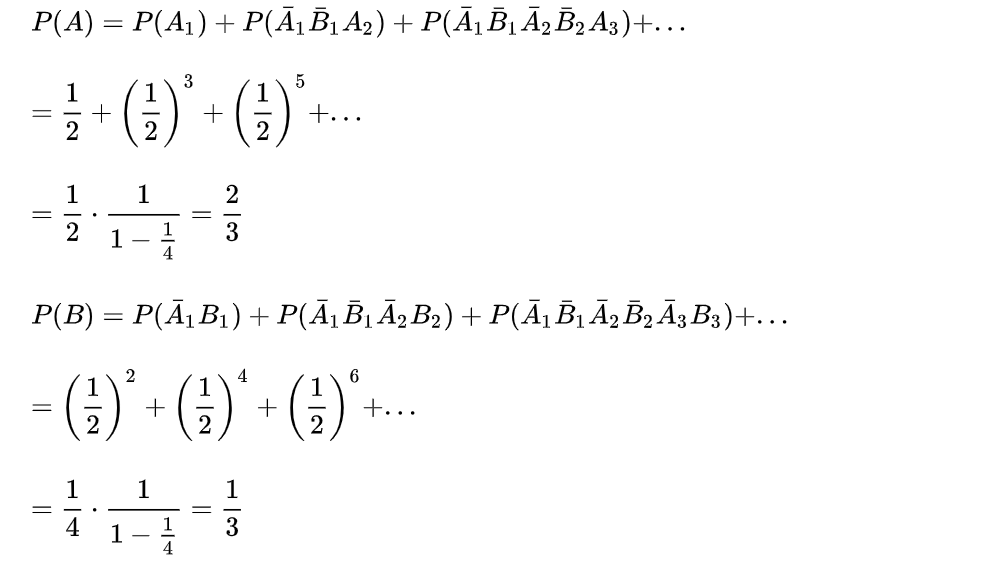

目录
- [1. 抛硬币问题 先抛的人赢的概率](#1-抛硬币问题-先抛的人赢的概率)
- [2. 判断是否为国内ip](#2-判断是否为国内ip)

## 1. 抛硬币问题 先抛的人赢的概率

已经用递归方法给出了解答，本回答给出基础的解决方法，利用两个基本公式：互不相容完备事件组概率和公式，以及无穷级数求和公式。

用 Ai 表示先拋的人第 i 次抛出正面，用 Bi 表示后拋的人第 i 次抛出正面

用 A,B 分别表示先拋和后拋的人获胜，则

## 2. 判断是否为国内ip

把国内ip段存数据库，或者网上就有ip数据库，获得ip查询数据库得到地址。