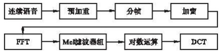

目录
- [1. Smart City](#1-smart-city)
  - [1.1 大体框架：](#11-大体框架)
  - [1.2 数据库：](#12-数据库)
  - [1.3 mapbox gl js](#13-mapbox-gl-js)
  - [1.4 echart 和 ajax](#14-echart-和-ajax)
  - [1.5 Vue-video-player](#15-vue-video-player)
  - [1.6 MQTT](#16-mqtt)
  - [1.7 version control](#17-version-control)
- [2. kingsoft](#2-kingsoft)
  - [2.1 测试](#21-测试)
  - [2.2 <mach/mach.h>](#22-machmachh)
- [3. 音乐搜索](#3-音乐搜索)
- [4. hadoop](#4-hadoop)
  - [4.1 shuffle](#41-shuffle)
    - [4.1.1 Map Shuffle](#411-map-shuffle)
    - [4.2 Reduce Shuffle](#42-reduce-shuffle)
## 1. Smart City

### 1.1 大体框架： 

后台：Spring MVC。
前端：Vue + axios。
前后段分离。
后端就和设备进行物理连接，然后写API，有个专门的后端负责人把API用swagger还是smart-doc（不记得了）生成了API文档。因为我这个项目是第三方的，也就是澳门的一家公司找我们做外包，所以他们有服务器，我们本地也搭了服务器。作为前端的我们，首先就是测试API是否可用。用Postman自测数据进行测试。然后在前端项目里加上axios的调用，get或者post方法，调用服务器上的API。最后就是和我们的UI连上测试。还有出了做链接这一块儿，我还要画UI，我画了20页UI吧不到。

现在网路请求主要有以下几种方式：

1）传统的Ajax是基于XMLHttpRequest(XHR)：配置和调用方式等非常混乱，操作复杂

2）jQuery-Ajax ：重量级框架，不适合 vue.js 开发的项目

3）axios：轻量，支持 Promise API ，可以在 node.js 中发送 http请求等等

- axios 拦截器
    拦截器分为请求拦截和响应拦截。

    请求拦截的作用

    请求成功的拦截：1.比如 config 中的一些信息不符合服务器的要求，可以拦截。**2.比如每次发送网络请求的时候，希望在界面中显示一个请求的图标。3.某些网络请求（比如登录（token）），必须携带一些特殊的信息。**

    请求拦截中错误拦截较少，通常都是配置相关的拦截。可能的错误比如请求超时，可以将页面跳转到一个错误页面中。

    响应拦截的作用

    响应的成功拦截中，主要是对数据进行过滤

    响应的失败拦截中，可以根据status判断报错的错误码，跳转到不同的错误提示页面。

### 1.2 数据库：
关系型数据库。数据不是很多我记得，因为这个项目主要是做一个智能照明的系统。绝大多数的数据存的都是路灯的信息，还有路灯的报警信息，人流量车流量等等。Mysql做的。

### 1.3 mapbox gl js
在做UI的时候，有几个页面比如我记得有个页面叫light_device.vue，这个界面主要就是显示灯杆的设备在地图上。根据从接口传来的不同的地理位置，灯杆颜色，状态，开关灯时间等等参数来在这个mapbox.js 上进行自由绘画。并且我还要添加地图的基本功能比如放大缩小，一键回到自己。画画的话比如我得加个图标，加个弹出窗口，加个浮动特效。我还需要将传来的数据转换格式。

难点：这个mapbox很难找到类似的实例，因为是动态数据而官方都是静态数据，我还自学了javascript然后一点一点尝试把他动态的加在地图上。

### 1.4 echart 和 ajax
主要是写javascript的动态统计图的代码。 还是实现各种各样的统计图。 用ajax的话是因为我记得有些需要点击刷新，我觉得再次axios调用的话有损结构，所以我觉得我自己加了ajax函数不知道最后他们有没有看出来。

### 1.5 Vue-video-player
一个比较新颖的想法。
遇到的问题：绝大多数的视频，或者我能想到的方法都是基于HTML5里面的插件。在Vue里面几乎没有能够嵌入实时视频的方法。刚开始我们想到的放法就是vue里面嵌入html，后来发现真的很丑。而且控制视频的video.js有的时候会没响应，有bug，没有办法自定义视频框。
后来我们就找各路大神，找到了这个新的js，用的SMTP视频流成功将视频导入了。

### 1.6 MQTT
因为甲方要求有个实时报警信息的功能，从来没有接触过这类的功能没有想法。后来上网找到了MQTT协议，于是自己就配合vue搭建了一个简单的即时通讯台。可以发送即时消息。

MQTT（Message Queuing Telemetry Transport，消息队列遥测传输协议），是一种基于发布/订阅（publish/subscribe）模式的"轻量级"通讯协议，该协议构建于TCP/IP协议上，由IBM在1999年发布。MQTT最大优点在于，可以以极少的代码和有限的带宽，为连接远程设备提供实时可靠的消息服务 

### 1.7 version control
github。 


## 2. kingsoft

培训了一个月。本来说是实习期必须一年然后转正的，后来因为出国需要准备考试所以就没有继续。但是学习到了很多。
学习了基础的Object-C。用xcode遍了简单的MVC框架。主要当时还是想继续工作下去所以自学了好多。

### 2.1 测试
刚开始主要是简单的程序测试，主要是黑盒测试。给了很多设备然后测试程序的性能。比如 
- app使用过程中，接听电话。可以测试不同的通话时间的长短，对于通话结束后，原先打开的
- app的响应，比如是否停留在原先界面，继续操作时的响应速度等。
- app使用过程中，有推送消息时，对app的使用影响
- 设备在充电时，app的响应以及操作流畅度
- 设备在不同电量时（低于10%，50%，95%），app的响应以及操作流畅度
- 意外断电时，app数据丢失情况

### 2.2 <mach/mach.h>
自己写了个软件，小app用来检测ios设备的状态。用mach.h 这个包，然后自己设计了ui写了一个程序。

## 3. 音乐搜索

刚开始选这个题目，我觉得音乐搜索我顶多就是一个基于关键词的搜索引擎。写了写内部的排序算法，实现了最近搜索榜，最近听歌榜等榜单。还有就是用js做了个mp3播放器嵌入网页，用各种jquery对网页里面的动画进行控制。然后把网页做的科技感和扁平化是我的目标。后来觉得半年就写这么点对不起教授也对不起自己。就开始研究机器学习，本来目标是想写一个听歌识曲，毫无头绪写不出来。后来不如做个基础的，训练个音乐模型然后进行分类然后根据搜索次数来推荐。

第一：数据收集从一个特殊的网站上找的，里面的歌有几万首，专门用来训练用的。
第二：数据特征提取。我知道训练一个模型，你必要要对这个类别的音乐进行特征提取，这个特征提取是基于mfcc（梅尔倒频谱系数）这个理论提取的。



(DCT:离散余弦变换)

这一系列都是比较复杂的数学操作，输入的是au格式的声音，输出的就是mfcc这个数。

第三： 降维。 我们得到的mfcc矩阵维度实在是太大了，有150多维度，有太多的特征了。维度太多，训练就很久。然后我就研究了办法去降维。用的PCA降维, 研究了matlab的方法，写了个pca降维的函数。降到了10维却能维护之前数据特征的95%。

第四：区分。一开始想到的方法就是直接区分。KNN算法进行区分。区分了以后发现正确率很低。和以前数据集比较只有50%。这个时候就遇到困难了，想要放弃。后来找了教授问了方法，说他有个svm的工具，可以帮我区分。在教授帮助下，写了一个调参的函数，基于高斯核函数。最后分出来了。正确率有70-90%。

## 4. hadoop
起初，Hadoop 包含以下两个主要组件：Hadoop Distributed File System (HDFS) 和一个分布式计算引擎，该引擎支持以 MapReduce 作业的形式实现和运行程序。

Hadoop 还提供了软件基础架构，以一系列 map 和 reduce 任务的形式运行 MapReduce 作业。Map 任务 在输入数据的子集上调用 map 函数。在完成这些调用后，reduce 任务 开始在 map 函数所生成的中间数据上调用 reduce 任务，生成最终的输出。 map 和 reduce 任务彼此单独运行，这支持并行和容错的计算。

最重要的是，Hadoop 基础架构负责处理分布式处理的所有复杂方面：并行化、调度、资源管理、机器间通信、软件和硬件故障处理，等等。得益于这种干净的抽象，实现处理数百（或者甚至数千）个机器上的数 TB 数据的分布式应用程序从未像现在这么容易过，甚至对于之前没有使用分布式系统的经验的开发人员也是如此。

>mapreduce
>mapreducce是一种编程模式，主要思想是讲数据处理分为map和reduce两个阶段，这两个阶段也可以任意组合，屏蔽了底层分布式、并行的计算方式
>
>map读取数据片段，输出<map,value>集合，reducce阶段相同的key一起处理，合并这些value，计算得到结果
>
>大体可以分为input、split、map、shuffle、reduce、output六个步骤
```
- 输入input：输入数据，一般是hdfs上的文件或目录
- 拆分split：切割文件，例如分成将字符串切割成每个单词
- 映射map：将拆分的内容转换成key-value形式
- 派发shuffle：将key相同的放到一起value是一个序列，这步涉及数据移动，会将key相同的数据移动到一台机器上
- 缩减reduce：将同样key的value序列进行计算
- 输出output：输出结果
```

### 4.1 shuffle
整体的Shuffle过程包含以下几个部分：Map端Shuffle、Sort阶段、Reduce端Shuffle。即是说：Shuffle 过程横跨 map 和 reduce 两端，中间包含 sort 阶段，就是数据从 map task 输出到reduce task输入的这段过程。
```
sort、combine 是在 map 端的，combine 是提前的 reduce ，需要自己设置。
```

Hadoop 集群中，大部分 map task 与 reduce task 的执行是在不同的节点上。当然很多情况下 Reduce 执行时需要跨节点去拉取其它节点上的map task结果。如果集群正在运行的 job 有很多，那么 task 的正常执行对集群内部的网络资源消耗会很严重。而对于必要的网络资源消耗，最终的目的就是最大化地减少不必要的消耗。还有在节点内，相比于内存，磁盘 IO 对 job 完成时间的影响也是可观的。从最基本的要求来说，对于 MapReduce 的 job 性能调优的 Shuffle 过程，目标期望可以有：

- 完整地从map task端拉取数据到reduce 端。
- 在跨节点拉取数据时，尽可能地减少对带宽的不必要消耗。
- 减少磁盘IO对task执行的影响。
  
总体来讲这段Shuffle过程，能优化的地方主要在于减少拉取数据的量及尽量使用内存而不是磁盘。

#### 4.1.1 Map Shuffle

- 输入:
    
    在map task 执行时，其输入来源 HDFS的 block ，map task 只读取split 。Split 与 block 的对应关系可能是多对一，默认为一对一。

- 切分:
  
    决定于当前的 mapper的 part交给哪个 reduce的方法是：mapreduce 提供的Partitioner接口，对key 进行 hash 后，再以 reducetask 数量取模，然后到指定的 job 上。

    然后将数据写入内存缓冲区中，缓冲区的作用是批量收集map结果，减少磁盘IO的影响。key/value对以及 Partition 的结果都会被写入缓冲区。写入之前，key 与value 值都会被序列化成字节数组。

- 溢写: 
  
    由于内存缓冲区的大小限制（默认100MB），当map task输出结果很多时就可能发生内存溢出，所以需要在一定条件下将缓冲区的数据临时写入磁盘，然后重新利用这块缓冲区。这个从内存往磁盘写数据的过程被称为Spill，中文可译为溢写。

    这个溢写是由另外单独线程来完成，不影响往缓冲区写map结果的线程。

    整个缓冲区有个溢写的比例spill.percent。这个比例默认是0.8，

    ```
    Combiner 将有相同key的 key/value 对加起来，减少溢写spill到磁盘的数据量。Combiner的适用场景：由于Combiner的输出是Reducer的输入，Combiner绝不能改变最终的计算结果。故大多数情况下，combiner适用于输入输出的key/value类型完全一致，且不影响最终结果的场景（比如累加、最大值等……）。
    ```

- Merge: 

    map 很大时，每次溢写会产生一个 spill_file，这样会有多个 spill_file，而最终的输出只有一个文件，在最终输出之前会对多个中间过程多次产生的溢写文件 spill_file 进行合并，此过程就是 merge。
    ```
    merge 就是把相同 key 的结果加起来。（当然，如果设置过combiner，也会使用combiner来合并相同的key）
    ```

#### 4.2 Reduce Shuffle
在 reduce task 之前，不断拉取当前 job 里每个 maptask 的最终结果，然后对从不同地方拉取过来的数据不断地做 merge ，也最终形成一个文件作为 reduce task 的输入文件。

- copy:
  
    Reduce进程启动一些数据copy线程(Fetcher)，通过HTTP方式请求map task所在的TaskTracker获取map task的输出文件。因为maptask早已结束，这些文件就归TaskTracker管理在本地磁盘中。

- merge:

    Copy 过来的数据会先放入内存缓冲区中，这里的缓冲区大小要比 map 端的更为灵活，它基于 JVM 的 heap size 设置，因为 Shuffle 阶段 Reducer 不运行，所以应该把绝大部分的内存都给 Shuffle 用。
    
    这里需要强调的是，merge 有三种形式：1)内存到内存 **2)内存到磁盘** 3)磁盘到磁盘。默认情况下第一种形式不启用，让人比较困惑，是吧。当内存中的数据量到达一定阈值，就启动内存到磁盘的 merge 。与 map 端类似，这也是溢写的过程，这个过程中如果你设置有Combiner，也是会启用的，然后在磁盘中生成了众多的溢写文件。第二种merge方式一直在运行，直到没有 map 端的数据时才结束，然后**启动第三种磁盘**到磁盘的 merge 方式生成最终的那个文件。

- reducer的输入:
    
    merge 的最后会生成一个文件，大多数情况下存在于磁盘中，但是需要将其放入内存中。当reducer 输入文件已定，整个 Shuffle 阶段才算结束。然后就是 Reducer 执行，把结果放到 HDFS 上。


